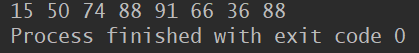

# 日期操作类

## Date类

表示特定的瞬间，精确到毫秒（因为闰秒的原因，所以其实结果并不是特别的准确，但是如果要求不是特别严格，影响并没有很大。）

**什么是闰秒？**


```java
public static void main(String[] args) {
        Date date = new Date();
        System.out.println(date);
        }
```


## Calendat类

是一个抽象类

```java
public abstract class Calendar
```

**直接已知子类：**`GregorianCalendar`

需要使用子类对象进行实例化。使用此类可以将日期精确到毫秒。以下取得一个完整日期。

```java
public class CalendarTest {
    public static void main(String[] args) {
        Calendar calendar = new GregorianCalendar();
//取得年份
        System.out.println("年:" + calendar.get(Calendar.YEAR));
//取得月份
        System.out.println("月:" + (calendar.get(Calendar.MONTH) + 1));
//取得日
        System.out.println("日：" + calendar.get(Calendar.DAY_OF_MONTH));
//取得时
        System.out.println("时：" + calendar.get(Calendar.HOUR_OF_DAY));
//取得分
        System.out.println("分：" + calendar.get(Calendar.MINUTE));
//取得秒
        System.out.println("秒：" + calendar.get(Calendar.SECOND));
//取得毫秒
        System.out.println("毫秒：" + calendar.get(Calendar.MILLISECOND));
    }
}
```


**注意在取得月份的时候要加1.**

## DateFormat类

此类是一个日期的格式化类，专门用来格式化日期。由于Date类已经包含了完整的日期，只需要将此日期进行格式化操作即可。

`public abstract class DateFormat extends Format `

此类是一个抽象类，需要子类进行实例化，但是该类本身提供了实例化操作。

1. 得到日期时间的DateFormat对象：

- public static final DateFormat getDateInstance()
- public static final DateFormat getDateTimeInstance()

2. 格式转换：public final String format(Date date)将一个 Date 格式化为日期/时间字符串

```java
 public static void main(String[] args) {
        DateFormat df1 = null;
        DateFormat df2 = null;
        df1 = DateFormat.getDateInstance();
        df2 = DateFormat.getDateTimeInstance();
        System.out.println("日期:" + df1.format(new Date()));
        System.out.println("日期+时间:" + df2.format(new Date()));
    }
```


## SimpleDateFormat类

`public class SimpleDateFormat extends DateFormat`

此类是DateFormat类的子类，用来完成日期的格式化操作。可以将一种日期格式变换成另一种日期格式。如：

原始日期：2018-04-09 17:59:20

转换成：2018年04月09日 17时59分20秒

以上可以发现，转换的日期数字相同，唯一不同的是显示的格式不同。要实现转换，首先要指定一个模板。

```java
 public static void main(String[] args) throws ParseException {
        String dateStr = "2019-12-11 17:59:20";
        SimpleDateFormat sdf1 = new SimpleDateFormat("yyyy-MM-dd HH:mm:ss");
        SimpleDateFormat sdf2 = new SimpleDateFormat("yyyy年MM月dd日  HH时mm分ss秒");
        Date d = sdf1.parse(dateStr);
        String df = sdf2.format(d);
        System.out.println(df);
    }
```


## 总结：

一般情况下，DateFormat类很少直接使用，而是使用SimpleDateFormat完成。

# Math类

Math类是一个很有用的数学帮助类，使用也非常简单，这个类比较特殊，首先他和String类一样都是用final修饰，所以不能有子类，还有就是它的构造方法是私有的，也就是我们不能通过new的方法在其它类中构造Math对象，那么我们怎样调用它的方法，原来它的所有的方法都是静态方法，也就是可以直接使用类名就可以访问方法了。

## 1.算术计算

- `Math.sqrt()` : 计算平方根
- `Math.cbrt()` : 计算立方根
- `Math.pow(a, b)` : 计算a的b次方
- `Math.max( , )` : 计算最大值
- `Math.min( , )` : 计算最小值
- `Math.abs()` : 取绝对值

```java
 public static void main(String[] args) {
        System.out.println(Math.sqrt(16)); // 4.0 计算平方根
        System.out.println(Math.cbrt(8)); // 2.0 计算立方根
        System.out.println(Math.pow(3, 2)); // 9.0 计算a的b次方
        System.out.println(Math.max(2.3, 4.5));// 4.5 计算最大值
        System.out.println(Math.min(2.3, 4.5));// 2.3 计算最小值
/**
 * abs求绝对值
 */
        System.out.println(Math.abs(-10.4)); // 10.4 取绝对值
        System.out.println(Math.abs(10.1)); // 10.1 取绝对值
    }
```

## 2.进位

- `Math.ceil()`: 天花板的意思，就是逢余进一
- `Math.floor()` : 地板的意思，就是逢余舍一
- `Math.rint()`: 四舍五入，返回double值。注意.5的时候会取偶数
- `Math.round()`: 四舍五入，float时返回int值，double时返回long值

```java
 public static void main(String[] args) {
        /**
         * ceil天花板的意思，就是逢余进一
         */
        System.out.println(Math.ceil(-10.1)); // -10.0
        System.out.println(Math.ceil(10.7)); // 11.0
        System.out.println(Math.ceil(-0.7)); // -0.0
        System.out.println(Math.ceil(0.0)); // 0.0
        System.out.println(Math.ceil(-0.0)); // -0.0
        System.out.println(Math.ceil(-1.7)); // -1.0

        System.out.println("-------------------");

/**
 * floor地板的意思，就是逢余舍一
 */
        System.out.println(Math.floor(-10.1)); // -11.0
        System.out.println(Math.floor(10.7)); // 10.0
        System.out.println(Math.floor(-0.7)); // -1.0
        System.out.println(Math.floor(0.0)); // 0.0
        System.out.println(Math.floor(-0.0)); // -0.0

        System.out.println("-------------------");

/**
 * rint 四舍五入，返回double值 注意.5的时候会取偶数 异常的尴尬=。=!
 */
        System.out.println(Math.rint(10.1)); // 10.0
        System.out.println(Math.rint(10.7)); // 11.0
        System.out.println(Math.rint(11.5)); // 12.0
        System.out.println(Math.rint(10.5)); // 10.0
        System.out.println(Math.rint(10.51)); // 11.0
        //返回最接近这个数的整数,如果刚好居中，则取偶数
        //按理来说是取-11.0，但-11.0是奇数，所以取-10.0
        System.out.println(Math.rint(-10.5)); // -10.0
        System.out.println(Math.rint(-11.5)); // -12.0
        System.out.println(Math.rint(-10.51)); // -11.0
        System.out.println(Math.rint(-10.6)); // -11.0
        System.out.println(Math.rint(-10.2)); // -10.0

        System.out.println("-------------------");
/**
 * round 四舍五入，float时返回int值，double时返回long值
 */
        System.out.println(Math.round(10)); // 10
        System.out.println(Math.round(10.1)); // 10
        System.out.println(Math.round(10.7)); // 11
        System.out.println(Math.round(10.5)); // 11
        System.out.println(Math.round(10.51)); // 11
        System.out.println(Math.round(-10.5)); // -10
        System.out.println(Math.round(-10.51)); // -11
        System.out.println(Math.round(-10.6)); // -11
        System.out.println(Math.round(-10.2)); // -10
}
```

【注意】这里有一个非常需要注意的一点是：这里所有进位的方法的入参都要保证是float或者double类型，否则进位方法将毫无意义。例如如下我们经常犯的错误：

```java
int a = 1300, b = 1000;
System.out.println(Math.ceil(a / b));  // 1  表达式A(错误使用)
System.out.println(Math.ceil(a / (float)b));  // 2 表达式B(正确使用)
```

看上去表达式A和表达式B没有什么区别，可仔细分析可知：a / b = 1 ，而 a / (float)b = 1.3， 实际上表达式A的Math.ceil()根本起不了任何作用。

## 3.随机数

- `Math.random()`: 取得一个[0, 1)范围内的随机数

```java
 public static void main(String[] args) {
        System.out.println(Math.random()); // [0, 1)的double类型的数
        System.out.println(Math.random() * 2);//[0, 2)的double类型的数
        System.out.println(Math.random() * 2 + 1);// [1, 3)的double类型的
    }
```


这是一段程序中的代码：

`int randomNumber=(int)(Math.random()*8)+1;`

所给出的注释是：得到一个1到8之间的随机整数。

`Math.random()`的作用是得到0-1之间的随机数。那么是如何实现的呢？

仔细想一想其实并不是很复杂：`Math.random()`的取值应该是0-1（事实上取不到0和1）之间的随机小数，乘以8

之后应该是0-8之间的随机小数，也就是0.到7.之间的小数（大于0而小于8），经过int类型转换之后，应该是0-7之

间的随机整数，所以"+1"之后就会得到1－8之间的

# Random类

java中存在两个随机函数，它们分别来自java.long.Math.random()和   java.util.Random();其中前者的适用范围比较小，完全可以被后者取代。

在Random类中有两种构造方法

- Random（）  无参构造方法，用于创建一个伪随机数生成器。

- Random（long seed） 有参构造方法，使用一个long类型的seed种子创建伪随机数生成器。


1.第一个构造函数(无参)

```java
  public static void main(String[] args) {
        Random r=new Random();   //不传入种子
        for(int i=0;i<8;i++){
            System.out.print(r.nextInt(100)+" ");
        }
    }
```

第一次运行


第二次运行


上边两个截图说明同样的程序运行两次得到的结果并不相同，是因为在创建Random对象时没有传入种子参数，程序会自动以当前时间为时间戳。所以每一次的运行结果都是不同的


2.有参构造函数

```java
  public static void main(String[] args) {
        Random r=new Random();   //不传入种子
        for(int i=0;i<8;i++){
            System.out.print(r.nextInt(100)+" ");
        }
    }
```

第一次运行



第二次运行


两次运行结果完全相同，那是因为创建Random对象时传入了参数，两次运行时种子相同

Random类中还有更多的方法，其中，**Random类的nextDouble()方法返回的是0.0至1.0之间的double类型值，nextFloat()方法返回的是0.0至1.0之间的float类型值，nextInt（int n）返回的是0（包括）至n（不包括）之间的int值**

```java
  public static void main(String[] args) {
        Random r=new Random();
        System.out.println("产生Float类型随机数："+r.nextFloat());
        System.out.println("产生1~100之间int类型随机数："+r.nextInt(100));
        System.out.println("产生double类型随机数："+r.nextDouble());
    }
```


## 随机数的范围

以下代码产生的是500-1000之间的随机数，`int temp = r.nextInt(500)+500`;其中括号内的（500）是一个随机范围，外面的+500则是起始下标，如果后面是+100，则是从100-（100+500）之间产生随机数。

```java
public static void main(String[] args) {
		Random r = new Random();
		int temp = r.nextInt(500)+500;
        System.out.println(temp);
	}
```

# 时间戳（timestamp）

**通常是一个字符序列，唯一地标识某一刻的时间。数字时间戳技术是数字签名技术一种变种的应用。**

**定义：   时间戳是指格林威治时间1970年01月01日00时00分00秒(北京时间1970年01月01日08时00分00秒)起至现在的总秒数。**

```java
 public static void main(String[] args) {
        // 精确到毫秒
        // 获取当前时间戳
        System.out.println(System.currentTimeMillis());
        System.out.println(Calendar.getInstance().getTimeInMillis());
        System.out.println(new Date().getTime());
        System.out.println("---------------------------");
        // 精确到秒
        // 获取当前时间戳
        System.out.println(System.currentTimeMillis() / 1000);
        System.out.println(Calendar.getInstance().getTimeInMillis() / 1000);
        System.out.println(new Date().getTime() / 1000);
        System.out.println("---------------------------");

        // 精确到毫秒
        // 获取指定格式的时间
        SimpleDateFormat df = new SimpleDateFormat("yyyy-MM-dd HH:mm:ss:SSS");
        // 输出字符串
        System.out.println(df.format(new Date()));
        // 获取指定时间Date对象，参数是时间戳，只能精确到秒
        System.out.println(new Date());
        df.getCalendar();
        // 获取指定时间的时间戳
        try {
            System.out.println(new SimpleDateFormat("yyyy/MM/dd HH:mm:ss:SSS").parse("2019/12/11 20:39:12:792").getTime());
        } catch (ParseException e) {
            e.printStackTrace();
        }
    }
```


