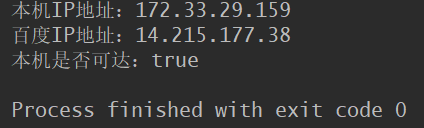
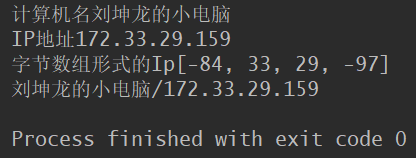
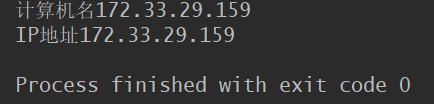
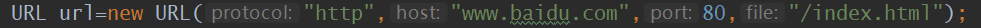
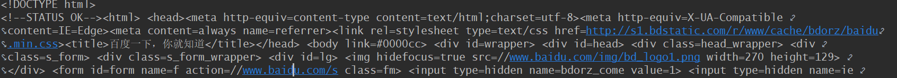

最最重要的概念：

网络编程分为服务端和客户端。服务端就相当于我们平时说的服务器，有固定的IP地址，随时等待服务器连接并出响应；而客户端相当于各种端系统，找到服务端进行连接获取服务（我们下面的程序也是这样，首先启动服务端等待连接，然后启动客户端连接服务端。如果先启动客户端再启动服务端则会报错）。       

说到java的网络编程倒不如说是Java的I/O编程，因为整个过程中关于服务端和客户端的socket创建也就那么两三行代码，其余的都是操作字节流，字符流等。


# InetAddress类

测试

```java
 public static void main(String[] args) throws Exception{
        //声明InetAddress对象
        InetAddress locAdd=null;
        InetAddress remAdd=null;
        //得到本机InetAddress对象
        locAdd=InetAddress.getLocalHost();
        //得到百度InetAddress对象
        remAdd=InetAddress.getByName("www.baidu.com");
        System.out.println("本机IP地址："+locAdd.getHostAddress());
        System.out.println("百度IP地址："+remAdd.getHostAddress());
        //判断地址是否可达，同时指定超时时间
        System.out.println("本机是否可达："+locAdd.isReachable(5000));
    }
```



# InetAddress类的总结

1. `InetAddress`类没有构造方法，所以不能直接new出一个对象

   可以通过`InetAddress`类的静态方法获得`InetAddress`的对象；

   -  `InetAddress.getLocalHost()`;

   - `InetAddress.getByName("")`;

2. 获取本机的`InetAddress`实例 

```java
  public static void main(String[] args) throws Exception{
        InetAddress address = InetAddress.getLocalHost();

        System.out.println("计算机名" + address.getHostName());

        System.out.println("IP地址" + address.getHostAddress());
        byte[] bytes = address.getAddress();//获取字节数组形式的IP地址  

        System.out.println("字节数组形式的Ip" + Arrays.toString(bytes));

        System.out.println(address);//直接输出InetAddress对象  
    }
```



3. 根据机器名获取`InetAddress`实例  

```java
 public static void main(String[] args) throws Exception{
     //通过主机名称得到InetAddress对象
        InetAddress address = InetAddress.getByName("172.33.29.159");
     //得到IP地址
        System.out.println("计算机名" + address.getHostName());
      //得到IP地址
        System.out.println("IP地址" + address.getHostAddress());
    }
```



为什么`address.getHostName()`输出的是`IP`地址，而没有输出电脑的名字？

**因为网络通信过程中客户端的主机名是不会带到服务器端的**


# URL

```java
  public static void main(String[] args) throws Exception{
        URL url=new URL("http","www.baidu.com",80,"/index.html");
        InputStream input=url.openStream();
        Scanner scanner=new Scanner(input);
        scanner.useDelimiter("\n");
        while (scanner.hasNext()){
            System.out.println(scanner.next());
        }
    }
```



输出：



# URLConnection类


# URLEncoder类和URLDecoder类


# TCP程序设计

