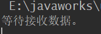
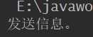
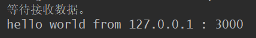

# UDP简介

TCP的所有操作都必须要建立可靠的连接，这样肯定会浪费大量的系统性能，为了减少这种开销，在网络中又提供了另一种传输协议——UDP（不可靠的连接）协议，这种协议在各个聊天工具中被广泛的使用

使用UDP发送出去的消息，对方不一定会收到，所有信息使用数据报的形式发出去，所以这就要求客户端要始终等待服务器发送的消息才能进行接收，在Java中使用DatagramSocket类和DatagramPacket类完成UDP程序开发


注：使用UDP开发的网络程序类似于平时使用的手机，手机就相当于是一个客户端，如果现在手机想正常的接收消息，肯定要先打开才行


要想实现UDP程序，则应该从客户端编写，在客户端指定要接收的端口并且取得数据

## UDP客户端

```java
public class UDPClient {
    public static void main(String[] args) throws IOException {
        DatagramSocket ds=null;
        byte[] buf=new byte[1024];//定义接收数据的字节数组
        DatagramPacket dp=null;


        ds=new DatagramSocket(9000);//客户端在9000端口监听
        dp=new DatagramPacket(buf,1024);//指定接收的数据长度为1024
        System.out.println("等待接收数据。");
        ds.receive(dp);//接收数据包

        //提取数据包信息
        String str=new String(dp.getData(),0,dp.getLength())
                +" from "
                +dp.getAddress().getHostAddress()
                +" : "
                +dp.getPort();
        System.out.println(str);
        ds.close();
    }
}
```



程序运行后，客户端已经打开了监听端口，等待服务器向客户端发送信息


## 编写UDP的服务器端程序

```java
public class UDPServer {
    public static void main(String[] args) throws IOException {
        DatagramSocket ds=null;
        DatagramPacket dp=null;

        ds=new DatagramSocket(3000);//服务器端在3000端口监听
        String str="hello world";//要发送的信息
       
        //数据内容，数据长度，要发送的目标地址，发送端口
        dp=new DatagramPacket(str.getBytes(),str.length(), //准备数据包
                InetAddress.getByName("localhost"),9000);
        System.out.println("发送信息。");
        //发送数据包
        ds.send(dp);
        ds.close();
    }
}

```




客户端得到数据



