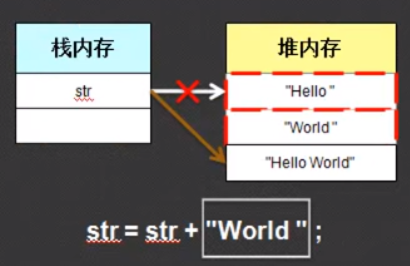

# StringBuffer类

String对象一经声明，便不能修改它的内容，修改的只是引用的地址；而StringBuffer对象是可以改变它的内容的

```java
  public static void main(String[] args) {
        String str= "hello ";
        System.out.println(System.identityHashCode(str));
        str=str+"world";
        System.out.println(System.identityHashCode(str));

        StringBuffer sb=new StringBuffer("hello ");
        System.out.println(System.identityHashCode(sb));
        sb.append("world");
        System.out.println(System.identityHashCode(sb));
    }
```


上面代码中的`System.identityHashCode()`返回的是对象的内存地址。可见，String字符串的内存地址改变了，而`StringBuffer`的内存地址并没有改变。说明修改String内容其实是引用关系的改变。原理如下图，其实是开辟了两个新的字符串堆内存，然后将String对象的内存地址改为"Hello world"字符串的地址，而旧的字符串并没有任何改变，也没有任何引用。这样就产生了两块垃圾空间。



### **StringBuffer的初始化**

`StringBuffer`不能像String那样直接用字符串赋值，所以也不能那样初始化。它需要通过构造方法来初始化，一共有4个构造方法

```java
public StringBuffer()
public StringBuffer(CharSequence seq)
public StringBuffer(int capacity)
public StringBuffer(String str)
```

### **StringBuffer和String的互换**

```java
1.String转换为StringBuffer有两种方法：

//（1）利用StringBuffer的构造方法：
public StringBuffer(String str)
    
//（2）利用StringBuffer的append()方法：
public StringBuffer append(String str)
   
2.StringBuffer转换为String也有两种方法：

//（1）利用StringBuffer的toString()方法：
public String toString()
    
//（2）利用String的构造方法：
public String(StringBuffer buffer)
```

**String类还提供了一个与StringBuffer对象作内容比较的方法**

```java
public boolean contentEquals(StringBuffer sb)
```


### StringBuffer的常用方法

```java
//1.将指定类型的数据追加到StringBuffer对象的末尾：
public StringBuffer append(T t)
    
//2.将指定类型的数据插入到StringBuffer序列指定位置：
public StringBuffer insert(int offset,T t)
    
//3.移除StringBuffer序列中的子字符串，从Start开始，到end-1的字符（注意不是字节，所以一个中文和一个英文都相当于一个字符）：
public StringBuffer delete(int start,int end)
```

测试

```java
   public static void main(String[] args) {
        StringBuffer sb=new StringBuffer("hello ");
        sb.append("world");
        sb.insert(0,"你好啊");
        System.out.println(sb);
        //删除[0,2)
        sb.delete(0,2);
        System.out.println(sb);
    }
```


# StringBuilder类

String类和StringBuffer类都是jdk1.0出现的，而StringBuilder是在jdk1.5出现的。StringBuilder拥有和StringBuilder一样的构造方法和方法函数，唯一不同的是StringBuffer是线程同步的安全操作，它的方法都被synchronized修饰，而StringBuilder是异步的。

## 总结
通常情况下涉及到字符串我们都使用String类，除非涉及到多次反复修改可以用StringBuffer或StringBuilder。

# Runtime类

1. Runtime类封装了运行时的环境。每个 Java 应用程序都有一个 Runtime 类实例，使应用程序能够与其运行的环境相连接。
2. 一般不能实例化一个Runtime对象，应用程序也不能创建自己的 Runtime 类实例，但可以通过 getRuntime 方法获取当前Runtime运行时对象的引用。
3.  一旦得到了一个当前的Runtime对象的引用，就可以调用Runtime对象的方法去控制Java虚拟机的状态和行为。 
4. 当Applet和其他不被信任的代码调用任何Runtime方法时，常常会引起SecurityException异常。


## runtime（运行时机制）是什么

runtime是属于OC的底层，是一套比较底层的纯C语言API, 属于1个C语言库, 包含了很多底层的C语言API，可以进行一些非常底层的操作(用OC是无法现实的, 不好实现)。 在我们平时编写的OC代码中, 程序运行过程时, 其实最终都是转成了runtime的C语言代码, runtime算是OC的幕后工作者。


> **OC代码： OC是C的超集，所有C语言的特性，在OC上都可以使用。**


## 常见的运用

### 1.得到系统内存的一些信息

```java
public class RuntimeTest {
    public static void main(String[] args) {
        Runtime runtime = Runtime.getRuntime();
        int processors = runtime.availableProcessors();
        long freeMemory = runtime.freeMemory();
        long maxMemory = runtime.maxMemory();
        long totalMemory = runtime.totalMemory();

        System.out.println("处理器的数量：" + processors);
        System.out.println("虚拟机中的空闲内存量：" + freeMemory);
        System.out.println("虚拟机试图使用的最大内存量：" + maxMemory);
        System.out.println("虚拟机中的内存总量：" + totalMemory);
    }
}

```


### 2.内存管理

Java提供了无用单元自动收集机制。通过totalMemory()和freeMemory()方法可以知道对象的堆内存有多大，还剩多少。
Java会周期性的回收垃圾对象（未使用的对象），以便释放内存空间。但是如果想先于收集器的下一次指定周期来收集废弃的对象，可以通过调用gc()方法来根据需要运行无用单元收集器。一个很好的试验方法是先调用gc()方法，然后调用freeMemory()方法来查看基本的内存使用情况，接着执行代码，然后再次调用freeMemory()方法看看分配了多少内存。下面的程序演示了这个构想。


### 


# Runtime类与Process类

### 3.执行其他程序

在安全的环境中，可以在多任务操作系统中使用Java去执行其他特别大的进程（也就是程序）。exec()方法有几种形式命名想要运行的程序和它的输入参数。**exec()方法返回一个Process对象**，可以使用这个对象控制Java程序与新运行的进程进行交互。exec()方法本质是依赖于环境。
下面的例子是**使用exec()方法启动windows的记事本notepad**。这个例子必须在Windows操作系统上运行。

```java
public class RuntimeTest {
    public static void main(String[] args)  {
        Runtime rt = Runtime.getRuntime();
        Process p = null;
        try{
            p = rt.exec("notepad");
        }catch(IOException e)
        {
            System.out.println("Execute error!");
        }
    }
}
```

exec()还有其他几种形式，例子中演示的是最常用的一种。exec()方法返回Process对象后，在新程序开始运行后就可以使用Process的方法了。可以用destory()方法杀死子进程，也可以使用waitFor()方法等待程序直到子程序结束，exitValue()方法返回子进程结束时返回的值。如果没有错误，将返回0，否则返回非0。

```java
public class RuntimeTest {
    public static void main(String[] args)  {
        Runtime r = Runtime.getRuntime();
        Process p = null;
        try{
            p = r.exec("notepad");
            p.waitFor();
        } catch (Exception e) {
            System.out.println("Error executing notepad.");
        }
        System.out.println("Notepad returned " + p.exitValue());
    }
}
```

运行结果：（当关闭记事本后，会接着运行程序，打印信息）


当子进程正在运行时，可以对标准输入输出进行读写。getOutputStream()方法和getInPutStream()方法返回对子进程的标准输入和输出。

# Locale类

### Java国际化

我们使用java.lang.Locale来构造Java国际化的情境。

java.lang.Locale代表特定的地理、政治和文化。需要Locale来执行其任务的操作叫语言环境敏感的操作。

构造一个系统默认的Locale

**构造一个系统默认的Locale**

`Locale defaultLocale = Locale.getDefault();`

```java
  public static void main(String[] args) {
        Locale defaultLocale = Locale.getDefault();//获得此Java虚拟机当前线程默认的语言环境值

        String country = defaultLocale.getCountry();//返回国家地区代码

        String language = defaultLocale.getLanguage();//返回国家的语言

        String displayCountry = defaultLocale.getDisplayCountry();//返回适合向用户显示的国家信息

        String displayLanaguage = defaultLocale.getDisplayLanguage();//返回适合向用户展示的语言信息

        String displayName = defaultLocale.getDisplayName();//返回适合向用户展示的语言环境名

        System.out.println("国家地区代码："+country);
        System.out.println("国家的语言："+language);
        System.out.println("国家信息："+displayCountry);
        System.out.println("语言信息："+displayLanaguage);
        System.out.println("语言环境名："+displayName);
    }
```


# System类

## **1.获取系统当前毫秒值（public static long currentTimeMillis()）**


```java
  public static void main(String[] args) {
        long start = System.currentTimeMillis();
        for(int i=1;i<=9;i++) {
            for(int j=1;j<=i;j++) {
                System.out.printf("%d x %d = %d \t",j,i,(j*i));

            }
            System.out.println();
        }
        long end = System.currentTimeMillis();
        System.out.printf("程序运行时间为[%d]毫秒！",(end-start));
    }
```


## **2.结束正在运行的Java程序（public staitc void exit(int status)）**

参数传入一个数字即可。通常传入0记为正常状态，其它为异常状态。

```java
  public static void main(String[] args) {
        int counts = 0;
        while (true) {
            System.out.println(counts+" 测试counts=3后是否退出");
            if (counts == 3) {
                System.exit(0);
            }
            counts++;
        }
    }
```


## **3.垃圾回收器（public static void gc()）**

用来运行JVM中的垃圾回收器，完成内存中垃圾的清除。

```java
class Student{
    //清除垃圾时，会默认调用被清空对象的finalize方法。
    public void finalize() {
        System.out.println("垃圾已经被收取啦！");
    }
}

public class SystemTest {
    public static void main(String[] args) {
        new Student();
        new Student();
        new Student();
        System.gc();
    }
}
```


**finalize()是在java.lang.Object里定义的，也就是说每一个对象都有这么个方法。这个方法在gc启动，该对象被回收的时候被调用。**


## **4.确定当前的系统属性（public static getProperties `**getProperties**()` ）**

```java
public static void main(String[] args) {
        System.out.println(System.getProperties());
    }
```


## **5.System类方法复制数组**

**（`public static notive void  arraycopy (Object src, int srcPos, Object dest, int destPos, int length)`）**

**【notive 是可以调用当前操作系统来实现数组拷贝的】**

用来实现将源数组部分元素复制到目标数组的指定位置。各个参数功能如下：

```java
Object src：要复制的原数组；

Int srcPos：数组源的起始索引；

Object dest：复制后的目标数组；

int destPos：目标数组起始索引；

int length，指定复制的长度；
```

**测试**

```java
 public static void main(String[] args) {
        int[] src = {1,22,333,4444,5555,666666,7777777};
        int[] dest = {10,20,30};
        System.arraycopy(src, 2, dest, 0, 2);

        for(int i=0;i<dest.length;i++) {
            System.out.println(dest[i]);
        }
    }
```


