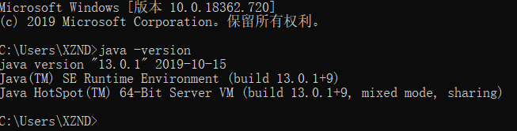
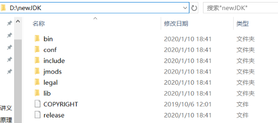
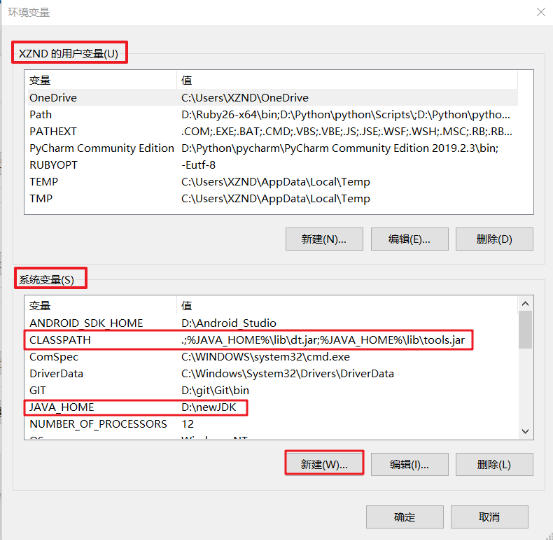
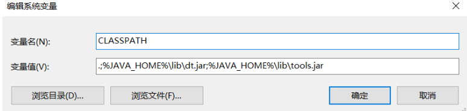
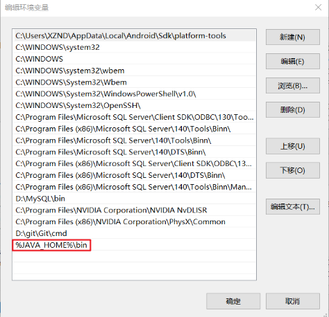

# JDK环境变量配置

- 查看JDK版本
  - `java -version`

- 注： -version是小写，不能使用大写，java后面有一个空格
- 配置成功后，会出现版本信息 **java version "13.0.1"**

## 下载，并解压到D:\newJDK

- 解压在一个自己喜欢的路径下都可以

## 环境变量配置

1. 右键我的电脑->属性->高级->环境变量->系统变量
   - 注意：是下面的**系统变量**，不是上面的用户变量
2. 新建变量名 JAVA_HOME，变量值:D:\newJDK

3. 点击新建如图

- 变量名：CLASSPATH
- 变量值：`.;%JAVA_HOME%\lib\dt.jar;%JAVA_HOME%\lib\tools.jar`
  - 注意不要少了前面的.和;

4. 找到Path点击编辑

- 在后面添加 `%JAVA_HOME%\bin ` 
  - 注意不需要添加;号，直接另起一行即点击新建添加即可

## 验证

- win+R键 输入cmd回车
- 分别输入`java` `javac` 查看安装是否完成