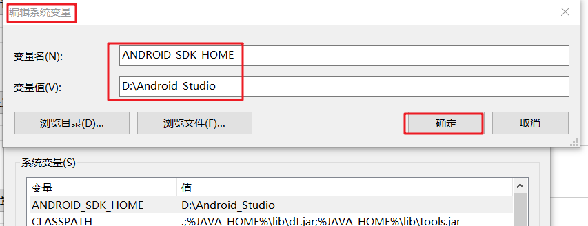
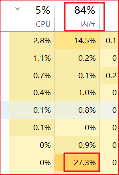

#### 更改虚拟机安装路径，减轻C盘压力



1. 打开环境变量
2. 在系统变量新建一个变量名`ANDROID_SDK_HOME`
3. 把变量值设置为`D:\Android_Studio`
4. 重启计算机，这样就可以修改虚拟机的安装路径了

#### 安卓studio运行时占的内存太大，很卡

打开，修改并设置里面的内容

```xaml
-Xms128m
-Xmx1050m
-XX:MaxPermSize=350m
-XX:ReservedCodeCacheSize=96m
```

```java
-Xms 初始堆大小
-Xmx 最大堆大小
-XX:MaxPermSize 设置持久代最大值
-XX:ReservedCodeCacheSize 设置代码缓存的最大值
```

效果：



内存稍微是降低了一些，原本是百分之九十以上，最明显的效果是打开虚拟机的速度的变快了很多