# 1.mybatis的curd（基于代理dao的方式）

## 1.1先在接口中定义方法

```java
//用户持久层接口
public interface IUserDao {
    //查询数据库所有信息
    List<User> findAll();

    //插入
    void saveUser(User user);

    //更新
    void updateUser(User user);

    //删除
    void deleteUser(Integer id);

    //查询一条数据
    User queryById(Integer id);

    //模糊查询
    List<User> queryByName(String name);

    //查询总记录数
    Integer countAll();
}
```

## 1.2在接口的xml文件中进行配置

```xml
<?xml version="1.0" encoding="UTF-8"?>
<!--导入约束-->
<!DOCTYPE mapper
        PUBLIC "-//mybatis.org//DTD Mapper 3.0//EN"
        "http://mybatis.org/dtd/mybatis-3-mapper.dtd">
<mapper namespace="com.kl.dao.IUserDao">

    <!--查询所有数据-->
    <select id="findAll" resultType="com.kl.domain.User">
      select * from user
    </select>

    <!--保存一条数据-->
    <insert id="saveUser" parameterType="com.kl.domain.User">
       insert into user (username,birthday,sex,address) values (#{username},#{birthday},#{sex},#{address})
        <!--获取插入数据后对应的id-->
       <selectKey keyProperty="id" keyColumn="id" resultType="java.lang.Integer" order="AFTER">
           select last_insert_id()
       </selectKey>
    </insert>

    <!--更新一条数据-->
    <update id="updateUser" parameterType="com.kl.domain.User">
        update user set username=#{username},birthday=#{birthday},sex=#{sex},address=#{address} where id=#{id}
    </update>

    <!--删除一条数据-->
    <delete id="deleteUser" parameterType="java.lang.Integer">
        delete from user where id=#{id}
    </delete>

    <!--查询一条数据-->
    <select id="queryById" parameterType="java.lang.Integer" resultType="com.kl.domain.User">
        select * from user where id=#{id}
    </select>

    <select id="queryByName" parameterType="java.lang.String" resultType="com.kl.domain.User">
        select * from  user where username like #{name}
    </select>

    <select id="countAll" resultType="java.lang.Integer">
        select count(id) from user
    </select>
</mapper>
```

## 1.3编写测试用例

```java
package com.kl.test;

import com.kl.dao.IUserDao;
import com.kl.domain.User;
import org.apache.ibatis.io.Resources;
import org.apache.ibatis.session.SqlSession;
import org.apache.ibatis.session.SqlSessionFactory;
import org.apache.ibatis.session.SqlSessionFactoryBuilder;
import org.junit.After;
import org.junit.Before;
import org.junit.Test;

import java.io.InputStream;
import java.util.Date;
import java.util.List;

public class MybatisTest {

    private InputStream in;
    private SqlSession sqlSession;
    private IUserDao userDao;

    @Before //用于在测试方法执行之前执行
    public void init() throws Exception{
        //1.读取配置文件
        in = Resources.getResourceAsStream("SqlMapConfig.xml");
        //2.创建SqlSessionFactory工厂
        SqlSessionFactoryBuilder builder = new SqlSessionFactoryBuilder();
        SqlSessionFactory factory = builder.build(in);
        //3.使用工厂生产SqlSession对象
        sqlSession = factory.openSession();
        //4.使用SqlSession创建Dao接口的代理对象
        userDao = sqlSession.getMapper(IUserDao.class);
    }

    @After //用于在测试方法执行之后执行
    public void destroy() throws Exception{
        //6.释放资源
        sqlSession.close();
        in.close();
        //7.提交事务:为了能够统一提交事务写在destroy方法中
        sqlSession.commit();
    }

    /*
    测试查询所有操作
     */
    @Test
    public void testSelectAll() throws Exception{
        //5.使用代理对象执行查询所有的方法
        List<User> users = userDao.findAll();
        for (User user : users) {
            System.out.println(user);
        }
    }

    /*
    测试保存用户操作
     */
    @Test
    public void testSave(){
        User user = new User();
        user.setUsername("SaveTest");
        user.setAddress("南京");
        user.setBirthday(new Date());
        user.setSex("男");

        System.out.println("保存前："+user);
        //5.使用代理对象执行保存对象的方法
        userDao.saveUser(user);
        System.out.println("保存后："+user);


    }

    /*
    测试更新用户操作
     */
    @Test
    public void testUpdate(){
        User user = new User();
        user.setId(41);
        user.setSex("男");
        user.setBirthday(new Date());
        user.setAddress("重庆");
        user.setUsername("UpdateTest");
        userDao.updateUser(user);
    }

    /*
    测试删除操作
     */
    @Test
    public void testDelete(){
        userDao.deleteUser(42);
    }

    /*
    测试查询一条数据
     */
    @Test
    public void testFindOne(){
        User user = userDao.queryById(41);
        System.out.println(user);
    }

    /*
    测试模糊查询
     */
    @Test
    public void testUnclear(){
        List<User> users = userDao.queryByName("%王%");
        for (User user : users) {
            System.out.println(user);
        }
    }

    //测试聚合函数统计总记录条数
    @Test
    public void testCountAll(){
        Integer nums = userDao.countAll();
        System.out.println(nums);
    }
}
```

- 未设置提交事务：自动提交事务的功能是被关闭的，提交失败，事务会自动回滚

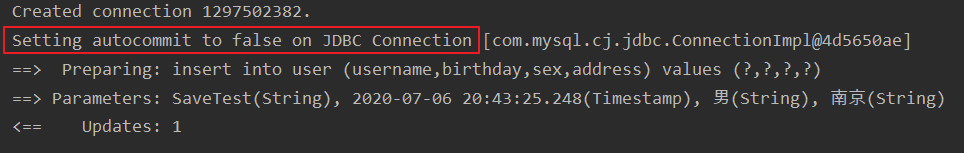

- 需要手动提交事务才能成功

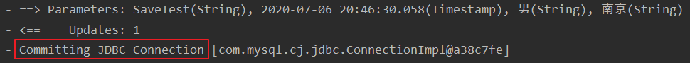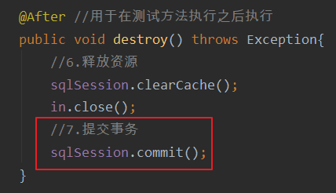

## 1.4注意事项

- 方法有返回值的一定要在resultType返回类型中注明查询的结果要封装到哪一个实体类中

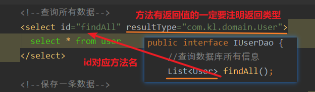

- 使用#{xxx}这样的方式填充就相当于PrepareStatement中的 ? 占位符，是安全可靠的

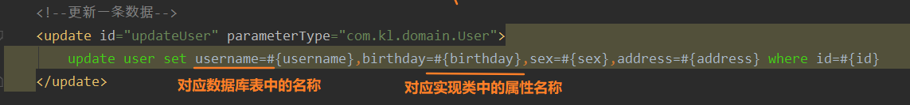

- parameterType的参数是一个简单类型（基本类型8种+String）的时候,#{xxx}中的值可以任意写，如果是一个对象（例如User）,则必须使用属性名称

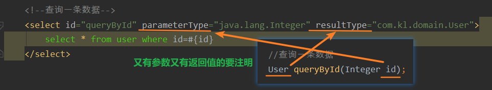

- order有AFTER和BRFORE两种选择，指明是在执行保存操作之前获取还是在之后获取，一般选择AFTER

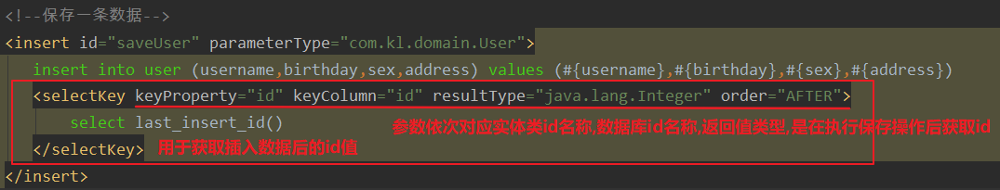

- 未使用selectKey标签前

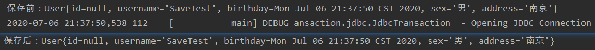

- 使用后

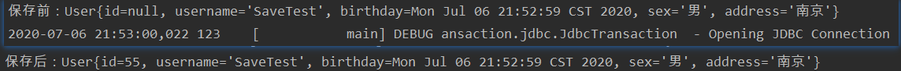

- 对比两次操作可以明显的看出有selectKey标签的时候返回的对象实体是有id值的

# 2.mybatis中的参数深入及结果集的深入

## 2.1参数 

- parameterType 属性： 代表参数的类型，因为我们要传入的是一个类的对象，所以类型就写类的全名称
-  sql 语句中使用#{}字符： 它代表占位符，相当于原来 jdbc 部分所学的 ? ，都是用于执行语句时替换实际的数据，具体的数据是由#{}里面的内容决定的
-  #{}中内容的写法： 由于我们保存方法的参数是 一个 User 对象，此处要写 User 对象中的属性名称，它用的是 ognl 表达式
-  ognl 表达式： 它是 apache 提供的一种表达式语言，全称是： Object Graphic Navigation Language（对象图导航语言） 它是按照一定的语法格式来获取数据的，语法格式就是使用 #{对象.对象}的方式
- \#{user.username}它会先去找 user 对象，然后在 user 对象中找到 username 属性，并调用 getUsername()方法把值取出来。但是我们在 parameterType 属性上指定了实体类名称，所以可以省略 user. 而直接写 username

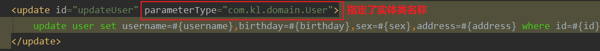

- 它是通过对象的取值方法来获取数据。在写法上把get给省略了，比如：我们获取用户的名称

>- 类中的写法：user.getUsername()
>- OGNL表达式写法：user.username

## 2.2结果集

- 如果javabean类中的属性和数据库中的列名对应不上，这时就需要用到起别名的方法

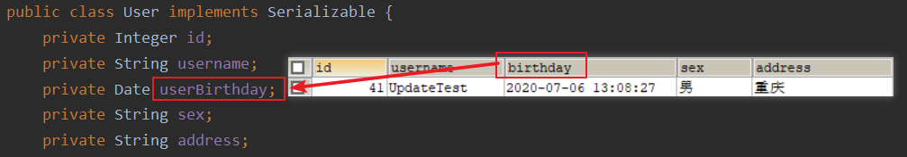

- 解决方式一：直接取别名

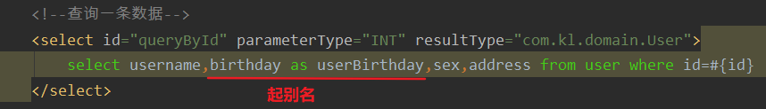

>- 优点：直接用起别名的方式，是直接针对数据库修改，效率很高
>- 缺点：如果有多条语句，每条语句都要以这样的方式，就会多出很多工作量

- 解决方式二：用setMap标签

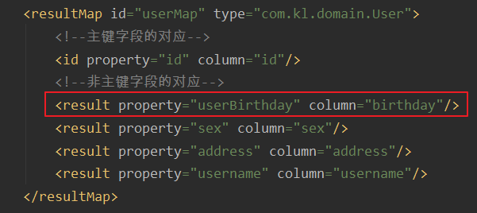

- 这种情况下resultType标签就没有用了，直接换成resultMap标签，即可正常查询

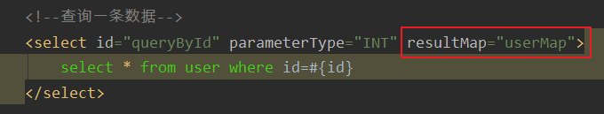

- **特别注意**

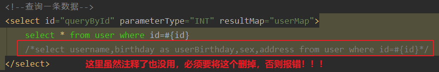

# 3.mybatis中基于传统dao的方式

>（编写dao的实现类）---了解的内容

- 实现IUserDao接口

```java
public class UserDaoImpl implements IUserDao {
    private SqlSessionFactory factory;
    public UserDaoImpl(SqlSessionFactory factory){
        this.factory = factory;
    }

    @Override
    public List<User> findAll() {
        SqlSession sqlSession = factory.openSession();
        //参数就是IUserDao.xml中的namespace的名称+调用的方法名称
        List<User> users = sqlSession.selectList("com.kl.dao.IUserDao.findAll");
        sqlSession.close();
        return users;
    }

    @Override
    public void saveUser(User user) {
        SqlSession sqlSession = factory.openSession();
        sqlSession.insert("com.kl.dao.IUserDao.saveUser",user);
        sqlSession.commit();
        sqlSession.close();
    }

    @Override
    public void updateUser(User user) {
        SqlSession sqlSession = factory.openSession();
        sqlSession.update("com.kl.dao.IUserDao.updateUser",user);
        sqlSession.commit();
        sqlSession.close();
    }

    @Override
    public void deleteUser(Integer id) {
        SqlSession sqlSession = factory.openSession();
        sqlSession.delete("com.kl.dao.IUserDao.deleteUser",id);
        sqlSession.commit();
        sqlSession.close();
    }

    @Override
    public User queryById(Integer id) {
        SqlSession sqlSession = factory.openSession();
        //参数就是IUserDao.xml中的namespace的名称+调用的方法名称
        User user = sqlSession.selectOne("com.kl.dao.IUserDao.queryById",id);
        sqlSession.close();
        return user;
    }
}
```

- 测试

```java
public class MybatisTest {

    private InputStream in;
    private IUserDao userDao;

    @Before //用于在测试方法执行之前执行
    public void init() throws Exception{
        //1.读取配置文件
        in = Resources.getResourceAsStream("SqlMapConfig.xml");
        //2.创建SqlSessionFactory工厂
        SqlSessionFactoryBuilder builder = new SqlSessionFactoryBuilder();
        SqlSessionFactory factory = builder.build(in);
        userDao = new UserDaoImpl(factory);
    }

    @After //用于在测试方法执行之后执行
    public void destroy() throws Exception{
        in.close();
    }

    /*
    测试查询所有操作
     */
    @Test
    public void testSelectAll() throws Exception{
        //5.使用代理对象执行查询所有的方法
        List<User> users = userDao.findAll();
        for (User user : users) {
            System.out.println(user);
        }
    }

    /*
    测试保存用户操作
     */
    @Test
    public void testSave(){
        User user = new User();
        user.setUsername("daoTest");
        user.setAddress("南京");
        user.setBirthday(new Date());
        user.setSex("男");

        System.out.println("保存前："+user);
        //5.使用代理对象执行保存对象的方法
        userDao.saveUser(user);
        System.out.println("保存后："+user);


    }

    /*
    测试更新用户操作
     */
    @Test
    public void testUpdate(){
        User user = new User();
        user.setId(41);
        user.setSex("男");
        user.setBirthday(new Date());
        user.setAddress("西安");
        user.setUsername("daoUpdate");
        userDao.updateUser(user);
    }

    /*
    测试删除操作
     */
    @Test
    public void testDelete(){
        userDao.deleteUser(50);
    }

    /*
    测试查询一条数据
     */
    @Test
    public void testFindOne(){
        User user = userDao.queryById(41);
        System.out.println(user);
    }
}
```

# 4.mybatis中的配置

- （主配置文件：SqlMapConfig.xml）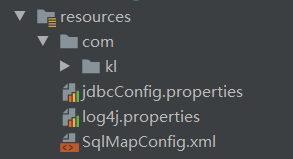

## 4.1properties标签

- 方式一：在标签内部配置数据库的信息 

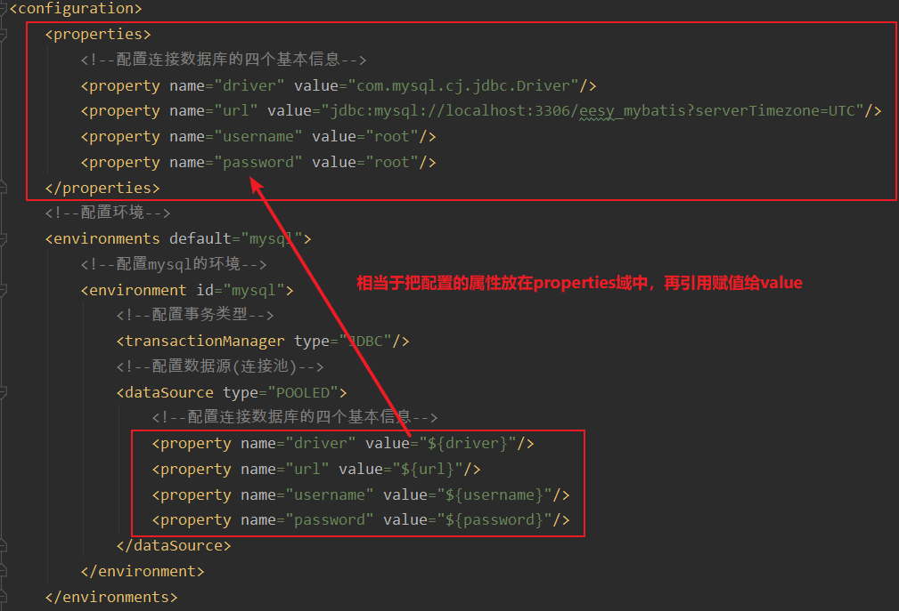

- 方式二：通过标签属性引用外部配置文件的信息
- resource属性：用于指定配置文件的位置，是按照类路径的写法来写，并且必须存在于类路径下
- 将数据库配置信息抽取后放到Resource配置文件目录下jdbcConfig.properties

```properties
jdbc.driver=com.mysql.cj.jdbc.Driver
jdbc.url=jdbc:mysql://localhost:3306/eesy_mybatis?serverTimezone=UTC
jdbc.username=root
jdbc.password=root
```

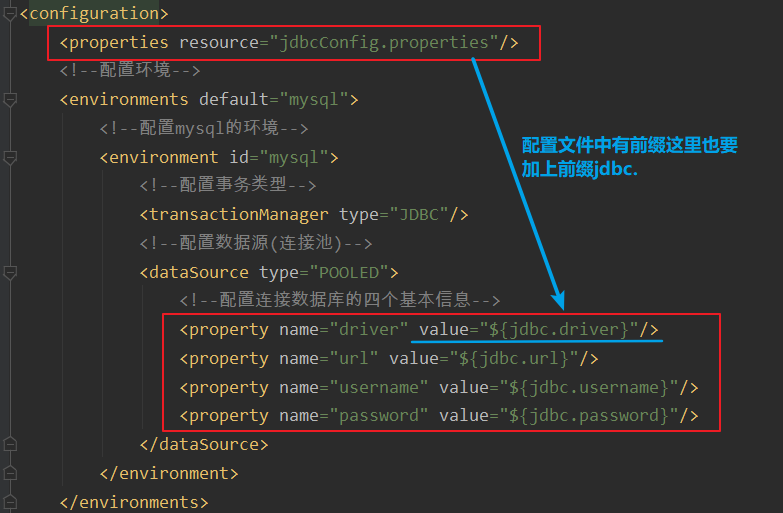

- 方式三：url属性，不灵活，不常用

>- url属性：是要求按照Ur1的写法来写地址
>- URL：Uniform Resource Locator统一资源定位符。它是可以唯一标识一个资源的位置
>- 它的写法：http://localhost:8080/mybatisserver/demo1Servlet
>- ​                  协议    主机      端口                  URI 
>- URI：Uniform Resource Identifier 统一资源标识符，它是在应用中可以定位唯一的一个资源

## 4.2typeAliases标签

- 配置别名方式一

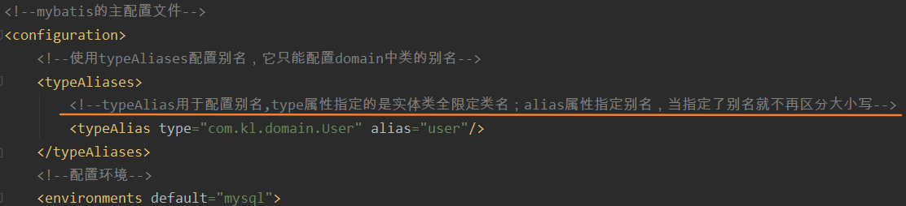

- 配置别名方式二：

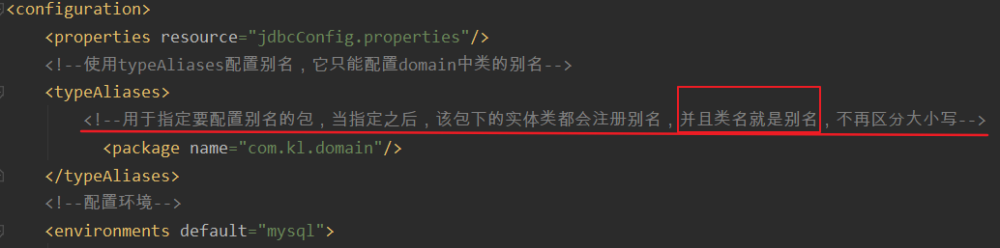

- 使用效果

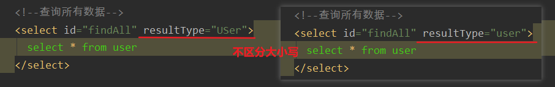

## 4.3mappers标签

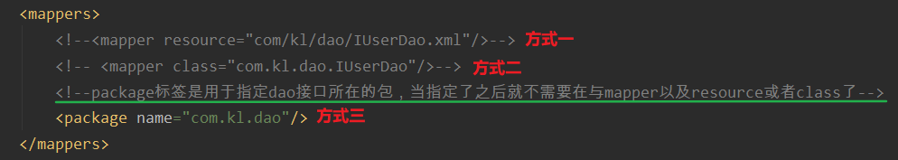