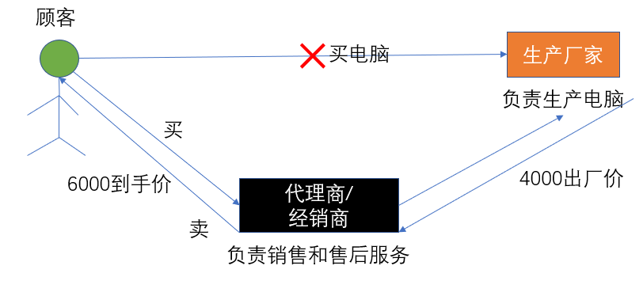
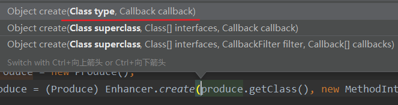
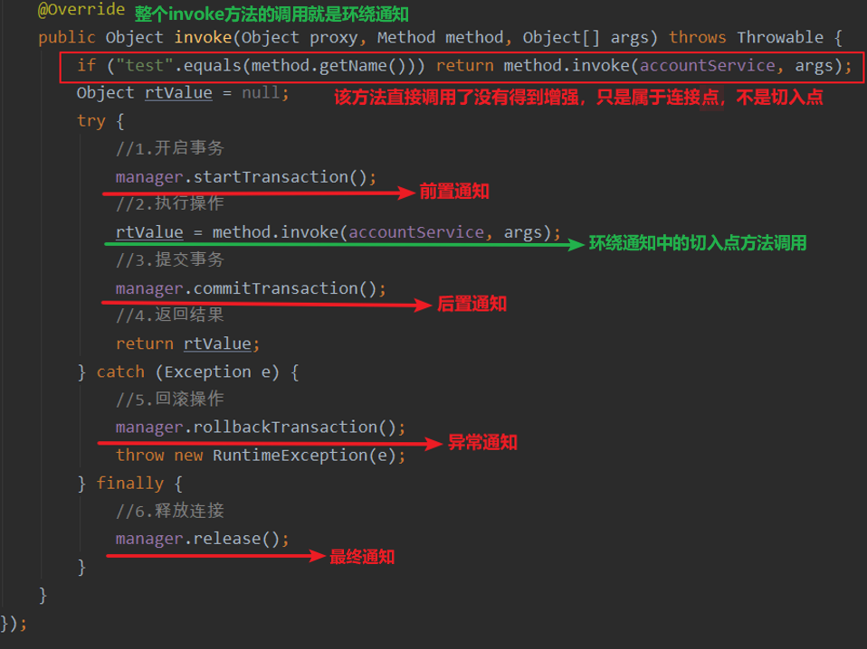
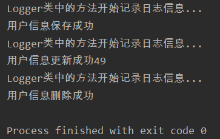
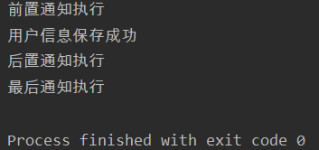
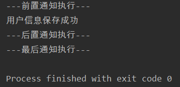
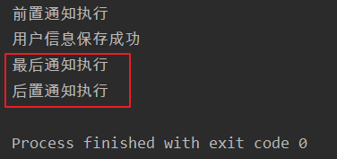
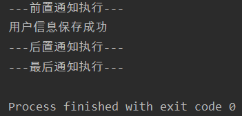

# 一、转账演示事务

## 1.1搭建测试代码

- 账户持久层

```java
public interface IAccountDao {
    /**
     * @param name 根据名称查询账户信息
     * @return 如果结果集只有一个就返回，如果没有就返回null
     * 如何结果集有多个就抛异常
     */
    Account selectAccountByName(String name);
}
```

- 实现

```java
@Repository("accountDao")
public class AccountDaoImpl implements IAccountDao {
    @Autowired
    private QueryRunner runner;

    @Override
    public Account selectAccountByName(String name) {
        try {
            List<Account> accounts = runner.query("select * from account where name = ?",
                                                  new BeanListHandler<>(Account.class), name);
            if (accounts == null || accounts.size() == 0) return null;
            else if (accounts.size() == 1) return accounts.get(0);
            else throw new RuntimeException("结果集大于1");
        } catch (SQLException e) {
            throw new RuntimeException();
        }
    }
}

```

- 业务层

```java
public interface IAccountService {
    //更新账户信息
    void updateAccount(Account account);
    //转账功能
    void transfer(String sourceName,String targetName,Float money);

}
```

- 实现

```java
@Service("accountService")
public class AccountServiceImpl implements IAccountService {
    @Autowired
    IAccountDao accountDao;
    
    
    public void updateAccount(Account account) {
        accountDao.updateAccount(account);
    }
    
    @Override
    public void transfer(String sourceName, String targetName, Float money) {
        //1.根据名称查询转出账户
        Account source = accountDao.selectAccountByName(sourceName);
        //2.根据名称查询转入账户
        Account target = accountDao.selectAccountByName(targetName);
        //3.转出账户减钱
        source.setMoney(source.getMoney() - money);
        //4.转入账户加钱
        target.setMoney(target.getMoney() + money);
        //5.更新转出账户
        accountDao.updateAccount(source);
        //6.更新转入账户
        accountDao.updateAccount(target);
    }
}
```

- 测试类

```java
@RunWith(SpringJUnit4ClassRunner.class)
@ContextConfiguration(classes = SpringConfiguration.class)
public class AccountTest {
    @Autowired
    private IAccountService service;
    
    @Test
    public void testTransfer(){
        service.transfer("张三", "李四",100f);
    }
}
```

## 1.2问题分析

- 当转账代码transfer中没有出现任何异常时转账正常进行
- 若在某一个环节出现问题，如下展示，那么就会出现转出账户转钱成功但转入账户转入失败


## 1.3添加事务操作

- 为了解决上面出现的问题：
- 需要使用ThreadLocal对象把Connection和当前线程绑定，从而使一个线程中只有一个能控制事务的对象
- 实质：在一个方法操作中保证使用的都是一个Connection连接对象

### 1.3.1获取连接的工具类

```java
package com.kl.util;

import org.springframework.beans.factory.annotation.Autowired;
import org.springframework.stereotype.Component;

import javax.sql.DataSource;
import java.sql.Connection;
import java.sql.SQLException;

@Component("utils") //将bean的id设置为utils并放入spring容器
public class ConnectionUtils {
    @Autowired //自动注入
    private DataSource dataSource;

    @Autowired
    private ThreadLocal<Connection> threadLocal;

    //获取当前线程上的连接
    public Connection getThreadConnection(){
        try {
            //1.先从ThreadLocal中获取
            Connection conn = threadLocal.get();
            if (conn == null){
                //2.若ThreadLocal中没有就从数据源中获取并保存到ThreadLocal
                conn = dataSource.getConnection();
                threadLocal.set(conn);
            }
            return conn;
        } catch (SQLException e) {
            throw new RuntimeException();
        }
    }

    //解除线程和连接的绑定
    public void removeConnection(){
        threadLocal.remove();
    }
}
```

### 1.3.2事务管理和线程解绑

- 包括开启事务，提交事务，回滚事务和释放连接

```java
package com.kl.util;

import org.springframework.beans.factory.annotation.Autowired;
import org.springframework.stereotype.Component;

import java.sql.Connection;
import java.sql.SQLException;

@Component("manager") //将bean的id设置为manager并放入spring容器
public class TransactionManager {
    @Autowired //自动注入
    private ConnectionUtils utils;

    /**
     * 开启事务
     */
    public void startTransaction() {
        try {
            utils.getThreadConnection().setAutoCommit(false);
        } catch (SQLException e) {
            e.printStackTrace();
        }
    }

    /**
     * 提交事务
     */
    public void commitTransaction() {
        try {
            utils.getThreadConnection().commit();
        } catch (SQLException e) {
            e.printStackTrace();
        }
    }

    /**
     * 回滚事务
     */
    public void rollbackTransaction() {
        try {
            utils.getThreadConnection().rollback();
        } catch (SQLException e) {
            e.printStackTrace();
        }
    }

    /**
     * 关闭连接,释放资源
     */
    public void release() {
        try {
            utils.getThreadConnection().close(); //连接被还回连接池中
            utils.removeConnection(); //解除连接与线程的绑定
        } catch (SQLException e) {
            e.printStackTrace();
        }
    }
}
```

### 1.3.3业务层和持久层代码控制

- AccountDaoImpl账户类：增加根据用户名查询账户的方法

```java
@Repository("accountDao")
public class AccountDaoImpl implements IAccountDao {
    @Autowired 
    private QueryRunner runner;

    @Autowired
    private ConnectionUtils utils;

    @Override
    public Account selectAccountByName(String name) {
        try {
            List<Account> accounts = runner.query(utils.getThreadConnection(),"select * from account where name = ?",
                    new BeanListHandler<>(Account.class), name);
            if (accounts == null || accounts.size() == 0) return null;
            else if (accounts.size() == 1) return accounts.get(0);
            else throw new RuntimeException("结果集大于1");
        } catch (SQLException e) {
            throw new RuntimeException();
        }
    }
    
    //......
}
```

- AccountServiceImpl

```java
Service("accountService") //放入spring容器
public class AccountServiceImpl implements IAccountService {
    @Autowired
    private IAccountDao accountDao;

    @Autowired
    private TransactionManager manager; //事务管理对象
    
     public void updateAccount(Account account) {
        try {
            //1.开启事务
            manager.startTransaction();
            //2.执行操作
            accountDao.updateAccount(account);
            //3.提交事务
            manager.commitTransaction();
            //4.返回结果
        } catch (Exception e) {
            //5.回滚操作
            manager.rollbackTransaction();
            e.printStackTrace();
        } finally {
            //6.释放资源
            manager.release();
        }
    }
    
    @Override
    public void transfer(String sourceName, String targetName, Float money) {
        try {
            //1.开启事务
            manager.startTransaction();

            //2.执行操作
            //2.1.根据名称查询转出账户
            Account source = accountDao.selectAccountByName(sourceName);
            //2.2.根据名称查询转入账户
            Account target = accountDao.selectAccountByName(targetName);
            //2.3.转出账户减钱
            source.setMoney(source.getMoney() - money);
            //2.4.转入账户加钱
            target.setMoney(target.getMoney() + money);
            //2.5.更新转出账户
            accountDao.updateAccount(source);
            int i = 1/0;
            //2.6.更新转入账户
            accountDao.updateAccount(target);

            //3.提交事务
            manager.commitTransaction();
            //4.返回结果
        } catch (Exception e) {
            //5.回滚操作
            manager.rollbackTransaction();
            throw new RuntimeException();
        } finally {
            //6.释放资源
            manager.release();
        }
    }
}
```

### 1.3.4srpingIOC配置

- 父配置类

```java
@Configuration //将该bean放入spring容器
@ComponentScan("com.kl") //告知要扫描的包
@Import(Config.class) //导入子配置文件
@PropertySource("classpath:jdbcConfig.properties") //配置文件路径
public class SpringConfiguration {

}
```

- 子配置类

```java
public class Config {
    @Value("${jdbc.driver}")
    private String driver;
    @Value("${jdbc.url}")
    private String jdbcUrl;
    @Value("${jdbc.user}")
    private String user;
    @Value("${jdbc.password}")
    private String password;

    @Bean(name = "runner")
    @Scope("prototype") //设置为多例模式
    public QueryRunner createQueryRunner(@Qualifier("ds1") DataSource source){
        return new QueryRunner(source);
    }

    @Bean(name = "ds1")
    public DataSource createDataSource(){
        try {
            ComboPooledDataSource dataSource = new ComboPooledDataSource();
            dataSource.setDriverClass(driver);
            dataSource.setJdbcUrl(jdbcUrl);
            dataSource.setUser(user);
            dataSource.setPassword(password);
            return dataSource;
        } catch (PropertyVetoException e) {
            throw new RuntimeException();
        }
    }

    @Bean(name = "threadLocal")
    public ThreadLocal<Connection> createThreadLocal(){
        return new ThreadLocal<>();
    }
}
```

- 配置文件jdbc.properties

```properties
jdbc.driver=com.mysql.jdbc.Driver
jdbc.url=jdbc:mysql://localhost:3306/eesy?serverTimezone=UTC
jdbc.user=root
jdbc.password=root
```

# 二、动态代理



- 动态代理：

>- 特点：字节码随用随创建，随用随加载
>- 作用：不修改源码的基础上对方法增强
>- 分类：
>  - 基于接口的动态代理
>  - 基于子类的动态代理

- 基于接口的动态代理：

>- 涉及的类：Proxy
>- 提供者：JDK官方

- 如何创建代理对象：使用Proxy类中的newProxyInstance方法
- 创建代理对象的要求：被代理类最少实现一个接口，如果没有则不能使用

---

- newProxyInstance方法的参数


- classLoader：类加载器
  - 它是用于加载代理对象字节码的，和被代理对象使用相同的类加载器 ------ (固定写法)
- Class[ ]：字节码数组
  - 它是用于让代理对象和被代理对象有相同方法 ------ (固定写法)
- InvocationHandler：用于提供增强的代码它是让我们写如何代理，我们一般都是些一个该接口的实现类，通常情况下都是匿名内部类，但不是必须的 ------ (此接口的实现类都是谁用谁写)

## 2.1基于接口的动态代理

- 接口

```java
//定义商家要求代理商的代理规范
public interface IProduce {
    //销售
    void saleProduce(Float money);

    //售后
    void afterService();
}
```

- 商家

```java
/**
 * 模拟生产者
 */
public class Produce implements IProduce {
    public void saleProduce(Float money) {
        System.out.println("商家卖了产品，收获"+money+"元");
    }

    public void afterService() {
        System.out.println("进入售后服务");
    }
}
```

- 消费者

```java
/**
 * 模拟消费者
 */
public class Consumer {
    public static void main(String[] args) {
        final Produce produce = new Produce();
        IProduce proxyProduce = (IProduce) Proxy.newProxyInstance(produce.getClass().getClassLoader(), produce.getClass().getInterfaces(), new InvocationHandler() {
            /**
             * 作用：执行被代理对象的任何接口方法都会经过该方法
             * @param o 代理对象的引用
             * @param method 当前执行的方法
             * @param objects 当前执行方法所需的参数
             * @return 和被代理对象方法有相同的返回值
             */
            public Object invoke(Object o, Method method, Object[] objects) throws Throwable {
                //提供增强的代码
                Object returnValue = null;
                Float money = (Float) objects[0];
                //获取方法参数并判断是否是销售方法
                if ("saleProduce".equals(method.getName())){
                    returnValue = method.invoke(produce,money * 0.8f);
                }
                return returnValue;
            }
        });
        proxyProduce.saleProduce(1000f); //商家卖了产品，收获800.0元
    }
}
```

## 2.2基于子类的动态代理

- 想要代理普通的java类需要第三方jar包的支持
- 在pom.xml导入需要的jar包的坐标

```xml
<dependencies>
    <dependency>
        <groupId>cglib</groupId>
        <artifactId>cglib</artifactId>
        <version>2.1_3</version>
    </dependency>
</dependencies>
```

- 基于子类的动态代理：

>- 涉及的类：Enhancer
>- 提供者：第三方cglib库

- 如何创建代理对象：使用Enhancer类中的create方法
- 创建代理对象的要求：被代理类不能是最终类

---

- create方法的参数



- Class：字节码，它是用于指定被代理对象的字节码
- callback：用于提供增强的代码

>- 它是让我们写如何代理。我们一般都是些一个该接口的实现类，通常情况下都是匿名内部类，但不是必须的
>- 此接口的实现类都是谁用谁写
>- 我们一般写的都是该接口的子接口实现类：MethodInterceptor

- 不需要接口的生产者

```java
/**
 * 模拟生产者
 */
public class Produce {
    public void saleProduce(Float money) {
        System.out.println("商家卖了产品，收获"+money+"元");
    }

    public void afterService() {
        System.out.println("进入售后服务");
    }
}
```

- 消费者测试

```java
/**
 * 模拟消费者
 */
public class Consumer {
    public static void main(String[] args) {
        final Produce produce = new Produce();
        Produce cglibProduce = (Produce) Enhancer.create(produce.getClass(), new MethodInterceptor() {
            /**
             * @param o 代理对象的引用
             * @param method 当前执行的方法
             * @param args 当前执行方法所需的参数
             * @param methodProxy 和被代理对象方法有相同的返回值
             */
            @Override
            public Object intercept(Object o, Method method, Object[] args, MethodProxy methodProxy) throws Throwable {
                //提供增强的代码
                Object returnValue = null;
                Float money = (Float) args[0];
                //获取方法参数并判断是否是销售方法
                if ("saleProduce".equals(method.getName())){
                    returnValue = method.invoke(produce,money * 0.8f);
                }
                return returnValue;
            }
        });
        cglibProduce.saleProduce(1000f); //商家卖了产品，收获800.0元
    }
}
```

## 2.3动态代理实现事务控制

- 为IAccountService开启代理类，这样IAccountService被代理类中的所有方法都会经过代理对象

```java
package com.kl.factory;

import com.kl.service.IAccountService;
import com.kl.util.TransactionManager;
import org.springframework.beans.factory.annotation.Autowired;
import org.springframework.context.annotation.Bean;
import org.springframework.stereotype.Component;

import java.lang.reflect.InvocationHandler;
import java.lang.reflect.Method;
import java.lang.reflect.Proxy;

@Component("beanFactory")
public class BeanFactory {
    @Autowired
    private IAccountService accountService;

    @Autowired
    private TransactionManager manager;

    @Bean(name = "proxyService")
    public IAccountService getAccountService() {
        return (IAccountService) Proxy.newProxyInstance(accountService.getClass().getClassLoader(),
                accountService.getClass().getInterfaces(),
                new InvocationHandler() {
                    /**
                     * 添加事务的支持
                     */
                    @Override
                    public Object invoke(Object proxy, Method method, Object[] args) throws Throwable {
                        Object rtValue = null;
                        try {
                            //1.开启事务
                            manager.startTransaction();
                            //2.执行操作
                            rtValue = method.invoke(accountService, args);
                            //3.提交事务
                            manager.commitTransaction();
                            //4.返回结果
                            return rtValue;
                        } catch (Exception e) {
                            //5.回滚操作
                            manager.rollbackTransaction();
                            throw new RuntimeException(e);
                        } finally {
                            //6.释放连接
                            manager.release();
                        }
                    }
                });
    }
}
```

- 删除AccountServiceImpl大量的重复事务方法

```java
package com.kl.service.impl;

import com.kl.dao.IAccountDao;
import com.kl.domain.Account;
import com.kl.service.IAccountService;
import org.springframework.beans.factory.annotation.Autowired;
import org.springframework.stereotype.Service;

import java.util.List;

@Service("accountService")
public class AccountServiceImpl implements IAccountService {
    @Autowired
    private IAccountDao accountDao;

    public List<Account> findAllAccount() {
        return accountDao.findAllAccount();
    }

    public Account findAccountById(Integer id) {
       return accountDao.findAccountById(id);
    }

    public void saveAccount(Account account) {
        accountDao.saveAccount(account);
    }

    public void updateAccount(Account account) {
        accountDao.updateAccount(account);
    }

    public void deleteAccountById(Integer id) {
        accountDao.deleteAccountById(id);
    }

    @Override
    public void transfer(String sourceName, String targetName, Float money) {
        //2.执行操作
        //2.1.根据名称查询转出账户
        Account source = accountDao.selectAccountByName(sourceName);
        //2.2.根据名称查询转入账户
        Account target = accountDao.selectAccountByName(targetName);
        //2.3.转出账户减钱
        source.setMoney(source.getMoney() - money);
        //2.4.转入账户加钱
        target.setMoney(target.getMoney() + money);
        //2.5.更新转出账户
        accountDao.updateAccount(source);
        int i = 1/0;
        //2.6.更新转入账户
        accountDao.updateAccount(target);
    }
}
```

- 在测试类中指定IAccountService用代理service注入

```java
@RunWith(SpringJUnit4ClassRunner.class)
@ContextConfiguration(classes = SpringConfiguration.class)
public class AccountTest {
    @Autowired
    @Qualifier("proxyService") //配置当前的service为代理service
    private IAccountService service;

    @Test
    public void testFindAll(){
        List<Account> allAccount = service.findAllAccount();
        for (Account account : allAccount) {
            System.out.println(account);
        }
    }
    @Test
    public void testTransfer(){
        service.transfer("张三", "李四",100f);
    }
}
```

# 三、AOP

## 3.1AOP的概念和作用

- AOP：全称是Aspect oriented programming，即(面向切面编程)

>在软件业，AOP为Aspect Oriented Programming的缩写，意为：面向切面编程，通过预编译万式和运行期动态代理实现程序功能的统一维护的一种技术。AOP是OOP的延续，是软件开发中的一个热点，也是Spring框架中的一个重要内容，是函数式练程的一种衍生范型。利用AOP可以对业务逻辑的各个部分进行隔离，从而使得业务遷辑各部分之间的關合度降低，提高程序的可重用性，同时提高了开发的效率

- 简单的说它就是把我们程序重复的代码抽取出来，在需要执行的时候，使用动态代理的技术，在不修改源码的基础上，对我们的已有方法进行增强
- 作用：在程序运行期间，不修改源码对已有方法进行增强
- 优势：减少重复代码，提高开发效率，维护方便

## 3.2AOP相关术语

- Joinpoint（连接点）：所谓连接点是指那些被拦截到的点
  - 在spring中，这些点指的是方法，因为spring只支持方法类型的连接点
- Pointcut（切入点）：所谓切入点是指我们要对哪些Joinpoint进行拦截的定义
- 小结：切入点一定是连接的，连接点不一定是切入点
- Advice（通知/增强）：所谓通知是指拦截到Joinpoint之后所要做的事情就是通知
  - 通知的类型：前置通知，后置通知，异常通知，最终通知，环绕通知



- Introduction（引介）：引介是一种特殊的通知在不修改类代码的前提下，Introduction可以在运行期为类动态地添加一些方法或Field
- Target（目标对象）：代理的目标对象
- Weaving（织入）：是指把增强应用到目标对象来创建新的代理对象的过程，spring采用动态代理织入，而AspectJ采用编译期织入和类装载期织入
- proxy（代理）：一个类被AOP织入增强后，就产生一个结果代理类
- Aspect（切面）：是切入点和通知（引介）的结合

## 3.3基于XML的AOP

- 在pom.xml导入所需坐标

```xml
<packaging>jar</packaging>
<dependencies>
    <dependency>
        <groupId>org.springframework</groupId>
        <artifactId>spring-context</artifactId>
        <version>5.0.2.RELEASE</version>
    </dependency>

    <dependency>
        <groupId>org.aspectj</groupId>
        <artifactId>aspectjweaver</artifactId>
        <version>1.8.7</version>
    </dependency>
</dependencies>
```

- 业务层接口

```java
package com.kl.service;

public interface IAccountService {

    //模拟保存用户：主要体现无返回值无参的函数
    void saveAccount();

    //模拟更新用户：主要体现无返回值有参的函数
    void updateAccount(int id);

    //模拟删除用户：主要体现有返回值无参的函数
    int deleteAccount();
}
```

- 业务层实现

```java
package com.kl.service.impl;

import com.kl.service.IAccountService;

public class AccountServiceImpl implements IAccountService {
    public void saveAccount() {
        System.out.println("用户信息保存成功");
    }

    public void updateAccount(int id) {
        System.out.println("用户信息更新成功"+id);
    }

    public int deleteAccount() {
        System.out.println("用户信息删除成功");
        return 0;
    }
}
```

- 公共代码

```java
package com.kl.utils;

/*
 用于记录日志的工具类：主要是为了提供公共代码
 */
public class Logger {

    /**
     * 用于打印日志：计划让其在切入点方法执行前执行（切入点方法就是业务层方法）
     */
    public void printLog(){
        System.out.println("Logger类中的方法开始记录日志信息...");
    }
}
```

- bean.xml配置

```xml
<?xml version="1.0" encoding="UTF-8"?>
<beans xmlns="http://www.springframework.org/schema/beans"
       xmlns:xsi="http://www.w3.org/2001/XMLSchema-instance"
       xmlns:aop="http://www.springframework.org/schema/aop"
       xsi:schemaLocation="http://www.springframework.org/schema/beans http://www.springframework.org/schema/beans/spring-beans.xsd http://www.springframework.org/schema/aop http://www.springframework.org/schema/aop/spring-aop.xsd">

    <!--配置spring的Ioc，把service对象配置进来，让service中的方法得到增强-->
    <bean id="accountService" class="com.kl.service.impl.AccountServiceImpl"/>

    <!--配置spring的AOP-->

    <!--配置Logger类-->
    <bean id="logger" class="com.kl.utils.Logger"/>
    <!--配置AOP-->
    <aop:config>
        <!--配置切面-->
        <aop:aspect id="logAdvice" ref="logger">
            <!--配置通知的类型并建立通知方法和切入点方法的关联-->
            <aop:before method="printLog"
                        pointcut="execution( * com.kl.service.impl.*.*(..)) "/>
                        <!--切到业务层实现类下的所有方法-->
        </aop:aspect>
    </aop:config>
</beans>
```

- 测试代码

```java
public class AOPTest {
    @Test
    public void testBefore(){
        //1.创建容器
        ApplicationContext container = new ClassPathXmlApplicationContext("bean.xml");
        //2.获取AccountService对象
        IAccountService as = (IAccountService) container.getBean("accountService");
        as.saveAccount();
        as.updateAccount(49);
        as.deleteAccount();
    }
}
```



### 3.3.1spring中基于XML的AOP配置步骤

```xml
<!--spring中基于XML的AOP配置步骤
    1、把通知Bean交给spring来管理
    2、使用aop:config标签表明开始AOP的配置
    3、使用aop:aspect标签表明配置切面
            id属性：是给切面提供一个唯一标识
            ref属性：是指定通知类bean的Id。
    4、在aop:aspect标签的内部使用对应标签来配置通知的类型
           我们现在示例是让printLog方法在切入点方法执行之前之前：所以是前置通知
           aop:before：表示配置前置通知
                method属性：用于指定Logger类中哪个方法是前置通知
                pointcut属性：用于指定切入点表达式，该表达式的含义指的是对业务层中哪些方法增强

        切入点表达式的写法：
            关键字：execution(表达式)
            表达式：
                访问修饰符  返回值  包名.包名.包名...类名.方法名(参数列表)
            标准的表达式写法：
                public void com.kl.service.impl.AccountServiceImpl.saveAccount()
            访问修饰符可以省略
                void com.kl.service.impl.AccountServiceImpl.saveAccount()
            返回值可以使用通配符，表示任意返回值
                * com.kl.service.impl.AccountServiceImpl.saveAccount()
            包名可以使用通配符，表示任意包。但是有几级包，就需要写几个*.
                * *.*.*.*.AccountServiceImpl.saveAccount())
            包名可以使用..表示当前包及其子包
                * *..AccountServiceImpl.saveAccount()
            类名和方法名都可以使用*来实现通配
                * *..*.*()
            参数列表：
                可以直接写数据类型：
                    基本类型直接写名称           int
                    引用类型写包名.类名的方式   java.lang.String
                可以使用通配符表示任意类型，但是必须有参数
                可以使用..表示有无参数均可，有参数可以是任意类型
            全通配写法：
                * *..*.*(..)

            实际开发中切入点表达式的通常写法：
                切到业务层实现类下的所有方法
                    * com.kl.service.impl.*.*(..)
-->
```

### 3.3.2四种常用的通知类型

- 在日志类中增加方法

```java
package com.kl.utils;

//测试四个通知
public class Logger {

    //前置通知
    public void beforeLog(){
        System.out.println("前置通知执行");
    }

    //后置通知
    public void afterReturningLog(){
        System.out.println("后置通知执行");
    }

    //异常通知
    public void afterThrowingLog(){
        System.out.println("异常通知执行");
    }

    //最终通知
    public void afterLog(){
        System.out.println("最后通知执行");
    }
}
```

- 修改bean.xml

```xml
<?xml version="1.0" encoding="UTF-8"?>
<beans xmlns="http://www.springframework.org/schema/beans"
       xmlns:xsi="http://www.w3.org/2001/XMLSchema-instance"
       xmlns:aop="http://www.springframework.org/schema/aop"
       xsi:schemaLocation="http://www.springframework.org/schema/beans http://www.springframework.org/schema/beans/spring-beans.xsd http://www.springframework.org/schema/aop http://www.springframework.org/schema/aop/spring-aop.xsd">

    <!--配置spring的Ioc，把service对象配置进来，让service中的方法得到增强-->
    <bean id="accountService" class="com.kl.service.impl.AccountServiceImpl"/>

    <!--配置spring的AOP-->

    <!--配置Logger类-->
    <bean id="logger" class="com.kl.utils.Logger"/>
    <!--配置AOP-->
    <aop:config>
        <!--配置切入点表达式id属性用于指定表达式的唯一标识。
        expression属性用于指定表达式内容此标签写在aop：aspect标签内部只能当前切面使用。
        它还可以写在aop:aspect外面，此时就变成了所有切面可用-->
        <aop:pointcut id="pc1" expression="execution( * com.kl.service.impl.*.*(..))"/>
        <!--配置切面-->
        <aop:aspect id="logAdvice" ref="logger">
            <!--前置通知，在切入点方法之前执行-->
            <aop:before method="beforeLog" pointcut-ref="pc1"/>
                        <!--切到业务层实现类下的所有方法-->
            <!--后置通知，在切入点方法正常执行之后执行，它和异常通知永远只能执行一个-->
            <aop:after-returning method="afterReturningLog" pointcut-ref="pc1"/>
            <!--异常通知，在切入点方法出现异常后执行，他和后置通知永远只能执行一个-->
            <aop:after-throwing method="afterThrowingLog" pointcut-ref="pc1"/>
            <!--最终通知，无论切入点方法是否正常执行它都会执行-->
            <aop:after method="afterLog" pointcut-ref="pc1"/>
        </aop:aspect>
    </aop:config>
</beans>
```

- 测试

```java
public class AOPTest {
    @Test
    public void testBefore(){
        //1.创建容器
        ApplicationContext container = new ClassPathXmlApplicationContext("bean.xml");
        //2.获取AccountService对象
        IAccountService as = (IAccountService) container.getBean("accountService");
        as.saveAccount();
    }
}
```



### 3.3.3环绕通知

- 修改bean.xml

```xml
<aop:config>
    <!--配置切入点表达式id属性用于指定表达式的唯一标识。
    expression属性用于指定表达式内容此标签写在aop：aspect标签内部只能当前切面使用。
    它还可以写在aop:aspect外面，此时就变成了所有切面可用-->
    <aop:pointcut id="pc1" expression="execution( * com.kl.service.impl.*.*(..))"/>
    <!--配置切面-->
    <aop:aspect id="logAdvice" ref="logger">
        <!--环绕通知-->
        <aop:around method="aroundLog" pointcut-ref="pc1"/>
    </aop:aspect>
</aop:config>
```

- 测试

```java
//环绕通知
public class Logger {
    
    /**
     * 环绕通知
     * 问题：
     *      当我们配置了环绕通知之后，切入点方法没有执行，而通知方法执行了。
     * 分析：
     *      通过对比动态代理中的环绕通知代码，发现动态代理的环绕通知有明确的切入点方法调用，而我们的代码中没有。
     * 解决：
     *      Spring框架为我们提供了一个接口：ProceedingJoinPoint。该接口有一个方法proceed()，此方法就相当于明确调用切入点方法。
     *      该接口可以作为环绕通知的方法参数，在程序执行时，spring框架会为我们提供该接口的实现类供我们使用。
     *
     * spring中的环绕通知：
     *      它是spring框架为我们提供的一种可以在代码中手动控制增强方法何时执行的方式。
     */
    public void aroundLog(ProceedingJoinPoint pjp){
        try {
            System.out.println("---前置通知执行---");
            Object[] arg = pjp.getArgs();
            pjp.proceed(arg); //显示调用切入点方法
            System.out.println("---后置通知执行---");
        } catch (Throwable throwable) {
            System.out.println("---异常通知执行---");
            throwable.printStackTrace();
        } finally {
            System.out.println("---最后通知执行---");
        }
    }
}
```



## 3.4基于注解的AOP

- bean,xml

```xml
<?xml version="1.0" encoding="UTF-8"?>
<beans xmlns="http://www.springframework.org/schema/beans"
       xmlns:xsi="http://www.w3.org/2001/XMLSchema-instance"
       xmlns:aop="http://www.springframework.org/schema/aop"
       xmlns:context="http://www.springframework.org/schema/context"
       xsi:schemaLocation="http://www.springframework.org/schema/beans
        http://www.springframework.org/schema/beans/spring-beans.xsd
        http://www.springframework.org/schema/aop
        http://www.springframework.org/schema/aop/spring-aop.xsd
        http://www.springframework.org/schema/context
        http://www.springframework.org/schema/context/spring-context.xsd">

    <!-- 配置spring创建容器时要扫描的包-->
    <context:component-scan base-package="com.kl"/>

    <!-- 配置spring开启注解AOP的支持 -->
    <aop:aspectj-autoproxy/>
</beans>
```

- 业务层

```java
@Service("accountService")
public class AccountServiceImpl implements IAccountService {

    @Pointcut("execution( * com.kl.service.impl.*.*(..))")
    public void pc1(){}


    public void saveAccount() {
        System.out.println("用户信息保存成功");
    }
}
```

- 日志类

```java
package com.kl.utils;

import org.aspectj.lang.ProceedingJoinPoint;
import org.aspectj.lang.annotation.*;
import org.springframework.stereotype.Component;

@Component("logger")
@Aspect //表示该类是一个切面类
public class Logger {
    @Pointcut("execution(* com.kl.service.impl.*.*(..))") //配置切入点表达式
    private void pc1(){}

    //前置通知
    @Before("pc1()")
    public void beforeLog(){
        System.out.println("前置通知执行");
    }

    //后置通知
    @AfterReturning("pc1()")
    public void afterReturningLog(){
        System.out.println("后置通知执行");
    }

    //异常通知
    @AfterThrowing("pc1()")
    public void afterThrowingLog(){
        System.out.println("异常通知执行");
    }

    //最终通知
    @After("pc1()")
    public void afterLog(){
        System.out.println("最后通知执行");
    }
}
```

- 测试

```java
public class AOPTest {
    public static void main(String[] args) {
        //1.创建容器
        ApplicationContext container = new ClassPathXmlApplicationContext("bean.xml");
        //2.获取AccountService对象
        IAccountService as = (IAccountService) container.getBean("accountService");
        as.saveAccount();
    }
}
```

- 从执行结果看出注解AOP的执行顺序有问题，这是spring中的一个bug



- 建议：使用环绕通知

```java
package com.kl.utils;

import org.aspectj.lang.ProceedingJoinPoint;
import org.aspectj.lang.annotation.*;
import org.springframework.stereotype.Component;

@Component("logger")
@Aspect //表示该类是一个切面类
public class Logger {
    @Pointcut("execution(* com.kl.service.impl.*.*(..))") //配置切入点表达式
    private void pc1(){}
    
       //环绕通知
   @Around("pc1()")
    public void aroundLog(ProceedingJoinPoint pjp){
        try {
            System.out.println("---前置通知执行---");
            Object[] arg = pjp.getArgs();
            pjp.proceed(arg); //显示调用切入点方法
            System.out.println("---后置通知执行---");
        } catch (Throwable throwable) {
            System.out.println("---异常通知执行---");
            throwable.printStackTrace();
        } finally {
            System.out.println("---最后通知执行---");
        }
    }
}
```

- 自己安排代码需要调用的位置，就不会出现顺序错乱的问题

