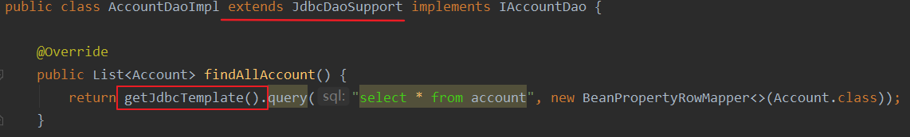
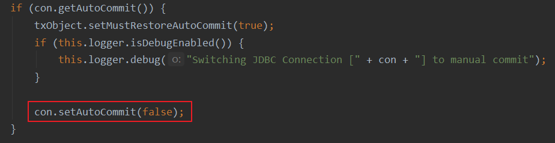
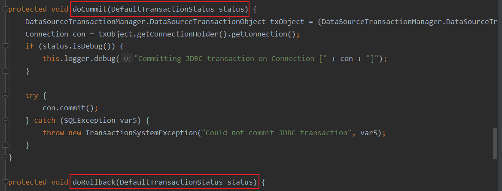
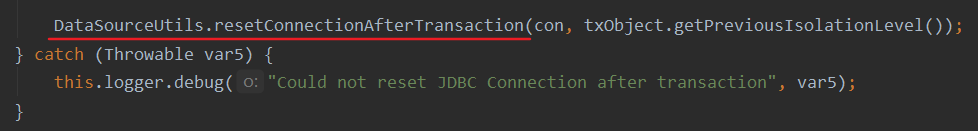

# 1.概述和入门

- 使用jdbc时,每次都需要自己获取PreparedStatement，输入sql语句参数，关闭连接等操作。造成操作冗余。影响我们打代码的效率。有了JDBCTemplate以后就可以只写SQL语句就可以了
- JdbcTemplate是Spring的一部分,是对数据库的操作在jdbc的封装,处理了资源的建立和释放(不需要我们管理连接了),我们只需要提供SQL语句(不需要我们设置参数了)和提取结果(查询时候可以直接返回对应的实体类),使JDBC更加易于使用
- 使用，在pom.xml导入坐标

```xml
<packaging>jar</packaging>
<dependencies>
    <dependency>
        <groupId>org.springframework</groupId>
        <artifactId>spring-context</artifactId>
        <version>5.0.2.RELEASE</version>
    </dependency>

    <dependency>
        <groupId>org.springframework</groupId>
        <artifactId>spring-jdbc</artifactId>
        <version>5.0.2.RELEASE</version>
    </dependency>

    <dependency>
        <groupId>org.springframework</groupId>
        <artifactId>spring-tx</artifactId>
        <version>5.0.2.RELEASE</version>
    </dependency>

    <dependency>
        <groupId>mysql</groupId>
        <artifactId>mysql-connector-java</artifactId>
        <version>5.1.6</version>
    </dependency>
</dependencies>
```

- 基本使用

```java
/*展示最基本的用法*/
public class JdbcTemplateDemo1 {
    public static void main(String[] args) {
        //创建数据源,使用spring内置数据源
        DriverManagerDataSource source = new DriverManagerDataSource();
        source.setDriverClassName("com.mysql.jdbc.Driver");
        source.setUrl("jdbc:mysql://localhost:3306/eesy");
        source.setUsername("root");
        source.setPassword("root");

        //1.创建JdbcTemplate对象
        JdbcTemplate template = new JdbcTemplate();
        //2.读取数据源
        template.setDataSource(source);
        //3.执行SQL语句
        template.execute("update account set money = 2000 where id = 2");
    }
}
```

# 2.使用Ioc配置

- 从基本用法里看到大量的set函数就知道可以使用Ioc进行配置
- bean.xml

```xml
<?xml version="1.0" encoding="UTF-8"?>
<beans xmlns="http://www.springframework.org/schema/beans"
       xmlns:xsi="http://www.w3.org/2001/XMLSchema-instance"
       xsi:schemaLocation="http://www.springframework.org/schema/beans http://www.springframework.org/schema/beans/spring-beans.xsd">

    <bean id="jdbcTemplate" class="org.springframework.jdbc.core.JdbcTemplate">
        <property name="dataSource" ref="dataSource"/>
    </bean>

    <bean id="dataSource" class="org.springframework.jdbc.datasource.DriverManagerDataSource">
        <property name="driverClassName" value="com.mysql.jdbc.Driver"/>
        <property name="url" value="jdbc:mysql://localhost:3306/eesy"/>
        <property name="username" value="root"/>
        <property name="password" value="root"/>
    </bean>
</beans>
```

- Ioc配置使用

```java
public class JdbcTemplateDemo2 {
    public static void main(String[] args) {
        //1.获取容器
        ApplicationContext container = new ClassPathXmlApplicationContext("bean.xml");
        //2.获取JdbcTemplate对象
        JdbcTemplate template = container.getBean("jdbcTemplate",JdbcTemplate.class);
        //3.执行SQL操作
        template.execute("update account set money = 2000 where id = 1");
    }
}
```

# 3.CRUD操作

- 增删改：和dbutils的使用差不多

```java
public class JdbcTemplateDemo2 {
    public static void main(String[] args) {
        //1.获取容器
        ApplicationContext container = new ClassPathXmlApplicationContext("bean.xml");
        //2.获取JdbcTemplate对象
        JdbcTemplate template = container.getBean("jdbcTemplate",JdbcTemplate.class);
        //3.执行SQL增删改操作

        //3.1增
        template.update("insert into account(name,money) values(?,?)","麻子",1100);
        //3.2改
        template.update("update account set money = 1200 where name = ?","麻子");
        //3.3删
        template.update("delete from account where id = ?",5);
    }
}
```

- 查询

```java
public class JdbcTemplateDemo2 {
    public static void main(String[] args) {
        //1.获取容器
        ApplicationContext container = new ClassPathXmlApplicationContext("bean.xml");
        //2.获取JdbcTemplate对象
        JdbcTemplate template = container.getBean("jdbcTemplate", JdbcTemplate.class);
        //3.执行SQL查询操作

        //3.1查询所有
        List<Account> accounts = template.query("select * from account", new BeanPropertyRowMapper<>(Account.class));
        for (Account account : accounts) {
            System.out.println(account);
        }
        //3.2条件查询
        List<Account> list = template.query("select * from account where money > ?", new BeanPropertyRowMapper<>(Account.class), 1000f);
        for (Account account : list) {
            System.out.println(account);
        }
        //3.3查询一个
        List<Account> aAccount = template.query("select * from account where id = ?", new BeanPropertyRowMapper<>(Account.class), 1);
        System.out.println(aAccount.get(0));
        //3.4查询一行一列:使用聚合函数
        Long nums = template.queryForObject("select count(*) from account where money > ?", Long.class, 1000f);
        System.out.println(nums);
    }
}
```

# 4.在Dao中的使用

- 持久层接口

```java
public interface IAccountDao {

    List<Account> findAllAccount();

    Account findAccountById(Integer id);

    Account findAccountByName(String username);

    void updateAccount(Account account);
}
```

- 持久层实现

```java
public class AccountDaoImpl extends JdbcDaoSupport implements IAccountDao {
    
    @Override
    public List<Account> findAllAccount() {
        return getJdbcTemplate().query("select * from account", new BeanPropertyRowMapper<>(Account.class));
    }

    @Override
    public Account findAccountById(Integer id) {
        List<Account> list = getJdbcTemplate().query("select * from account where id = ?", new BeanPropertyRowMapper<>(Account.class), id);
        return list.isEmpty() ? null : list.get(0);
    }

    @Override
    public Account findAccountByName(String username) {
        List<Account> list = getJdbcTemplate().query("select * from account where name = ?", new BeanPropertyRowMapper<>(Account.class), username);
        if (list.isEmpty()) return null;
        else if (list.size() == 1) return list.get(0);
        else throw new RuntimeException("查询结果大于1");
    }

    @Override
    public void updateAccount(Account account) {
        getJdbcTemplate().update("update account set name = ?,money=? where id = ?", account.getName(), account.getMoney(),account.getId());
    }
}
```

- bean.xml文件里进行Ioc配置

```xml
<?xml version="1.0" encoding="UTF-8"?>
<beans xmlns="http://www.springframework.org/schema/beans"
       xmlns:xsi="http://www.w3.org/2001/XMLSchema-instance"
       xsi:schemaLocation="http://www.springframework.org/schema/beans http://www.springframework.org/schema/beans/spring-beans.xsd">

    <!--配置持久层实体类对象-->
    <bean id="accountDao" class="com.kl.dao.impl.AccountDaoImpl">
         <property name="dataSource" ref="dataSource"/>
    </bean>

    <bean id="dataSource" class="org.springframework.jdbc.datasource.DriverManagerDataSource">
        <property name="driverClassName" value="com.mysql.jdbc.Driver"/>
        <property name="url" value="jdbc:mysql://localhost:3306/eesy"/>
        <property name="username" value="root"/>
        <property name="password" value="root"/>
    </bean>
</beans>
```

- 测试代码

```java
public class JdbcTemplateDemo3 {
    public static void main(String[] args) {
        //1.获取容器
        ApplicationContext container = new ClassPathXmlApplicationContext("bean.xml");
        AccountDaoImpl accountDao = container.getBean("accountDao", AccountDaoImpl.class);
        System.out.println(accountDao.findAccountById(1));
    }
}
```

# 5.JdbcDaoSupport

- spring框架中的类
- 当setDataSource方法被调用时createJdbcTemplate方法就会被触发
- new JdbcTemplate(dataSource)会在创建JdbcTemplate对象的时候加载数据源
- 所以当我们继承了该类在XML配置文件中就只需要配置数据源DataSource即可，createJdbcTemplate会因为DataSource的加载而加载
- JdbcDaoSupport源码如下：

```java
public abstract class JdbcDaoSupport extends DaoSupport {
    @Nullable
    private JdbcTemplate jdbcTemplate;

    public JdbcDaoSupport() {
    }

    public final void setDataSource(DataSource dataSource) {
        if (this.jdbcTemplate == null || dataSource != this.jdbcTemplate.getDataSource()) {
            this.jdbcTemplate = this.createJdbcTemplate(dataSource);
            this.initTemplateConfig();
        }
    }
    
    protected JdbcTemplate createJdbcTemplate(DataSource dataSource) {
        return new JdbcTemplate(dataSource);
    }

    //类中能够直接获取JdbcTemplate
    public final JdbcTemplate getJdbcTemplate() {
        return this.jdbcTemplate;
    }
}
```

- 触发后就会为我们创建出一个JdbcTemplate对象


- 持久层中的使用



# 6.基于XML的AOP控制事务

- 将代码转换到bean.xml中

```java
@Bean(name = "proxyService")
    public IAccountService getAccountService() {
        return (IAccountService) Proxy.newProxyInstance(accountService.getClass().getClassLoader(),
                accountService.getClass().getInterfaces(),
                new InvocationHandler() {
                    /**
                     * 添加事务的支持
                     */
                    @Override
                    public Object invoke(Object proxy, Method method, Object[] args) throws Throwable {
                        Object rtValue = null;
                        try {
                            //1.开启事务
                            manager.startTransaction();
                            //2.执行操作
                            rtValue = method.invoke(accountService, args);
                            //3.提交事务
                            manager.commitTransaction();
                            //4.返回结果
                            return rtValue;
                        } catch (Exception e) {
                            //5.回滚操作
                            manager.rollbackTransaction();
                            throw new RuntimeException(e);
                        } finally {
                            //6.释放连接
                            manager.release();
                        }
                    }
                });
    }
}
```

- 替换

```xml
<!-- 配置事务管理器-->
<bean id="txManager" class="com.kl.utils.TransactionManager">
    <!-- 注入ConnectionUtils -->
    <property name="connectionUtils" ref="connectionUtils"/>
</bean>

<!--配置aop-->
<aop:config>
    <aop:pointcut id="pc1" expression="execution(* com.kl.service.impl.*.*(..))"/>
    <aop:aspect id="txAdvice" ref="txManager">
       <!--配置前置通知，开启事务-->
        <aop:before method="beginTransaction" pointcut-ref="pc1"/>
       <!--配置后置通知，提交事务-->
        <aop:after-returning method="commit" pointcut-ref="pc1"/>
       <!--配置异常通知，回滚事务-->
        <aop:after-throwing method="rollback" pointcut-ref="pc1"/>
       <!--配置最后通知，释放连接-->
        <aop:after method="release" pointcut-ref="pc1"/>
    </aop:aspect>
</aop:config>
```

# 7.基于注解的AOP控制事务

- 替换bean.xml中的主要代码逻辑如下

```java
package com.kl.utils;

import org.aspectj.lang.ProceedingJoinPoint;
import org.aspectj.lang.annotation.*;
import org.springframework.beans.factory.annotation.Autowired;
import org.springframework.stereotype.Component;

/**
 * 和事务管理相关的工具类，它包含了，开启事务，提交事务，回滚事务和释放连接
 */
@Component("txManager")
@Aspect
public class TransactionManager {

    @Pointcut("execution(* com.kl.service.impl.*.*(..))")
    private void pc1(){}

    @Autowired
    private ConnectionUtils connectionUtils;


    /**
     * 开启事务
     */
    public  void beginTransaction(){
        try {
            connectionUtils.getThreadConnection().setAutoCommit(false);
        }catch (Exception e){
            e.printStackTrace();
        }
    }

    /**
     * 提交事务
     */
    public  void commit(){
        try {
            connectionUtils.getThreadConnection().commit();
        }catch (Exception e){
            e.printStackTrace();
        }
    }

    /**
     * 回滚事务
     */
    public  void rollback(){
        try {
            connectionUtils.getThreadConnection().rollback();
        }catch (Exception e){
            e.printStackTrace();
        }
    }


    /**
     * 释放连接
     */
    public  void release(){
        try {
            connectionUtils.getThreadConnection().close();//还回连接池中
            connectionUtils.removeConnection();
        }catch (Exception e){
            e.printStackTrace();
        }
    }

    @Around("pc1()") //开启环绕通知
    public Object aroundAdvice(ProceedingJoinPoint pjp){
        Object rtValue = null;
        try {
            this.beginTransaction();
            Object[] args = pjp.getArgs();
            rtValue = pjp.proceed(args);
            this.commit();
            return rtValue;
        } catch (Throwable throwable) {
            this.rollback();
            throwable.printStackTrace();
        } finally {
            this.release();
        }
        return rtValue;
    }
}
```

# 8.spring中基于事务的API

- 第一：JavaEE体系进行分层开发，事务处理位于业务层，Spring提供了分层设计业务层的事务处理解决力案
- 第二：spring框架为我们提供了一组事务控制的接口，这组接口是在spring-tx-5.0.2.RELEASE.jar中.
- 第三：spring的事务控制都是基于AOP的，它既可以使用编程的方式实现，也可以使用配置的方式实现，我们学习的重点是使用配置的方式实现

## PlatformTransactionManage

- 该接口提供事务操作的方法，包含有3个具体的操作

1. 获取事务状态信息
   - `TransactionStatus getTransaction（TransactionDefinition definition）`
2. 提交事务
   - `void commit（TransactionStatus status）`
3. 回滚事务
   - `void rollback（TransactionStatus status）`

## 实现类

- 真正管理事务的对象
  - `oxg.springframework.Jdbc.datasource.DatasourcerransactionManager` 使用SpringJDBC或iBatis进行持久化数据时使用
  - `org.springframework.orm.hibernate5.HibernateTransactionManager`使用Hibernato版本进行持久化数据时使用
- DatasourcerransactionManager类中的dobegin方法一开始就将自动提交事务设置为false



- 也实现了事务提交和回滚的方法



- 最后会调用doCleanupAfterCompletion方法，方法中释放连接



## TransactionDefinition

- 获取事务对象名称
  - `String getName()`
- 获取事务隔离级
  - `int getlsolationLevel()`
- 获取事务传播行为
  - `int getPropagationBehavior()`
- 获取事务超时时间
  - `int getTimeout()`
- 获取事务是否只读
  - `boolean isReadOnly()`

## 事务的隔离级别

- 事务隔离级反映事务提交并发访问时的处理态度
- ISOLATION DEFAULT：默认级别，归属下列某一种
- ISOLATION_READ UNCOMMITTED:可以读取未提交数据
- ISOLATION READ COMMITTED：只能读取已提交数据，解决脏读问题（Oracle默认级别）
- ISOLATION REPEATABLE_READ：是否读取其他事务提交修改后的数据，解决不可重复读问题（MySQL默认级别）
- SOLATION SERIALIZABLE：是否读取其他书务提交添加后的数据，解决幻影读问题

## 事务的传播行为

- REQUIRED：如果当前没有事务，就新建一个事务，如果已经存在一个事务中，加入到这个事务中
  - 一般的选择(默认值)
- SUPPORTS：支持当前事务，如果当前没有事务，就以非事务方式执行（没有事务）
- MANDATORY：使用当前的事务，如果当前没有事务，就她出异常
- REQUERS-NEW：新建事务，如果当前在事务中，把当前事务挂起
- NOT-SUPPORTED：以非事务方式执行操作，如果当前存在事务，就把当前事务挂起
- NEVER：以非事务方式运行，如果当前存在事务，抛出异常
- NESTED：如果当前存在事务，则在嵌套事务内执行，如果当前没有事务，则执行REQUIRED类似的操作

## 超时时间

- 默认值是-1，没有超时限制，如果有，以秒为单位进行设置

## 是否只读事务

- 建议查询设置为只读事务

## Transactionstatus

- Transactionstatus接口描述了某个时间点上事务对象的状态信息，包含有6个具体的操作
- 刷新事务
  - `void flush()`
- 获取是否是否存在存储点
  - `boolean hasSavepoint()`
- 获取事务是否完成
  - `boolean isCornpleted()`
- 获取事务是否为新的事务
  - `boolean isNewTransaction()`
- 获取事务是否回滚
  - `boolean isRollbackOnly()`
- 设置事务回滚
  - `void setRollbackOnly()`

# 9.基于XML的声明式事务控制

- 只需在xml文件中声明一次以后对应的方法都会自动加上事务操作
- 业务层

```java
package com.kl.service.impl;

import com.kl.dao.IAccountDao;
import com.kl.domain.Account;
import com.kl.service.IAccountService;


public class AccountServiceImpl implements IAccountService {

    private IAccountDao accountDao;

    public void setAccountDao(IAccountDao accountDao) {
        this.accountDao = accountDao;
    }

    /**
     * 根据id查询账户信息
     */
    public Account findAccountById(Integer id) {
        return accountDao.findAccountById(id);
    }

    /**
     * 转账操作
     */
    public void transfer(String sourceName, String targetName, Float money) {
        System.out.println("transfer...");
        //1根据名称查询转出账户
        Account source = accountDao.findAccountByName(sourceName);
        //2根据名称查询转入账户
        Account target = accountDao.findAccountByName(targetName);
        //3转出账户减钱
        source.setMoney(source.getMoney()-money);
        //4转入账户加钱
        target.setMoney(target.getMoney()+money);
        //5更新转出账户
        accountDao.updateAccount(source);

        int i=1/0; //使用事务处理异常

        //6更新转入账户
        accountDao.updateAccount(target);
    }
} 
```

- bean.xml文件的配置

```xml
<?xml version="1.0" encoding="UTF-8"?>
<beans xmlns="http://www.springframework.org/schema/beans"
       xmlns:xsi="http://www.w3.org/2001/XMLSchema-instance"
       xmlns:aop="http://www.springframework.org/schema/aop"
       xmlns:tx="http://www.springframework.org/schema/tx"
       xsi:schemaLocation="
        http://www.springframework.org/schema/beans
        http://www.springframework.org/schema/beans/spring-beans.xsd
        http://www.springframework.org/schema/tx
        http://www.springframework.org/schema/tx/spring-tx.xsd
        http://www.springframework.org/schema/aop
        http://www.springframework.org/schema/aop/spring-aop.xsd">

    <!-- 配置业务层-->
    <bean id="accountService" class="com.kl.service.impl.AccountServiceImpl">
        <property name="accountDao" ref="accountDao"/>
    </bean>

    <!-- 配置账户的持久层-->
    <bean id="accountDao" class="com.kl.dao.impl.AccountDaoImpl">
        <property name="dataSource" ref="dataSource"/>
    </bean>


    <!-- 配置数据源-->
    <bean id="dataSource" class="org.springframework.jdbc.datasource.DriverManagerDataSource">
        <property name="driverClassName" value="com.mysql.jdbc.Driver"/>
        <property name="url" value="jdbc:mysql://localhost:3306/eesy"/>
        <property name="username" value="root"/>
        <property name="password" value="root"/>
    </bean>

    <!-- spring中基于XML的声明式事务控制配置步骤
        1、配置事务管理器
        2、配置事务的通知
                此时我们需要导入事务的约束 tx名称空间和约束，同时也需要aop的
                使用tx:advice标签配置事务通知
                    属性：
                        id：给事务通知起一个唯一标识
                        transaction-manager：给事务通知提供一个事务管理器引用
        3、配置AOP中的通用切入点表达式
        4、建立事务通知和切入点表达式的对应关系
        5、配置事务的属性
               是在事务的通知tx:advice标签的内部

     -->
    <!-- 配置事务管理器 -->
    <bean id="transactionManager" class="org.springframework.jdbc.datasource.DataSourceTransactionManager">
        <property name="dataSource" ref="dataSource"/>
    </bean>

    <!-- 配置事务的通知-->
    <tx:advice id="txAdvice" transaction-manager="transactionManager">
        <!-- 配置事务的属性
                isolation：用于指定事务的隔离级别。默认值是DEFAULT，表示使用数据库的默认隔离级别。
                propagation：用于指定事务的传播行为。默认值是REQUIRED，表示一定会有事务，增删改的选择。查询方法可以选择SUPPORTS。
                read-only：用于指定事务是否只读。只有查询方法才能设置为true。默认值是false，表示读写。
                timeout：用于指定事务的超时时间，默认值是-1，表示永不超时。如果指定了数值，以秒为单位。
                rollback-for：用于指定一个异常，当产生该异常时，事务回滚，产生其他异常时，事务不回滚。没有默认值。表示任何异常都回滚。
                no-rollback-for：用于指定一个异常，当产生该异常时，事务不回滚，产生其他异常时事务回滚。没有默认值。表示任何异常都回滚。
        -->
        <tx:attributes>
            <tx:method name="*" propagation="REQUIRED" read-only="false"/>
            <tx:method name="find*" propagation="SUPPORTS" read-only="true"/> <!--优先级更高-->
        </tx:attributes>
    </tx:advice>

    <!-- 配置aop-->
    <aop:config>
        <!-- 配置切入点表达式-->
        <aop:pointcut id="pt1" expression="execution(* com.kl.service.impl.*.*(..))"/>
        <!--建立切入点表达式和事务通知的对应关系 -->
        <aop:advisor advice-ref="txAdvice" pointcut-ref="pt1"/>
    </aop:config>
</beans>
```

# 10.基于注解的声明式事务控制

## 10.1XML和注解混合使用

- bean.xml

```xml
<?xml version="1.0" encoding="UTF-8"?>
<beans xmlns="http://www.springframework.org/schema/beans"
       xmlns:xsi="http://www.w3.org/2001/XMLSchema-instance"
       xmlns:tx="http://www.springframework.org/schema/tx"
       xmlns:context="http://www.springframework.org/schema/context"
       xsi:schemaLocation="http://www.springframework.org/schema/beans
        http://www.springframework.org/schema/beans/spring-beans.xsd
        http://www.springframework.org/schema/tx
        http://www.springframework.org/schema/tx/spring-tx.xsd
        http://www.springframework.org/schema/context http://www.springframework.org/schema/context/spring-context.xsd">

    <!--扫包-->
    <context:component-scan base-package="com.kl"/>

    <bean id="jdbcTemplate" class="org.springframework.jdbc.core.JdbcTemplate">
        <property name="dataSource" ref="dataSource"/>
    </bean>

    <!-- 配置数据源-->
    <bean id="dataSource" class="org.springframework.jdbc.datasource.DriverManagerDataSource">
        <property name="driverClassName" value="com.mysql.jdbc.Driver"/>
        <property name="url" value="jdbc:mysql://localhost:3306/eesy"/>
        <property name="username" value="root"/>
        <property name="password" value="root"/>
    </bean>

    <!-- spring中基于注解的声明式事务控制配置步骤
         1、配置事务管理器
         2、开启spring对注解事务的支持
         3、在需要事务支持的地方使用@Transactional注解
         -->
    <!-- 配置事务管理器 -->
    <bean id="transactionManager" class="org.springframework.jdbc.datasource.DataSourceTransactionManager">
        <property name="dataSource" ref="dataSource"/>
    </bean>

    <!--开启spring对事务的支持-->
    <tx:annotation-driven transaction-manager="transactionManager"/>

</beans>
```

- 持久层注解配置

```java
@Repository("accountDao")
public class AccountDaoImpl implements IAccountDao {
    @Autowired
    private JdbcTemplate jdbcTemplate;
    //......
}
```

- 业务层注解配置
- 弊端：当我们有多个不同方法时，需要配置不同的事务控制，就需要在方法上重新添加注解的事务控制，这会很麻烦
- 优点：注解配置事务很简洁

```java
@Service("accountService")
@Transactional(propagation = Propagation.SUPPORTS,readOnly = true) //只读型事务控制
public class AccountServiceImpl implements IAccountService {

    @Autowired
    private IAccountDao accountDao;


    /**
     * 根据id查询账户信息
     */
    public Account findAccountById(Integer id) {
        return accountDao.findAccountById(id);
    }

    /**
     * 转账操作，需要的是读写型事务控制，那么就需要使用注解重新声明配置
     */
    @Transactional(propagation = Propagation.REQUIRED,readOnly = false)
    public void transfer(String sourceName, String targetName, Float money) {
        System.out.println("transfer...");
        //2.1根据名称查询转出账户
        Account source = accountDao.findAccountByName(sourceName);
        //2.2根据名称查询转入账户
        Account target = accountDao.findAccountByName(targetName);
        //2.3转出账户减钱
        source.setMoney(source.getMoney()-money);
        //2.4转入账户加钱
        target.setMoney(target.getMoney()+money);
        //2.5更新转出账户
        accountDao.updateAccount(source);

        int i=1/0;

        //2.6更新转入账户
        accountDao.updateAccount(target);
    }
} 
```

- 测试方法

```java
@RunWith(SpringJUnit4ClassRunner.class)
@ContextConfiguration(locations = "classpath:bean.xml")
public class AccountTest {

    @Autowired
    private IAccountService service;

    @Test
    public void testTransfer(){
        service.transfer("张三","李四",100f);
    }
}
```

## 10.1纯注解事务控制

- 把bean.xml全部消掉
- 将连接jdbc所需的四个属性抽取到一个资源文件jdbcconfig.properties中

```properties
jdbc.driver=com.mysql.jdbc.Driver
jdbc.url=jdbc:mysql://localhost:3306/eesy
jdbc.user=root
jdbc.password=root
```

---

- **创建和数据库相关的配置类**

```java
package com.kl.config;

import org.springframework.beans.factory.annotation.Value;
import org.springframework.context.annotation.Bean;
import org.springframework.jdbc.core.JdbcTemplate;
import org.springframework.jdbc.datasource.DriverManagerDataSource;

import javax.sql.DataSource;

/**
 * 和数据库相关的配置类
 */
public class JdbcConfig {

    @Value("${jdbc.driver}")
    private String driverClass;
    @Value("${jdbc.url}")
    private String jdbcUrl;
    @Value("${jdbc.user}")
    private String user;
    @Value("${jdbc.password}")
    private String password;


    /**
     * 创建JdbcTemplate并加载进springIoc容器
     */
    @Bean("jdbcTemplate")
    private JdbcTemplate createJdbcTemplate(DataSource dataSource){
        return new JdbcTemplate(dataSource);
    }

    /**
     * 创建DataSource并加载进springIoc容器
     */
    @Bean("dataSource")
    private DataSource createDataSource(){
        DriverManagerDataSource ds = new DriverManagerDataSource();
        ds.setDriverClassName(driverClass);
        ds.setUrl(jdbcUrl);
        ds.setUsername(user);
        ds.setPassword(password);
        return ds;
    }
}
```

- **创建和事务相关的配置类**

```java
package com.kl.config;

import org.springframework.context.annotation.Bean;
import org.springframework.jdbc.datasource.DataSourceTransactionManager;
import org.springframework.transaction.PlatformTransactionManager;

import javax.sql.DataSource;

/**
 * 和事务相关的配置类
 */
public class TransactionConfig {

    /**
     * 创建事务管理对象并放入SpringIoc容器
     */
    @Bean("transactionManager")
    public PlatformTransactionManager creatTransactionManager(DataSource ds){
        return new DataSourceTransactionManager(ds);
    }
}
```

- **声明总配置类**

```java
package com.kl.config;

import org.springframework.context.annotation.ComponentScan;
import org.springframework.context.annotation.Configuration;
import org.springframework.context.annotation.Import;
import org.springframework.context.annotation.PropertySource;
import org.springframework.transaction.annotation.EnableTransactionManagement;

@Configuration //声明为配置类(相当于bean.xml)
@ComponentScan("com.kl") //扫包
@Import({JdbcConfig.class,TransactionConfig.class}) //导入子配置类
@PropertySource("classpath:jdbcConfig.properties") //使用配置的资源文件
@EnableTransactionManagement //开启对注解事务的支持
public class SpringConfiguration {

}
```

- **修改测试类的配置路径为classes**

```java
@RunWith(SpringJUnit4ClassRunner.class)
@ContextConfiguration(classes = SpringConfiguration.class)
public class AccountTest {

    @Autowired
    private IAccountService service;

    @Test
    public void testTransfer(){
        service.transfer("张三","李四",100f);
    }
}
```

