# 一、MVC概念

## 1.1三层架构

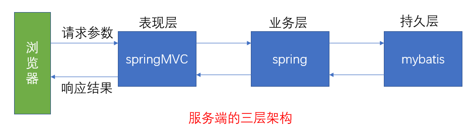

- 我们的开发架构一般都是基于两种形式，一种是 C/S 架构，也就是客户端/服务器，另一种是 B/S 架构，也就 是浏览器服务器。在 JavaEE 开发中，几乎全都是基于 B/S 架构的开发。那么在 B/S 架构中，系统标准的三层架构 包括：表现层、业务层、持久层。三层架构在我们的实际开发中使用的非常多，所以我们课程中的案例也都是基于 三层架构设计的。 三层架构中，每一层各司其职，接下来我们就说说每层都负责哪些方面： 
- 表现层： 也就是我们常说的web层。它负责接收客户端请求，向客户端响应结果，通常客户端使用http协议请求 web 层，web 需要接收 http 请求，完成 http 响应。 表现层包括展示层和控制层：控制层负责接收请求，展示层负责结果的展示。 表现层依赖业务层，接收到客户端请求一般会调用业务层进行业务处理，并将处理结果响应给客户端。 表现层的设计一般都使用 MVC 模型。（MVC 是表现层的设计模型，和其他层没有关系） 
- 业务层： 也就是我们常说的 service 层。它负责业务逻辑处理，和我们开发项目的需求息息相关。web 层依赖业 务层，但是业务层不依赖 web 层。 业务层在业务处理时可能会依赖持久层，如果要对数据持久化需要保证事务一致性。（也就是我们说的， 事务应该放到业务层来控制） 
- 持久层： 也就是我们是常说的 dao 层。负责数据持久化，包括数据层即数据库和数据访问层，数据库是对数据进 行持久化的载体，数据访问层是业务层和持久层交互的接口，业务层需要通过数据访问层将数据持久化到数据库 中。通俗的讲，持久层就是和数据库交互，对数据库表进行曾删改查的

## 1.2MVC模型

- MVC 全名是 Model View Controller，是模型(model)－视图(view)－控制器(controller)的缩写， 是一种用于设计创建 Web 应用程序表现层的模式。MVC 中每个部分各司其职： 
- Model（模型）： 通常指的就是我们的数据模型。作用一般情况下用于封装数据
-  View（视图）： 通常指的就是我们的 jsp 或者 html。作用一般就是展示数据的。 通常视图是依据模型数据创建的
- Controller（控制器）： 是应用程序中处理用户交互的部分。作用一般就是处理程序逻辑的

>它相对于前两个不是很好理解，这里举个例子： 例如： 我们要保存一个用户的信息，该用户信息中包含了姓名，性别，年龄等等。 这时候表单输入要求年龄必须是 1~100 之间的整数。姓名和性别不能为空。并且把数据填充 到模型之中。 此时除了 js 的校验之外，服务器端也应该有数据准确性的校验，那么校验就是控制器的该做 的。 当校验失败后，由控制器负责把错误页面展示给使用者。 如果校验成功，也是控制器负责把数据填充到模型，并且调用业务层实现完整的业务需求

# 二、SpringMVC

## 2.1概率

- SpringMVC 是一种基于 Java 的实现 MVC 设计模型的请求驱动类型的轻量级 Web 框架，属于 Spring FrameWork 的后续产品，已经融合在 Spring Web Flow 里面。Spring 框架提供了构建 Web 应用程序的全功 能 MVC 模块。使用 Spring 可插入的 MVC 架构，从而在使用 Spring 进行 WEB 开发时，可以选择使用 Spring 的 Spring MVC 框架或集成其他 MVC 开发框架，如 Struts1(现在一般不用)，Struts2 等。 SpringMVC 已经成为目前最主流的 MVC 框架之一，并且随着 Spring3.0 的发布，全面超越 Struts2，成 为最优秀的 MVC 框架。 它通过一套注解，让一个简单的 Java 类成为处理请求的控制器，而无须实现任何接口。同时它还支持 RESTful 编程风格的请求

## 2.2优势

1. 清晰的角色划分： 前端控制器（DispatcherServlet） 请求到处理器映射（HandlerMapping） 处理器适配器（HandlerAdapter） 视图解析器（ViewResolver） 处理器或页面控制器（Controller） 验证器（ Validator） 命令对象（Command 请求参数绑定到的对象就叫命令对象） 表单对象（Form Object 提供给表单展示和提交到的对象就叫表单对象）
2. 分工明确，而且扩展点相当灵活，可以很容易扩展，虽然几乎不需要
3. 由于命令对象就是一个 POJO，无需继承框架特定 API，可以使用命令对象直接作为业务对象
4. 和 Spring 其他框架无缝集成，是其它 Web 框架所不具备的
5. 可适配，通过 HandlerAdapter 可以支持任意的类作为处理器
6. 可定制性，HandlerMapping、ViewResolver 等能够非常简单的定制
7. 功能强大的数据验证、格式化、绑定机制
8. 利用 Spring 提供的 Mock 对象能够非常简单的进行 Web 层单元测试
9. 本地化、主题的解析的支持，使我们更容易进行国际化和主题的切换
10. 强大的 JSP 标签库，使 JSP 编写更容易。
11. 还有比如RESTful风格的支持、简单的文件上传、约定大于配置的契约式编程支持、基于注解的零配 置支持等等

## 2.3SpringMVC 和 Struts2 的优略分析

- 共同点： 

>- 它们都是表现层框架，都是基于 MVC 模型编写的
>-  它们的底层都离不开原始 ServletAPI
>- 它们处理请求的机制都是一个核心控制器

- 区别： 

>- Spring MVC 的入口是 Servlet, 而 Struts2 是 Filter 
>- Spring MVC 是基于方法设计的，而 Struts2 是基于类，Struts2 每次执行都会创建一个动作类。所 以 Spring MVC 会稍微比 Struts2 快些
>- Spring MVC 使用更加简洁,同时还支持 JSR303, 处理 ajax 的请求更方便

# 三、环境搭建

1. 创建maven工程

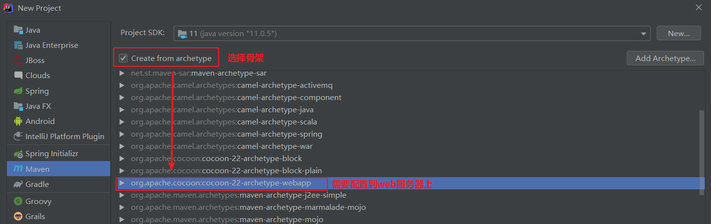

2. 填好工程名后

>- 键：archetypeCatalog
>- 值：internal

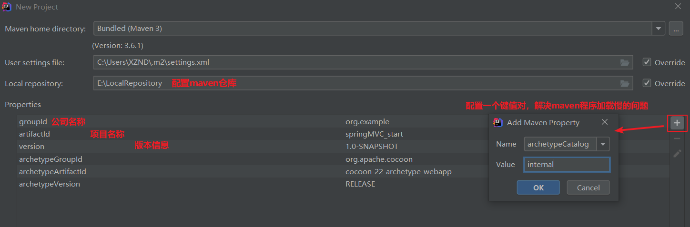

3. 工程加载成功后会发现目录结构是不全的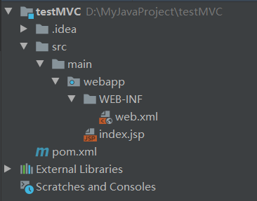
4. 需要手动创建一个java目录和resource资源目录，根据idea的提示直接创建即可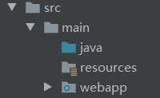

5. 若是普通的目录再手动设置为java目录或是资源目录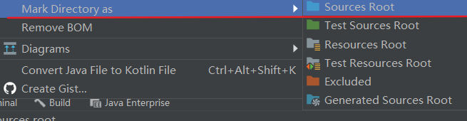
6. 配置pom.xml

```xml
<?xml version="1.0" encoding="UTF-8"?>

<project xmlns="http://maven.apache.org/POM/4.0.0" xmlns:xsi="http://www.w3.org/2001/XMLSchema-instance"
  xsi:schemaLocation="http://maven.apache.org/POM/4.0.0 http://maven.apache.org/xsd/maven-4.0.0.xsd">
  <modelVersion>4.0.0</modelVersion>

  <groupId>org.example</groupId>
  <artifactId>testMVC</artifactId>
  <version>1.0-SNAPSHOT</version>
  <packaging>war</packaging>

  <name>testMVC Maven Webapp</name>
  <!-- FIXME change it to the project's website -->
  <url>http://www.example.com</url>

  <properties>
    <project.build.sourceEncoding>UTF-8</project.build.sourceEncoding>
    <maven.compiler.source>1.8</maven.compiler.source>
    <maven.compiler.target>1.8</maven.compiler.target>
    <!--版本锁定-->
    <spring.version>5.0.2.RELEASE</spring.version>
  </properties>

  <dependencies>
      <!--直接引入-->
    <dependency>
      <groupId>org.springframework</groupId>
      <artifactId>spring-context</artifactId>
      <version>${spring.version}</version>
    </dependency>
    <dependency>
      <groupId>org.springframework</groupId>
      <artifactId>spring-web</artifactId>
      <version>${spring.version}</version>
    </dependency>
    <dependency>
      <groupId>org.springframework</groupId>
      <artifactId>spring-webmvc</artifactId>
      <version>${spring.version}</version>
    </dependency>
    <dependency>
      <groupId>javax.servlet</groupId>
      <artifactId>servlet-api</artifactId>
      <version>2.5</version>
      <scope>provided</scope>
    </dependency>
    <dependency>
      <groupId>javax.servlet.jsp</groupId>
      <artifactId>jsp-api</artifactId>
      <version>2.0</version>
      <scope>provided</scope>
    </dependency>

  </dependencies>

  <build>
      <!--省略-->
  </build>
</project>
```

# 四、SpringMVC入门

## 4.1入门案例

1. 重新创建index.jsp文件

```jsp
<%@ page contentType="text/html;charset=UTF-8" language="java" %>
<html>
<head>
    <title>入门案例</title>
</head>
<body>
<h3>入门案例</h3>
<a href="hello">入门跳转</a>
</body>
</html>
```

2. 在web.xml里配置前端控制器

```xml
<!DOCTYPE web-app PUBLIC
        "-//Sun Microsystems, Inc.//DTD Web Application 2.3//EN"
        "http://java.sun.com/dtd/web-app_2_3.dtd" >

<web-app>
    <display-name>Archetype Created Web Application</display-name>

    <!--配置前端控制器-->
    <!-- 配置 spring mvc 的核心控制器 -->
    <servlet>
        <servlet-name>dispatcherServlet</servlet-name>
        <servlet-class>org.springframework.web.servlet.DispatcherServlet</servlet-class>
        <!-- 配置初始化参数，用于读取 SpringMVC 的配置文件 -->
        <init-param>
            <param-name>contextConfigLocation</param-name>
            <param-value>classpath:springMVC.xml</param-value>
        </init-param>
        <!-- 配置 servlet 的对象的创建时间点:应用加载时创建,取值只能是非 0 正整数,表示启动顺序 -->
        <load-on-startup>1</load-on-startup>
    </servlet>
    <servlet-mapping>
        <servlet-name>dispatcherServlet</servlet-name>
        <url-pattern>/</url-pattern>
    </servlet-mapping>
</web-app>
```

- 在resource资源目录下创建springMVC.xml文件

```xml
<?xml version="1.0" encoding="UTF-8"?>
<beans xmlns="http://www.springframework.org/schema/beans"
       xmlns:mvc="http://www.springframework.org/schema/mvc"
       xmlns:context="http://www.springframework.org/schema/context"
       xmlns:xsi="http://www.w3.org/2001/XMLSchema-instance"
       xsi:schemaLocation="
        http://www.springframework.org/schema/beans
        http://www.springframework.org/schema/beans/spring-beans.xsd
        http://www.springframework.org/schema/mvc
        http://www.springframework.org/schema/mvc/spring-mvc.xsd
        http://www.springframework.org/schema/context
        http://www.springframework.org/schema/context/spring-context.xsd">

    <!-- 配置创建 spring 容器要扫描的包 -->
    <context:component-scan base-package="com.kl"/>

    <!-- 视图解析器对象
         根据文件所在目录和资源的后缀名解析对象
         跳转到指定的页面-->
    <bean id="internalResourceViewResolver" class="org.springframework.web.servlet.view.InternalResourceViewResolver">
        <!--前缀，找视图解析器下的目录-->
        <property name="prefix" value="/WEB-INF/pages/"/>
        <!--后缀，找目录中后缀名为.jsp的文件解析-->
        <property name="suffix" value=".jsp"/>
    </bean>

    <!-- 开启SpringMVC框架注解的支持 -->
    <mvc:annotation-driven/>

</beans>
```

- 在java类目录下创建控制器类

```java
package com.kl.controller;

import org.springframework.stereotype.Controller;
import org.springframework.web.bind.annotation.RequestMapping;

@Controller //控制器类
public class HelloController {

     //方法请求路径
     @RequestMapping(path="/hello")
     public String sayHello(){
         System.out.println("Hello SpringMVC");
         return "success"; //资源名就叫success,不能乱改
     }
}
```

- 在WEB-INF目录下创建pages目录并添加success.jsp作为跳转成功的页面

```jsp
<%@ page contentType="text/html;charset=UTF-8" language="java" %>
<html>
    <head>
        <title>成功页面</title>
    </head>
    <body>
        <h3>入门成功</h3>
    </body>
</html>
```

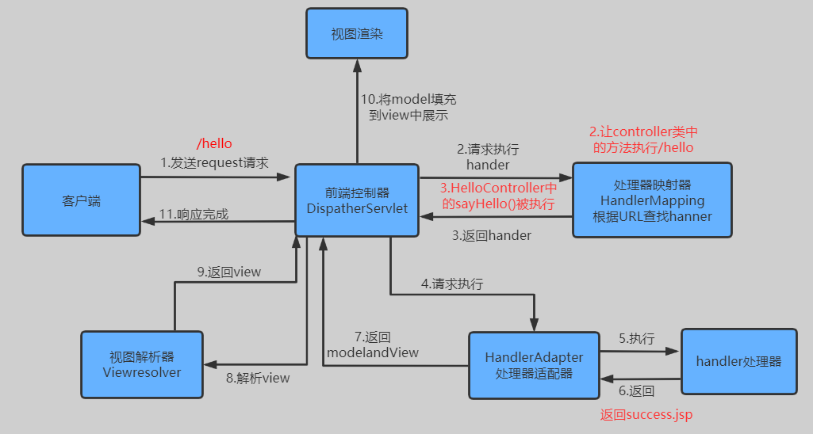

## 4.2案例分析

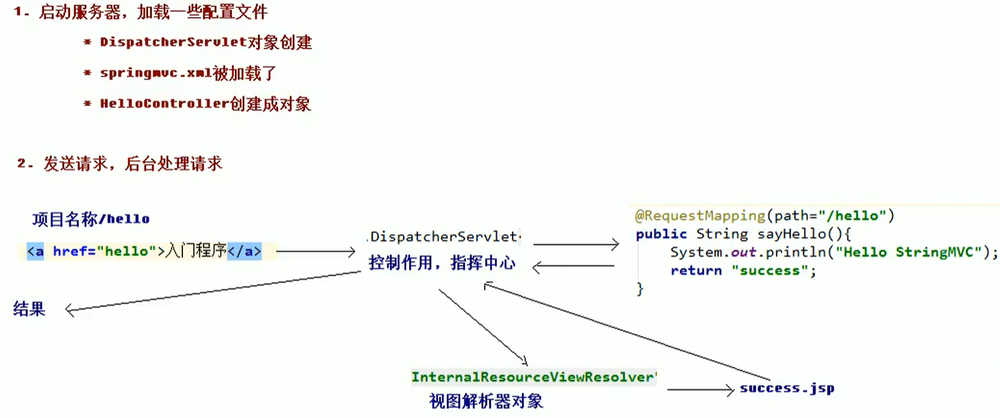

- 入门案例的执行流程 

>1. 当启动Tomcat服务器的时候，因为配置了load-on-startup标签，所以会创建DispatcherServlet对象， 就会加载springmvc.xml配置文件
>2. 开启了注解扫描，那么HelloController对象就会被创建
>3. 从index.jsp发送请求，请求会先到达DispatcherServlet核心控制器，根据配置@RequestMapping注解 找到执行的具体方法 
>4. 根据执行方法的返回值，再根据配置的视图解析器，去指定的目录下查找指定名称的JSP文件
>5. Tomcat服务器渲染页面，做出响应

## 4.3SpringMVC流程图

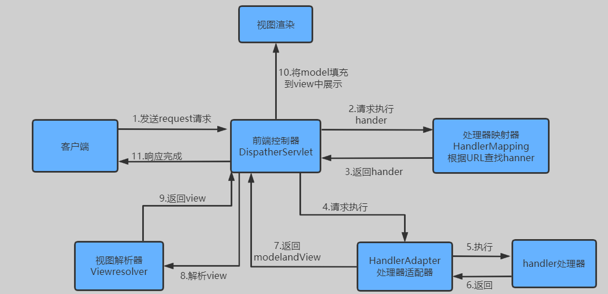

## 4.4组件介绍

- DispatcherServlet：前端控制器

>用户请求到达前端控制器，它就相当于 mvc 模式中的 c，dispatcherServlet 是整个流程控制的中心，由 它调用其它组件处理用户的请求，dispatcherServlet 的存在降低了组件之间的耦合性

- HandlerMapping：处理器映射器

>HandlerMapping 负责根据用户请求找到 Handler 即处理器，SpringMVC 提供了不同的映射器实现不同的 映射方式，例如：配置文件方式，实现接口方式，注解方式等

- Handler：处理器

>它就是我们开发中要编写的具体业务控制器。由 DispatcherServlet 把用户请求转发到 Handler。由 Handler 对具体的用户请求进行处理

- HandlAdapter：处理器适配器

>通过 HandlerAdapter 对处理器进行执行，这是适配器模式的应用，通过扩展适配器可以对更多类型的处理 器进行执行

- View Resolver：视图解析器

>View Resolver 负责将处理结果生成 View 视图，View Resolver 首先根据逻辑视图名解析成物理视图名 即具体的页面地址，再生成 View 视图对象，最后对 View 进行渲染将处理结果通过页面展示给用户

- View：视图

>- SpringMVC 框架提供了很多的 View 视图类型的支持，包括：jstlView、freemarkerView、pdfView 等。我们最常用的视图就是 jsp
>- 一般情况下需要通过页面标签或页面模版技术将模型数据通过页面展示给用户，需要由程序员根据业务需求开 发具体的页面

- `< mvc:annotation-driven/ >`说明

>在 SpringMVC 的各个组件中，处理器映射器、处理器适配器、视图解析器称为 SpringMVC 的三大组件。 使 用  自动加载 RequestMappingHandlerMapping （处理映射器） 和 RequestMappingHandlerAdapter （ 处 理 适 配 器 ） ， 可 用 在 SpringMVC.xml 配 置 文 件 中 使 用 替代注解处理器和适配器的配置

```xml
<!-- 上面的标签相当于 如下配置-->
<!-- Begin -->
<!-- HandlerMapping -->
<bean
      class="org.springframework.web.servlet.mvc.method.annotation.RequestMappingHandlerM
apping"></bean>
<bean
class="org.springframework.web.servlet.handler.BeanNameUrlHandlerMapping"></bean>
<!-- HandlerAdapter -->
<bean
class="org.springframework.web.servlet.mvc.method.annotation.RequestMappingHandlerA
dapter"></bean>
<bean
class="org.springframework.web.servlet.mvc.HttpRequestHandlerAdapter"></bean>
<bean
class="org.springframework.web.servlet.mvc.SimpleControllerHandlerAdapter"></bean>
<!-- HadnlerExceptionResolvers -->
<bean
class="org.springframework.web.servlet.mvc.method.annotation.ExceptionHandlerExcept
ionResolver"></bean>
<bean
class="org.springframework.web.servlet.mvc.annotation.ResponseStatusExceptionResolv
er"></bean>
<bean
class="org.springframework.web.servlet.mvc.support.DefaultHandlerExceptionResolver"
></bean>

<!-- End ......
注意：一般开发中，我们都需要写上此标签
明确：我们只需要编写处理具体业务的控制器以及视图
-->
```

#  五、RequestMapping注解

- 作用： 用于建立请求 URL 和处理请求方法之间的对应关系

## 5.1只注解在方法上

- 当其他配置信息无误的情况下

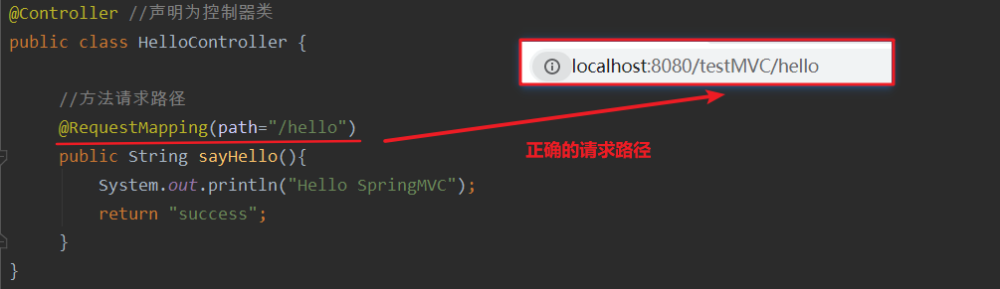

- 请求 URL 的第二级访问目录

## 5.2注解在类和方法上

- 请求 URL 的第一级访问目录。此处不写的话，就相当于应用的根目录。写的话需要以/开头
- 它出现的目的是为了使我们的 URL 可以按照模块化管理
- 例如账户模块：/account部分就是把 RequsetMappding 写在类上，使我们的 URL 更加精细。

>- /account/add 
>
>- /account/update
>
>- /account/delete

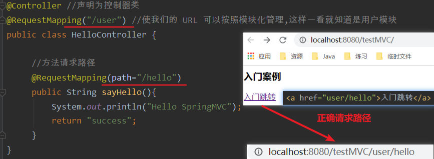

## 5.3属性

- value：用于指定请求的 URL。它和 path 属性的作用是一样的

```java
@AliasFor("path") //别名叫做path
String[] value() default {};

@AliasFor("value") //别名叫做value

String[] path() default {};
```

- method：用于指定请求的方式

```java
RequestMethod[] method() default {};
```

```java
public enum RequestMethod {
    GET,
    HEAD,
    POST,
    PUT,
    PATCH,
    DELETE,
    OPTIONS,
    TRACE;

    private RequestMethod() {
    }
}
```

- params：用于指定限制请求参数的条件。它支持简单的表达式。要求请求参数的 key 和 value 必须和 配置的一模一样

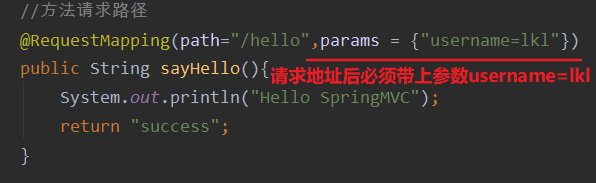

```java
String[] params() default {};
```

```java
例如：
params = {"accountName"}，表示请求参数必须有 accountName
params = {"moeny!100"}，表示请求参数中 money 不能是 100。
headers：用于指定限制请求消息头的条件。
```

- **注意：以上四个属性只要出现 2 个或以上时，他们的关系是与的关系**

# 六、请求参数的绑定

- 请求参数的绑定说明

>- 绑定机制
>  1. 表单提交的数据都是key-value格式的username=haha&password=123
>  2. SpringMVC的参数绑定过程是把表单提交的请求参数，作为控制器中方法的参数进行绑定
>  3. 要求：提交表单的name和参数的名称是相同的
>- 支持的数据类型
>  1. 基本数据类型和字符串类型
>  2. 实体类型（JavaBean）
>  3. 集合数据类型（List，map集合等）

- 基本数据类型和字符串类型

>1. 提交表单的name和参数的名称是相同的
>2. 区分大小写

- 实体类型（JavaBean）

>1. 提交表单的name和JavaBean中的属性名称需要一致
>2. 如果一个JavaBean类中包含其他的引用类型，那么表单的name属性需要编写成：对象属性例如：address.name


## 6.1基本数据绑定

```java
@Controller
@RequestMapping("/param")
public class ParamController {

    @RequestMapping("/bindParam")
    public String bindParam(String username,String password){
        System.out.println(username); //输出super
        System.out.println(password); //输出123
        return "success";
    }
}
```

- 请求路径里的请求参数必须要和方法中的参数名相同

```jsp
<!--请求参数绑定-->
<!--请求路径中带有一级目录和二级目录-->
<a href="param/bindParam?username=super&password=123">入门跳转</a>
```

## 6.2封装到javabean中

- javabean

```java
package com.kl.domain;
import java.io.Serializable;

public class User implements Serializable {
    private String username;
    private String password;
    private Double money;
    //......
}
```

- 控制类

```java
@Controller
@RequestMapping("/param")
public class ParamController {

    @RequestMapping("/saveUser") //会自动找到user类中的set方法进行参数绑定
    public String saveUser(User user){
        System.out.println(user);
        return "success";
    }
}
```

- 请求表单

```jsp
<body>
<form action="param/saveUser" method="get">
    姓名：<input type="text" name="username"><br/>
    密码：<input type="password" name="password"><br/>
    余额：<input type="text" name="money"><br/>
    <input type="submit" value="保存">
</form>
</body>
```

---

- **若Javabean中还有引用对象的情况：**
- 在User类中加一个UserInfo的引用

```java
public class User {
    private String username;
    private String password;
    private Double money;
    private UserInfo info; //用户信息
    //...
}

public class UserInfo {
    private Integer ang;
    private String address;
    //......
}
```

- 主要是修改表单提交的信息即可

```jsp
<body>
    <!--把数据封装到User对象中-->
    <form action="param/saveUser" method="get">
        姓名：<input type="text" name="username"><br/>
        密码：<input type="password" name="password"><br/>
        余额：<input type="text" name="money"><br/>
        用户年龄：<input type="text" name="info.age"><br/>
        用户地址：<input type="text" name="info.address"><br/>
        <input type="submit" value="保存">
    </form>
</body>
```

## 6.3解决表单提交post请求乱码问题

- 问题：表单提交中文使用get请求时不会乱码，但使用post请求会出现乱码
- 在web.xml文件中配置过滤器

```xml
<web-app>
    <display-name>Archetype Created Web Application</display-name>
    <!--配置解决中文乱码的过滤器-->
    <filter>
        <filter-name>characterEncodingFilter</filter-name>
        <filter-class>org.springframework.web.filter.CharacterEncodingFilter</filter-class>
        <init-param>
            <param-name>encoding</param-name>
            <param-value>UTF-8</param-value>
        </init-param>
    </filter>
    <filter-mapping>
        <filter-name>characterEncodingFilter</filter-name>
        <url-pattern>/*</url-pattern>
    </filter-mapping>

    <!--省略其他配置-->
</web-app>
```

- 有可能会遇到报错

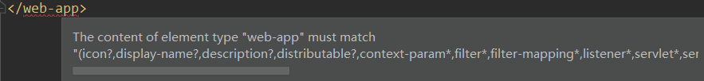

- **原因：文档内容标签顺序不符合web-app_2_3.dtd规范** 
- 解决方式一：它要求过滤器必须配置在最前面，我们只需要将配置该过滤器配置文件提起到其他配置文件之前即可
- 解决方式二：使用如下配置信息

```xml
<?xml version="1.0" encoding="UTF-8"?>
<web-app version="3.0" xmlns="http://java.sun.com/xml/ns/javaee"
         xmlns:xsi="http://www.w3.org/2001/XMLSchema-instance"
         xsi:schemaLocation="http://java.sun.com/xml/ns/javaee
                             http://java.sun.com/xml/ns/javaee/web-app_3_0.xsd">
    <display-name>Archetype Created Web Application</display-name>
```

- 替换掉原文件中的下面部分：第五行，包含第五行以上的所有信息即可随意摆放Filter的配置信息了

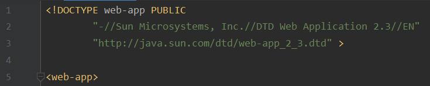

## 6.4封装到集合中

- 修改User

```java
public class User implements Serializable {
    private String username;
    private String password;
    private Double money;
    private List<UserInfo> infos;
    private Map<String,UserInfo> map;
}
```

- 主要是表单的信息

```jsp
<body>
<form action="param/saveUser" method="post">
    姓名：<input type="text" name="username"><br/>
    密码：<input type="password" name="password"><br/>
    余额：<input type="text" name="money"><br/>
    用户年龄(集合)：<input type="text" name="infos[0].age"><br/> <%--封装到集合中--%>
    用户地址(集合)：<input type="text" name="infos[0].address"><br/>
    用户年龄(表)：<input type="text" name="map['one'].age"><br/> <%--封装到map中--%>
    用户地址(表)：<input type="text" name="map['one'].address"><br/>
    <input type="submit" value="保存">
</form>
</body>
```

## 6.5自定义类型转换器

- 当我们在表单输入信息的时候，比如输入一串日期类型，系统能够解析的格式是2020/1/1这样的格式，如果我们想要输入其他格式的数据也能解析成功就需要自定义类型转换器

- 实现转换器Converter接口方法

```java
package com.kl.utils;

import org.springframework.core.convert.converter.Converter;

import java.text.ParseException;
import java.text.SimpleDateFormat;
import java.util.Date;

//字符串到日期的类型转换器
public class StringToDateConverter implements Converter<String, Date> {

    @Override
    public Date convert(String s) {
        SimpleDateFormat sdf = new SimpleDateFormat("yyyy-MM-dd"); //定义解析的格式
        try {
            return sdf.parse(s); //返回安装指定格式解析后的日期
        } catch (ParseException e) {
            throw new RuntimeException();
        }
    }
}
```

- 在springMVC.xml文件中进行配置和注册

```xml
<!--配置自定义类型转换器-->
<bean id="converterService" class="org.springframework.context.support.ConversionServiceFactoryBean">
    <property name="converters">
        <set>
            <bean class="com.kl.utils.StringToDateConverter"/>
        </set>
    </property>
</bean>

<!-- 开启SpringMVC框架注解的支持 -->
<mvc:annotation-driven conversion-service="conversionService"/>
```

- 表单

```jsp
<form action="param/saveUser" method="post">
    姓名：<input type="text" name="username"><br/>
    密码：<input type="password" name="password"><br/>
    生日：<input type="text" name="birthday"><br/>
    <input type="submit" value="保存">
</form>
</body>
```

- 当我们输入2000-1-1时系统就能解析成功，但这时新的解析器会覆盖之前的解析器，再输入2000/1/1就会解析失败

## 6.6获取servlet原生的的API

- 直接在方法参数中注明相应的HTTP对象即可，会自动获取

```java
@RequestMapping(path = "servletAPI")
public String getServletAPI(HttpServletRequest request, HttpServletResponse response){
    System.out.println(request);
    System.out.println(response);
    return "success";
}
```

# 七、常用注解

## 7.1RequestParam

- 作用： 把请求中指定名称的参数给控制器中的形参赋值
- 属性： value：请求参数中的名称
- required：请求参数中是否必须提供此参数
  - 默认值：true，表示必须提供，如果不提供将报错

```java
@Controller
@RequestMapping("/annotation")
public class AnnotationController {

    @RequestMapping(path = "/requestParam")
    public String testRequestParam(@RequestParam(name = "name") String username,
                                   @RequestParam(value = "password",required = false) String password){
        System.out.println("执行成功");
        System.out.println(username);
        System.out.println(password);
        return "success";
    }
}
```

- 表单

```jsp
<form action="annotation/requestParam" method="get">
    姓名：<input type="text" name="name"><br/>
    密码：<input type="password" name="password"><br/>
    <input type="submit" value="保存">
</form>
</body>
```

- 可以看到在表单中我们并没有输入password信息，程序也执行成功了，因为required=fasle
- 表单中的姓名name=name，没有和方法中的形参名一样

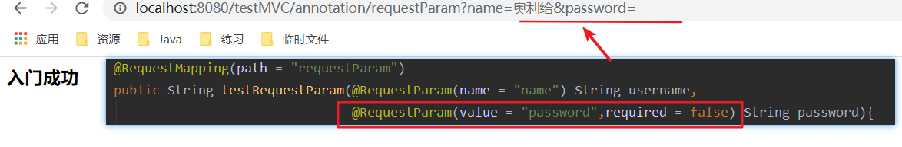

## 7.2RequestBody

- 作用： 用于获取请求体内容。直接使用得到是 key=value&key=value...结构的数据
  -  get 请求方式不适用，get请求没有请求体
- 属性： required：是否必须有请求体，默认值是:true，当取值为 true 时 get 请求方式会报错。如果取值 为 false，get 请求得到是 null

```java
@Controller
@RequestMapping("/annotation")
public class AnnotationController {
        @RequestMapping(path = "/requestBody")
    public String testRequestBody(@RequestBody String body){
        System.out.println(body); //获得请求体：username=super&password=123456
        return "success";
    }
}
```

- 表单信息

```jsp
<body>
<form action="annotation/requestBody" method="post">
    姓名：<input type="text" name="username"><br/>
    密码：<input type="password" name="password"><br/>
    <input type="submit" value="保存">
</form>
</body>
```

## 7.3PathVaribale

- 作用： 用于绑定 url 中的占位符
  - 例如：请求 url 中 /delete/{id}，这个{id}就是 url 占位符
  -  url 支持占位符是 spring3.0 之后加入的。是 springmvc 支持 rest 风格 URL 的一个重要标志
-  属性： value：用于指定 url 中占位符名称
  - required：是否必须提供占位符

```java
@Controller
@RequestMapping("/annotation")
public class AnnotationController {
    @RequestMapping(path = "/pathVariable/{uid}")
    public String testPathVariable(@PathVariable("uid") int id){
        System.out.println(id); //输出520
        return "success";
    }
}
```

- 表单

```jsp
<body>
<form action="annotation/pathVariable/520" method="post">
    姓名：<input type="text" name="username"><br/>
    密码：<input type="password" name="password"><br/>
    <input type="submit" value="保存">
</form>
</body>
```

## 7.4REST风格URL

### rest的概念

- 什么是 rest：

>- REST（英文：Representational State Transfer，简称 REST）描述了一个架构样式的网络系统， 比如 web 应用程序。它首次出现在 2000 年 Roy Fielding 的博士论文中，他是 HTTP 规范的主要编写者之 一。在目前主流的三种 Web 服务交互方案中，REST 相比于 SOAP（Simple Object Access protocol，简单 对象访问协议）以及 XML-RPC 更加简单明了，无论是对 URL 的处理还是对 Payload 的编码，REST 都倾向于用更 加简单轻量的方法设计和实现。值得注意的是 REST 并没有一个明确的标准，而更像是一种设计的风格
>- 它本身并没有什么实用性，其核心价值在于如何设计出符合 REST 风格的网络接口

- restful 的优点：它结构清晰、符合标准、易于理解、扩展方便，所以正得到越来越多网站的采用

### restful 的特性

- 资源（Resources）：网络上的一个实体，或者说是网络上的一个具体信息

>它可以是一段文本、一张图片、一首歌曲、一种服务，总之就是一个具体的存在。可以用一个 URI（统一 资源定位符）指向它，每种资源对应一个特定的 URI 。要 获取这个资源，访问它的 URI 就可以，因此 URI 即为每一个资源的独一无二的识别符

- 表现层（Representation）：把资源具体呈现出来的形式，叫做它的表现层 （Representation）

>比如，文本可以用 txt 格式表现，也可以用 HTML 格式、XML 格式、JSON 格式表现，甚至可以采用二 进制格式。

- 状态转化（State Transfer）：每 发出一个请求，就代表了客户端和服务器的一次交互过程

>- HTTP 协议，是一个无状态协议，即所有的状态都保存在服务器端。因此，如果客户端想要操作服务器， 必须通过某种手段，让服务器端发生“状态转化”（State Transfer）。而这种转化是建立在表现层之上的，所以 就是 “表现层状态转化”
>- **具体说，就是 HTTP 协议里面，四个表示操作方式的动词：GET 、POST 、PUT、 DELETE。它们分别对应四种基本操作：GET 用来获取资源，POST 用来新建资源，PUT 用来更新资源，DELETE 用来 删除资源**

- restful 的示例：

>- /account/1 HTTP GET ： 得到 id = 1 的 account 
>- /account/1 HTTP DELETE： 删除 id = 1 的 account 
>- /account/1 HTTP PUT： 更新 id = 1 的 account 

## 7.5HiddentHttpMethodFilter(了解)

- 作用： 由于浏览器 form 表单只支持 GET 与 POST 请求，而 DELETE、PUT 等 method 并不支持，Spring3.0 添 加了一个过滤器，可以将浏览器请求改为指定的请求方式，发送给我们的控制器方法，使得支持 GET、POST、PUT 与 DELETE 请求
- 使用方法： 

>- 第一步：在 web.xml 中配置该过滤器
>- 第二步：请求方式必须使用 post 请求
>- 第三步：按照要求提供_method 请求参数，该参数的取值就是我们需要的请求方式

## 7.6RequestHeader

- 作用： 用于获取请求消息头
- 属性： 
  - value：提供消息头名称 
  - required：是否必须有此消息头 
- 注： 在实际开发中一般不怎么用。

```java
@Controller
@RequestMapping("/annotation")
public class AnnotationController {
    @RequestMapping(path = "/RequestHeader")
    public String testRequestHeader(@RequestHeader(value = "Accept-Language") String requestHeader){
        System.out.println(requestHeader); //zh-CN,zh;q=0.9
        return "success";
    }
}
```

- 表单测试

```jsp
<form action="annotation/RequestHeader" method="post">
    姓名：<input type="text" name="username"><br/>
    密码：<input type="password" name="password"><br/>
    <input type="submit" value="保存">
</form>
```

## 7.7CookieValue

- 作用： 用于把指定 cookie 名称的值传入控制器方法参数。
- 属性：
  -  value：指定 cookie 的名称
  -  required：是否必须有此 cookie

```java
@Controller
@RequestMapping("/annotation")
public class AnnotationController {
    @RequestMapping(path = "/cookieValue")
    public String testCookieValue(@CookieValue("JSESSIONID") String cookieValue){
        System.out.println(cookieValue); //8B531B9786E66C9B946D55E33DE7495F
        return "success";
    }
}
```

- 表单测试

```jsp
<form action="annotation/cookieValue" method="post">
    姓名：<input type="text" name="username"><br/>
    密码：<input type="password" name="password"><br/>
    <input type="submit" value="保存">
</form>
```

## 7.8ModelAttribute

- 作用： 
  - 该注解是 SpringMVC4.3 版本以后新加入的。它可以用于修饰方法和参数
  - 出现在方法上，表示当前方法会在控制器的方法执行之前，先执行
  - 它可以修饰没有返回值的方法，也可以修饰有具体返回值的方法
  - 出现在参数上，获取指定的数据给参数赋值
- 属性： value：用于获取数据的 key。key 可以是 POJO 的属性名称，也可以是 map 结构的 key
- 应用场景： 当表单提交数据不是完整的实体类数据时，保证没有提交数据的字段使用数据库对象原来的数据
- 例如： 我们在编辑一个用户时，用户有一个创建信息字段，该字段的值是不允许被修改的。在提交表单数 据是肯定没有此字段的内容，一旦更新会把该字段内容置为 null，此时就可以使用此注解解决问题

### 方法有返回值

```java
@Controller
@RequestMapping("/annotation")
public class AnnotationController {

    @RequestMapping(path = "/modelAttribute")
    public String testModelAttribute(User user) {
        System.out.println("控制器中处理请求的方法：修改用户："+user);
        return "success";
    }

    //该方法会执行
    @ModelAttribute
    public User findUser(String name) {
        //通过用户模拟数据库查询后数据注入javabean
        User user = new User();
        user.setUsername(name);
        user.setPassword("123456");
        user.setBirthday(new Date());
        System.out.println("执行了 findUser 方法" + user);
        return user;
    }
}
```

- user中有birthday属性，但是表单填写中没有，我们可以先于数据库中获得之前的用户信息
- 最后输出的数据除了birthday之外都是用户自己填写的数据， @ModelAttribute是在控制器之前执行，根据SpringMVC的执行流程图知，表单数据提交请求后控制器才执行，所以把前端的数据拿来覆盖掉了旧对象的值

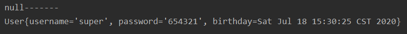

- 表单测试

```jsp
<form action="annotation/modelAttribute" method="post">
    姓名：<input type="text" name="username"><br/>
    密码：<input type="text" name="password"><br/>
    <input type="submit" value="保存">
</form>
```

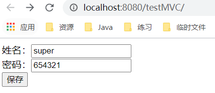

### 方法没有返回值

```java
@Controller
@RequestMapping("/annotation")
public class AnnotationController {

    @RequestMapping(path = "/modelAttribute")
    public String testModelAttribute(@ModelAttribute(value = "userMap") User user) {
        System.out.println("控制器中处理请求的方法：修改用户："+user);
        return "success";
    }

    @ModelAttribute
    public void findUser(String name, Map<String,User> map) {
        //通过用户模拟数据库查询后数据注入javabean
        User user = new User();
        System.out.println(name+"-------");
        user.setUsername(name);
        user.setPassword("123456");
        user.setBirthday(new Date());
        System.out.println("执行了 findUser 方法" + user);
        map.put("userMap",user);
    }
}
```

## 7.9SessionAttribute

- 作用： 用于多次执行控制器方法间的参数共享
-  属性：
  -  value：用于指定存入的属性名称 
  - type：用于指定存入的数据类型

```java
@Target({ElementType.TYPE})  //该注解只能作用在类上
@Retention(RetentionPolicy.RUNTIME)
@Inherited
@Documented
public @interface SessionAttributes {
    @AliasFor("names")
    String[] value() default {};

    @AliasFor("value")
    String[] names() default {};

    Class<?>[] types() default {};
}
```

---

- 测试：
- Model是一个接口对象，可以将数据以键值对的方式存入request域中
- ModelMap是Model接口的实现类，可以将request中的数据以键值对的方式取出
- sessionstatus中有方法能够清除session域中的数据

```java
@Controller
@RequestMapping("/annotation")
@SessionAttributes(value = {"username","password"},types = {String.class}) //将username和password存入到session域中
public class AnnotationController {

    @RequestMapping("/testPut")       //存放session域
    public String testPut(Model model){ 
        model.addAttribute("username","王小二");
        model.addAttribute("password","123456");
        return "success";
    }
    @RequestMapping("/testGet")       //从session中取出
    public String testGet(ModelMap modelMap){
        System.out.println(modelMap.get("username") + "--->" + modelMap.get("password"));
        return "success";
    }
    @RequestMapping("/testClean")     //清除session域中的数据
    public String testClean(SessionStatus status){
        status.isComplete();
        return "success";
    }
}
```

- jsp页面

```jsp
<body>
    <a href="annotation/testPut">存入Session域中</a><br/>
    <a href="annotation/testGet">从session中取出数据</a><br/>
    <a href="annotation/testClean">清除session域中的数据</a>
</body>
```

- 跳转成功页面
- 在该jsp页面要想使用EL表达式就必须加上isELIgnored="false"，否则系统会直接将EL表达式当一般数据输出到页面上

```jsp
<%@ page contentType="text/html;charset=UTF-8" language="java" isELIgnored="false" %>
<html>
    <head>
        <title>成功页面</title>
    </head>
    <body>
        <h3>入门成功</h3>
        ${username}===>${password}
    </body>
</html>
```