# 一、环境搭建流程

- 大致的环境搭建流程

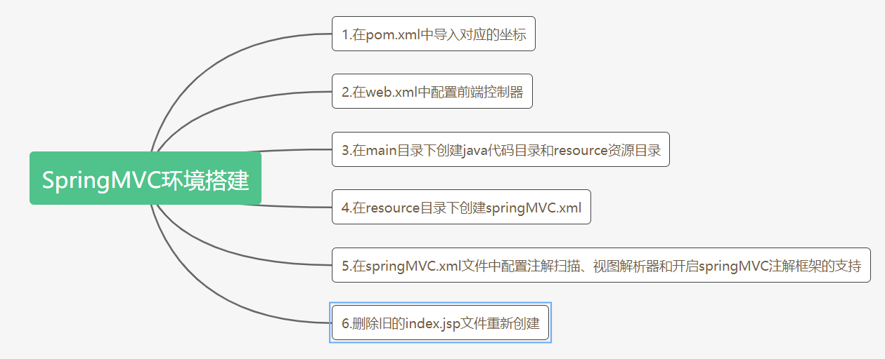

# 二、响应返回值

## 2.1返回String

```java
@Controller //交由spring容器管理
@RequestMapping("/user")
public class ResponseController {

    @RequestMapping(path = "/testString")
    public String testString(Model model){
        //模拟从数据库中查询出了user对象
        User user = new User();
        user.setUsername("张三");
        user.setPassword("123456");
        user.setAge(20);
        model.addAttribute("user",user);
        return "success";
    }
}
```

- jsp页面

```jsp
<a href="user/testString">返回值为String</a>
```

- success.jsp页面

```jsp
<%@ page contentType="text/html;charset=UTF-8" language="java" isELIgnored="false" %>
<html>
    <head>
        <title>成功页面</title>
    </head>
    <body>
        <h3>执行成功</h3>
        ${user.username}===>${user.password}===>${user.age}
    </body>
</html>
```

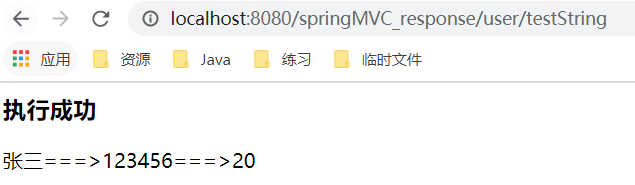

## 2.2返回void

```java
@RequestMapping(path = "/testVoid")
public void testVoid(){
    System.out.println("testVoid执行了");
}
```

- jsp

```jsp
<a href="user/testVoid">返回值为Void</a>
```

- 这种情况直接调用方法，方法会被执行，但前端页面会报错
- 默认会自动去找WEB-INF/pages/user/testVoid.jsp
- 根据自己配置的视图解析器在WEB-INF/pages/目录下，系统会根据testVoid的方法名自动查找该目录下加testVoid的资源文件

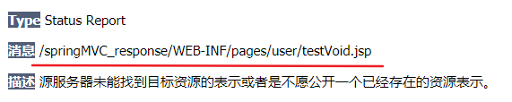

---

- 使用方法一：请求转发

```java
@RequestMapping(path = "/testVoid")
public void testVoid(HttpServletRequest request, HttpServletResponse response) throws Exception{
    System.out.println("testVoid执行了");
    //请求转发到success.jsp页面
    request.getRequestDispatcher("/WEB-INF/pages/success.jsp").forward(request,response);
}
```

---

- 使用方法二：请求重定向
- 由于WEB-INF目录是用户不能直接访问的，所以请求重定向不能指定该目录下的文件
- 假设需要访问http://localhost:8080/springMVC_response/test.jsp

```java
@RequestMapping(path = "/testVoid")
public void testVoid(HttpServletRequest request, HttpServletResponse response) throws Exception{
    System.out.println("testVoid执行了");
    //请求转发到success.jsp页面
    //request.getContextPath()取得工程路径
    response.sendRedirect(request.getContextPath()+"/test.jsp");
}
```

---

- 使用方法三：通过 response 指定响应结果

```java
@RequestMapping(path = "/testVoid")
public void testVoid(HttpServletRequest request, HttpServletResponse response) throws Exception{
    System.out.println("testVoid执行了");
    request.setCharacterEncoding("UTF-8");
    response.setContentType("text/html;charset=UTF-8");
    response.getWriter().print("你好");
}
```

## 2.3ModelAndView

- ModelAndView对象是Spring提供的一个对象，可以用来调整具体的JSP视图

```java
@RequestMapping(path = "/testModelAndView")
public ModelAndView testModelAndView(){
    ModelAndView mv = new ModelAndView();
    //模拟从数据库中查询出了user对象
    User user = new User();
    user.setUsername("李四");
    user.setPassword("123456");
    user.setAge(20);
    //把user对象存入到mv对象中，同时也会被存入到request对象里面
    mv.addObject("user",user);
    //设置要跳转的页面
    mv.setViewName("success");
    return mv;
}
```

- jsp

```jsp
<a href="user/testModelAndView">测试ModelAndView</a>
```

## 2.4forward 转发

```java
@RequestMapping(path = "/testForward")
public String testForward(){
    System.out.println("执行...方法");
    return "forward:/WEB-INF/pages/success.jsp";
}
```

- jsp

```jsp
<a href="user/testForward">请求转发</a>
```

## 2.5Redirect 重定向

```java
@RequestMapping(path = "/testRedirect")
public String testRedirect(){
    System.out.println("执行...方法");
    return "redirect:/test.jsp";  //不需要加上项目名称也可以,框架自动帮我们加上了
}
```

- jsp

```jsp
<a href="user/testRedirect">重定向</a>
```

## 2.6ResponseBody响应json数据

- 在webapp目录下创建一个js目录并引入jQuery.min文件
- DispatcherServlet会拦截到所有的资源，导致一个问题就是静态资源（img、css、js）也会被拦截到，从而不能被使用。解决问题就是需要配置静态资源不进行拦截，在springmvc.xml配置文件添加如下配置
- location：表示webapp目录下的包下的所有文件 
- mapping：表示以/static开头的所有请求路径，如/static/a 或者/static/a/b

```xml
<!-- 设置静态资源不过滤 -->
<mvc:resources location="/css/" mapping="/css/**"/> <!-- 样式 -->
<mvc:resources location="/images/" mapping="/images/**"/> <!-- 图片 -->
<mvc:resources location="/js/" mapping="/js/**"/> <!-- javascript -->
```

- 准备异步请求的前端代码

```jsp
<%@ page contentType="text/html;charset=UTF-8" language="java" %>
<html>
    <head>
        <title>Title</title>
        <script src="js/jquery.min.js"></script>
        <script>
            /*页面加载，绑定单击事件*/
            $(function () {
                $("#btn").click(function () {
                    $.ajax({
                        url:"user/testJson",
                        contentType:"application/json;charset=UTF-8",
                        data:'{"username":"super","password":"987654","age":20}',
                        dataType:"json",
                        type:"post",
                        success:function (data) {
                            alert(data);
                            alert(data.username);
                            alert(data.password);
                            alert(data.age);
                        }
                    })
                })
            });
        </script>
    </head>
    <body>
        <button id="btn">ajax异步请求</button>
    </body>
</html>
```

- 测试代码

```java
@RequestMapping("/testJson")
public void testJson(@RequestBody String body) { //@RequestBody注解定义这里的参数值接收的是响应体,而非普通参数
    System.out.println(body);
}
```

- 点击异步请求按钮后，输出以下内容：

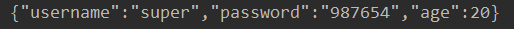

- 我们也可以将该响应体直接注入到一个javabean中
- json字符串和JavaBean对象互相转换的过程中，需要使用jackson的jar包

```xml
<dependency>
  <groupId>com.fasterxml.jackson.core</groupId>
  <artifactId>jackson-databind</artifactId>
  <version>2.9.0</version>
</dependency>
<dependency>
  <groupId>com.fasterxml.jackson.core</groupId>
  <artifactId>jackson-core</artifactId>
  <version>2.9.0</version>
</dependency>
<dependency>
  <groupId>com.fasterxml.jackson.core</groupId>
  <artifactId>jackson-annotations</artifactId>
  <version>2.9.0</version>
</dependency>
```

- 测试代码：这里有返回值

```java
@RequestMapping(path = "/testJson")
public @ResponseBody User testJson(@RequestBody User user) {
    System.out.println(user);
    return user;
}
```

- 必须要在方法上加@ResponseBody注解才会会返回到data中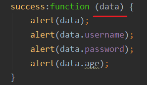，然后可以直接对json数据进行解析
- 若不在方法上加@ResponseBody只能让前端传来的数据成功注入user对象，不能返回到data中

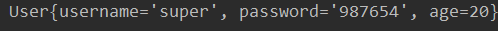

# 三、SpringMVC实现文件上传

## 3.1文件上传

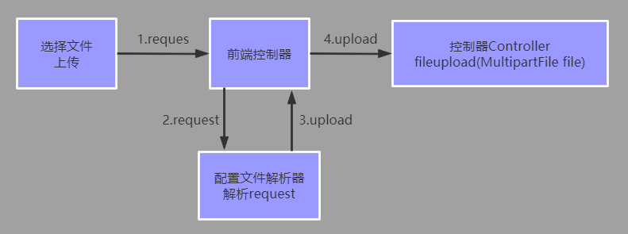

1. 环境搭建
2. 导入文件上传需要的jar包

```xml
dependency>
  <groupId>commons-fileupload</groupId>
  <artifactId>commons-fileupload</artifactId>
  <version>1.3.1</version>
</dependency>
<dependency>
  <groupId>commons-io</groupId>
  <artifactId>commons-io</artifactId>
  <version>2.4</version>
</dependency>
```

3. 编写文件上传的JSP页面：提交的表单全部都会封装到request的对象中

- form表单的enctype设置为multipart/form-data，以二进制的形式传输数据

```jsp
<body>
<form action="user/testFileUpload1" method="post" enctype="multipart/form-data">
    选择文件：<input type="file" name="upload"><br/>
    <input type="submit" value="上传文件">
</form>
</body>
```

4.  编写文件上传的Controller控制器：SpringMVC框架提供了MultipartFile对象，该对象表示上传的文件，要求变量名称必须和表单file标签的 name属性名称相同

- ServletContext().getRealPath("路径名A");这个方法，无论你的路径名A是什么，ServletContext().getRealPath()方法底层都会在路径名A前拼上当前web应用的硬盘路径，这样加上你传进去的路径就可以找成功找到了

```java
@Controller
@RequestMapping("/user")
public class UserController {

    @RequestMapping(path = "testFileUpload1")
    public String testFileUpload1(@RequestParam("upload") MultipartFile file, HttpServletRequest req) throws Exception {
  public String testFileUpload1(@RequestParam("upload") MultipartFile file, HttpServletRequest req) throws Exception {
        //1.判断文件是否为空,空则跳转到失败页面
        if (file.isEmpty()) return "failed";
        //2.获取文件存储的绝对路径
        String realPath = req.getSession().getServletContext().getRealPath("/WEB-INF/file/");
        //3.如果文件目录WEB-INF/file不存在就创建目录
        File f = new File(realPath);
        if (!f.exists()) f.mkdirs();
        //4.获取原文件名
        String originalFilename = file.getOriginalFilename();
        //5.创建文件实体,新文件名和原文件名相同
        assert originalFilename != null;
        File fileSolid = new File(realPath, originalFilename);
        //6.写入文件
        file.transferTo(fileSolid);
    }
}
```

- ### springmvc.xml配置CommonsMultipartResolver

```xml
<!--配置文件解析器对象,要求id名必须是multipartResolver-->
<bean id="multipartResolver"
      class="org.springframework.web.multipart.commons.CommonsMultipartResolver">
    <!--上传文件的最大大小，单位为字节 10485760=10*1024*1024=10M-->
    <property name="maxUploadSize" value="10485760"/>
    <!-- 上传文件的编码 -->
    <property name="defaultEncoding" value="UTF-8"/>
</bean>
```

- 细节分析

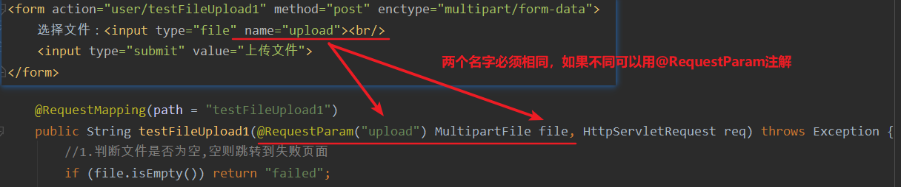

## 3.2跨服务器方式的文件上传 

- 在实际开发钟，我们会有很多处理不同功能的服务器。
- 例如：
- 应用服务器：负责部署我们的应用
- 数据库服务器：运行我们的数据库
- 缓存和消息服务器：负责处理大并发访问的缓存和消息
- 文件服务器：负责存储用户上传文件的服务器
- 这里说的不是服务器集群

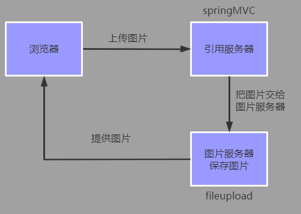

### 配置接收图片的服务器

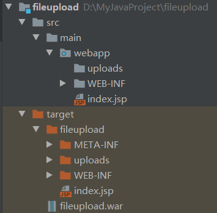

- **注意：这里部署时要选择war exploed方式才能够获取到从另一台服务器传来的图片**

### 配置上传文件的web应用服务器

1.  实现SpringMVC跨服务器方式文件上传，在之前的配置基础上导入开发需要的jar包

```xml
<dependency>
    <groupId>com.sun.jersey</groupId>
    <artifactId>jersey-core</artifactId>
    <version>1.18.1</version>
</dependency>
<dependency>
    <groupId>com.sun.jersey</groupId>
    <artifactId>jersey-client</artifactId>
    <version>1.18.1</version>
</dependency>
```

3. 编写文件上传的JSP页面

```jsp
<form action="user/testFileUpload1" method="post" enctype="multipart/form-data">
    选择文件：<input type="file" name="upload"><br/>
    <input type="submit" value="上传文件">
</form>
```

4. 编写控制器

```java
package com.kl.controller;

import com.sun.jersey.api.client.Client;
import com.sun.jersey.api.client.WebResource;
import org.springframework.stereotype.Controller;
import org.springframework.web.bind.annotation.RequestMapping;
import org.springframework.web.multipart.MultipartFile;

@Controller
@RequestMapping("/user")
public class UserController {

    @RequestMapping(path = "testFileUpload1")
    public String testFileUpload1(MultipartFile upload) throws Exception {
        System.out.println("跨服务器上传");
        //1.判断文件是否为空,空则跳转到失败页面
        if (upload.isEmpty()) return "failed";
        //2.定义图片服务器的请求路径
        String path = "http://localhost:9090/fileupload_war_exploded/uploads/";

        //3.获取到上传文件的名称
        String filename = upload.getOriginalFilename();
        //4.创建客户端对象
        Client client = Client.create();
        //5.连接图片服务器
        WebResource webResource = client.resource(path + filename);
        //6.上传文件:需要以二进制形式
        webResource.put(upload.getBytes());
        return "success";
    }
}
```

## 3.3错误情况

- 报错情况一：

```
com.sun.jersey.api.client.UniformInterfaceException: PUT http://localhost:9090/uploads/654a1661b41149cea4c920f8e5734970.jpg returned a response status of 405 Method Not Allowed
```

- 原因：TOMCAT考虑到安全性，默认关闭了TOMCAT的PUT和DELETE请求(即readonly = true)
- 解决方法：进入到tomcat的conf目录下，修改web.xml,在default servlet下增加参数readonly=false

```xml
<servlet>
    <servlet-name>default</servlet-name>
    <servlet-class>org.apache.catalina.servlets.DefaultServlet</servlet-class>
    <init-param>
        <param-name>debug</param-name>
        <param-value>0</param-value>
    </init-param>
    <init-param>
        <param-name>listings</param-name>
        <param-value>false</param-value>
    </init-param>
    <init-param>
        <param-name>readonly</param-name>
        <param-value>false</param-value>
    </init-param>
    <load-on-startup>1</load-on-startup>
</servlet>
```

- 报错情况二：

```
报错：com.sun.jersey.api.client.UniformInterfaceException: PUT http://localhost:9090/uploads/0d843b18f5b04ad087b54bb125699c4e.jpg returned a response status of 409 Conflict
```

- 原因：我们在创建文件服务器时，webapp下的uploads文件夹是空的，导致编译时并没有拷贝到target/uploadserver下
- 解决方法：在target/uploadserver下手动创建uploads目录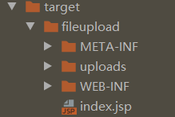


## 3.3war和war exploded

>- war模式: 将WEB工程以包的形式上传到服务器
>- war exploded模式: 将WEB工程以当前文件夹的位置关系上传到服务器

- war模式这种可以称之为是发布模式，看名字也知道，这是先打成war包，再发布；
- war exploded模式是直接把文件夹、jsp页面 、classes等等移到Tomcat 部署文件夹里面，进行加载部署。因此这种方式支持热部署，一般在开发的时候也是用这种方式
- 在平时开发的时候，使用热部署的话，应该对Tomcat进行相应的设置，这样的话修改的jsp界面什么的东西才可以及时的显示出来

# 四、SpringMVC的异常处理

 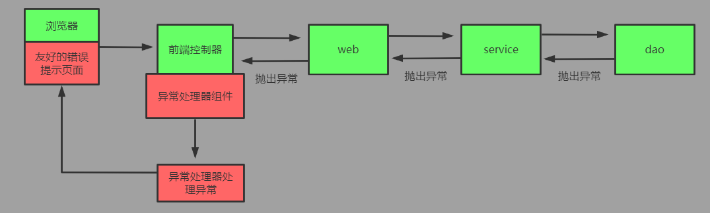

- 异常处理思路： Controller调用service，service调用dao，异常都是向上抛出的，最终有DispatcherServlet找异常处理器进 行异常的处理

---

1. 自定义异常类

```java
package com.kl.exception;

public class SysException extends Exception {
    private String errorMsg;

    public SysException(String errorMsg) {
        this.errorMsg = errorMsg;
    }

    public String getErrorMsg() {
        return errorMsg;
    }

    public void setErrorMsg(String errorMsg) {
        this.errorMsg = errorMsg;
    }
}
```

2. 自定义异常处理器

```java
package com.kl.exception;

import org.springframework.web.servlet.HandlerExceptionResolver;
import org.springframework.web.servlet.ModelAndView;

import javax.servlet.http.HttpServletRequest;
import javax.servlet.http.HttpServletResponse;

public class SysExceptionResolver implements HandlerExceptionResolver {
    @Override
    public ModelAndView resolveException(HttpServletRequest httpServletRequest,
                                         HttpServletResponse httpServletResponse, Object o, Exception e) {
        SysException se = null;
        //获取到异常对象
        if (e instanceof  SysException){
            se = (SysException) e;
        }else {
            se = new SysException("网络错误,请联系管理员");
        }
        ModelAndView mv = new ModelAndView();
        //存入错误的提示信息到request域中
        mv.addObject("errorMsg",se.getErrorMsg());
        //跳转到友好的错误提示页面 
        mv.setViewName("error");
        return mv;
    }
}
```

3. 在springMVC.xml文件中配置异常处理器

```xml
<!--配置异常处理器-->
<bean id="sysExceptionResolver" class="com.kl.exception.SysExceptionResolver"/>
```

4. 测试

```java
@Controller
@RequestMapping("/user")
public class UserController {

    @RequestMapping(path = "testException")
    public String testException(){
        System.out.println("执行成功...");
        int i = 1/0;
        return "success";
    }
}
```

- 错误提示页面error.jsp

```jsp
<body>
<h3>友好提示</h3>
${requestScope.errorMsg}
</body>
```

# 五、SpringMVC框架中的拦截器

## 5.1 拦截器的概述

1. SpringMVC框架中的拦截器用于对处理器进行预处理和后处理的技术
2. 可以定义拦截器链，连接器链就是将拦截器按着一定的顺序结成一条链，在访问被拦截的方法时，拦截器链中的拦截器会按着定义的顺序执行
3. 拦截器和过滤器的功能比较类似，有区别 

>- 过滤器是Servlet规范的一部分，任何框架都可以使用过滤器技术
>- 拦截器是SpringMVC框架独有的
>- 过滤器配置了/*，可以拦截任何资源
>- 拦截器只会对控制器中的方法进行拦截

4. 拦截器也是AOP思想的一种实现方式
5. 想要自定义拦截器，需要实现HandlerInterceptor接口

## 5.2自定义拦截器

>1. preHandle方法是controller方法执行前拦截的方法 1
>   - 可以使用request或者response跳转到指定的页面 
>   - return true放行，执行下一个拦截器，如果没有拦截器，执行controller中的方法
>   -  return false不放行，不会执行controller中的方法
>2. postHandle是controller方法执行后执行的方法，在JSP视图执行前
>   - 可以使用request或者response跳转到指定的页面
>   - 如果指定了跳转的页面，那么controller方法跳转的页面将不会显示
>3.  postHandle方法是在JSP执行后执行 
>   - request或者response不能再跳转页面了

1. 创建类，实现HandlerInterceptor接口，重写需要的方法

```java
package com.kl.interceptor;

import org.springframework.stereotype.Controller;
import org.springframework.web.bind.annotation.RequestMapping;
import org.springframework.web.servlet.HandlerInterceptor;
import org.springframework.web.servlet.ModelAndView;

import javax.servlet.http.HttpServletRequest;
import javax.servlet.http.HttpServletResponse;


public class MyInterceptor implements HandlerInterceptor {
    /**
     * controller方法执行前调用，进行拦截的方法
     * @return 返回true方向 返回false拦截
     */
    @Override
    public boolean preHandle(HttpServletRequest request, HttpServletResponse response, Object handler) throws Exception {
        System.out.println("拦截器预处理方法执行......");
        return true;
    }

    /**
     * 控制器方法执行后就执行
     */
    @Override
    public void postHandle(HttpServletRequest request, HttpServletResponse response, Object handler, ModelAndView modelAndView) throws Exception {
        System.out.println("拦截器后处理方法执行");
    }

    /**
     * 页面加载结束后执行
     */
    @Override
    public void afterCompletion(HttpServletRequest request, HttpServletResponse response, Object handler, Exception ex) throws Exception {
        System.out.println("拦截器最后处理方法执行");
    }
}
```

2.  在springmvc.xml中配置拦截器类

```xml
<mvc:interceptors>
    <mvc:interceptor>
        <mvc:mapping path="/user/*"/>
        <!-- 哪些方法不进行拦截
            <mvc:exclude-mapping path=""/>
            -->
        <bean id="myInterceptor" class="com.kl.interceptor.MyInterceptor"/>
    </mvc:interceptor>
</mvc:interceptors>
```

- 控制器测试方法

```java
@Controller
@RequestMapping("/user")
public class UserController {
    @RequestMapping(path = "testInterceptor")
    public String testInterceptor(){
        System.out.println("控制器方法执行成功...");
        return "success";
    }
}
```

- jsp页面

```jsp
<body>
    <h3>success</h3>
    <%
    System.out.println("页面被加载......");
    %>
</body>
```

- 结果

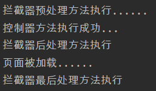