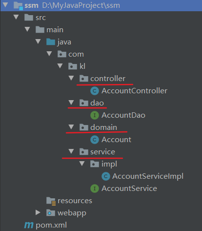
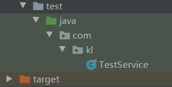
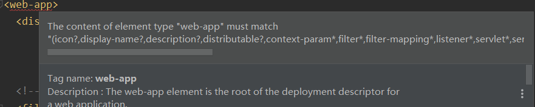
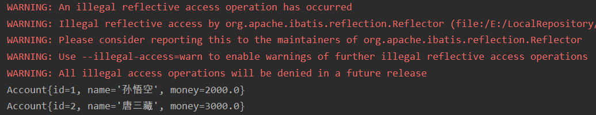
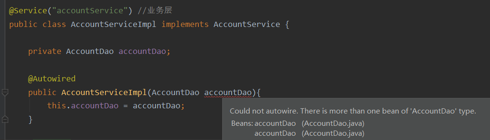
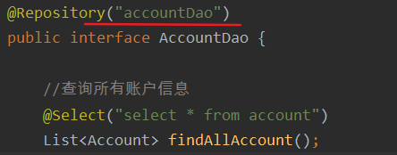

# 一、搭建整合环境

1. 整合说明：SSM整合可以使用多种方式，咱们会选择XML + 注解的方式
2. 整合的思路

>1. 先搭建整合的环境
>2.  先把Spring的配置搭建完成
>3. 再使用Spring整合SpringMVC框架
>4. 最后使用Spring整合MyBatis框架

## 1.1配置pom.xml

1. 创建数据库和表结构

```mysql
create database ssm;
use ssm;
create table account(
id int primary key auto_increment,
name varchar(20),
money double
);
```

2. 创建maven的工程（使用工程的聚合和拆分的概念）
3. 在pom.xml导入坐标依赖

```xml
<!--版本控制-->
<properties>
    <project.build.sourceEncoding>UTF-8</project.build.sourceEncoding>
    <maven.compiler.source>1.8</maven.compiler.source>
    <maven.compiler.target>1.8</maven.compiler.target>
    <spring.version>5.0.2.RELEASE</spring.version>
    <slf4j.version>1.6.6</slf4j.version>
    <log4j.version>1.2.12</log4j.version>
    <mysql.version>5.1.6</mysql.version>
    <mybatis.version>3.4.5</mybatis.version>
</properties>
```

- 坐标依赖

```xml
<dependencies>
    <!-- spring -->
    <dependency>
        <groupId>org.aspectj</groupId>
        <artifactId>aspectjweaver</artifactId>
        <version>1.6.8</version>
    </dependency>

    <dependency>
        <groupId>org.springframework</groupId>
        <artifactId>spring-aop</artifactId>
        <version>${spring.version}</version>
    </dependency>

    <dependency>
        <groupId>org.springframework</groupId>
        <artifactId>spring-context</artifactId>
        <version>${spring.version}</version>
    </dependency>

    <dependency>
        <groupId>org.springframework</groupId>
        <artifactId>spring-web</artifactId>
        <version>${spring.version}</version>
    </dependency>

    <dependency>
        <groupId>org.springframework</groupId>
        <artifactId>spring-webmvc</artifactId>
        <version>${spring.version}</version>
    </dependency>

    <dependency>
        <groupId>org.springframework</groupId>
        <artifactId>spring-test</artifactId>
        <version>${spring.version}</version>
    </dependency>

    <dependency>
        <groupId>org.springframework</groupId>
        <artifactId>spring-tx</artifactId>
        <version>${spring.version}</version>
    </dependency>

    <dependency>
        <groupId>org.springframework</groupId>
        <artifactId>spring-jdbc</artifactId>
        <version>${spring.version}</version>
    </dependency>

    <dependency>
        <groupId>junit</groupId>
        <artifactId>junit</artifactId>
        <version>4.12</version>
        <scope>compile</scope>
    </dependency>

    <dependency>
        <groupId>mysql</groupId>
        <artifactId>mysql-connector-java</artifactId>
        <version>${mysql.version}</version>
    </dependency>

    <dependency>
        <groupId>javax.servlet</groupId>
        <artifactId>servlet-api</artifactId>
        <version>2.5</version>
        <scope>provided</scope>
    </dependency>

    <dependency>
        <groupId>javax.servlet.jsp</groupId>
        <artifactId>jsp-api</artifactId>
        <version>2.0</version>
        <scope>provided</scope>
    </dependency>

    <dependency>
        <groupId>jstl</groupId>
        <artifactId>jstl</artifactId>
        <version>1.2</version>
    </dependency>

    <!-- log start -->
    <dependency>
        <groupId>log4j</groupId>
        <artifactId>log4j</artifactId>
        <version>${log4j.version}</version>
    </dependency>

    <dependency>
        <groupId>org.slf4j</groupId>
        <artifactId>slf4j-api</artifactId>
        <version>${slf4j.version}</version>
    </dependency>

    <dependency>
        <groupId>org.slf4j</groupId>
        <artifactId>slf4j-log4j12</artifactId>
        <version>${slf4j.version}</version>
    </dependency>

    <!-- log end -->
    <dependency>
        <groupId>org.mybatis</groupId>
        <artifactId>mybatis</artifactId>
        <version>${mybatis.version}</version>
    </dependency>

    <dependency>
        <groupId>org.mybatis</groupId>
        <artifactId>mybatis-spring</artifactId>
        <version>1.3.0</version>
    </dependency>

    <dependency>
        <groupId>c3p0</groupId>
        <artifactId>c3p0</artifactId>
        <version>0.9.1.2</version>
        <type>jar</type>
        <scope>compile</scope>
    </dependency>
</dependencies>
```

## 1.2项目结构搭建



## 1.3搭建spring环境

- applicationContext.xml全局配置

```xml
<?xml version="1.0" encoding="UTF-8"?>
<beans xmlns="http://www.springframework.org/schema/beans"
       xmlns:xsi="http://www.w3.org/2001/XMLSchema-instance"
       xmlns:context="http://www.springframework.org/schema/context"
       xmlns:aop="http://www.springframework.org/schema/aop"
       xmlns:tx="http://www.springframework.org/schema/tx"
       xsi:schemaLocation="http://www.springframework.org/schema/beans
                           http://www.springframework.org/schema/beans/spring-beans.xsd
                           http://www.springframework.org/schema/context
                           http://www.springframework.org/schema/context/spring-context.xsd
                           http://www.springframework.org/schema/aop
                           http://www.springframework.org/schema/aop/spring-aop.xsd
                           http://www.springframework.org/schema/tx
                           http://www.springframework.org/schema/tx/spring-tx.xsd">

    <!--开启注解的扫描，希望处理service和dao，controller不需要Spring框架去处理-->
    <context:component-scan base-package="com.kl">
        <!--配置哪些注解不扫描,控制类的不扫描-->
        <context:exclude-filter type="annotation" expression="org.springframework.stereotype.Controller"/>
    </context:component-scan>
</beans>
```

- 业务层

```java
@Service("accountService") //业务层
public class AccountServiceImpl implements AccountService {
    @Override
    public List<Account> findAllAccount() {
        System.out.println("业务层:查询所有账户信息");
        return null;
    }

    @Override
    public void saveAccount() {
        System.out.println("业务层:保存账户信息");
    }
}
```

- 创建测试包
- 测试

```java
public class TestService {
    @Test
    public void test1(){
        ApplicationContext ac = new ClassPathXmlApplicationContext("applicationContext.xml");
        AccountService as = ac.getBean("accountService", AccountService.class);
        as.findAllAccount();  //业务层:查询所有账户信息
    }
}
```

## 1.4搭建springMVC

1. 在web.xml中配置前端控制器，读完springMVC.xml配置文件和字符过滤器

```xml
<!DOCTYPE web-app PUBLIC
 "-//Sun Microsystems, Inc.//DTD Web Application 2.3//EN"
 "http://java.sun.com/dtd/web-app_2_3.dtd" >

<web-app>
    <display-name>Archetype Created Web Application</display-name>

    <!--配置解决中文乱码的过滤器-->
    <filter>
        <filter-name>characterEncodingFilter</filter-name>
        <filter-class>org.springframework.web.filter.CharacterEncodingFilter</filter-class>
        <init-param>
            <param-name>encoding</param-name>
            <param-value>UTF-8</param-value>
        </init-param>
    </filter>
    <filter-mapping>
        <filter-name>characterEncodingFilter</filter-name>
        <url-pattern>/*</url-pattern>
    </filter-mapping>

    <!--配置前端控制器-->
    <servlet>
        <servlet-name>dispatcherServlet</servlet-name>
        <servlet-class>org.springframework.web.servlet.DispatcherServlet</servlet-class>
        <!--加载springMVC.xml配置文件-->
        <init-param>
            <!--contextConfigLocation是固定写法-->
            <param-name>contextConfigLocation</param-name>
            <param-value>classpath:springMVC.xml</param-value>
        </init-param>
        <!--启动服务器,创建该servlet-->
        <load-on-startup>1</load-on-startup>
    </servlet>
    <servlet-mapping>
        <servlet-name>dispatcherServlet</servlet-name>
        <url-pattern>/</url-pattern>
    </servlet-mapping>

</web-app>
```

- springMVC.xml

```xml
<?xml version="1.0" encoding="UTF-8"?>
<beans xmlns="http://www.springframework.org/schema/beans"
       xmlns:mvc="http://www.springframework.org/schema/mvc"
       xmlns:context="http://www.springframework.org/schema/context"
       xmlns:xsi="http://www.w3.org/2001/XMLSchema-instance"
       xsi:schemaLocation="
        http://www.springframework.org/schema/beans
        http://www.springframework.org/schema/beans/spring-beans.xsd
        http://www.springframework.org/schema/mvc
        http://www.springframework.org/schema/mvc/spring-mvc.xsd
        http://www.springframework.org/schema/context
        http://www.springframework.org/schema/context/spring-context.xsd">

    <!--开启注解扫描，只扫描Controller注解-->
    <context:component-scan base-package="com.kl">
        <context:include-filter type="annotation" expression="org.springframework.stereotype.Controller"/>
    </context:component-scan>

    <!--配置的视图解析器对象-->
    <bean id="internalResourceViewResolver" class="org.springframework.web.servlet.view.InternalResourceViewResolver">
        <property name="prefix" value="/WEB-INF/pages/"/>
        <property name="suffix" value=".jsp"/>
    </bean>

    <!--过滤静态资源-->
    <!-- <mvc:resources location="/css/" mapping="/css/**" />
     <mvc:resources location="/images/" mapping="/images/**" />
     <mvc:resources location="/js/" mapping="/js/**" />-->

    <!--开启SpringMVC注解的支持-->
    <mvc:annotation-driven/>

</beans>
```

- 控制层

```java
//账户控制器
@Controller //控制层
@RequestMapping("/account") //一级目录
public class AccountController {

    @RequestMapping(path = "findAll")
    public String findAll(){
        System.out.println("控制层:查询所有方法");
        return "list"; //------WEB-INF/pages/list.jsp
    }
}
```

- 从新创建index.jsp页面，避免字符乱码

```jsp
<a href="account/findAll">查询所有</a>
```

## 1.5Spring整合SpringMVC框架

1. 配置监听器实现启动服务创建容器
2. 目的：在controller中能成功的调用service对象中的方法

```xml
<!--配置spring的监听器,默认只加载WEB-INF目录下的applicationContext.xml文件-->
  <listener>
    <listener-class>org.springframework.web.context.ContextLoaderListener</listener-class>
  </listener>

<!-- 手动指定 spring 配置文件位置 -->
<context-param>
  <param-name>contextConfigLocation</param-name>
  <!--加载类路径下的applicationContext.xml配置文件-->
  <param-value>classpath:applicationContext.xml</param-value>
</context-param>
```

- 注意：在web-app标签中要求严格按照全局配置参数---》过滤器---》监听器---》servlet程序这样的配置顺序进行



- 在控制层测试：控制层能够调用业务层的方法就说明整合成功

```java
@Controller //控制层
@RequestMapping("/account") //一级目录
public class AccountController {

    private  AccountService service;

    @Autowired //使用构造器注入的方式是编译器推荐的
    AccountController(AccountService service){
        this.service = service;
    }

    @RequestMapping(path = "findAll")
    public String findAll(){
        System.out.println("控制层:查询所有方法");
        service.findAllAccount();
        return "list";
    }
}
```


## 1.6搭建和测试MyBatis的环境

- 在web项目中编写SqlMapConfig.xml的配置文件，编写核心配置文件

```xml
<?xml version="1.0" encoding="UTF-8"?>
<!--导入mybatis配置的文件约束-->
<!DOCTYPE configuration
        PUBLIC "-//mybatis.org//DTD Config 3.0//EN"
        "http://mybatis.org/dtd/mybatis-3-config.dtd">
<configuration>
    <environments default="mysql">
        <environment id="mysql">
            <!--事务类型-->
            <transactionManager type="JDBC"/>
            <!--应用的连接池-->
            <dataSource type="POOLED">
                <property name="driver" value="com.mysql.jdbc.Driver"/>
                <property name="url" value="jdbc:mysql://localhost:3306/ssm"/>
                <property name="username" value="root"/>
                <property name="password" value="root"/>
            </dataSource>
        </environment>
    </environments>
    <!--引入映射配置文件-->
    <mappers>
        <!--扫描这个包下所有的接口-->
       <package name="com.kl.dao"/>
    </mappers>
</configuration>
```

-  在AccountDao接口的方法上添加注解，编写SQL语句

```java
package com.kl.dao;

import com.kl.domain.Account;
import org.apache.ibatis.annotations.Select;
import org.springframework.stereotype.Repository;

import java.util.List;

@Repository("accountDao") //持久层
public interface AccountDao {

    //查询所有账户信息
    @Select("select * from account")
    List<Account> findAllAccount();

    //保存账户信息,#{name}表示占位符
    @Select("insert into account(name,money) values(#{name},#{money})")
    void saveAccount();
}
```

- 编写测试的方法：

```java
package com.kl;

import com.kl.dao.AccountDao;
import com.kl.domain.Account;
import org.apache.ibatis.io.Resources;
import org.apache.ibatis.session.SqlSession;
import org.apache.ibatis.session.SqlSessionFactory;
import org.apache.ibatis.session.SqlSessionFactoryBuilder;
import org.junit.Test;

import java.io.InputStream;
import java.util.List;

public class TestMyBatis {

    @Test
    public void test1() throws Exception{
        //1.使用org.apache.ibatis.io.Resources加载配置文件
        InputStream in = Resources.getResourceAsStream("SqlMapConfig.xml");
        //2.创建SqlSessionFactory对象
        SqlSessionFactory factory = new SqlSessionFactoryBuilder().build(in);
        //3.创建SqlSession对象
        SqlSession sqlSession = factory.openSession();
        //4.获取到代理对象
        AccountDao accountDao = sqlSession.getMapper(AccountDao.class);
        //5.查询测试
        List<Account> accounts = accountDao.findAllAccount();
        for (Account account : accounts) {
            System.out.println(account);
        }
        //6.释放资源
        sqlSession.close();
        in.close();
    }

    @Test //测试保存方法
    public void test2() throws Exception{
        //省略..........................................
        //1.使用org.apache.ibatis.io.Resources加载配置文件
        //2.创建SqlSessionFactory对象
        //3.创建SqlSession对象
        //4.获取到代理对象 
        //5.查询测试
        accountDao.saveAccount(new Account(null,"猪八戒",500.0));
        //6.提交事务
        sqlSession.commit();
        //7.释放资源
    }
}
```

- 可以看到查询结果确实输出了，但是有一大排警告，这样因为JDK版本太高的原因，可以将JDK版本调低来解决，也可以不用管，不会影响程序的正常运行



## 1.7SSM整合

-  目的：把SqlMapConfig.xml配置文件中的内容配置到applicationContext.xml配置文件中
- 可以将之前的SqlMapConfig.xml配置文件移除

```xml
<!--Spring整合MyBatis框架-->
<!--配置连接池-->
<bean id="dataSource" class="com.mchange.v2.c3p0.ComboPooledDataSource">
    <property name="driverClass" value="com.mysql.jdbc.Driver"/>
    <property name="jdbcUrl" value="jdbc:mysql:///ssm"/>
    <property name="user" value="root"/>
    <property name="password" value="root"/>
</bean>

<!--配置SqlSessionFactory工厂-->
<bean id="sqlSessionFactory" class="org.mybatis.spring.SqlSessionFactoryBean">
    <property name="dataSource" ref="dataSource"/>
</bean>

<!--配置AccountDao接口所在包-->
<bean id="mapperScanner" class="org.mybatis.spring.mapper.MapperScannerConfigurer">
    <property name="basePackage" value="com.kl.dao"/>
</bean>
```

- 在web.xml文件中配置

```xml
<!--设置配置文件路径-->
  <context-param>
    <param-name>contextConfigLocation</param-name>
    <!--加载类路径下的applicationContext.xml配置文件-->
    <param-value>classpath:applicationContext.xml</param-value>
  </context-param>

<!--配置spring的监听器,默认只加载WEB-INF目录下的applicationContext.xml文件-->
<listener>
  <listener-class>org.springframework.web.context.ContextLoaderListener</listener-class>
</listener>
```

- 在AccountDao接口中添加@Repository注解

```java
@Repository("accountDao") //持久层
public interface AccountDao {

    //查询所有账户信息
    @Select("select * from account")
    List<Account> findAllAccount();

    //保存账户信息,#{name}表示占位符
    @Select("insert into account(name,money) values(#{name},#{money})")
    void saveAccount(Account account);
}
```

- 在service中注入dao对象，进行测试

```java
@Service("accountService") //业务层
public class AccountServiceImpl implements AccountService {

    private AccountDao accountDao;

    @Autowired
    public AccountServiceImpl(AccountDao accountDao){
        this.accountDao = accountDao;
    }
    
    @Override
    public List<Account> findAllAccount() {
        System.out.println("业务层：查询所有账户信息");
        return accountDao.findAllAccount();
    }

    @Override
    public void saveAccount(Account account) {
        System.out.println("业务层：保存账户信息");
        accountDao.saveAccount(account);
    }
}
```

- 表现层：获取查询数据返回将数据存储到request域中并返回到页面进行展示

```java
@Controller //控制层
@RequestMapping("/account") //一级目录
public class AccountController {

    @Autowired
    private  AccountService service;

    @RequestMapping(path = "/findAll")
    public String findAll(Model model){
        System.out.println("控制层:查询所有方法");
        List<Account> allAccount = service.findAllAccount();
        System.out.println("allAccount---------------"+allAccount);
        //将查询结果存入request,返回到list页面解析数据
        model.addAttribute("accounts", allAccount);
        return "list";
    }
}
```

- 细节分析：业务层注入时出现警告，程序可以正常运行，就是说出来了多个bean的实现类，why?明明就一个AccountDap实现类



- 解决：是因为我在AccountDao接口注解上value设置为accountDao，如果删除value，只保留@Repository注解就不会再报错，原因未知！！！



## 1.8配置Spring的声明式事务管理

- 在applicationContext.xml文件中声明事务
- 配置事务一般都是在业务层进行配置

```xml
<!-- 配置Spring框架声明式事务管理
 配置事务管理器-->
 <bean id="transactionManager" class="org.springframework.jdbc.datasource.DataSourceTransactionManager">
     <property name="dataSource" ref="dataSource"/>
 </bean>

 <!--配置事务通知-->
 <tx:advice id="txAdvice" transaction-manager="transactionManager">
     <tx:attributes>
         <tx:method name="*" propagation="REQUIRED" read-only="false"/>
         <tx:method name="find*" propagation="SUPPORTS" read-only="true"/> <!--优先级更高-->
     </tx:attributes>
 </tx:advice>

 <!--配置AOP增强-->
 <aop:config>
     <aop:pointcut id="pt1" expression="execution(* com.kl.service.impl.*.*(..))"/>
     <aop:advisor advice-ref="txAdvice" pointcut-ref="pt1"/>
 </aop:config>
```

- 测试

```java
@Override
public void saveAccount(Account account) {
    System.out.println("业务层：保存账户信息");
    accountDao.saveAccount(account);
    int i = 1/0;
}
```

- 运行后发现事务没有其作用，虽然报错了但是数据还是存入了数据库中

- ### 原因 ：springmvc和spring的配置扫描包，均是扫描所有com.kl下面的包，而springmvc只需要扫描Controller层，即com.kl.controller即可

- 具体解释如下：

>1. Spring与SpringMVC属于父子容器关系。框架启动时先启动Spring容器，而后启动SpringMVC容器。子容器可以访问父容器中的Bean，而父容器不能访问子容器中的Bean
>2. 由于SpringMVC在扫描时扩大了扫描范围，装载了@Service标识的类的实例，从而导致Controller层在注入Service时，实际注入的是子容器中的Service实例
>3. 事务被配置在父容器中，Spring父容器在装载Service时会同时应用事务配置，而SpringMVC只是单纯加载Service的实例

- 事务不起作用的配置文件

```xml
<context:component-scan base-package="com.kl">
    <!--开启注解扫描，只扫描Controller注解-->
    <context:include-filter type="annotation" expression="org.springframework.stereotype.Controller"/>
</context:component-scan>
```

- 可以看出要把最终的包写上，而不能这样写base-package=”com.fq”。这种写法对于include-filter来讲它都会扫描，而不是仅仅扫描@Controller，这点需要注意。他一般会导致一个常见的错误，那就是事务不起作用，补救的方法是添加use-default-filters=”false”
- 第一种修改方式

```xml
<context:component-scan base-package="com.kl" use-default-filters="false">
    <!--开启注解扫描，只扫描Controller注解-->
    <context:include-filter type="annotation" expression="org.springframework.stereotype.Controller"/>
</context:component-scan>
```

- 第二种修改方式

```xml
<!--只扫描controller包下的注解-->
<context:component-scan base-package="com.kl.controller"/>
```

---

- 补充：在SpringMVC.xml中有如下配置：

```xml
<!-- 配置扫描注解,不扫描@Controller注解 -->
<context:component-scan base-package="com.kl">
    <context:exclude-filter type="annotation"
        expression="org.springframework.stereotype.Controller" />
</context:component-scan>
```

- 要扫描com.kl包下的所有子类，不包含@Controller
- 对于exculude-filter不存在包不精确，都进行扫描的问题

# 二、请求处理和静态资源处理


```xml
<servlet>
    <servlet-name>SpringMVC</servlet-name>
    <servlet-class>org.springframework.web.servlet.DispatcherServlet</servlet-class>
    <init-param>
        <param-name>contextConfigLocation</param-name>
        <param-value>classpath:spring-mvc.xml</param-value>
    </init-param>
    <load-on-startup>1</load-on-startup>
</servlet>
<servlet-mapping>
    <servlet-name>SpringMVC</servlet-name>
    <url-pattern>/</url-pattern>
</servlet-mapping>
```

- 使用springMVC时，一般将DispatcherServlet请求映射配置为"/"，则Spring MVC将捕获Web容器所有的请求，包括静态资源的请求，Spring MVC会将它们当成一个普通请求处理，因此找不到对应处理器将导致错误
- **在SpringMVC3.0之后推荐使用一：** 

```xml
<mvc:resources location="/img/" mapping="/img/**"/>   
<mvc:resources location="/js/" mapping="/js/**"/>    
<mvc:resources location="/css/" mapping="/css/**"/>  
```

- location元素表示webapp目录下的static包下的所有文件；
- mapping元素表示以/static开头的所有请求路径，如/static/a 或者/static/a/b；
- 该配置的作用是：DispatcherServlet不会拦截以/static开头的所有请求路径，并当作静态资源交由Servlet处理

---

- **也可以使用二：web.xml里添加如下的配置**

```xml
<servlet-mapping>  
    <servlet-name>default</servlet-name>  
    <url-pattern>*.css</url-pattern>  
</servlet-mapping>  

<servlet-mapping>  
    <servlet-name>default</servlet-name>  
    <url-pattern>*.gif</url-pattern>  

</servlet-mapping>  

<servlet-mapping>  
    <servlet-name>default</servlet-name>  
    <url-pattern>*.jpg</url-pattern>  
</servlet-mapping>  

<servlet-mapping>  
    <servlet-name>default</servlet-name>  
    <url-pattern>*.js</url-pattern>  
</servlet-mapping>
```

