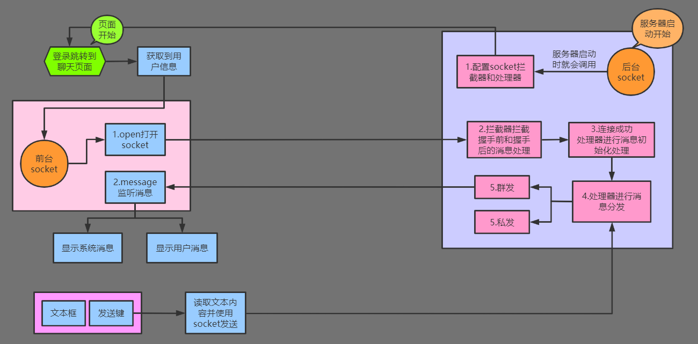
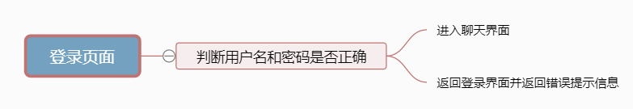
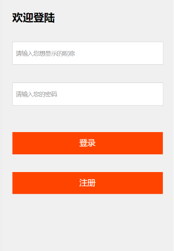
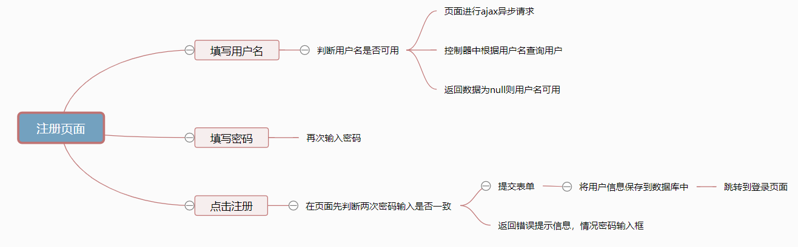
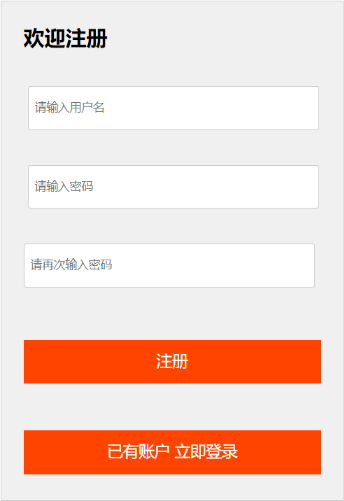
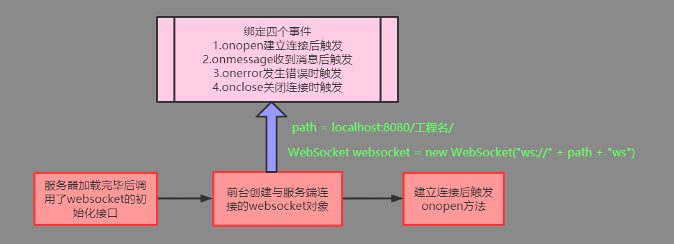
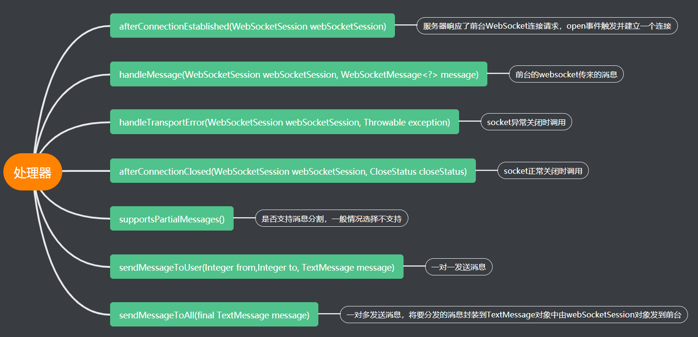
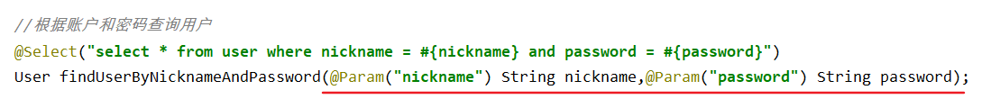

# 在线聊天室

## 0.流程预览

- 连接后的通信流程



## 1.搭建maven项目，配置pom.xml

```xml
<!-- 自定义属性管理 -->
<properties>
    <!-- 编译等所有操作使用utf-8编码 -->
    <project.build.sourceEncoding>UTF-8</project.build.sourceEncoding>
    <maven.compiler.source>1.8</maven.compiler.source>
    <maven.compiler.target>1.8</maven.compiler.target>
    <!-- 统一版本维护管理 -->
    <spring.version>4.2.8.RELEASE</spring.version>
    <servlet.version>3.1.0</servlet.version>
    <jsp.version>2.0</jsp.version>
    <gson.version>2.7</gson.version>
    <junit.version>4.12</junit.version>
    <!--mybatis版本-->
    <mysql.version>5.1.6</mysql.version>
    <mybatis.version>3.4.5</mybatis.version>
</properties>
```

```xml
<!--依赖管理-->
<dependencies>
    <dependency>
        <groupId>org.apache.tomcat.embed</groupId>
        <artifactId>tomcat-embed-websocket</artifactId>
        <version>9.0.34</version>
    </dependency>

    <dependency>
        <groupId>org.aspectj</groupId>
        <artifactId>aspectjweaver</artifactId>
        <version>1.6.8</version>
    </dependency>

    <dependency>
        <groupId>org.springframework</groupId>
        <artifactId>spring-aop</artifactId>
        <version>${spring.version}</version>
    </dependency>

    <dependency>
        <groupId>org.springframework</groupId>
        <artifactId>spring-context</artifactId>
        <version>${spring.version}</version>
    </dependency>

    <dependency>
        <groupId>org.springframework</groupId>
        <artifactId>spring-web</artifactId>
        <version>${spring.version}</version>
    </dependency>


    <dependency>
        <groupId>org.springframework</groupId>
        <artifactId>spring-test</artifactId>
        <version>${spring.version}</version>
    </dependency>

    <dependency>
        <groupId>org.springframework</groupId>
        <artifactId>spring-tx</artifactId>
        <version>${spring.version}</version>
    </dependency>

    <dependency>
        <groupId>org.springframework</groupId>
        <artifactId>spring-jdbc</artifactId>
        <version>${spring.version}</version>
    </dependency>

    <dependency>
        <groupId>javax.servlet</groupId>
        <artifactId>servlet-api</artifactId>
        <version>2.5</version>
        <scope>provided</scope>
    </dependency>

    <dependency>
        <groupId>javax.servlet.jsp</groupId>
        <artifactId>jsp-api</artifactId>
        <version>2.0</version>
        <scope>provided</scope>
    </dependency>

    <dependency>
        <groupId>jstl</groupId>
        <artifactId>jstl</artifactId>
        <version>1.2</version>
    </dependency>
    <dependency>
        <groupId>org.springframework</groupId>
        <artifactId>spring-webmvc</artifactId>
        <version>${spring.version}</version>
    </dependency>
    <dependency>
        <groupId>org.springframework</groupId>
        <artifactId>spring-websocket</artifactId>
        <version>${spring.version}</version>
    </dependency>
    <dependency>
        <groupId>org.springframework</groupId>
        <artifactId>spring-messaging</artifactId>
        <version>${spring.version}</version>
    </dependency>
    <dependency>
        <groupId>javax.servlet</groupId>
        <artifactId>javax.servlet-api</artifactId>
        <version>${servlet.version}</version>
        <scope>provided</scope>
    </dependency>
    <dependency>
        <groupId>junit</groupId>
        <artifactId>junit</artifactId>
        <version>${junit.version}</version>
        <scope>test</scope>
    </dependency>
    <dependency>
        <groupId>com.google.code.gson</groupId>
        <artifactId>gson</artifactId>
        <version>${gson.version}</version>
    </dependency>

    <dependency>
        <groupId>mysql</groupId>
        <artifactId>mysql-connector-java</artifactId>
        <version>${mysql.version}</version>
    </dependency>

    <dependency>
        <groupId>org.mybatis</groupId>
        <artifactId>mybatis</artifactId>
        <version>${mybatis.version}</version>
    </dependency>

    <dependency>
        <groupId>org.mybatis</groupId>
        <artifactId>mybatis-spring</artifactId>
        <version>1.3.0</version>
    </dependency>

    <dependency>
        <groupId>c3p0</groupId>
        <artifactId>c3p0</artifactId>
        <version>0.9.1.2</version>
        <type>jar</type>
        <scope>compile</scope>
    </dependency>
</dependencies>

```

## 2.登录界面login.jsp



- 预览



- jsp代码

```jsp
<%@ page language="java" contentType="text/html; charset=UTF-8"
    pageEncoding="UTF-8" isELIgnored="false" %>
<!DOCTYPE html PUBLIC "-//W3C//DTD HTML 4.01 Transitional//EN" "http://www.w3.org/TR/html4/loose.dtd" >
<html>
    <head>
        <meta http-equiv="Content-Type" content="text/html; charset=utf-8" />
        <title>在线聊天室</title>
        <script type="text/javascript" src="${pageContext.request.contextPath}/resources/js/jquery-1.11.3.min.js"></script>
        <script type="text/javascript" src="${pageContext.request.contextPath}/resources/js/lbt.js"></script>
        <link rel="stylesheet" href="${pageContext.request.contextPath}/resources/css/style.css" type="text/css" media="all" />
        <script type="text/javascript">

            $(function(){
                $("#register").click(function () {
                    location.href="${pageContext.request.contextPath}/register.jsp"
                })
            });

        </script>

    </head>
    <body>
        <!--登陆区域开始-->
        <div class="loginMain">

            <div class="loginArea">
                <h2>欢迎登陆</h2>
                <div><font color="red" size="5">${requestScope.errorMsg }</font></div>
                <form action="${pageContext.request.contextPath }/chat/login"  method="post">
                    <input type="text" placeholder="请输入您想显示的昵称" name="nickname" id="myText" /><br/>
                    <input type="text" placeholder="请输入您的密码" name="password" id="myPass" />
                    <button>登录</button>
                </form>
                <button id="register">注册</button>
            </div>
        </div>
        <!--登陆区域结束-->
    </body>
</html>
```

## 3.注册页面register.jsp





- jsp代码

```jsp
<%@ page contentType="text/html;charset=UTF-8" language="java" %>
<html>
    <head>
        <title>注册用户</title>
        <script type="text/javascript" src="${pageContext.request.contextPath}/resources/js/jquery-1.11.3.min.js"></script>
        <script type="text/javascript" src="${pageContext.request.contextPath}/resources/js/lbt.js"></script>
        <link rel="stylesheet" href="${pageContext.request.contextPath}/resources/css/style.css" type="text/css"
              media="all"/>
        <script type="text/javascript">
            $(function () {

                /*跳转到登陆页面*/
                $("#login").click(function () {
                    // /chatroom
                    location.href = "${pageContext.request.contextPath}/chat/loginPage";
                });

                var submit = true;
                //给注册用户添加失去焦点事件，使用ajax请求
                $("#myText").blur(function () {
                    let nickname = this.value;
                    $.getJSON("http://localhost:8080/chatroom/chat/ajaxIsExistNickname", "nickname=" + nickname, function (data) {
                        if (data.isExist) {
                            $("#errorMsg").html("用户名已存在!!!");
                            submit = false;
                        } else {
                            $("#errorMsg").html("用户名可用");
                            submit = true;
                        }
                    })
                });

                //给注册按钮添加点击事件
                $("#save").click(function () {
                    let name = $("#myText").val();
                    let p1 = $("#myPass").val();
                    let p2 = $("#myPass2").val();
                    //用户名不能为空
                    if (name === "" || name == null) return false;
                    //两次密码不相等不提交表单
                    if (p1 !== p2) {
                        $("#errorMsg").html("两次密码输入不一致!!!");
                        return false;
                    }
                    //清除错误提示信息
                    $("#errorMsg").html("");
                    if (!submit) return false;
                });
            })
        </script>
    </head>
    <body>
        <!--登陆区域开始-->
        <div class="registerMain">
            <div class="registerArea">
                <h2>欢迎注册</h2>
                <%--${pageContext.request.contextPath }/chat/register--%>
                <form action="${pageContext.request.contextPath }/chat/register" method="get">
                    <label for="myText"></label><input type="text" placeholder="请输入用户名" name="nickname" id="myText"/><br/>
                    <label for="myPass"></label><input type="password" placeholder="请输入密码" name="password" id="myPass">
                    <label for="myPass"></label><label for="myPass2"></label><input type="password" placeholder="请再次输入密码"
                                                                                    name="password2" id="myPass2">
                    <button id="save">注册</button>
                    <br/><br/>
                </form>
                <button id="login">已有账户 立即登录</button>
                <br/>
                <h1 id="errorMsg" style="color: #ff4400"></h1>
            </div>
        </div>
        <!--登陆区域结束-->
    </body>
</html>
```

## 4.登录注册的css样式

```css
@charset "utf-8";
/* CSS Document */
.inHeader{
    width:1200px;
    margin:0 auto;
    overflow:hidden;
}
.header h1{
    float:left;
    width:300px;
}
.style{
    float:right;
    margin-top:20px;
}
.style p{ float:left; line-height:15px; color:#FF0000;font-size: large}
.style span{
    width:15px;
    height:15px;
    display:inline-block;
    float:left;
    margin:0 3px;
    cursor:pointer;
}
.chatArea{
    min-height:700px;
    background:url(../images/bg3.jpg) no-repeat top;
    background-size:cover;
    padding:0 2%;
}
.inChatArea{
    width:1200px;
    margin:0 auto;
    padding:20px 0;
}
.chatSidebar{
    width:150px;
    float:left;
    padding-bottom:20px;
}
.chatCon{
    width:800px;
    height:500px;
    float:left;
    margin-left:25px;
}
.chatSidebar h2{
    background:#00ae10;
    font-size:14px;
    line-height:40px; height:40px;
    padding:0 10px;
    color:#ffffff;
    font-family: 微软雅黑, serif;
}
.chatSidebar ul{
    line-height:30px;
}
.chatSidebar ul li{
    background:rgba(0,0,0,0.2);
    margin-bottom:1px;
    padding-left:15px;
    font-size:14px;
}
.chatSidebar ul li:hover{background:rgba(0,0,0,0.3);}
.up{
    height:300px;
    background:rgba(0,0,0,0.2);
    margin-bottom:30px;
    padding:15px;
    overflow:auto;
}
.up em{ font-style:normal; background:#FF6600; color:#FFFFFF; padding:3px 5px; margin:0 5px; float:left;}
.up b{ font-weight:normal; background-color:#333333; padding:2px 5px; color:#f4f4f4; float:left;}
.up span{ background:#f4f4f4; padding:3px 5px; float:left; max-width:480px;}
.up ul li{ margin-bottom:10px;overflow:hidden;}
.down{
    background:#ffffff;
    padding:15px;
}
.down textarea{
    width:99%;
    height:50px;
    margin-top:5px;
    resize:none;
}
.otherArea{ position:relative;}
.otherArea .bqb{ 
    position:absolute; 
    width:424px; 
    height:190px; 
    background:#fff; 
    top:-202px; 
    left:-15px; 
    padding-top:8px; 
    padding-left:8px;
    border:1px solid #ccc;
}
.otherArea .bqb img{
    border:1px solid #fff;
    padding:3px;
}
.otherArea .bqb img.current{
    border:1px solid #000;
    cursor:pointer;
}
.otherArea span{
    background:url(../images/bq.gif) no-repeat;
    width:16px;
    height:16px;
    display:block;
    text-indent:-9999px;
    cursor:pointer;
}
.down .btn{
    width:101px;
    height:33px;
    background:url(../images/btn.gif) no-repeat;
    border:0;
    cursor:pointer;
    margin-left:auto;
    display:block;
    margin-top:10px;
}
```

## 5.聊天室页面mian.jsp



```jsp
<%@ page language="java" contentType="text/html; charset=UTF-8"
    pageEncoding="UTF-8" %>
<%
String path = request.getContextPath();
//localhost:8080/chatroom/
String basePath = request.getServerName() + ":" + request.getServerPort() + path + "/";
String baseUrlPath = request.getScheme() + "://" + request.getServerName() + ":" + request.getServerPort() + path + "/";
%>
<!DOCTYPE html PUBLIC "-//W3C//DTD HTML 4.01 Transitional//EN" "http://www.w3.org/TR/html4/loose.dtd">
<html>
    <head>
        <meta http-equiv="Content-Type" content="text/html; charset=utf-8"/>
        <script type="text/javascript" src="${pageContext.request.contextPath}/resources/js/jquery-1.11.3.min.js"></script>
        <script type="text/javascript" src="${pageContext.request.contextPath}/resources/js/sockjs.min.js"></script>
        <link rel="stylesheet" href="${pageContext.request.contextPath}/resources/css/style.css" type="text/css"
              media="all"/>
        <link rel="stylesheet" href="${pageContext.request.contextPath}/resources/css/chat.css" type="text/css"
              media="all"/>
        <script type="text/javascript">
            var path = '<%=basePath%>';

            var uid = '${sessionScope.loginUser.id}';
            //发送人编号
            var from = '${sessionScope.loginUser.id}';
            var fromName = '${sessionScope.loginUser.nickname}';
            //接收人编号
            var to = "-1";

            // 创建一个Socket实例
            //参数为URL，ws表示WebSocket协议。onopen、onclose和onmessage方法把事件连接到Socket实例上。每个方法都提供了一个事件，以表示Socket的状态。
            var websocket;
            //不同浏览器的WebSocket对象类型不同
            //alert("ws://" + path + "/ws?uid="+uid);
            if ('WebSocket' in window) {
                websocket = new WebSocket("ws://" + path + "ws");
                console.log("=============WebSocket");
                //火狐
            } else if ('MozWebSocket' in window) {
                websocket = new MozWebSocket("ws://" + path + "ws");
                console.log("=============MozWebSocket");
            } else {
                websocket = new SockJS("http://" + path + "ws/sockjs");
                console.log("=============SockJS");
            }

            console.log("ws://" + path + "ws");

            //打开Socket,
            websocket.onopen = function (event) {
                console.log("WebSocket:已连接");
            };

            // 监听消息
            //onmessage事件提供了一个data属性，它可以包含消息的Body部分。消息的Body部分必须是一个字符串，可以进行序列化/反序列化操作，以便传递更多的数据。
            websocket.onmessage = function (event) {
                console.log('Client received a message', event);
                //var data=JSON.parse(event.data);
                var data = $.parseJSON(event.data);
                console.log("WebSocket:收到一条消息", data);

                //2种推送的消息
                //1.用户聊天信息：发送消息触发
                //2.系统消息：登录和退出触发

                //判断是否是欢迎消息（没用户编号的就是欢迎消息）
                if (data.from === undefined || data.from === null || data.from === "") {
                    //===系统消息
                    $("#contentUl").append("<li><em>系统消息：</em><span>" + data.text + "</span></li>");
                    //刷新在线用户列表
                    $("#chatOnline").html("在线用户(" + data.userList.length + ")人");
                    $("#chatUserList").empty();
                    $(data.userList).each(function () {
                        $("#chatUserList").append("<li id=" + this.id + " onclick='onGetId(this)'>" + this.nickname +"(可私聊)"+ "</li>");
                    });

                } else {
                    //===普通消息
                    //处理一下个人信息的显示：
                    if (data.fromName === fromName) {
                        data.fromName = "我";
                        if (data.from === data.to) {
                            alert("自己不能私聊自己");
                        } else if (data.to === -1) { //群发消息设置
                            $("#contentUl").append("<li><span  style='display:block; float:right;'><em>" + data.fromName + "</em><span>" + data.text + "</span></span></li><br/>");
                        } else { //私聊消失设置
                            $("#contentUl").append("<li><span  style='display:block; float:right;'><em>" + data.fromName + "(发送悄悄话)" + "</em><span>" + data.text + "</span></span></li><br/>");
                        }

                    } else {
                        if (data.to === -1) { //群聊消息设置
                            $("#contentUl").append("<li><em>" + data.fromName + "</em><span>" + data.text + "</span></li><br/>");
                        } else { //私聊消息设置
                            $("#contentUl").append("<li><em>" + data.fromName + "(发来悄悄话)" + "</em><span>" + data.text + "</span></li><br/>");
                        }
                    }
                }

                scrollToBottom();
            };

            // 监听WebSocket的关闭
            websocket.onclose = function (event) {
                $("#contentUl").append("<li><em>系统消息：</em><span>连接已断开！</span></li>");
                scrollToBottom();
                console.log("WebSocket:已关闭：Client notified socket has closed", event);
            };

            //监听异常
            websocket.onerror = function (event) {
                $("#contentUl").append("<li><em>系统消息：</em><span>连接异常，建议重新登录</span></li>");
                scrollToBottom();
                console.log("WebSocket:发生错误 ", event);
            };

            //onload初始化
            $(function () {
                //发送消息
                $("#sendBtn").on("click", function () {
                    sendMsg();
                });

                //给退出聊天绑定事件
                $("#exitBtn").on("click", function () {
                    closeWebsocket();
                    location.href = "${pageContext.request.contextPath}/index.jsp";
                });

                //给注销用户绑定事件
                $("#deleteBtn").on("click", function () {
                    closeWebsocket();
                    location.href = "${pageContext.request.contextPath}/chat/delete";
                });

                //给输入框绑定事件
                $("#msg").on("keydown", function (event) {
                    keySend(event);
                });

                //初始化时如果有消息，则滚动条到最下面：
                scrollToBottom();


            });


            //发送消息
            function sendMsg() {
                //对象为空了
                if (websocket == undefined || websocket == null) {
                    //alert('WebSocket connection not established, please connect.');
                    alert('您的连接已经丢失，请退出聊天重新进入');
                    return;
                }
                //获取用户要发送的消息内容
                var msg = $("#msg").val();
                if (msg == "") {
                    return;
                } else {
                    var data = {};
                    data["from"] = from;
                    data["fromName"] = fromName;
                    data["to"] = to;
                    data["text"] = msg;
                    //发送消息，将 JavaScript 值转换为 JSON 字符串
                    websocket.send(JSON.stringify(data));
                    //发送完消息，清空输入框
                    $("#msg").val("");
                }
            }

            //关闭Websocket连接
            function closeWebsocket() {
                if (websocket != null) {
                    websocket.close();
                    websocket = null;
                }

            }

            //div滚动条(scrollbar)保持在最底部
            function scrollToBottom() {
                var div = document.getElementById('up');
                div.scrollTop = div.scrollHeight;
            }


            function onGetId(obj) {
                //修改文本框中的提示信息
                alert("你正在私聊" + obj.innerText);
                $("#msg").attr('placeholder', '私聊用户' + obj.innerText);
                $("#chatOnline").html("私聊(点击返回群聊)");
                to = obj.id; //要私聊对象的id值
            }

            //私聊和群聊模式的切换
            function onPrivateOrPublic(obj) {
                let text = obj.innerText;
                if (text === "私聊(点击返回群聊)") {
                    $("#chatOnline").html("群聊模式");
                    $("#msg").attr('placeholder', '发送群聊消息');
                    to = -1;
                } else {
                    $("#chatOnline").html("私聊(点击返回群聊)");
                    $("#msg").attr('placeholder', '私聊用户' + obj.innerText);
                }
            }

        </script>
    </head>

    <body>

        <!--头部开始-->
        <div class="header">
            <div class="inHeader">
                <div class="style">
                    <p>当前登录用户：${sessionScope.loginUser!=null?sessionScope.loginUser.nickname:"请登录" }&nbsp;&nbsp;&nbsp;
                        <button id="exitBtn">退出</button>
                        <button id="deleteBtn">注销</button>
                    </p>
                </div>
            </div>
        </div>
        <!--头部end-->
        <!--聊天区域开始-->
        <div class="chatArea" id="chatArea">
            <div class="inChatArea">
                <div id="chatSidebar" class="chatSidebar">
                    <h2 id="chatOnline" onclick="onPrivateOrPublic(this)">在线用户(0人)</h2>
                    <ul id="chatUserList">

                    </ul>
                </div>
                <div class="chatCon">
                    <div class="up" id="up">
                        <ul id="contentUl">

                        </ul>
                    </div>
                    <div class="down">
                        <textarea class="textInfo" id="msg" placeholder="发送群聊消息" rows="3" cols="3"></textarea>
                        <button class="btn" id="sendBtn"></button>
                    </div>
                </div>
            </div>
        </div>
        <!--聊天区域结束-->
    </body>
</html>
```

## 6.控制器

```java
package com.kl.chatroom.web.controller;

import java.util.HashMap;
import java.util.Map;
import java.util.Random;
import java.util.UUID;

import javax.servlet.http.HttpServletRequest;
import javax.servlet.http.HttpServletResponse;
import javax.servlet.http.HttpSession;
import javax.websocket.Session;

import com.google.gson.Gson;
import com.kl.chatroom.service.UserService;
import org.springframework.beans.factory.annotation.Autowired;
import org.springframework.beans.factory.annotation.Qualifier;
import org.springframework.stereotype.Controller;
import org.springframework.web.bind.annotation.RequestMapping;
import org.springframework.web.bind.annotation.RequestMethod;
import org.springframework.web.servlet.ModelAndView;

import com.kl.chatroom.domain.User;


@Controller
@RequestMapping("/chat")
public class ChatController {

    @Autowired
    @Qualifier("userService")
    private UserService userService;


    //跳转到用户登录页面,get请求
    @RequestMapping(value = "loginPage", method = RequestMethod.GET)
    public ModelAndView loginPage() {
        return new ModelAndView("login");
    }

    //请求登录进入聊天主页面
    @RequestMapping(value = "login", method = RequestMethod.POST)
    public ModelAndView login(User loginUser, HttpServletRequest request) {
        HttpSession session = request.getSession();
        //登录操作时判断是否是一个已经登录的用户
        if (session.getAttribute("loginUser") != null) {
            // 清除旧的用户,只允许无账户密码登录一次
            //session.removeAttribute("loginUser");
            return new ModelAndView("main"); //直接登录
        }
        // 第一次登录,判断用户信息是否合法
        User user = userService.findUserByNicknameAndPassword(loginUser.getNickname(), loginUser.getPassword());
        //无效的用户信息，重新返回登录页面
        if (user == null) return new ModelAndView("login");
        // 有效的用户信息，将用户放入session
        session.setAttribute("loginUser", user);
        System.out.println("用户登录成功：" + loginUser);
        //跳转到聊天室
        return new ModelAndView("main");
    }

    //注册用户
    @RequestMapping(value = "/register", method = RequestMethod.GET)
    public String register(User registerUser) {
        userService.saveUser(registerUser);
        return "login"; //注册成功
    }

    //注销用户
    @RequestMapping(value = "/delete",method = RequestMethod.GET)
    public String deleteUser(HttpServletRequest request) {
        System.out.println("用户注销成功......");
        HttpSession session = request.getSession();
        if (session.getAttribute("loginUser") != null) {
            session.removeAttribute("loginUser");
        }
        return "login";
    }

    //异步请求
    @RequestMapping(value = "/ajaxIsExistNickname")
    public void ajaxIsExistNickname(String nickname, HttpServletResponse resp) throws Exception {
        System.out.println("传来的网名是--------" + nickname);
        boolean isExist = userService.findUserByNickname(nickname);
        System.out.println(isExist + "--------");
        Map<String, Boolean> map = new HashMap<>();
        map.put("isExist", isExist); //保存到map中并转化为json字符串
        Gson gson = new Gson();
        String json = gson.toJson(map);
        System.out.println(json);
        resp.getWriter().write(json); //回传到页面
    }
}
```

## 7.WebSocket配置

### 配置类

- 服务器加载完毕后调用websocket的初始化接口，等待客户端websocket的连接

```java
package com.kl.chatroom.web.websocket;

import org.springframework.beans.factory.annotation.Autowired;
import org.springframework.stereotype.Component;
import org.springframework.web.socket.config.annotation.EnableWebSocket;
import org.springframework.web.socket.config.annotation.WebSocketConfigurer;
import org.springframework.web.socket.config.annotation.WebSocketHandlerRegistry;

/**
 * 
 * 说明：WebScoket配置处理器
 * 把处理器和拦截器注册到spring websocket中
 * @author 传智.BoBo老师
 * @version 1.0
 * @date 2016年10月27日
 */
@Component("webSocketConfig")
//配置开启WebSocket服务用来接收ws请求
@EnableWebSocket
public class WebSocketConfig implements WebSocketConfigurer {

    //注入处理器
    @Autowired
    private ChatWebSocketHandler webSocketHandler;
    @Autowired
    private ChatHandshakeInterceptor chatHandshakeInterceptor;

    public void registerWebSocketHandlers(WebSocketHandlerRegistry registry) {
        //添加一个处理器还有定义处理器的处理路径
        registry.addHandler(webSocketHandler, "/ws").addInterceptors(chatHandshakeInterceptor);
        /*
       * 在这里我们用到.withSockJS()，SockJS是spring用来处理浏览器对websocket的兼容性
       * 目前浏览器支持websocket还不是很好，特别是IE11以下
       * SockJS能根据浏览器能否支持websocket来提供三种方式用于websocket请求
       * 三种方式分别是 WebSocket, HTTP Streaming以及 HTTP Long Polling
       */
        registry.addHandler(webSocketHandler, "/ws/sockjs").addInterceptors(chatHandshakeInterceptor).withSockJS();
    }

}
```

### 拦截器

- 在前台websocket要与服务端websocket建立连接之前的方法处理

```java
package com.kl.chatroom.web.websocket;

import java.util.Map;

import javax.servlet.http.HttpSession;

import org.springframework.http.server.ServerHttpRequest;
import org.springframework.http.server.ServerHttpResponse;
import org.springframework.http.server.ServletServerHttpRequest;
import org.springframework.stereotype.Component;
import org.springframework.web.socket.WebSocketHandler;
import org.springframework.web.socket.server.HandshakeInterceptor;

import com.kl.chatroom.domain.User;
/**
 * websocket的链接建立是基于http握手协议，我们可以添加一个拦截器处理握手之前和握手之后过程
 * @author BoBo
 *
 */
@Component
public class ChatHandshakeInterceptor implements HandshakeInterceptor{

   /**
     * 握手之前，若返回false，则不建立链接
     */
   @Override
   public boolean beforeHandshake(ServerHttpRequest request, ServerHttpResponse response, WebSocketHandler wsHandler,
         Map<String, Object> attributes) throws Exception {
      if (request instanceof ServletServerHttpRequest) {
         ServletServerHttpRequest servletRequest = (ServletServerHttpRequest) request;
         HttpSession session = servletRequest.getServletRequest().getSession(false);
         //如果用户已经登录，允许聊天
         if(session.getAttribute("loginUser")!=null){
            //获取登录的用户
            User loginUser=(User)session.getAttribute("loginUser") ;
            //将用户放入socket处理器的会话(WebSocketSession)中
            attributes.put("loginUser", loginUser);
            System.out.println("Websocket:用户[ID:" + (loginUser.getId() + ",Name:"+loginUser.getNickname()+"]要建立连接"));
         }else{
            //用户没有登录，拒绝聊天
            //握手失败！
            System.out.println("----握手已失败.........");
            return false;
         }
      }
      System.out.println("-----握手开始.........");
      return true;
   }

   /**
     * 握手之后
     */
   @Override
   public void afterHandshake(ServerHttpRequest request, ServerHttpResponse response, WebSocketHandler wsHandler,
         Exception exception) {
      System.out.println("----握手成功啦........");
   }

}
```

### 处理器

- 客户端和服务端websocket连接成功后的业务逻辑



```java
package com.kl.chatroom.web.websocket;

import java.io.IOException;
import java.util.Date;
import java.util.HashMap;
import java.util.Map;
import java.util.Map.Entry;
import java.util.Set;

import org.springframework.stereotype.Component;
import org.springframework.web.socket.CloseStatus;
import org.springframework.web.socket.TextMessage;
import org.springframework.web.socket.WebSocketHandler;
import org.springframework.web.socket.WebSocketMessage;
import org.springframework.web.socket.WebSocketSession;
import org.springframework.web.util.HtmlUtils;

import com.kl.chatroom.domain.Message;
import com.kl.chatroom.domain.User;
import com.kl.utils.GsonUtils;

/**
 *
 *  * 说明：WebSocket处理器
 */
@Component("chatWebSocketHandler")
public class ChatWebSocketHandler implements WebSocketHandler {
   
   //在线用户的SOCKETsession(存储了所有的通信通道)
   public static final Map<Integer, WebSocketSession> USER_SOCKETSESSION_MAP;
   
   //存储所有的在线用户
   static {
      USER_SOCKETSESSION_MAP = new HashMap<Integer, WebSocketSession>();
   }
   
   /**
    * webscoket建立好链接之后的处理函数--连接建立后的准备工作
    * 连接建立后就会获得一个从前台传来的WebSocketSession对象
    */
   @Override
   public void afterConnectionEstablished(WebSocketSession webSocketSession) throws Exception {
      //将当前的连接的用户会话放入map,key是用户id编号
      User loginUser=(User) webSocketSession.getAttributes().get("loginUser");
      USER_SOCKETSESSION_MAP.put(loginUser.getId(), webSocketSession);
      
      //设置要进行群发消息告知大家有新用户进入聊天室
      Message msg = new Message();
      msg.setText("【"+loginUser.getNickname()+"】进入了聊天室...");
      msg.setDate(new Date());
      //获取所有在线的WebSocketSession对象集合
      Set<Entry<Integer, WebSocketSession>> entrySet = USER_SOCKETSESSION_MAP.entrySet();
      //将最新的所有的在线人列表放入消息对象的list集合中，用于页面显示
      for (Entry<Integer, WebSocketSession> entry : entrySet) {
         msg.getUserList().add((User)entry.getValue().getAttributes().get("loginUser"));
      }
      
      //将消息转换为json数据
      TextMessage message = new TextMessage(GsonUtils.toJson(msg));
      //群发消息
      sendMessageToAll(message);
      
   }

   @Override
    /*
     * 客户端发送服务器的消息时的处理函数，在这里收到消息之后可以分发消息
     * 处理消息：当一个新的WebSocket到达的时候，会被调用(在客户端通过Websocket API发送的消息会经过这里，然后进行相应的处理)
     */
   public void handleMessage(WebSocketSession webSocketSession, WebSocketMessage<?> message) throws Exception {
      //如果消息没有任何内容，则直接返回
      if(message.getPayloadLength()==0)return;
      //反序列化服务端收到的json消息
      Message msg = GsonUtils.fromJson(message.getPayload().toString(), Message.class);
      msg.setDate(new Date());
      //处理html的字符，转义：
      String text = msg.getText();
      //转换为HTML转义字符表示
      String htmlEscapeText = HtmlUtils.htmlEscape(text);
      msg.setText(htmlEscapeText);
      System.out.println("消息（可存数据库作为历史记录）:"+message.getPayload().toString());
      //判断是群发还是单发
      if(msg.getTo()==null||msg.getTo()==-1){
         //群发
         sendMessageToAll(new TextMessage(GsonUtils.toJson(msg)));
      }else{
         //单发
         sendMessageToUser(msg.from,msg.getTo(), new TextMessage(GsonUtils.toJson(msg)));
      }
   }

   @Override
   /**
     * 消息传输过程中出现的异常处理函数
     * 处理传输错误：处理由底层WebSocket消息传输过程中发生的异常
     */
   public void handleTransportError(WebSocketSession webSocketSession, Throwable exception) throws Exception {
      // 记录日志，准备关闭连接
      System.out.println("Websocket异常断开:" + webSocketSession.getId() + "已经关闭");
      //一旦发生异常，强制用户下线，关闭session
      if (webSocketSession.isOpen()) {
         webSocketSession.close();
      }
      
      //群发消息告知大家
      Message msg = new Message();
      msg.setDate(new Date());
      
      //获取异常的用户的会话中的用户编号
      User loginUser=(User)webSocketSession.getAttributes().get("loginUser");
      //获取所有的用户的会话
      Set<Entry<Integer, WebSocketSession>> entrySet = USER_SOCKETSESSION_MAP.entrySet();
      //并查找出在线用户的WebSocketSession（会话），将其移除（不再对其发消息了。。）
      for (Entry<Integer, WebSocketSession> entry : entrySet) {
         if(entry.getKey().equals(loginUser.getId())){
            msg.setText("【"+loginUser.getNickname()+"】退出了聊天室。。。！");
            //清除在线会话
            USER_SOCKETSESSION_MAP.remove(entry.getKey());
            //记录日志：
            System.out.println("Socket会话已经移除:用户ID" + entry.getKey());
            break;
         }
      }
      
      //并查找出在线用户的WebSocketSession（会话），将其移除（不再对其发消息了。。）
      for (Entry<Integer, WebSocketSession> entry : entrySet) {
         msg.getUserList().add((User)entry.getValue().getAttributes().get("loginUser"));
      }
      
      TextMessage message = new TextMessage(GsonUtils.toJson(msg));
      sendMessageToAll(message);
      
   }

   @Override
   /**
     * websocket链接关闭的回调
     * 连接关闭后：一般是回收资源等
     */
   public void afterConnectionClosed(WebSocketSession webSocketSession, CloseStatus closeStatus) throws Exception {
      // 记录日志，准备关闭连接
      System.out.println("Websocket正常断开:" + webSocketSession.getId() + "已经关闭");
      
      //群发消息告知大家
      Message msg = new Message();
      msg.setDate(new Date());
      
      //获取异常的用户的会话中的用户编号
      User loginUser=(User)webSocketSession.getAttributes().get("loginUser");
      Set<Entry<Integer, WebSocketSession>> entrySet = USER_SOCKETSESSION_MAP.entrySet();
      //并查找出在线用户的WebSocketSession（会话），将其移除（不再对其发消息了。。）
      for (Entry<Integer, WebSocketSession> entry : entrySet) {
         if(entry.getKey().equals(loginUser.getId())){
            //群发消息告知大家
            msg.setText("【"+loginUser.getNickname()+"】离开了聊天室...");
            //清除在线会话
            USER_SOCKETSESSION_MAP.remove(entry.getKey());
            //记录日志：
            System.out.println("Socket会话已经移除:用户ID" + entry.getKey());
            break;
         }
      }
      
      //并查找出在线用户的WebSocketSession（会话），将其移除（不再对其发消息了。。）
      for (Entry<Integer, WebSocketSession> entry : entrySet) {
         msg.getUserList().add((User)entry.getValue().getAttributes().get("loginUser"));
      }
      
      TextMessage message = new TextMessage(GsonUtils.toJson(msg));
      sendMessageToAll(message);
   }

   @Override
    /**
     * 是否支持处理拆分消息，返回true返回拆分消息
     */
   //是否支持部分消息：如果设置为true，那么一个大的或未知尺寸的消息将会被分割，并会收到多次消息（会通过多次调用方法handleMessage(WebSocketSession, WebSocketMessage). ）
   //如果分为多条消息，那么可以通过一个api：org.springframework.web.socket.WebSocketMessage.isLast() 是否是某条消息的最后一部分。
   //默认一般为false，消息不分割
   public boolean supportsPartialMessages() {
      return false;
   }

   /**
    * 
    * 说明：给某个人发信息
    * @param to 用户id 对应着用户的websocket
    * @param message 想要发送的消息
    */
   private void sendMessageToUser(Integer from,Integer to, TextMessage message) throws IOException{
      System.out.println("私聊-------------------------");
      //获取到要接收消息的用户的session
      WebSocketSession fromSession = USER_SOCKETSESSION_MAP.get(from);
      if (fromSession != null && fromSession.isOpen()) {
         //发送消息
         fromSession.sendMessage(message);
      }
      //获取到要接收消息的用户的session
      WebSocketSession toSession = USER_SOCKETSESSION_MAP.get(to);
      if (toSession != null && toSession.isOpen()) {
         //发送消息
         toSession.sendMessage(message);
      }
   }
   
   /**
    * 
    * 说明：群发信息：给所有在线用户发送消息
    */
   private void sendMessageToAll(final TextMessage message){
      System.out.println("群发-------------------");
      //对用户发送的消息内容进行转义
      //获取到所有在线用户的SocketSession对象
      Set<Entry<Integer, WebSocketSession>> entrySet = USER_SOCKETSESSION_MAP.entrySet();
      for (Entry<Integer, WebSocketSession> entry : entrySet) {
         //某用户的WebSocketSession
         final WebSocketSession webSocketSession = entry.getValue();
         //判断连接是否仍然打开的
         if(webSocketSession.isOpen()){
            //开启多线程发送消息（效率高）
            new Thread(() -> {
               try {
                  if (webSocketSession.isOpen()) {
                     webSocketSession.sendMessage(message);
                  }
               } catch (IOException e) {
                  e.printStackTrace();
               }
            }).start();
         }
      }
   }
   
}
```

## 8.持久层

```java
package com.kl.chatroom.dao;

import com.kl.chatroom.domain.User;
import org.apache.ibatis.annotations.Insert;
import org.apache.ibatis.annotations.Param;
import org.apache.ibatis.annotations.Select;
import org.springframework.stereotype.Repository;

@Repository("userDao")
public interface UserDao {

    //根据账户和密码查询用户
    @Select("select * from user where nickname = #{nickname} and password = #{password}")
    User findUserByNicknameAndPassword(@Param("nickname") String nickname,@Param("password") String password);

    //保存用户信息
    @Insert("insert into user(nickname,password) values(#{nickname},#{password})")
    void saveUser(User user);

    //根据用户名查询用户
    @Select("select * from user where nickname = #{nickname}")
    User findUserByNickname(String nickname);
}
```

## 9.业务层

- 接口

```java
package com.kl.chatroom.service;

import com.kl.chatroom.domain.User;

public interface UserService {

    User findUserByNicknameAndPassword(String nickname,String password);

    void saveUser(User user);

    boolean findUserByNickname(String nickname);

}
```

- 实现

```java
package com.kl.chatroom.service.impl;

import com.kl.chatroom.dao.UserDao;
import com.kl.chatroom.domain.User;
import com.kl.chatroom.service.UserService;
import org.springframework.beans.factory.annotation.Autowired;
import org.springframework.beans.factory.annotation.Qualifier;
import org.springframework.stereotype.Service;

@Service("userService")
public class UserServiceImpl implements UserService {

    @Autowired
    @Qualifier("userDao")
    private UserDao userDao;

    @Override
    public User findUserByNicknameAndPassword(String nickname, String password) {
        return userDao.findUserByNicknameAndPassword(nickname,password);
    }

    @Override
    public void saveUser(User user) {
        userDao.saveUser(user);
    }

    @Override
    public boolean findUserByNickname(String nickname) {
        return userDao.findUserByNickname(nickname) != null;
    }
}
```

## 10.domain类

### Message

```java
package com.kl.chatroom.domain;

import java.util.ArrayList;
import java.util.Date;
import java.util.List;

import com.google.gson.annotations.Expose;
/**
 * DTO类，用来存放聊天的消息
 */
public class Message {

   //发送者
   @Expose
   public Integer from;
   //发送者名称
   @Expose
   public String fromName;
   //接收者
   @Expose
   public Integer to;
   //发送的文本
   @Expose
   public String text;
   
   //在线用户列表
   @Expose
   List<User> userList = new ArrayList<>();

   //............
}
```

### User 

```java
package com.kl.chatroom.domain;

import com.google.gson.annotations.Expose;

//用户
public class User {
    @Expose
    private Integer id;//唯一标识属性
    @Expose
    private String nickname;
    @Expose
    private String password;

    //............

    @Override
    public String toString() {
        return "User [id=" + id + ", name=" + nickname  + ", password=" + password + "]";
    }
}
```

## 11.json工具类

```java
package com.kl.utils;

import java.lang.reflect.Type;
import com.google.gson.Gson;
import com.google.gson.GsonBuilder;

//gson的工具类
public class GsonUtils {
    //保证是线程安全的
    private static final Gson GSON;
    static{
        GSON = new GsonBuilder()     
            .excludeFieldsWithoutExposeAnnotation()//打开Export注解，调用了这个方法的副作用，要转换和不转换都要加注解
            .setDateFormat("yyyy-MM-dd HH:mm:ss")//序列化日期格式  "yyyy-MM-dd"
            .setPrettyPrinting() //自动格式化换行
            .create();
    }

    //获取gson解析器
    public static Gson getGson(){
        return GSON;
    }

    //对象转换为json
    public static String toJson(Object object){
        return GSON.toJson(object);
    }

    //反序列化
    //JSON转换为对象--普通类型
    public static <T> T fromJson(String json, Class<T> classOfT){
        return GSON.fromJson(json, classOfT);
    }
    //JSON转换为对象-针对泛型的类型
    public static <T> T fromJson(String json, Type typeOfT){
        return GSON.fromJson(json, typeOfT);
    }

}
```

## 11.index.jsp

```jsp
<%@ page language="java" contentType="text/html; charset=UTF-8"
    pageEncoding="UTF-8"%>
<!DOCTYPE html PUBLIC "-//W3C//DTD HTML 4.01 Transitional//EN" "http://www.w3.org/TR/html4/loose.dtd">
<html>
    <head>
        <meta http-equiv="Content-Type" content="text/html; charset=UTF-8">
        <title>跳转到主页</title>
    </head>
    <body>
        <!-- 这里的index.jsp并不是真正的主页， 系统的所有页面都放在 WEB-INF/pages下，这样用户就无法对这些页面直接访问-->
        <jsp:forward page="/chat/loginPage"/>
    </body>
</html>
```

# 错误

- ### No suitable default RequestUpgradeStrategy found

- 项目中使用了spring-websocket，在Junit单元测试时报以上错误，由于websocket依赖容器中的websocket相关jar包，通过引入内置tomcat解决

```xml
<dependency>
	<groupId>org.apache.tomcat.embed</groupId>
    <artifactId>tomcat-embed-websocket</artifactId>
	<version>8.5.15</version>
</dependency>
```

- 有多个参数时要加注解

