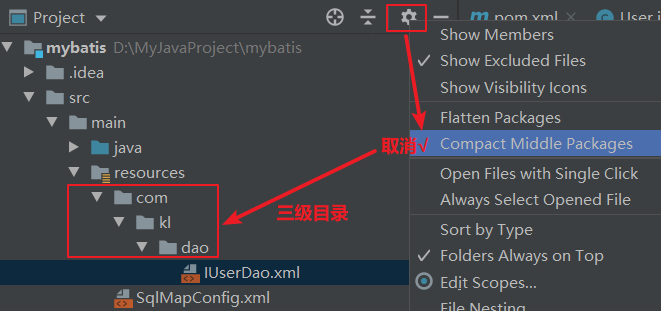
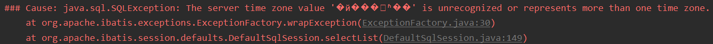
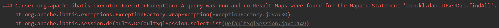
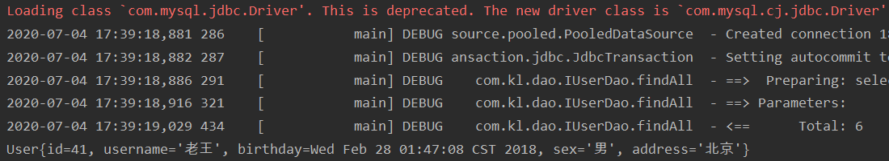
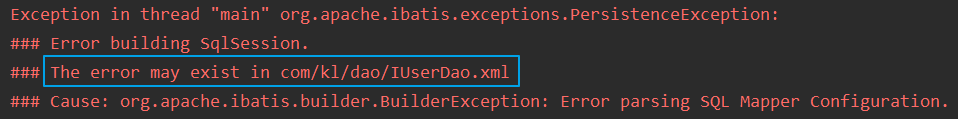

# 1.概述

- 什么是框架？

>- 它是我们软件开发中的一套解决方案，不同的框架解决的是不同的问题
>- 使用框架的好处：框架封装了很多的细节，使开发者可以使用极简的方式实现功能，大大提高开发效率
>- 简而言之，框架其实就是某种应用的半成品，就是一组组件，供你选用完成你自己的系统

- 三层架构

>- 表现层：是用于展示数据的
>- 业务层：是处理业务需求
>- 持久层：是和数据库交互的

- jdbc问题分析

>1. 数据库链接创建、释放频繁造成系统资源浪费从而影响系统性能，如果使用数据库链接池可解决此问题
>2. sql语句在代码中硬编码，造成代码不易维护，实际应用sql变化的可能较大，sql变动需要改变java代码
>3. 使用PreparedStatement向占位符传参数存在硬编码，因为sql语句的where条件不一定，可能多也可能少，修改sql还要修改代码，系统不易维护
>4. 对结果集解析存在硬编码（查询列名），sql变化导致解析代码变化，系统不易维护，如果能将数据库记录封装成pojo对象解析比较方便

- mybatis的概述

>- mybatis是一个持久层框架，用java编写的
>- 它封装了jdbc操作的很多细节，使开发者只需要关注sql语句本身，而无需关注注册驱动，创建连接等繁杂过程它使用了ORM思想实现了结果集的封装

- ORM

>- Object Relational Mappging：对象关系映射
>- 简单的说：就是把数据库表和实体类及实体类的属性对应起来让我们可以操作实体类就实现操作数据库表

- 之前

| javabean  |  数据库  |
| :-------: | :------: |
|   user    |   User   |
|    id     |  userId  |
| user_name | userName |

- 今天我们需要做到实体类中的属性和数据库表的字段名称保持一致

| javabean  |  数据库   |
| :-------: | :-------: |
|   user    |   User    |
|    id     |    id     |
| user_name | user_name |

# 2.环境搭建

- 创建数据库

```sql
DROP TABLE IF EXISTS `user`;

CREATE TABLE `user` (
    `id` int(11) NOT NULL auto_increment,
    `username` varchar(32) NOT NULL COMMENT '用户名称',
    `birthday` datetime default NULL COMMENT '生日',
    `sex` char(1) default NULL COMMENT '性别',
    `address` varchar(256) default NULL COMMENT '地址',
    PRIMARY KEY  (`id`)
) ENGINE=InnoDB DEFAULT CHARSET=utf8;


insert  into `user`(`id`,`username`,`birthday`,`sex`,`address`) 
values 
(41,'路飞','2018-02-27 17:47:08','男','北京'),
(42,'索隆','2018-03-02 15:09:37','男','上海'),
(43,'罗宾','2018-03-04 11:34:34','女','上海'),
(45,'乔巴','2018-03-04 12:04:06','男','上海'),
(46,'乌索普','2018-03-07 17:37:26','男','北京'),
(48,'娜美','2018-03-08 11:44:00','女','广州');
```

- 早pom.xml导入maven工程

```xml
<?xml version="1.0" encoding="UTF-8"?>
<project xmlns="http://maven.apache.org/POM/4.0.0"
         xmlns:xsi="http://www.w3.org/2001/XMLSchema-instance"
         xsi:schemaLocation="http://maven.apache.org/POM/4.0.0 http://maven.apache.org/xsd/maven-4.0.0.xsd">
    <modelVersion>4.0.0</modelVersion>

    <groupId>org.example</groupId>
    <artifactId>mybatis</artifactId>
    <version>1.0-SNAPSHOT</version>
    <!--打包方式-->
    <packaging>jar</packaging>
    <dependencies>
        <!--导入mybatis坐标--><!--最关键的,其他坐标导入可以省略-->
        <dependency>
            <groupId>org.mybatis</groupId>
            <artifactId>mybatis</artifactId>
            <version>3.5.5</version>
        </dependency>
        <!--导入mysql的坐标-->
        <dependency>
            <groupId>mysql</groupId>
            <artifactId>mysql-connector-java</artifactId>
            <version>6.0.6</version>
        </dependency>
        <!--导入日志的坐标-->
        <dependency>
            <groupId>log4j</groupId>
            <artifactId>log4j</artifactId>
            <version>1.2.17</version>
        </dependency>
        <!--导入单元测试的坐标-->
        <dependency>
            <groupId>junit</groupId>
            <artifactId>junit</artifactId>
            <version>4.10</version>
        </dependency>
    </dependencies>
</project>
```

- 在resources目录下创建SqlMapConfig.xml文件

```xml
<?xml version="1.0" encoding="UTF-8"?>
<!--导入约束-->
<!DOCTYPE configuration
        PUBLIC "-//mybatis.org//DTD Config 3.0//EN"
        "http://mybatis.org/dtd/mybatis-3-config.dtd">
<!--mybatis的主配置文件-->
<configuration>
    <!--配置环境-->
    <environments default="mysql">
        <!--配置mysql的环境-->
        <environment id="mysql">
            <!--配置事务类型-->
            <transactionManager type="JDBC"/>
            <!--配置数据源(连接池)-->
            <dataSource type="POOLED">
                <!--配置连接数据库的四个基本信息-->
                <property name="driver" value="com.mysql.jdbc.Driver"/>
                <property name="url" value="jdbc:mysql://localhost:3306/eesy_mybatis"/>
                <property name="username" value="root"/>
                <property name="password" value="root"/>
            </dataSource>
        </environment>
    </environments>
    <!--指定映射配置文件的位置,映射配置文件指的是每个dao独立的配置文件-->
    <mappers>
        <mapper resource="com/kl/dao/IUserDao.xml"/>
    </mappers>
</configuration>
```

- 定义用户持久层接口和抽象方法

```java
//用户持久层接口
public interface IUserDao {
    //查询数据库所有信息
    List<User> findAll();
}
```

- 在resources目录下创建com/kl/dao三级目录，再创建IUserDao.xml文件

```xml
<?xml version="1.0" encoding="UTF-8"?>
<!--导入约束-->
<!DOCTYPE mapper
        PUBLIC "-//mybatis.org//DTD Mapper 3.0//EN"
        "http://mybatis.org/dtd/mybatis-3-mapper.dtd">
<mapper namespace="com.kl.dao.IUserDao">
    <!--配置查询所有-->
    <select id="findAll">
        <!--编写自己需要的查询语句-->
        select * from user
    </select>
</mapper>
```

- 小结：mybatis的环境搭建

>- 第一步：创建maven工程并导入坐标
>- 第二步：创建实体类和dao的接口
>- 第三步：创建Mybatis的主配置文件   ---   SqlMapConifg.xml
>- 第四步：创建映射配置文件 --- IUserDao.xml

- 环境搭建的注意事项：

>- 第一个：创建IUserDao.xml和IUserDao.java时名称是为了和我们之前的知识保持一致
>  - 在Mybatis中它把持久层的操作接口名称和映射文件也叫做：Mapper，所以：IUserDao和IUserMapper是一样的
>- 第二个：在idea中创建目录的时候，它和包是不一样的
>  - 包在创建时：com.itheima.dao它是三级结构
>  - 目录在创建时：com.itheima.dao是一级目录，所以需要三级目录结构时必须逐一创建
>- 第三个：mybatis的映射配置文件位置必须和dao接口的包结构相同
>- 第四个：映射配置文件的mapper标签namespace属性的取值必须是dao接口的全限定类名
>- 第五个：映射配置文件的操作配置（select），id属性的取值必须是dao接口的方法名

- 当我们遵从了第三，四，五点之后，我们在开发中就无须再写dao的实现



# 3.入门案例

- 在test/java下进行测试

```java
package com.kl.test;

import com.kl.dao.IUserDao;
import com.kl.domain.User;
import org.apache.ibatis.io.Resources;
import org.apache.ibatis.session.SqlSession;
import org.apache.ibatis.session.SqlSessionFactory;
import org.apache.ibatis.session.SqlSessionFactoryBuilder;

import java.io.InputStream;
import java.util.List;

public class MybatisTest {
    public static void main(String[] args) throws Exception{
        //1.读取配置文件
        InputStream in = Resources.getResourceAsStream("SqlMapConfig.xml");
        //2.创建SqlSessionFactory工厂
        SqlSessionFactoryBuilder builder = new SqlSessionFactoryBuilder(); //构建者模式
        SqlSessionFactory factory = builder.build(in);                     //工厂模式
        //3.使用工厂生产SqlSession对象
        SqlSession sqlSession = factory.openSession(); 
        //4.使用SqlSession创建Dao接口的代理对象
        IUserDao userDao = sqlSession.getMapper(IUserDao.class);           //代理模式
        //5.使用代理对象执行方法
        List<User> users = userDao.findAll();
        for (User user : users) {
            System.out.println(user);
        }
        //6.释放资源
        sqlSession.clearCache();
        in.close();
    }
}
```

1. **运行时出现下列错误**

>数据库配置，启动项目报错：这个错误的意思是服务器的区时不对



- 解决办法：根据提示需要在配置数据库的连接信息中，在MySQL的URL后面加上“**?serverTimezone=UTC**” ，如下所示：
- 修改SqlMapConfig.xml中的配置信息

```xml
<property name="url" value="jdbc:mysql://localhost:3306/eesy_mybatis?serverTimezone=UTC"/>
```

2. **运行时出现下列错误**

>这个错误是findAll方法查询后没有返回类型，mybatis查询完后不知道将结果集封装到哪里：查询完的结果需要封装到一个javabean类中



- 解决办法：在IUserDao,xml配置文件中加上resultType属性并补全全类名

```xml
<mapper namespace="com.kl.dao.IUserDao">
    <!--配置查询所有-->
    <select id="findAll" resultType="com.kl.domain.User">select * from user</select>
</mapper>
```

- 3. **虽然查询到结果，但依然有警告**

>com.mysql.jdbc.Driver这个类已经被丢弃了，现在是使用新的类com.mysql.cj.jdbc.Driver来替换



- 解决办法：在SqlMapConfig.xml配置文件中修改

```xml
<property name="driver" value="com.mysql.cj.jdbc.Driver"/>
```

- **mybatis的入门案例小结**

>- 第一步：读取配置文件
>- 第二步：创建SqlSessionFactory工厂
>- 第三步：创建SqlSession
>- 第四步：创建Dao接口的代理对象
>- 第五步：执行dao中的方法
>- 第六步：释放资源

- 注意事项：

>- 不要忘记在映射配置中告知mybatis要封装到哪个实体类中
>- 配置的方式：指定实体类的全限定类名

- **mybatis基于注解的入门案例：**

>- 把IUserDao.xml移除，在dao接口的方法上使用@Select注解
>- 并且指定SQL语句同时需要在SqlMapConfig.xml中的mapper配置时，使用class属性指定dao接口的全限定类名

- 修改IUserDao接口

```java
//用户持久层接口
public interface IUserDao {
    @Select("select * from user")
    List<User> findAll();
}
```

- 修改SqlMapConfig.xml文件

```xml
<!--指定映射配置文件的位置,映射配置文件指的是每个dao独立的配置文件-->
<mappers>
    <!--1.xml文件的配置方式-->
    <!-- <mapper resource="com/kl/dao/IUserDao.xml"/>-->
    
    <!--2.反射方法的配置方式-->
    <mapper class="com.kl.dao.IUserDao"/>
</mappers>
```

- 可能会出现如下错误

>- 这是因为com/kl/dao/IUserDao.xml下的文件还存在



- 解决办法：删掉com/kl/dao/IUserDao.xml目录和文件即可

---

- 明确：

>- 我们在实际开发中，都是越简便越好，所以都是采用不写dao实现类的方式
>- 不管使用XML还是注解配置，Mybatis它是支持写dao实现类

# 4.自定义mabatis框架

>为了了解mybatis的执行细节

- 有了数据库的四个基本信息就能创建Connection对象

```xml
<!--配置连接数据库的四个基本信息,以键值对形式存储信息-->
<property name="driver" value="com.mysql.cj.jdbc.Driver"/>
<property name="url" value="jdbc:mysql://localhost:3306/eesy_mybatis?serverTimezone=UTC"/>
<property name="username" value="root"/>
<property name="password" value="root"/>
```

- 映射配置信息

```xml
<mappers>
    <mapper resource="com/kl/dao/IUserDao.xml"/>
    <!--注解方式: <mapper class="com.kl.dao.IUserDao"/> -->
</mappers>
```

- 有了它就有了执行的SQL语句，就可以获取PreparedStatement，此配置中还有封装的实体类全限定类名

```xml
<mapper namespace="com.kl.dao.IUserDao">
    <!--配置查询所有 id属性指定接口中定义的方法 resultType属性指定返回值要封装到的实体类是哪一个-->
    <select id="findAll" resultType="com.kl.domain.User">
        select * from user
    </select>
</mapper>
```

