# 连接池以及事务控制

>原理部分了解，应用部分会用

- 连接池：我们在实际开发中都会使用连接池，因为它可以减少我们获取连接所消耗的时间

- mybatis中的连接池：mybatis连接池提供了3种方式的配置

  - 配置的位置：主配置文件SqlMapConfig.xml中的dataSource标签，type属性就是表示采用何种连接池方式
  - type属性的取值：

  >- POOLED：采用传统的javax.sql.DataSource规范中的连接池，mybatis中有针对规范的实现
  >- UNPOOLED：采用传统的获取连接的方式，虽然也实现Javax.sql.DataSource接口，但是并没有使用池的思想
  >- JNDI：采用服务器提供的JNDI技术实现，来获取DataSource对象，不同的服务器所能拿到DataSource是不一样，注意：如果不是web或者maven的war工程，是不能使用的，tomcat服务器，采用连接池就是dbcp连接池

## mybatis中连接池使用及分析

### 日志分析

- type=POOLED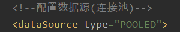

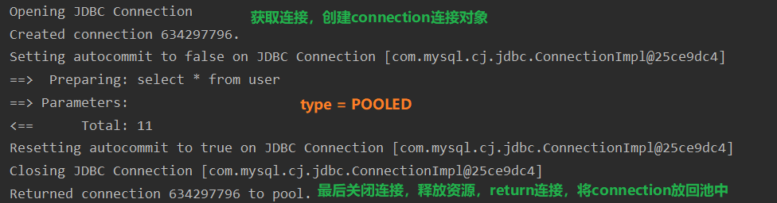

- type=UNPOOLED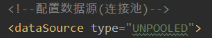

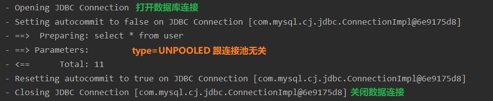

### 获取连接的详情

- UNPOOLED方式

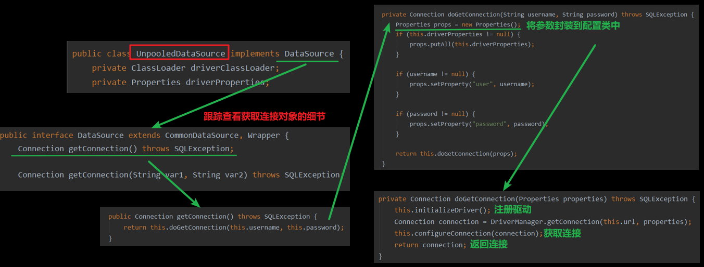

- POOLED方式

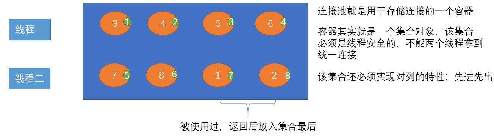

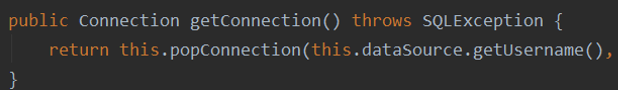

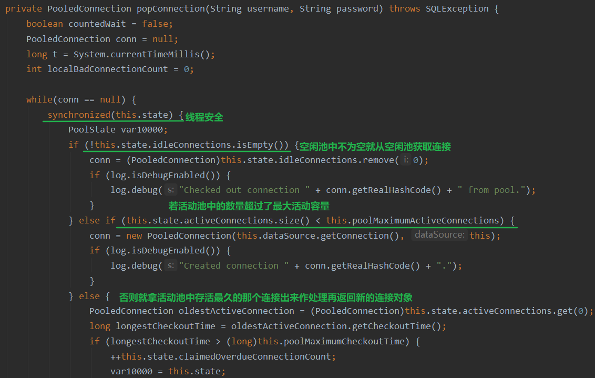

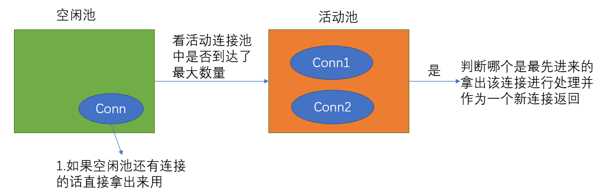

- 在开发中多用连接池的思想---POOLED

## mybatis事务控制的分析

>- 什么是事务
>- 事务的四大特性ACID
>- 不考虑隔离性会产生的3个问题
>- 解决办法：四种隔离级别

- mybatis中的事务是通过sqlsession对象的commit方法和rollback方法实现事务的提交和回滚

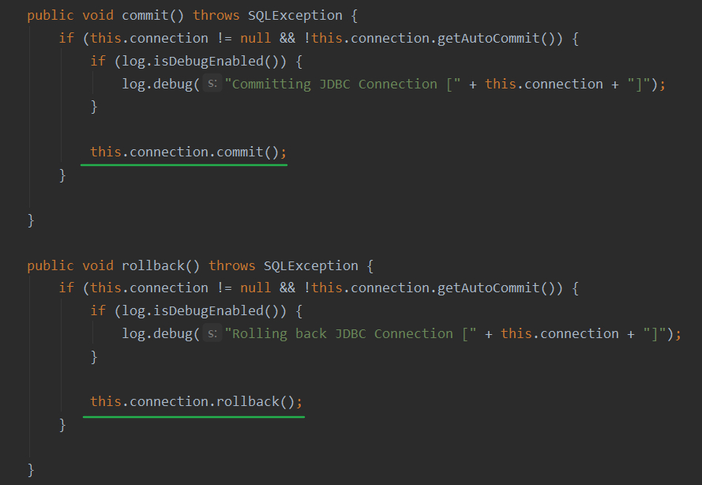

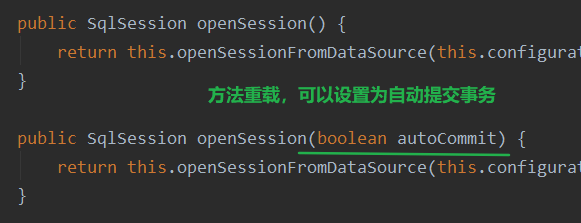

# 基于XML配置的动态SQL语句

>会用即可

## < if >

- 在接口中注明方法

```java
public interface IUserDao {
    //根据条件查询
    List<User> findUserByCondition(User user);
}
```

- 在IUserDao.xml配置文件中操作

```xml
<mapper namespace="com.kl.dao.IUserDao">
    <resultMap id="userMap" type="com.kl.domain.User">
        <!--主键字段的对应-->
        <id property="id" column="id"/>
        <!--非主键字段的对应-->
        <result property="userBirthday" column="birthday"/>
        <result property="sex" column="sex"/>
        <result property="address" column="address"/>
        <result property="username" column="username"/>
    </resultMap>

    <select id="findUserByCondition" resultMap="userMap" parameterType="com.kl.domain.User">
        select * from user where 1=1
        <if test="username != null"> <!-- if标签的使用 -->
            and username=#{username}
        </if>
        <if test="sex != null">
            and sex=#{sex}
        </if>
    </select>
</mapper>
```

- 测试

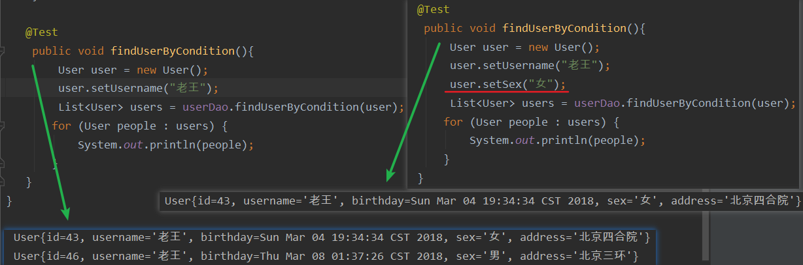

## < where >

- 下列两种做法的查询效果是一样的
- where标签去掉了一个用于为真的条件，使SQL语句更清晰更简洁

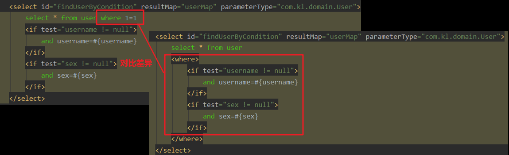

## < foreach >

- QueryVo类

```java
public class QueryVo {
    private User user;
    private List<Integer> ids;
    //getter / setter ......
}
```

- 在接口中注明方法

```java
public interface IUserDao {
    //根据queryVo中提供的ID集合查询用户信息
    List<User> findUserInIds(QueryVo queryVo);
}
```

- 在IUserDao.xml配置文件中操作

```xml
<select id="findUserInIds" resultMap="userMap" parameterType="com.kl.domain.User">
    select * from user
    <where>
        <if test="ids != null and ids.size()>0">
            <foreach collection="ids" open="and id in (" close=")" item="id" separator=",">
                #{id}
            </foreach>
        </if>
    </where>
</select>
```

- 测试

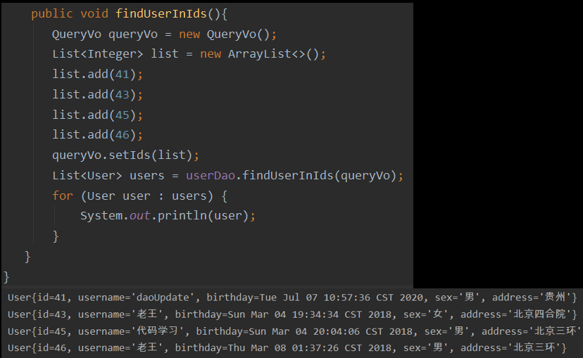

## < sql >

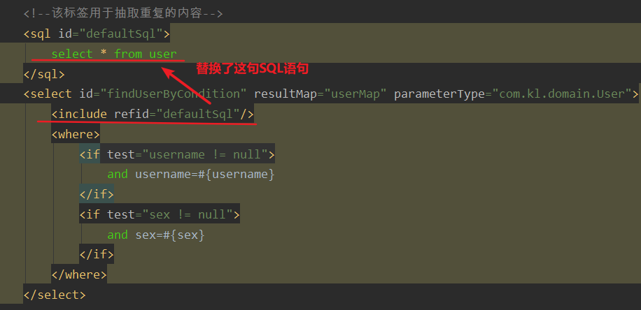

# 多表操作

>掌握应用

- mybatis中的多表查询：示例：用户和账户
  - 一个用户可以有多个账户
  - 一个账户只能属于一个用户（多个账户也可以属于同一个用户）
- 步骤如下：

1. 建立两张表：用户，账户表

>  - 让用户表和账户表之间具备一对多的关系：需要使用外键在账户表中添加

2. 建立两个实体类：用户实体类和账户实体类

>  - 让用户和账户的实体类能体现出啦一对多的关系

3. 建立两个配置文件

>  - 用户的配置文件账户的配置文件

4. 实现配置：

>  - 当我们查询用户时，可以同时得到用户下所包含的账户信息
>  - 当我们查询账户时，可以同时得到账户的所属用户信息

## 准备数据库表

- 账户表account

```mysql
DROP TABLE IF EXISTS `account`;

CREATE TABLE `account` (
  `ID` int(11) NOT NULL COMMENT '编号',
  `UID` int(11) default NULL COMMENT '用户编号',
  `MONEY` double default NULL COMMENT '金额',
  PRIMARY KEY  (`ID`),
  KEY `FK_Reference_8` (`UID`),
  CONSTRAINT `FK_Reference_8` FOREIGN KEY (`UID`) REFERENCES `user` (`id`)
) ENGINE=InnoDB DEFAULT CHARSET=utf8;


insert  into `account`(`ID`,`UID`,`MONEY`) values (1,46,1000),(2,45,1000),(3,46,2000);
```

## 一对一查询

- Account表的实体类

```java
public class Account implements Serializable {
    private Integer id;
    private Integer uid;
    private Double money;
    private User user;
    
    //getter/setter/toString方法......
}
```

- 账户接口

```java
public interface IAccountDao {
    //查询所有账户信息,同时还有获取当前账户所属的用户信息
    List<Account> findAll();
}
```

- IAccountDao.xml配置

```xml
<mapper namespace="com.kl.dao.IAccountDao">

    <!--定义封装Account和User的resultMap-->
    <resultMap id="AccountUserMap" type="com.kl.domain.Account">
        <id property="id" column="aid"/>
        <result property="uid" column="uid"/>
        <result property="money" column="money"/>

        <!--一对一的关系映射,配置封装user的内容-->
        <!--property="user"是account类中对应的User属性-->
        <association property="user" column="uid" javaType="com.kl.domain.User">
            <id property="id" column="id"/>
            <result property="username" column="username"/>
            <result property="address" column="address"/>
            <result property="sex" column="sex"/>
            <result property="birthday" column="birthday"/>
        </association>

    </resultMap>

    <!--查询所有数据-->
    <select id="findAll" resultMap="AccountUserMap">
      select u.*,a.id as aid,a.uid,a.money from  account a,user u where u.id = a.uid
     /* Select * from account a,user u where u.id = a.uid*/
    /* select a.*,u.username,u.address from account a ,user u where u.id = a.uid*/
    </select>
    
</mapper>
```

- 测试：一个账户只能对应一个人

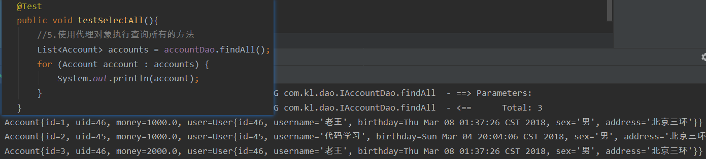

## 一对多

- 将上面Account表中的user属性删除
- 在User表中增加Account属性

```java
public class User implements Serializable {
    private Integer id;
    private String username;
    private Date birthday;
    private String sex;
    private String address;

    //一对多关系映射，主表实体应该包含从表实体的集合引用
    private List<Account> accounts;
    //...........
}
```

- IUserDao.xml配置文件

```xml
<mapper namespace="com.kl.dao.IUserDao">
    <!--定义user的resultMap-->
    <resultMap id="userAccountMap" type="com.kl.domain.User">
        <id property="id" column="id"/>
        <result property="username" column="username"/>
        <result property="sex" column="sex"/>
        <result property="birthday" column="birthday"/>
        <result property="address" column="address"/>
        
        <!--配置user对象中accounts对象集合-->
        <collection property="accounts" ofType="com.kl.domain.Account">
            <id property="id" column="aid"/> <!--查询语句中起了别名-->
            <result property="uid" column="uid"/>
            <result property="money" column="money"/>
        </collection>
    </resultMap>

    <!--查询所有数据-->
    <select id="findAll" resultMap="userAccountMap">
      select u.*,a.id as aid,uid,money from user u right outer join account a on u.id = a.uid;
    </select>

</mapper>
```

- 测试：一张人可以有多个账户

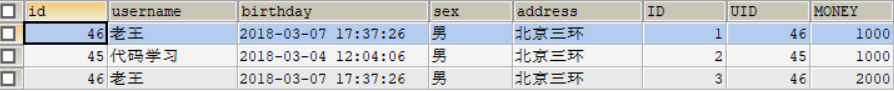

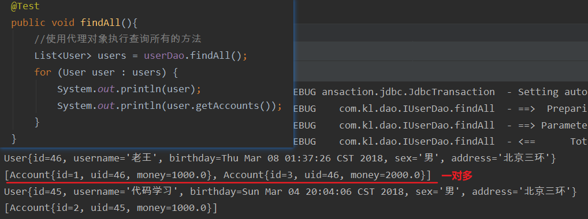

## 多对多

- 示例：用户和角色

>- 一个用户可以有多个角色
>- 一个角色可以赋予多个用户

- 步骤：

>1. 建立两张表：用户表，角色表:
>   - 让用户表和角色表具有多对多的关系。需要使用中间表，中间表中包含各自的主链在中间表中是外键
>2. 建立两个实体类：用户实体类和角色实体类让用户和角色的实体类能体现出来多对多的关系各自包含对方一个集合引用
>3. 建立两个配置文件：用户的配置文件角色的配置文件
>4. 实现配置：当我们查询用户时，可以同时得到用户所包含的角色信息当我们查询角色时，可以同时得到角色的所赋子的用户信息

---

- 查询角色同时获取用户的信息

```java
public interface IRoleDao {
    //查询所有角色同时获取用户信息
    List<Role> findAll();
}
```

- pojo类

```java
public class Role {
    private Integer roleId;
    private String roleName;
    private String roleDesc;
    //一个角色可以对应对个对象
    private List<User> users;
    
    //......
}
```

- IRoleDao.xml文件

```xml
<mapper namespace="com.kl.dao.IRoleDao">

    <!--定义role表的ResultMap-->
    <resultMap id="roleMap" type="com.kl.domain.Role">
        <id property="roleId" column="rid"/>
        <result property="roleName" column="role_name"/>
        <result property="roleDesc" column="role_desc"/>
        <collection property="users" ofType="user">
            <id column="id" property="id"/>
            <result column="username" property="username"/>
            <result column="address" property="address"/>
            <result column="sex" property="sex"/>
            <result column="birthday" property="birthday"/>
        </collection>
    </resultMap>

    <!--查询所有-->
    <select id="findAll" resultMap="roleMap">
       select u.*,r.id as rid,r.role_name,r.role_desc from role r
        left outer join user_role ur  on r.id = ur.rid
        left outer join user u on u.id = ur.uid
    </select>
</mapper>
```

- 测试：一个角色对应多个用户

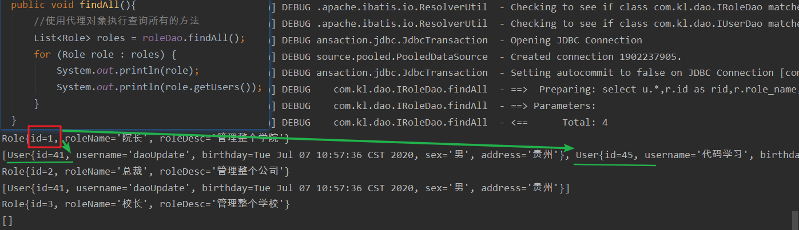

- 一个用户对应多个角色的逻辑是差不多的，只需要把SQL语句从左外连接改成右外连接即可


