# 一、延迟加载

-  问题：在一对多中，当我们有一个用户，它有100个账户

>- 在查询用户的时候，要不要把关联的账户查出来？
>- 在查询账户的时候，要不要把关联的用户查出来？

- 在查询用户时，用户下的账户信息应该是，什么时候使用，什么时候查询的
- 在查询账户时，账户的所属用户信息应该是随着账户查询时一起查询出来

---

- 什么是延迟加载：在真正使用数据时才发起查询，不用的时候不查询。按需加载（懒加载）
- 什么是立即加载：不管用不用，只要一调用方法，马上发起查询
- 在对应的四种表关系中：一对多，多对一，一对一，多对多

>- 一对多，多对多：通常情况下我们都是采用延迟加载
>- 多对一，一对一：通常情况下我们都是采用立即加载

---

## 1.1一对一关系中使用延迟加载

- 未启动延迟加载前：一个账户对应一个用户的情况

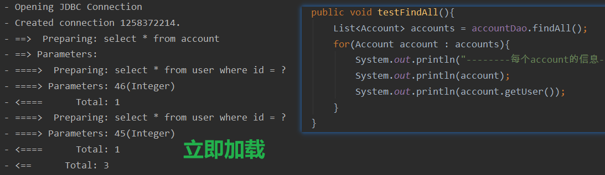

- 在SqlConfigMap.xml文件中配置，打开延迟加载的开关

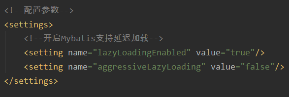

- 在IAccountDao.xml文件中进行配置

```xml
<?xml version="1.0" encoding="UTF-8"?>
<!DOCTYPE mapper
        PUBLIC "-//mybatis.org//DTD Mapper 3.0//EN"
        "http://mybatis.org/dtd/mybatis-3-mapper.dtd">
<mapper namespace="com.kl.dao.IAccountDao">

    <!-- 定义封装account和user的resultMap -->
    <resultMap id="accountUserMap" type="com.kl.domain.Account">
        <id property="id" column="id"/>
        <result property="uid" column="uid"/>
        <result property="money" column="money"/>
        <!-- 一对一的关系映射：配置封装user的内容
        select属性指定的内容：查询用户的唯一标识：
        column属性指定的内容：用户根据id查询时，所需要的参数的值
        -->
        <association property="user" column="uid" javaType="user"
                     select="com.kl.dao.IUserDao.findById"/>
    </resultMap>

    <!-- 查询所有 -->
    <select id="findAll" resultMap="accountUserMap">
        select * from account
    </select>

</mapper>
```

- 关键部分

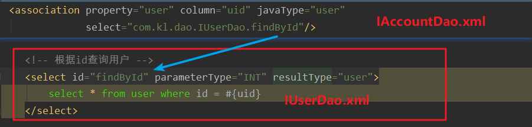

- 测试方法

```java
@Test
public void testFindAll(){
    List<Account> accounts = accountDao.findAll();
}
```

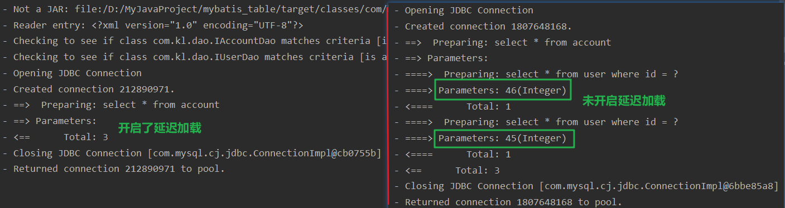

- 测试方法

```java
public void testFindAll(){
    List<Account> accounts = accountDao.findAll();
    for(Account account : accounts){
        System.out.println("--------每个account的信息------------");
        System.out.println(account);
        System.out.println(account.getUser());
    }
}
```

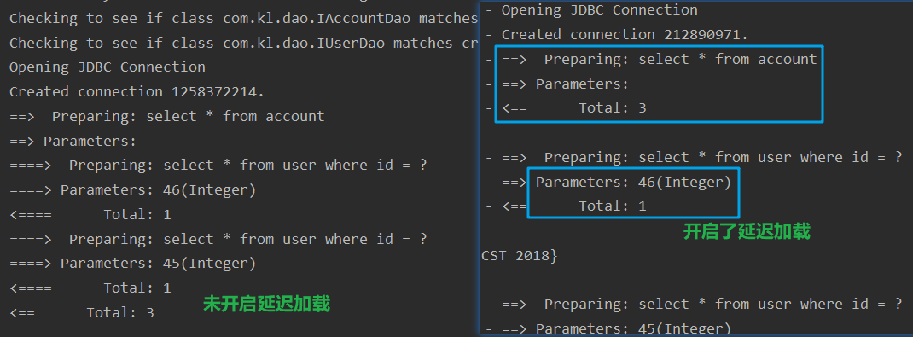

## 1.2一对多关系中使用延迟加载

- IUserDao.xml

```xml
<?xml version="1.0" encoding="UTF-8"?>
<!DOCTYPE mapper
        PUBLIC "-//mybatis.org//DTD Mapper 3.0//EN"
        "http://mybatis.org/dtd/mybatis-3-mapper.dtd">
<mapper namespace="com.kl.dao.IUserDao">
    <!-- 定义User的resultMap-->
    <resultMap id="userAccountMap" type="user">
        <id property="id" column="id"/>
        <result property="username" column="username"/>
        <result property="address" column="address"/>
        <result property="sex" column="sex"/>
        <result property="birthday" column="birthday"/>
        <!-- 配置user对象中accounts集合的映射 -->
        <collection property="accounts" ofType="account"
                    select="com.kl.dao.IAccountDao.findAccountByUid" column="id"/>
    </resultMap>

    <!-- 查询所有 -->
    <select id="findAll" resultMap="userAccountMap">
        select * from user
    </select>

    <!-- 根据id查询用户 -->
    <select id="findById" parameterType="INT" resultType="user">
        select * from user where id = #{uid}
    </select>

</mapper>
```

- 关键

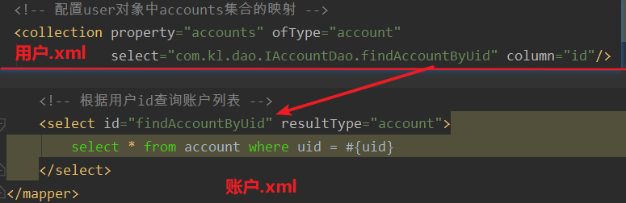

# 二、Mybatis中的缓存

- 什么是缓存：存在于内存中的临时数据
- 为什么使用缓存：减少和数据库的交互次数，提高执行效率
- 什么样的数据能使用缓存，什么样的数据不能使用：

>- 适用于缓存：经常查询并且不常改变的；数据的正确与否对最终结果影响不大的
>- 不适用于缓存：经常改变故数据；数据的正确与否对最终结果影响很大的
>  - 例如：商品的库存，银行的汇率，股市的牌价

---

## 2.1一级缓存

- 一级缓存：它指的是Mybatis中SqlSession对象的缓存

>- 当我们执行查询之后，查询的结果会同时存入到Sq1Session为我们提供一块区域中
>- 该区域的结构是一个Map.当我们再次查询同样的数据，mybatis会先去sqlsession中查询是否有，有的话直接拿出来用
>- 当SqlSession对象消失时，mybatis的一级缓存也就消失了

- 测试方法一：

```java
@Test
public void testFirstLevelCache(){
    User user1 = userDao.findById(41);
    System.out.println(user1);
    User user2 = userDao.findById(41);
    System.out.println(user2);
    System.out.println(user1 == user2);
}
```

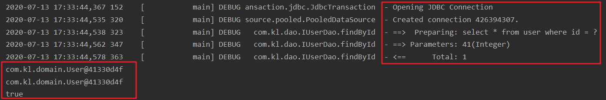

- 从输出结果中可以看出只查询了一次，并且两次查询的对象都是相同的
- 测试方法二：

```java
@Test
public void testFirstLevelCache(){
    User user1 = userDao.findById(41);
    //关闭sqlSession对象并重新创建
    sqlSession.close();
    sqlSession = factory.openSession();
    userDao = sqlSession.getMapper(IUserDao.class);
    User user2 = userDao.findById(41);
    System.out.println(user1);
    System.out.println(user2);
    System.out.println(user1 == user2);
}
```

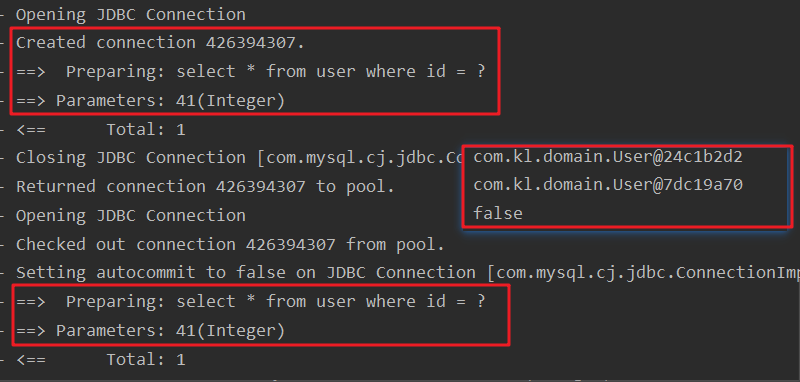

- 可以看出方法被执行了两次并且返回的是两个不同的对象
- 测试方法三

```java
@Test
public void testFirstLevelCache(){
    User user1 = userDao.findById(41);
    //可以清除缓存
    sqlSession.clearCache();
    User user2 = userDao.findById(41);
    System.out.println(user1);
    System.out.println(user2);
    System.out.println(user1 == user2);
}
```

## 2.2二级缓存

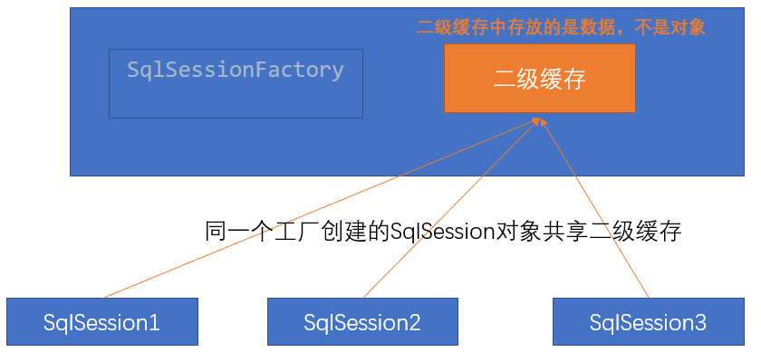

- 它指的是Mybatis中SqlSessionFactory对象的缓存。由同一个SqlSessionFactory对象创建的SqlSession共享其缓存
- 二级缓存的使用步骤：

>第一步：让Mybatis框架支持二级缓存（在SqIMapConfig.xml中配置）
>第二步：让当前的映射文件支持二级缓存（在IUserDao.xml中配置）
>第三步：让当前的操作支持二级缓存（在select标签中配置）

# 三、Mybatis中的注解开发

## 3.1环境搭建

0. pom.xml文件中导包

```xml
<?xml version="1.0" encoding="UTF-8"?>
<project xmlns="http://maven.apache.org/POM/4.0.0"
         xmlns:xsi="http://www.w3.org/2001/XMLSchema-instance"
         xsi:schemaLocation="http://maven.apache.org/POM/4.0.0 http://maven.apache.org/xsd/maven-4.0.0.xsd">
    <modelVersion>4.0.0</modelVersion>

    <groupId>org.example</groupId>
    <artifactId>annotation_mybatis</artifactId>
    <version>1.0-SNAPSHOT</version>
    <packaging>jar</packaging>
    <dependencies>
        <dependency>
            <groupId>org.mybatis</groupId>
            <artifactId>mybatis</artifactId>
            <version>3.5.5</version>
        </dependency>
        <dependency>
            <groupId>mysql</groupId>
            <artifactId>mysql-connector-java</artifactId>
            <version>5.1.6</version>
        </dependency>
        <dependency>
            <groupId>log4j</groupId>
            <artifactId>log4j</artifactId>
            <version>1.2.12</version>
        </dependency>
        <dependency>
            <groupId>junit</groupId>
            <artifactId>junit</artifactId>
            <version>4.10</version>
            <scope>test</scope>
        </dependency>
    </dependencies>

</project>
```

1. domain类

```java
public class User implements Serializable {
    private Integer id;
    private String username;
    private String sex;
    private String address;
    private Date birthday;
}
```

2. dao接口

```java
public interface IUserDao {
    @Select("select * from user")
    List<User> findAll();
}
```

3. 在resources目录下创建数据库配置文件jdbcConfig.properties

```properties
jdbc.driver=com.mysql.jdbc.Driver
jdbc.url=jdbc:mysql://localhost:3306/eesy_mybatis?serverTimezone=UTC
jdbc.username=root
jdbc.password=root
```

4. 在resources目录下导入日志文件log4j.properties(可选)

```properties
# Set root category priority to INFO and its only appender to CONSOLE.
#log4j.rootCategory=INFO, CONSOLE            debug   info   warn error fatal
log4j.rootCategory=debug, CONSOLE, LOGFILE

# Set the enterprise logger category to FATAL and its only appender to CONSOLE.
log4j.logger.org.apache.axis.enterprise=FATAL, CONSOLE

# CONSOLE is set to be a ConsoleAppender using a PatternLayout.
log4j.appender.CONSOLE=org.apache.log4j.ConsoleAppender
log4j.appender.CONSOLE.layout=org.apache.log4j.PatternLayout
log4j.appender.CONSOLE.layout.ConversionPattern=%d{ISO8601} %-6r [%15.15t] %-5p %30.30c %x - %m\n

# LOGFILE is set to be a File appender using a PatternLayout.
log4j.appender.LOGFILE=org.apache.log4j.FileAppender
log4j.appender.LOGFILE.File=d:\axis.log
log4j.appender.LOGFILE.Append=true
log4j.appender.LOGFILE.layout=org.apache.log4j.PatternLayout
log4j.appender.LOGFILE.layout.ConversionPattern=%d{ISO8601} %-6r [%15.15t] %-5p %30.30c %x - %m\n
```

5. 在resources目录下配置主配置文件SqlMapConfig.xml

```xml
<?xml version="1.0" encoding="UTF-8"?>
<!DOCTYPE configuration
        PUBLIC "-//mybatis.org//DTD Config 3.0//EN"
        "http://mybatis.org/dtd/mybatis-3-config.dtd">
<configuration>
    <!-- 引入外部配置文件-->
    <properties resource="jdbcConfig.properties"/>
    <!--配置别名-->
    <typeAliases>
        <package name="com.kl.domain"/>
    </typeAliases>
    <!-- 配置环境-->
    <environments default="mysql">
        <environment id="mysql">
            <transactionManager type="JDBC"/>
            <dataSource type="POOLED">
                <property name="driver" value="${jdbc.driver}"/>
                <property name="url" value="${jdbc.url}"/>
                <property name="username" value="${jdbc.username}"/>
                <property name="password" value="${jdbc.password}"/>
            </dataSource>
        </environment>
    </environments>
    <!-- 指定带有注解的dao接口所在位置 -->
    <mappers>
         <package name="com.kl.dao"/>
    </mappers>
</configuration>
```

6. 在test/java下搭建测试环境

```java
package com.kl.test;

import com.kl.dao.IUserDao;
import com.kl.domain.User;
import org.apache.ibatis.io.Resources;
import org.apache.ibatis.session.SqlSession;
import org.apache.ibatis.session.SqlSessionFactory;
import org.apache.ibatis.session.SqlSessionFactoryBuilder;
import org.junit.After;
import org.junit.Before;
import org.junit.Test;

import java.io.IOException;
import java.io.InputStream;
import java.util.List;

public class AnnotationTest {
    private IUserDao userDao;
    private InputStream in;
    private SqlSession sqlSession;

    @Before //测试方法执行前调用
    public void init() throws IOException {
        in = Resources.getResourceAsStream("SqlMapConfig.xml");
        SqlSessionFactory factory = new SqlSessionFactoryBuilder().build(in);
        sqlSession = factory.openSession();
        userDao = sqlSession.getMapper(IUserDao.class);
    }

    @After //测试方法执行后调用
    public void destroy(){
        if (in != null){
            try {
                in.close();
            } catch (IOException e) {
                e.printStackTrace();
            }
        }
        //提交事务
        sqlSession.commit();
        //关闭资源
        sqlSession.close();
    }

    @Test //编写自己想要测试的方法
    public void testFindAll(){
        List<User> users = userDao.findAll();
        for (User user : users) {
            System.out.println(user);
        }
    }
    
    //......其他方法的测试
}
```

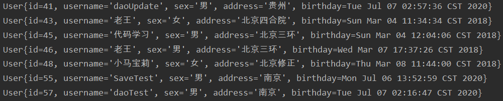

- 查询无误，搭建成功

## 3.2单表CRUD操作(代理Dao方式)

```java
package com.kl.dao;

import com.kl.domain.User;
import org.apache.ibatis.annotations.Delete;
import org.apache.ibatis.annotations.Insert;
import org.apache.ibatis.annotations.Select;
import org.apache.ibatis.annotations.Update;

import java.util.List;

public interface IUserDao {
    @Select("select * from user")
    List<User> findAll(); //查询所有

    @Insert("insert into user(username,address) values(#{username},#{address})")
    void saveUser(User user); //保存用户

    @Update("update user set sex=#{sex},birthday=#{birthday} where username=#{username}")
    void updateUser(User user); //更新用户信息

    @Delete("delete from user where username=#{username}")
    void deleteUserByName(String username); //根据用户名删除用户信息

    @Select("select * from user where username like '%${username}%' ")
    List<User> selectByName(String username); //模糊查询

    @Select("select * from user where username like #{username} ")
    List<User> selectByName2(String username); //模糊查询方式二
}
```

## 3.3处理属性与字段不匹配

- User类中的属性名称和数据库user表字段不匹配的情况

```java
public class User implements Serializable {
    private Integer userId;
    private String username;
    private String userSex;
    private String userAddress;
    private Date userBirthday;
    
    //......
}
```

- 直接查询的情况下

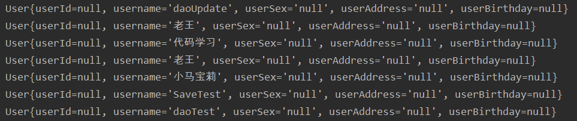

- 可以看到只有用户名能够查询出来，其他字段因为不配备所以注入失败
- 使用注解查询

```java
public interface IUserDao {
    @Select("select * from user")
    @Results(value = {
            @Result(id = true,property = "userId",column = "id"),
            @Result(property = "userSex",column = "sex"),
            @Result(property = "userAddress",column = "address"),
            @Result(property = "userBirthday",column = "birthday")
    })
    List<User> findAll();
}
```

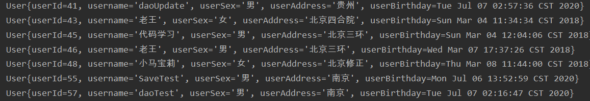

---

- 问题：如果有多个查询方法，那么需要我们每次都在方法上写这么一大段属性和字段对应的注解吗？
- 解决：给@Results注解中加上id属性，其他注解需要使用时引用该注解即可

```java
public interface IUserDao {
    @Select("select * from user")
    @Results(id = "userMap",value = {
        @Result(id = true,property = "userId",column = "id"),
        @Result(property = "userSex",column = "sex"),
        @Result(property = "userAddress",column = "address"),
        @Result(property = "userBirthday",column = "birthday")
    })
    List<User> findAll();


    @Select("select * from user where username like '%${username}%' ")
    @ResultMap(value = {"userMap"})           //引用注解方式一
    List<User> selectByName(String username); //模糊查询

    @Select("select * from user where username like #{username} ")
    @ResultMap("userMap")                      //引用注解方式二
    List<User> selectByName2(String username); //模糊查询方式二
}
```

## 3.4多表查询

### 3.4.1一对一

>一个账户类对应一个用户类，这就是一对一的关系

- 账户类

```java
public class Account implements Serializable {
    private Integer id;
    private Integer uid;
    private Double money;
    private User user;
    
    //......
}
```

- 账户DAO接口

```java
public interface IAccountDao {

    @Select("select * from account")
    List<Account> findAll();
}
```

- 这样直接在测试方法中测试查询时user为null

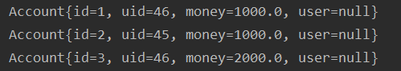

- 解决：需要找user的对应关系

```java
public interface IAccountDao {

    @Select("select * from account")
    @Results(id = "accountMap",value = {
            @Result(id = true,column = "id",property = "id"),
            @Result(column = "uid",property = "uid"),
            @Result(column = "money",property = "money"),
            @Result(property = "user",column = "uid",one=@One(select = "com.kl.dao.IUserDao.findById",fetchType = FetchType.LAZY))
    })
    List<Account> findAll();
}
```

- 第5,6,7行代码可以省略的，因为这里的Account类属性和account表中的字段完全对应
- 再次查询，可得到user的打印结果

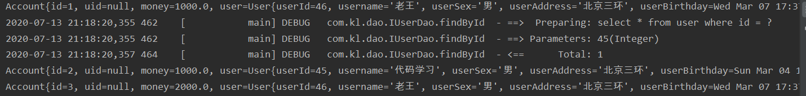

- 小细节说明：

```java
@Result(property = "user",column = "uid",one=@One(select = "com.kl.dao.IUserDao.findById",fetchType = FetchType.LAZY))

// property      ---是Account中对应的user属性
// column        ---是select * from account查询完需要用到的"结果表"中字段
// one=@One      ---表示一对一的关系注解
// select        ---当我们得到account表中的uid后,因为account.uid=user.id,可以将这个uid传递到IUserDao中能够根据id查询用户的方法里,就可以查询到相关的用户信息
// fetchType     ---表示加载类 设置为FetchType.LAZY表示懒加载
```

- 用户Dao

```java
public interface IUserDao {
    //...
    
    //虽然原表中的是userId,但由于我们在ResultMap注解中指定了userId映射为id,所以这里填id或userId都可用
    @Select("select * from user where id = #{id}") 
    @ResultMap("userMap")
    User findById(Integer id);
    //...
}
```

### 3.4.2一对多

>一个用户可以有多个账户，这就是一对多的关系

- 用户类

```java
public class User implements Serializable {
    private Integer userId;
    private String username;
    private String userSex;
    private String userAddress;
    private Date userBirthday;

    //一个用户可以有多个账户
    private List<Account> accounts;
}
```

- 添加映射关系

```java
public interface IUserDao {
    @Select("select * from user")
    @Results(id = "userMap",value = {
            @Result(id = true,property = "userId",column = "id"),
            @Result(property = "userSex",column = "sex"),
            @Result(property = "userAddress",column = "address"),
            @Result(property = "userBirthday",column = "birthday"),
            @Result(property = "accounts",column = "id",many = @Many(select = "com.kl.dao.IAccountDao.findByUid",fetchType = FetchType.LAZY))
    })
    List<User> findAll();
}
```

- 调用方法测试：可以看到有账户的实体类的账户信息都被查出来了

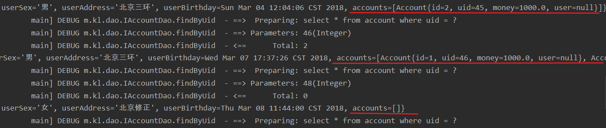

- 小细节分析

```java
@Result(property = "accounts",column = "id",many = @Many(select = "com.kl.dao.IAccountDao.findByUid",fetchType = FetchType.LAZY))

// property      --- 是User中对应的List<Account> account属性
// column        --- 是select * from user查询完需要用到的"结果表"中字段
// many = @Many  --- 表示一对多的关系注解
// select        --- 当我们得到user表中的id后,因为account.uid=user.id,可以将这个id传递到IAccountDao中能够根据id查询账户的方法里,就可以查询到相关的用户信息
// fetchType     --- 表示加载类 设置为FetchType.LAZY表示懒加载
```

- 账户Dao

```java
public interface IAccountDao {
    //...

    @Select("select * from account where uid = #{uid}")
    Account findByUid(Integer uid);

    //...
}
```

## 3.5缓存的配置

```java
package com.kl.test;

import com.kl.dao.IAccountDao;
import com.kl.dao.IUserDao;
import com.kl.domain.User;
import org.apache.ibatis.io.Resources;
import org.apache.ibatis.session.SqlSession;
import org.apache.ibatis.session.SqlSessionFactory;
import org.apache.ibatis.session.SqlSessionFactoryBuilder;
import org.junit.After;
import org.junit.Before;
import org.junit.Test;

import java.io.IOException;
import java.io.InputStream;

public class SecondLevelCacheTest {
    private IUserDao userDao;
    private InputStream in;
    private SqlSession sqlSession;
    private SqlSessionFactory factory;

    @Before //测试方法执行前调用
    public void init() throws IOException {
        in = Resources.getResourceAsStream("SqlMapConfig.xml");
        factory = new SqlSessionFactoryBuilder().build(in);
        sqlSession = factory.openSession();
        userDao = sqlSession.getMapper(IUserDao.class);
    }

    @After //测试方法执行后调用
    public void destroy() throws IOException {
        //提交事务
        sqlSession.commit();
        //关闭资源
        sqlSession.close();
        in.close();;
    }

    @Test
    public void findOne(){
        User user1 = userDao.findById(43);
        User user2 = userDao.findById(43);
        System.out.println(user1);
        System.out.println(user2);
        System.out.println(user1 == user2);
    }
}
```

- 根据测试方法可看到一级缓存效果

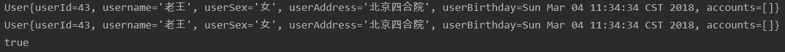

- 修改测试类

```java
@Test
public void findOne(){
    SqlSession sqlSession1 = factory.openSession();
    IUserDao userDao1 = sqlSession.getMapper(IUserDao.class);
    User user1 = userDao1.findById(43);
    sqlSession1.close(); //释放一级缓存
    SqlSession sqlSession2 = factory.openSession(); //打开一个新的sqlSession
    IUserDao userDao2 = sqlSession2.getMapper(IUserDao.class);
    User user2 = userDao2.findById(43);
    System.out.println(user1);
    System.out.println(user2);
    System.out.println(user1 == user2);
    sqlSession1.close();
    sqlSession2.close();
}
```

- 并没有看到二级缓存的效果：还是查询了两次

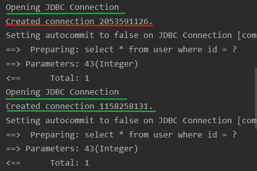

- 原因：没有打开二级缓存的开关

---

1. 在SqlMapConfig.xml全局配置文件中打开二级缓存

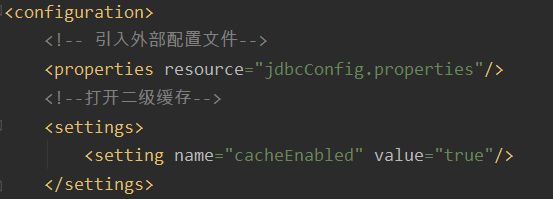

2. 在IUserDao接口上方加上打开二级缓存的注解

```java
@CacheNamespace(blocking = true)
public interface IUserDao {
    //...
}
```

3. 再次调用测试方法

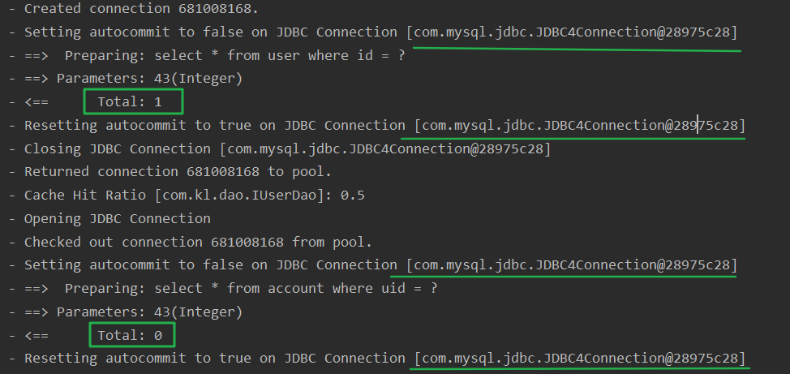