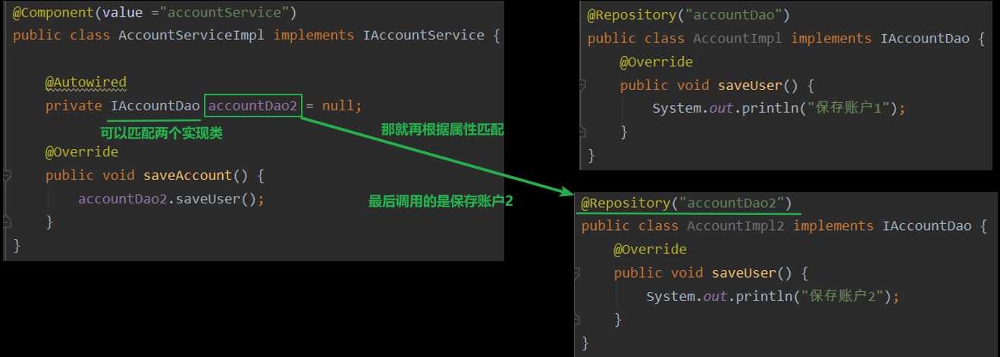
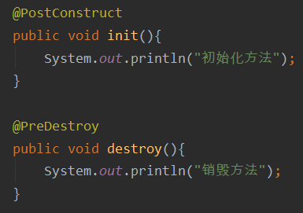
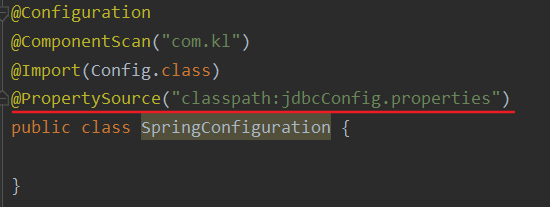

# 一、spring中IOC的常用注解

>- 学习基于注解的Ioc配置，大家脑海里首先得有一个认知，即注解配置和xml配置要实现的功能都是一样的，都是要降低程序间的耦合。只是配置的形式不一样
>- 关于实际的开发中到底使用xml还是注解，每家公司有着不同的使用习惯。所以这两种配置方式我们都需要掌握

## 1.1创建对象的注解使用

- 用于创建对象的注解： @Component

>- 他们的作用就和在XML配置文件中编写一个< bean >标签实现的功能是一样的
>- 作用：用于把当前类对象存入spring容器中
>- 属性value：用于指定bean的id,当我们不写时，它的默认值是当前类名，且首字母改小写

---

- 修改bean.xml

```xml
<?xml version="1.0" encoding="UTF-8"?>
<beans xmlns="http://www.springframework.org/schema/beans"
       xmlns:xsi="http://www.w3.org/2001/XMLSchema-instance"
       xmlns:context="http://www.springframework.org/schema/context"
       xsi:schemaLocation="http://www.springframework.org/schema/beans
        http://www.springframework.org/schema/beans/spring-beans.xsd
        http://www.springframework.org/schema/context
        http://www.springframework.org/schema/context/spring-context.xsd">

    <!--告知spring在创建容器时要扫描的包，配置所需要的标签不是在beans的约束中，而是一个名称为
    context名称空间和约束中-->
    <context:component-scan base-package="com.kl"/>
</beans>
```

* AccountServiceImpl类

```java
package com.kl.service.impl;
import com.kl.service.IAccountService;
import org.springframework.stereotype.Component;

@Component(value ="accountService") //value中只有一个值时value可以省略不写
public class AccountServiceImpl implements IAccountService {
    public AccountServiceImpl(){
        System.out.println("对象被创建");
    }
    @Override
    public void saveAccount() {
        System.out.println("执行save");
    }
}
```

- 测试代码

```java
public class Client {
    public static void main(String[] args) {
        //1.获取核心容器对象
        ApplicationContext ac = new ClassPathXmlApplicationContext("bean.xml");
        //2.根据id获取bean对象
        IAccountService service = (IAccountService) ac.getBean("accountService");
        service.saveAccount();
    }
}
```


---

## 1.2其他对象注解

- 还有其它三个注解：他们的作用和属性与Component是一模一样

>- Controller：一般用在表现层
>- Service：一般用在业务层
>- Repository：一般用在持久层

- 上面三个是spring框架为我们提供明确的三层使用的注解，使我们的三层对象更加清晰
- 如果要注解的类都不是三层之一就使用Component注解，当然，他们的效果都是一样的，只是为了代码更具可读性和逻辑性

---

## 1.3注入数据的注解使用

### 1.3.1@Autowired

- 作用：

>- 自动按照类型注入。只要容器中有唯一的一个bean对象类型和要注入的变量类型匹配，就可以注入成功
>- 如果Ioc容器中没有任何bean的类型和要注入的变量类型匹配，则报错

 *                出现位置：可以是变量上，也可以是方法上
 *                细节：在使用注解注入时，set方法就不是必须的了

---

- 一个对象匹配时


- 如果Ioc容器中有多个类型匹配时：根据属性名去找是否有bean对象，若发现有多个bean对象，则判断属性名是否和bean的id能够对应，若有对应的则可注入成功，否则失败



### 1.3.2@Qualifier

- 作用：在按照类中注入的基础之上再按照名称注入。它在给类成员注入时不能单独使用。但是在给方法参数注入时可以
- 属性：value：用于指定注入bean的id
- 必须和@Autowired搭配使用


### 1.3.3@Resource

- 作用：直接按照bean的id注入。它可以独立使用
- 属性name：用于指定bean的id


- 注意：这个@Resource注解在jdk11版本上就没有了，需要在pom.xml中导入依赖包

```xml
<dependency>
    <groupId>javax.annotation</groupId>
    <artifactId>javax.annotation-api</artifactId>
    <version>1.3.2</version>
</dependency>
```

### 1.3.4小结

- 以上三个注入都只能注入其他bean类型的数据，而基本类型和String类型无法使用上述注解实现
- 另外，集合类型的注入只能通过XML来实现

### 1.3.5@Value

- 作用：用于注入基本类型和String类型的数据
- 属性value：用于指定数据的值。它可以使用spring中SpEL(也就是spring的el表达式）
  - SpEL的写法：${表达式}

### 1.3.6@Scope

- 作用：用于指定bean的作用范围
- 属性value：指定范围的取值
  - 常用取值：singleton 和 prototype

---

- 测试方法

```java
public class Client {
    public static void main(String[] args) {
        //1.获取核心容器对象
        ApplicationContext ac = new ClassPathXmlApplicationContext("bean.xml");
        //2.根据id获取bean对象
        IAccountService service1 = (IAccountService) ac.getBean("accountService");
        IAccountService service2 = (IAccountService) ac.getBean("accountService");
        service1.saveAccount();
        System.out.println(service1 == service2);
    }
}
```

- 默认为单例输出为true
- 设置为多例输出为false


### 1.3.7生命周期相关

- 和生命周期相关(了解)：他们的作用就和在bean标签中使用init-method和destroy-methode的作用是一样的

- PostConstruct：用于指定初始化方法
- PreDestroy：用于指定销毁方法



# 二、基于xml的IOC案例

1. 在pomxml中导入所需坐标

```xml
<?xml version="1.0" encoding="UTF-8"?>
<project xmlns="http://maven.apache.org/POM/4.0.0"
         xmlns:xsi="http://www.w3.org/2001/XMLSchema-instance"
         xsi:schemaLocation="http://maven.apache.org/POM/4.0.0 http://maven.apache.org/xsd/maven-4.0.0.xsd">
    <modelVersion>4.0.0</modelVersion>

    <groupId>org.example</groupId>
    <artifactId>xml_ioc</artifactId>
    <version>1.0-SNAPSHOT</version>
    <build>
        <plugins>
            <plugin>
                <groupId>org.apache.maven.plugins</groupId>
                <artifactId>maven-compiler-plugin</artifactId>
                <configuration>
                    <source>6</source>
                    <target>6</target>
                </configuration>
            </plugin>
        </plugins>
    </build>

    <!--打包方式-->
    <packaging>jar</packaging>
    <dependencies>
        <!--spring框架-->
        <dependency>
            <groupId>org.springframework</groupId>
            <artifactId>spring-context</artifactId>
            <version>5.0.2.RELEASE</version>
        </dependency>
        <!--spring测试框架-->
        <dependency>
            <groupId>org.springframework</groupId>
            <artifactId>spring-test</artifactId>
            <version>5.0.2.RELEASE</version>
        </dependency>
        <!--德鲁伊数据库工具包-->
        <dependency>
            <groupId>commons-dbutils</groupId>
            <artifactId>commons-dbutils</artifactId>
            <version>1.4</version>
        </dependency>
        <!--数据库驱动-->
        <dependency>
            <groupId>mysql</groupId>
            <artifactId>mysql-connector-java</artifactId>
            <version>5.1.6</version>
        </dependency>
        <!--数据库连接池-->
        <dependency>
            <groupId>c3p0</groupId>
            <artifactId>c3p0</artifactId>
            <version>0.9.1.2</version>
        </dependency>
        <!--单元测试包-->
        <dependency>
            <groupId>junit</groupId>
            <artifactId>junit</artifactId>
            <version>4.12</version>
        </dependency>
    </dependencies>
</project>
```

2. 业务层

```java
public interface IAccountService {

    //查询所有账户信息
    List<Account> findAllAccount();

    //查询一个账户信息
    Account findAccountById(Integer id);

    //保存账户信息
    void saveAccount(Account account);

    //更新账户信息
    void updateAccount(Account account);

    //删除账户信息
    void deleteAccountById(Integer id);

}
```

- 实现

```java
package com.kl.service.impl;

import com.kl.dao.IAccountDao;
import com.kl.domain.Account;
import com.kl.service.IAccountService;

import java.util.List;

public class AccountServiceImpl implements IAccountService {
    IAccountDao accountDao;

    public void setAccountDao(IAccountDao accountDao) {
        this.accountDao = accountDao;
    }

    public List<Account> findAllAccount() {
        return accountDao.findAllAccount();
    }

    public Account findAccountById(Integer id) {
        return accountDao.findAccountById(id);
    }

    public void saveAccount(Account account) {
        accountDao.saveAccount(account);
    }

    public void updateAccount(Account account) {
        accountDao.updateAccount(account);
    }

    public void deleteAccountById(Integer id) {
        accountDao.deleteAccountById(id);
    }
}
```

---

- Dao持久层

```java
public interface IAccountDao {

    //查询所有账户信息
    List<Account> findAllAccount();

    //查询一个账户信息
    Account findAccountById(Integer id);

    //保存账户信息
    void saveAccount(Account account);

    //更新账户信息
    void updateAccount(Account account);

    //删除账户信息
    void deleteAccountById(Integer id);

}
```

- 实现

```java
package com.kl.dao.impl;

import com.kl.dao.IAccountDao;
import com.kl.domain.Account;
import org.apache.commons.dbutils.QueryRunner;
import org.apache.commons.dbutils.handlers.BeanHandler;
import org.apache.commons.dbutils.handlers.BeanListHandler;

import java.sql.SQLException;
import java.util.List;

public class AccountDaoImpl implements IAccountDao {
    private QueryRunner runner;

    public void setRunner(QueryRunner runner) {
        this.runner = runner;
    }

    @Override
    public List<Account> findAllAccount() {
        try {
            return runner.query("select * from account",new BeanListHandler<>(Account.class));
        } catch (SQLException e) {
           throw new RuntimeException();
        }
    }

    @Override
    public Account findAccountById(Integer id) {
        try {
            return runner.query("select * from account where id = ?",new BeanHandler<Account>(Account.class),id);
        } catch (SQLException e) {
            throw new RuntimeException();
        }
    }

    @Override
    public void saveAccount(Account account) {
        try {
            runner.update("insert into account(name,money) values(?,?)",account.getName(),account.getMoney());
        } catch (SQLException e) {
            throw new RuntimeException();
        }
    }

    @Override
    public void updateAccount(Account account) {
        try {
            runner.update("update account set name = ?,money = ? where id = ?",
                    account.getName(),account.getMoney(),account.getId());
        } catch (SQLException e) {
            throw new RuntimeException();
        }
    }

    @Override
    public void deleteAccountById(Integer id) {
        try {
           runner.update("delete from account where id = ?",id);
        } catch (SQLException e) {
            throw new RuntimeException();
        }
    }
}
```

---

- 在bean.xml文件中注入对象

```xml
<?xml version="1.0" encoding="UTF-8"?>
<beans xmlns="http://www.springframework.org/schema/beans"
       xmlns:xsi="http://www.w3.org/2001/XMLSchema-instance"
       xsi:schemaLocation="http://www.springframework.org/schema/beans http://www.springframework.org/schema/beans/spring-beans.xsd">

    <!--配置账户service-->
    <bean id="accountService" class="com.kl.service.impl.AccountServiceImpl">
        <!--注入账户dao-->
        <property name="accountDao" ref="accountDao"/>
    </bean>

    <!--配置账户dao-->
    <bean id="accountDao" class="com.kl.dao.impl.AccountDaoImpl">
        <!--注入SQL语句执行对象-->
        <property name="runner" ref="runner"/>
    </bean>

    <!--配置SQL语句执行对象-->
    <bean id="runner" class="org.apache.commons.dbutils.QueryRunner" scope="prototype">
        <!--注入数据源-->
        <constructor-arg name="ds" ref="dataSource"/>
    </bean>

    <!--配置数据源-->
    <bean id="dataSource" class="com.mchange.v2.c3p0.ComboPooledDataSource">
        <!--注入数据库必备信息-->
        <property name="driverClass" value="com.mysql.jdbc.Driver"/>
        <property name="jdbcUrl" value="jdbc:mysql://localhost:3306/eesy?serverTimezone=UTC"/>
        <property name="user" value="root"/>
        <property name="password" value="root"/>
    </bean>
</beans>
```

- 测试

```java
package com.kl;

import com.kl.domain.Account;
import com.kl.service.IAccountService;
import com.kl.service.impl.AccountServiceImpl;
import org.junit.Before;
import org.junit.Test;
import org.springframework.context.ApplicationContext;
import org.springframework.context.support.ClassPathXmlApplicationContext;

import java.util.List;

public class AccountTest {
    private IAccountService service;

    @Before
    public void init(){
        //1.获取容器
        ApplicationContext container = new ClassPathXmlApplicationContext("bean.xml");
        //2.得到业务层对象
        service = container.getBean("accountService",AccountServiceImpl.class);
    }

    @Test
    public void testFindAll(){
        List<Account> allAccount = service.findAllAccount();
        for (Account account : allAccount) {
            System.out.println(account);
        }
    }
    @Test
    public void testFindOne(){
        Account account = service.findAccountById(1);
        System.out.println(account);
    }

    @Test
    public void testSave(){
        Account account = new Account();
        account.setName("麻子");
        account.setMoney(2000.0f);
        service.saveAccount(account);
    }

    @Test
    public void testUpdate(){
        Account account = new Account();
        account.setId(1);
        account.setName("张三");
        account.setMoney(1500.0f);
        service.updateAccount(account);
    }

    @Test
    public void testDelete(){
        service.deleteAccountById(4);
    }
}
```

# 三、注解IOC案例

## 3.1@Repository和@Service

- 改造基于注解的ioc案例，使用纯注解的方式实现spring，和一些新注解使用
- 修改bean.xml

```xml
<?xml version="1.0" encoding="UTF-8"?>
<beans xmlns="http://www.springframework.org/schema/beans"
       xmlns:xsi="http://www.w3.org/2001/XMLSchema-instance"
       xmlns:context="http://www.springframework.org/schema/context"
       xsi:schemaLocation="http://www.springframework.org/schema/beans
        http://www.springframework.org/schema/beans/spring-beans.xsd
        http://www.springframework.org/schema/context
        http://www.springframework.org/schema/context/spring-context.xsd">

    <!-- 告知spring在创建容器时要扫描的包 -->
    <context:component-scan base-package="com.kl"/>

    <!--配置SQL语句执行对象-->
    <bean id="runner" class="org.apache.commons.dbutils.QueryRunner" scope="prototype">
        <!--注入数据源-->
        <constructor-arg name="ds" ref="dataSource"/>
    </bean>

    <!--配置数据源-->
    <bean id="dataSource" class="com.mchange.v2.c3p0.ComboPooledDataSource">
        <!--注入数据库必备信息-->
        <property name="driverClass" value="com.mysql.jdbc.Driver"/>
        <property name="jdbcUrl" value="jdbc:mysql://localhost:3306/eesy?serverTimezone=UTC"/>
        <property name="user" value="root"/>
        <property name="password" value="root"/>
    </bean>
</beans>
```

- 给接口实现类和类中的属性加上注解

```java
@Repository("accountDao")
public class AccountDaoImpl implements IAccountDao {
    @Autowired
    private QueryRunner runner;
    //...........
}
```

---

```java
@Service("accountService")
public class AccountServiceImpl implements IAccountService {
    @Autowired
    IAccountDao accountDao;
    //...........
}
```

## 3.2@Configuration、@ComponentScan和@Bean

- **解决在注解下依然需要xml文件的问题**

- 将bean.xml替换为配置类，可直接删除该xml文件了

```xml
<?xml version="1.0" encoding="UTF-8"?>
<beans xmlns="http://www.springframework.org/schema/beans"
       xmlns:xsi="http://www.w3.org/2001/XMLSchema-instance"
       xmlns:context="http://www.springframework.org/schema/context"
       xsi:schemaLocation="http://www.springframework.org/schema/beans
        http://www.springframework.org/schema/beans/spring-beans.xsd
        http://www.springframework.org/schema/context
        http://www.springframework.org/schema/context/spring-context.xsd">

    <!-- 告知spring在创建容器时要扫描的包 -->
    <context:component-scan base-package="com.kl"/>

    <!--配置SQL语句执行对象-->
    <bean id="runner" class="org.apache.commons.dbutils.QueryRunner" scope="prototype">
        <!--注入数据源-->
        <constructor-arg name="ds" ref="dataSource"/>
    </bean>

    <!--配置数据源-->
    <bean id="dataSource" class="com.mchange.v2.c3p0.ComboPooledDataSource">
        <!--注入数据库必备信息-->
        <property name="driverClass" value="com.mysql.jdbc.Driver"/>
        <property name="jdbcUrl" value="jdbc:mysql://localhost:3306/eesy?serverTimezone=UTC"/>
        <property name="user" value="root"/>
        <property name="password" value="root"/>
    </bean>
</beans>
```

- 取代bean.xml的配置类
- 该类是一个配置类，它的作用和bean.xml是一样的
- spring中的新注解：@Configuration

>- 作用：指定当前类是一个配置类
>- 细节：当配置类作为AnnotationConfig或ApplicationContext对象创建的参数时，该注解可以不写

- @ComponentScan

>- 作用：用于通过注解指定spring在创建容器时要扫描的包
>- value：它和basePackages的作用是一样的，都是用于指定创建容器时要扫描的包
>- 我们使用此注解就等同于在xml中配置了:< context:component-scan base-package="com.kl" />

- @Bean

>- 作用：用于把当前方法的返回值作为bean对象存入spring的ioc容器中
>- name:用于指定bean的id。当不写时，默认值是当前方法的名称
>- 当我们使用注解配置方法时，如果方法有参数，spring框架会去容器中查找有没有可用的bean对象
>- 查找的方式和Autowired注解的作用是一样的

---

- 因为不能在QueryRunner类上直接添加注解，所以只能把它放在一个配置类里进行配置

```java
package com.kl.config;

import com.mchange.v2.c3p0.ComboPooledDataSource;
import org.apache.commons.dbutils.QueryRunner;
import org.springframework.context.annotation.Bean;
import org.springframework.context.annotation.ComponentScan;
import org.springframework.context.annotation.Configuration;
import org.springframework.context.annotation.Scope;

import javax.sql.DataSource;
import java.beans.PropertyVetoException;

@Configuration
@ComponentScan("com.kl")
public class SpringConfiguration {

    @Bean(name = "runner")
    @Scope("prototype") //设置为多例模式
    public QueryRunner createQueryRunner(DataSource source){
        return new QueryRunner(source);
    }

    @Bean(name = "dataSource")
    public DataSource createDataSource(){
        try {
            ComboPooledDataSource dataSource = new ComboPooledDataSource();
            dataSource.setDriverClass("com.mysql.jdbc.Driver");
            dataSource.setJdbcUrl("jdbc:mysql://localhost:3306/eesy?serverTimezone=UTC");
            dataSource.setUser("root");
            dataSource.setPassword("root");
            return dataSource;
        } catch (PropertyVetoException e) {
            throw new RuntimeException();
        }
    }
}
```

- 修改使用bean.xml获取容器的地方：直接加载配置类

```java
//1.获取容器
ApplicationContext container = new AnnotationConfigApplicationContext(SpringConfiguration.class);
```

## 3.3@Import

- 在注解类中导入其他子注解配置

```java
@Configuration
@ComponentScan("com.kl")
@Import(Config.class) //导入其他子配置
public class SpringConfiguration {

}
```


## 3.4@PropertySource

- 作用：用于指定properties文件的位置
- 属性value：指定文件的名称和路径
- 关键字：classpath，表示类路径下

---

- 使用原因，将下列这种设置方式抽取出来放到jdbcConfig.properties配置文件中

```java
 public DataSource createDataSource(){
        try {
            ComboPooledDataSource dataSource = new ComboPooledDataSource();
            dataSource.setDriverClass("com.mysql.jdbc.Driver");
            dataSource.setJdbcUrl("jdbc:mysql://localhost:3306/eesy?serverTimezone=UTC");
            dataSource.setUser("root");
            dataSource.setPassword("root");
            return dataSource;
        } catch (PropertyVetoException e) {
            throw new RuntimeException();
        }
    }
```

- jdbcConfig.properties

```properties
jdbc.driver=com.mysql.jdbc.Driver
jdbc.url=jdbc:mysql://localhost:3306/eesy?serverTimezone=UTC
jdbc.user=root
jdbc.password=root
```

- Config配置类

```java
public class Config {
    @Value("${jdbc.driver}")
    private String driver;
    @Value("${jdbc.url}")
    private String jdbcUrl;
    @Value("${jdbc.user}")
    private String user;
    @Value("${jdbc.password}")
    private String password;

    @Bean(name = "runner")
    @Scope("prototype") //设置为多例模式
    public QueryRunner createQueryRunner(DataSource source){
        return new QueryRunner(source);
    }

    @Bean(name = "dataSource")
    public DataSource createDataSource(){
        try {
            ComboPooledDataSource dataSource = new ComboPooledDataSource();
            dataSource.setDriverClass(driver);
            dataSource.setJdbcUrl(jdbcUrl);
            dataSource.setUser(user);
            dataSource.setPassword(password);
            return dataSource;
        } catch (PropertyVetoException e) {
            throw new RuntimeException();
        }
    }
}
```

- 使用@PropertySource注解指定properties文件的位置




## 3.5@Qualifier

- 解决一个对象有多个实现类的情况
- 在方法参数中进行注解，可独立使用
- @Qualifier("ds2")指定使用id位ds2的bean作为实现类注入

```java
public class Config {
    @Value("${jdbc.driver}")
    private String driver;
    @Value("${jdbc.url}")
    private String jdbcUrl;
    @Value("${jdbc.user}")
    private String user;
    @Value("${jdbc.password}")
    private String password;

    @Bean(name = "runner")
    @Scope("prototype") //设置为多例模式
    public QueryRunner createQueryRunner(@Qualifier("ds2") DataSource source){
        return new QueryRunner(source);
    }

    @Bean(name = "ds1")
    public DataSource createDataSource(){
        try {
            ComboPooledDataSource dataSource = new ComboPooledDataSource();
            dataSource.setDriverClass(driver);
            dataSource.setJdbcUrl(jdbcUrl);
            dataSource.setUser(user);
            dataSource.setPassword(password);
            return dataSource;
        } catch (PropertyVetoException e) {
            throw new RuntimeException();
        }
    }
    @Bean(name = "ds2")
    public DataSource createDataSource2(){
        try {
            ComboPooledDataSource dataSource = new ComboPooledDataSource();
            dataSource.setDriverClass(driver);
            dataSource.setJdbcUrl("jdbc:mysql://localhost:3306/db3?serverTimezone=UTC");
            dataSource.setUser(user);
            dataSource.setPassword(password);
            return dataSource;
        } catch (PropertyVetoException e) {
            throw new RuntimeException();
        }
    }
}
```

# 四、spring和Junit整合 

- 应用程序的入口：main方法
- junit单元测试中，没有main方法也能执行

>- junit集成了一个main方法
>- 该方法就会判断当前测试类中哪些方法有@Test注解
>- junit就让有@Test注解的方法执行

- junit不会管我们是否采用spring框架
  - 在执行测试方法时，junit根本不知道我们是不是使用了spring框架所以也就不会为我们读取配置文件/配置类创建spring核心容器
- 由以上三点可知：当测试方法执行时，没有Ioc容器，就算写了Autowired注解，也无法实现注入

```java
/**
 * 使用Junit单元测试：测试我们的配置
 * Spring整合junit的配置
 *   1、导入spring整合junit的jar(坐标)
 *   2、使用Junit提供的一个注解把原有的main方法替换了，替换成spring提供的
 *         @Runwith
 *   3、告知spring的运行器，spring和ioc创建是基于xml还是注解的，并且说明位置
 *         @ContextConfiguration
 *         1.locations：指定xml文件的位置，加上classpath关键字，表示在类路径下
 *         2.classes：指定注解类所在地位置
 * 当我们使用spring 5.x版本的时候，要求junit的jar必须是4.12及以上
 */
@RunWith(SpringJUnit4ClassRunner.class)
@ContextConfiguration(classes = SpringConfiguration.class)
public class AccountTest {
    @Autowired
    private IAccountService service;


    @Test
    public void testFindAll(){
        List<Account> allAccount = service.findAllAccount();
        for (Account account : allAccount) {
            System.out.println(account);
        }
    }
}
```

