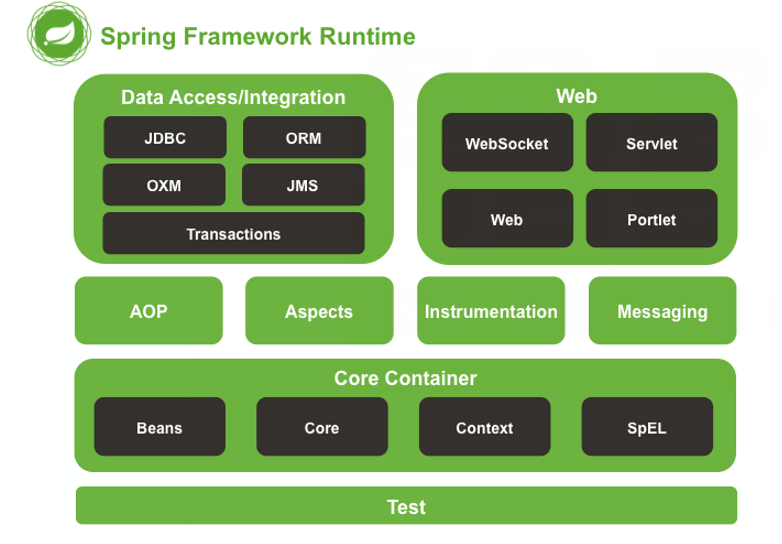

# Spring的初步认识

- Spring是分层的 Java SE/EE应用 full-stack 轻量级开源框架，以 IoC（Inverse Of Control： 反转控制）和 AOP（Aspect Oriented Programming：面向切面编程）为内核，提供了展现层 Spring MVC 和持久层 Spring JDBC 以及业务层事务管理等众多的企业级应用技术，还能整合开源世界众多 著名的第三方框架和类库，逐渐成为使用最多的Java EE 企业应用开源框架

## Spring 的发展历程 

- 1997 年 IBM提出了EJB 的思想   
- 1998 年，SUN制定开发标准规范 EJB1.0   
- 1999 年，EJB1.1 发布   
- 2001 年，EJB2.0 发布   
- 2003 年，EJB2.1 发布  
-  2006 年，EJB3.0 发布   
- Rod Johnson（spring之父）    

>- Expert One-to-One J2EE Design and Development(2002)    
>- 阐述了 J2EE 使用EJB 开发设计的优点及解决方案   
>-  Expert One-to-One J2EE Development without EJB(2004)    
>- 阐述了 J2EE 开发不使用 EJB的解决方式（Spring 雏形） 

- 2017 年 9 月份发布了 spring 的最新版本 spring 5.0 通用版（GA） 

## spring 的优势 

- **方便解耦，简化开发**  

>通过 Spring提供的 IoC容器，可以将对象间的依赖关系交由 Spring进行控制，避免硬编码所造 成的过度程序耦合。用户也不必再为单例模式类、属性文件解析等这些很底层的需求编写代码，可 以更专注于上层的应用

-  **AOP编程的支持**  

>通过 Spring的 AOP 功能，方便进行面向切面的编程，许多不容易用传统OOP 实现的功能可以通过 AOP 轻松应付

- **声明式事务的支持**  

>可以将我们从单调烦闷的事务管理代码中解脱出来，通过声明式方式灵活的进行事务的管理， 提高开发效率和质量

- **方便程序的测试**  

>可以用非容器依赖的编程方式进行几乎所有的测试工作，测试不再是昂贵的操作，而是随手可做的事情

- **方便集成各种优秀框架**  

>Spring可以降低各种框架的使用难度，提供了对各种优秀框架（Struts、Hibernate、Hessian、Quartz 等）的直接支持

-  **降低 JavaEE API的使用难度**  

>Spring对 JavaEE API（如 JDBC、JavaMail、远程调用等）进行了薄薄的封装层，使这些 API 的 使用难度大为降低

-  **Java源码是经典学习范例** 

>Spring的源代码设计精妙、结构清晰、匠心独用，处处体现着大师对Java 设计模式灵活运用以 及对 Java技术的高深造诣。它的源代码无意是 Java 技术的最佳实践的范例

## spring 的体系结构 

# IOC 的概念和作用 

## 什么是程序的耦合 

- 耦合性(Coupling)，也叫耦合度，是对模块间关联程度的度量。耦合的强弱取决于模块间接口的复杂性、调用模块的方式以及通过界面传送数据的多少
- 模块间的耦合度是指模块之间的依赖关系，包括控制关系、调用关系、数据传递关系。模块间联系越多，其耦合性越强，同时表明其独立性越差( 降低耦合性，可以提高其独立 性)。耦合性存在于各个领域，而非软件设计中独有的，但是我们只讨论软件工程中的耦合。
- 在软件工程中，耦合指的就是就是对象之间的依赖性。对象之间的耦合越高，维护成本越高。因此对象的设计应使类和构件之间的耦合最小。软件设计中通常用耦合度和内聚度作为衡量模块独立程度的标准。划分模块的一个 准则就是高内聚低耦合。 它有如下分类：  

>1. 内容耦合。当一个模块直接修改或操作另一个模块的数据时，或一个模块不通过正常入口而转入另 一个模块时，这样的耦合被称为内容耦合。内容耦合是最高程度的耦合，应该避免使用之
>2. 公共耦合。两个或两个以上的模块共同引用一个全局数据项，这种耦合被称为公共耦合。在具有大 量公共耦合的结构中，确定究竟是哪个模块给全局变量赋了一个特定的值是十分困难的
>3. 外部耦合 。一组模块都访问同一全局简单变量而不是同一全局数据结构，而且不是通过参数表传 递该全局变量的信息，则称之为外部耦合
>4. 控制耦合 。一个模块通过接口向另一个模块传递一个控制信号，接受信号的模块根据信号值而进 行适当的动作，这种耦合被称为控制耦合
>5. 标记耦合 。若一个模块 A 通过接口向两个模块 B 和 C 传递一个公共参数，那么称模块 B 和 C 之间 存在一个标记耦合
>6. 数据耦合。模块之间通过参数来传递数据，那么被称为数据耦合。数据耦合是最低的一种耦合形 式，系统中一般都存在这种类型的耦合，因为为了完成一些有意义的功能，往往需要将某些模块的输出数据作为另
>   一些模块的输入数据
>7. 非直接耦合 。两个模块之间没有直接关系，它们之间的联系完全是通过主模块的控制和调用来实现的

- 总结：  耦合是影响软件复杂程度和设计质量的一个重要因素，在设计上我们应采用以下原则：如果模块间必须 存在耦合，就尽量使用数据耦合，少用控制耦合，限制公共耦合的范围，尽量避免使用内容耦合
- 内聚与耦合  内聚标志一个模块内各个元素彼此结合的紧密程度，它是信息隐蔽和局部化概念的自然扩展。内聚是从 功能角度来度量模块内的联系，一个好的内聚模块应当恰好做一件事。它描述的是模块内的功能联系。耦合是软件结构中各模块之间相互连接的一种度量，耦合强弱取决于模块间接口的复杂程度、进入或访问一个模块的点以及通过接口的数据。 程序讲究的是低耦合，高内聚。就是同一个模块内的各个元素之间要高度紧密，但是各个模块之 间的相互依存度却要不那么紧密。 内聚和耦合是密切相关的，同其他模块存在高耦合的模块意味着低内聚，而高内聚的模块意味着该模块同其他模块之间是低耦合。在进行软件设计时，应力争做到高内聚，低耦合
- 我们在开发中，有些依赖关系是必须的，有些依赖关系可以通过优化代码来解除的