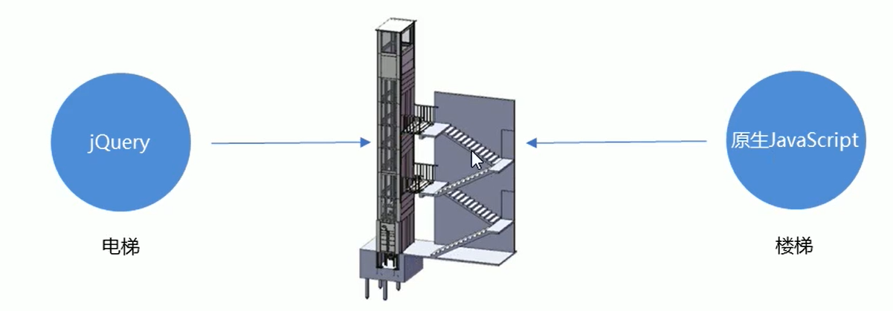
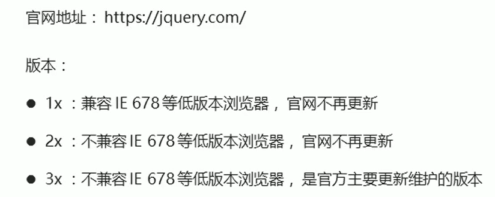
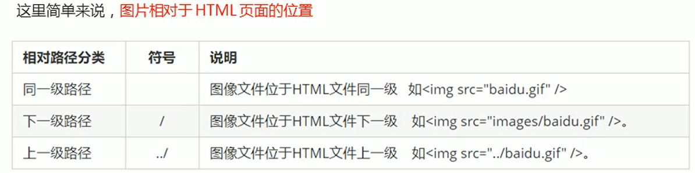
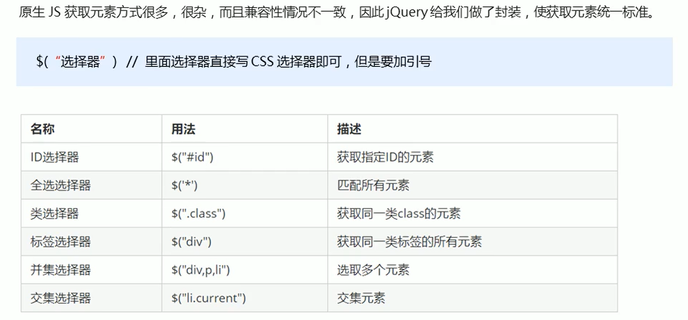
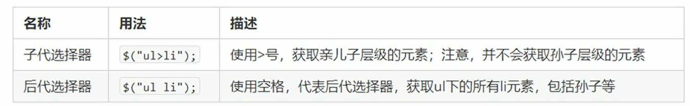
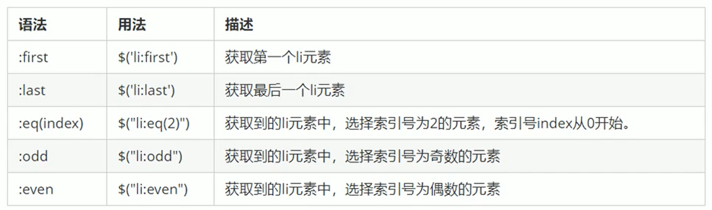
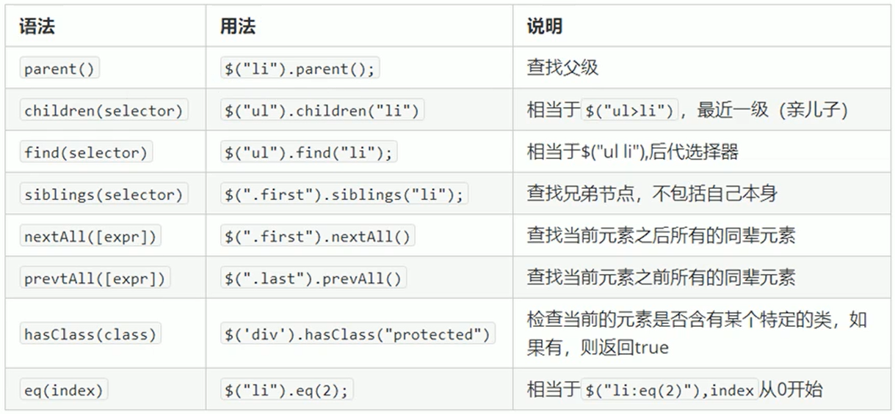

# jQuery

## 概念

- <u>jQuery是一个快速、简洁的JavaScript库，其设计的宗旨是"write Less，Do More"，即倡导写更少的代码，做更多的事情</u>
- j就是JavaScript；Query查询；意思就是查询js，把js中的DOM操作做了封装，我们可以快速的查询使用里面的功能。
- jQuery封装了JavaScript常用的功能代码，优化了DOM操作、事件处理、动画设计和Ajax交互
- 学习jQuery本质：就是学习调用这些函数（方法）
- jQuery出现的目的是加快前端人员的开发速度，我们可以非常方便的调用和使用它，从而提高开发效率



- 优点
  - 轻量级。核心文件才几+kb，不会影响页面加载速度跨浏览器兼容
  - 基本兼容了现在主流的浏览器
  - 链式编程、隐式迭代
  - 对事件、样式、动画支持，大大简化了DOM操作
  - 支持插件扩展开发。有着丰富的第三方的插件，例如：树形菜单、日期控件、轮播图等
  - 免费、开源
- 下载



## 路径



## 基本使用

- 方式一

```css
$(function(){
    //...等待页面加载完成后再加载
});
```

- 方式二

```css
$(document).ready({
    //...等待页面加载完成后再加载
});
```

## 选择器

### 基础选择器

 

### 层级选择器



### 筛选选择器



### 筛选方法



