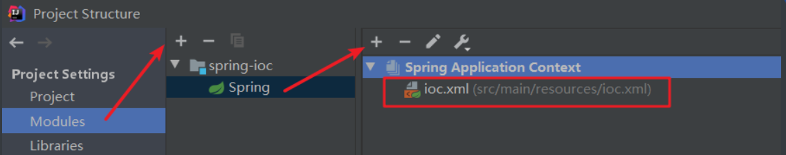

# ①Spring准备和使用

## 1.1构造spring项目

1. 打开idea，新建项目(不是社区版，社区版没有JavaEE功能)


- 之后的全部选择默认即可
- 在之后可能会遇到下列的报错信息


---

- 解决办法一：使用Maven创建项目时设置属性archetypeCatalog-internal


- 解决办法二：在maven的VM Options加上`-DarchetypeCatalog-internal`参数，如下：


- 关闭之前的项目，重新创建一个新的项目即可生效

## 1.2导入核心容器包

- Spring模块分类图


- 搭建Spring运行时环境：需要导入spring核心容器（Core Container）所需要的jar包
- 在pom.xml文件中导入所需坐标即可

```xml
<!--引入spring核心容器-->
<dependency>
    <groupId>org.springframework</groupId>
    <artifactId>spring-context</artifactId>
    <version>5.1.5.RELEASE</version>
</dependency>
```

- 导入成功，如下所示


---

- 创建项目后pom.xml中compiler环境默认是1.7，把它改成1.8即可

```xml
<properties>
    <project.build.sourceEncoding>UTF-8</project.build.sourceEncoding>
    <maven.compiler.source>1.8</maven.compiler.source>
    <maven.compiler.target>1.8</maven.compiler.target>
</properties>
```

## 1.3创建配置文件

- 在src目录下创建一个resources资源目录，并创建ioc.xml配置文件
- 创建成功会回有一段警告提示：application context not configured for this file
- spring配置文件中时常会出现这个提示，翻译过来大概意思就是没有配置该文件到项目中


- 消除警告提示：选择编辑器左上角file--->Project Structure，最后点击apply即可



# ②通过IOC容器创建对象并为属性赋值:star:

## 2.1给容器中注册一个组件

- 先创建一个Person类，之后把这个类放到spring容器中交给容器管理

```java
package org.example.bean;

public class Person {
    //姓名、年龄、性别、生日
    private String name;
    private Integer age;
    private String gender;
    
    //getter、setter、toString...
}
```

- 编写ioc.xml配置文件

```xml
<?xml version="1.0" encoding="UTF-8"?>
<beans xmlns="http://www.springframework.org/schema/beans"
       xmlns:xsi="http://www.w3.org/2001/XMLSchema-instance"
       xsi:schemaLocation="http://www.springframework.org/schema/beans http://www.springframework.org/schema/beans/spring-beans.xsd">

    <!--注册一个Person对象,spring会自定创建这个对象-->
    <!--bean标签可以注册一个组件(对象、类)-->
    <!--class要写注册的组件全名-->
    <!--id是这个对象的唯一标识,以后可以通过这个标识从spring容器中获取-->
    <bean class="org.example.bean.Person" id="person">
         <!--property标签的作用是调用对象中的getter和setter方法-->
        <!--name是指定属性名 value是指定属性的值-->
        <property name="name" value="蝙蝠侠"/>
        <property name="age" value="30"/>
        <property name="gender" value="男"/>
    </bean>
</beans>
```

## 2.2从容器中获取组件

- 在test包下创建一个测试类

```java
package org.example;

import org.example.bean.Person;
import org.junit.Test;
import org.springframework.context.ApplicationContext;
import org.springframework.context.support.ClassPathXmlApplicationContext;

public class IocTest {
    @Test
    public void testIOC(){
        //ApplicationContext代表ioc容器
        //ClassPathXmlApplicationContext作为它的实现类:表示当前应用的xml在classpath类路径下
        //根据spring的配置文件创建ioc容器对象
        ApplicationContext ioc = new ClassPathXmlApplicationContext("ioc.xml");

        //容器帮我们创建好了对象,直接根据对象在容器中的id名获取对象
        Person person = (Person) ioc.getBean("person");
        System.out.println(person);
    }
}
```

- 当我们运行后发现对象确定能够输出成功，而且我们并没有使用手动new对象的形式


## 2.3类路径说明

- 在IDEA中，src下的mian源码包会被映射到traget文件里的类路径中再点进classes类路径文件发现之前编写的ioc.xml配置文件就是放在类路径的根目录下

---

## 2.4APPlicationContext

- APPlicationContext是一个接口，代表容器，它有很多的实现类


- 我们之前从容器中获取组件时就使用了`ApplicationContext ioc = new ClassPathXmlApplicationContext("ioc.xml");`
- ClassPathXmlApplicationContext这个实现类的功能就是是从类路径下加载配置文件，获取到IOC容器对象；反言之，如果我们的配置文件没有放到类路径下，就不能使用这个类

## 2.5容器创建对象的细节说明

- Spring在创建IOC容器对象时，就已经完成了bean的创建和属性的赋值
- Sring在创建对象时会调用bean默认的空参构造函数，传入配置文件中的value属性值并调用bean对象中的setter方法为对象属性赋值
- getter和setter都最好使用系统的自动生成，避免写错名字导致为对象赋值失败
- Spring对同一个对象只会创建一次，之后的getBean()都是从容器中直接获取
- 如果我们从容器中获取没有对应id的对象就会报错


# ③根据bean的类型从IOC容器中获取bean的实例:star:

- getBean有5个重载函数


- 我们将测试第二个重载函数：根据bean的类型获取容器中注册的组件

```java
@Test
public void test2(){
    ApplicationContext ioc = new ClassPathXmlApplicationContext("ioc.xml");
    Person person = ioc.getBean(Person.class);
    System.out.println(person); //正常运行,输出成功
}
```

- 上面的测试是针对iox.xml配置文件中只注册了一个组件的情况，接下来我们在ioc.xml文件中再注册一个相同类型的组件

```xml
<bean class="org.example.bean.Person" id="person">
    <!--name是指定属性名 value是指定属性的值-->
    <property name="name" value="蝙蝠侠"/>
    <property name="age" value="30"/>
    <property name="gender" value="男"/>
</bean>
<bean class="org.example.bean.Person" id="person2">
    <!--name是指定属性名 value是指定属性的值-->
    <property name="name" value="钢铁侠"/>
    <property name="age" value="35"/>
    <property name="gender" value="男"/>
</bean>
```

- 再次通过`ioc.getBean(Person.class)`从容器中获取组件就会报错 
- 原因是找到了多个相同类型的bean对象


- 系统期望是单个匹配，但是匹配到了person和person2两个对象


- **所以如果是单纯的通过类型来获取组件，如果ioc容器中这个类型的bean有多个，查找就会报错**

---

- 如何遇到了多个相同类型的bean，最好的方法是使用第四种重载函数来获取组件

```java
@Test
public void test2(){
    ApplicationContext ioc = new ClassPathXmlApplicationContext("ioc.xml");
    Person person = ioc.getBean("person2",Person.class); //同时指定id名和bean对象的类型
    System.out.println(person);
}
```

# ④通过构造器为bean的属性赋值

- 在Person类中添加有参无参构造器

```java
public class Person {
    //姓名、年龄、性别、生日
    private String name;
    private Integer age;
    private String gender;

    public Person() {
    }

    public Person(String name, Integer age, String gender) {
        this.name = name;
        this.age = age;
        this.gender = gender;
    }
    //.........
}
```

## 4.1使用name属性:small_orange_diamond:

- 在ioc.xml中注册组件并为Person对象赋值

```xml
<bean class="org.example.bean.Person" id="person3">
    <!--一个constructor-arg标签代表构造器中的一个参数-->
    <constructor-arg name="name" value="蜘蛛侠"/>
    <constructor-arg name="age" value="18"/>
    <constructor-arg name="gender" value="男"/>
</bean>
```

- 获取组件

```java
@Test
public void test3(){
    ApplicationContext ioc = new ClassPathXmlApplicationContext("ioc.xml");
    Person person = ioc.getBean("person3",Person.class);
    System.out.println(person); //成功
}
```

## 4.2不使用name属性

- 在ioc.xml中注册组件并为Person对象赋值

```xml
<bean class="org.example.bean.Person" id="person4">
    <!--一个constructor-arg标签代表构造器中的一个参数-->
    <!--可以省略name属性,但必须按照有参构造器中的属性顺序进行赋值-->
    <constructor-arg  value="猪猪侠"/>
    <constructor-arg  value="8"/>
    <constructor-arg  value="男"/>
</bean>
```

- 获取组件

```java
@Test
public void test3(){
    ApplicationContext ioc = new ClassPathXmlApplicationContext("ioc.xml");
    Person person = ioc.getBean("person4",Person.class);
    System.out.println(person); //成功
}
```

# ⑤bean的作用域


- singleton：单实例模式
  - 系统默认就是单实例，该bean对象会在容器启动完成之前就创建成功并保存在容器中
  - 之后的每一次getBean获取bean都是唯一的一个
  - IOC容器关闭后就被销毁
- prototype：多实例模式
  - 容器启动时不会去创建该bean对象，只有在调用getBean方法获取的时候才会去创建
  - 每次获取bean对象都会重新创建一个
  - IOC容器关闭后不会被销毁

# ⑥实现FactoryBean接口使用工厂模式创建对象:star:

```java
package org.example.factory;

import org.example.bean.Person;
import org.springframework.beans.factory.FactoryBean;

/**
 * FactoryBean是spring中的一个接口,只要是这个接口的实现类就会被认为是一个工厂
 */
public class MyFactoryBeanImpl implements FactoryBean<Person> {

    //spring会自动调用该方法创建对象
    @Override
    public Person getObject() throws Exception {
        System.out.println("FactoryBean...开始为我们创建对象");
        Person person = new Person();
        person.setName("绿巨人");
        person.setAge(15);
        person.setGender("男");
        return person;
    }

    //告诉spring需要创建的类的类型是什么
    @Override
    public Class<?> getObjectType() {
        return Person.class;
    }

    //是否为单例模式
    @Override
    public boolean isSingleton() {
        return false;
    }
}
```

- 创建factoryIOC.xml配置文件

```xml
<?xml version="1.0" encoding="UTF-8"?>
<beans xmlns="http://www.springframework.org/schema/beans"
       xmlns:xsi="http://www.w3.org/2001/XMLSchema-instance"
       xsi:schemaLocation="http://www.springframework.org/schema/beans http://www.springframework.org/schema/beans/spring-beans.xsd">

    <bean class="org.example.factory.MyFactoryBeanImpl" id="myFactoryBean"/>
</beans>
```

- 加载配置文件并启动IOC容器

```java
@Test
public void testFactory(){
    ApplicationContext ioc = new ClassPathXmlApplicationContext("factoryIOC.xml");
    System.out.println("IOC容器启动完成...");
    Person person = ioc.getBean("myFactoryBean",Person.class);
    System.out.println(person);
}
```

- 在容器启动时，工厂不会为我们创建对象，只有当我们使用时才会创建对象，这是FactoryBean的特点，默认为懒加载
- 可以通过isSingleton方法来设置工厂方法创建的对象是单实例还是多实例


# ⑦创建带有生命周期的bean

- 生命周期：控制bean对象的创建和销毁
- 我们可以为bean设置一些生命周期的方法，使spring在创建bean和销毁bean时会调用指定方法
- IOC容器中注册的bean
  - 单例bean：容器启动的时候就会创建好，容器关闭时就会被销毁
  - 多例bean：容器启动的时候不会创建，从容器中获取的时候才会创建，容器关闭时不会被销毁

---

- 自定义初始化和销毁方法

```java
public class Person {
    //姓名、年龄、性别、生日
    private String name;
    private Integer age;
    private String gender;

    public Person() {
        System.out.println("Person无参构造器被调用......");
    }

    public void init(){
        System.out.println("Person创建之后的初始化方法......");
    }

    public void destroy(){
        System.out.println("Person销毁之前的处理方法......");
    }
    
    //......
}
```

- 在ioc.xml中声明初始化和销毁方法

```xml
<bean class="org.example.bean.Person" id="person5" init-method="init" destroy-method="destroy">
    <!--name是指定属性名 value是指定属性的值-->
    <property name="name" value="蝙蝠侠"/>
    <property name="age" value="30"/>
    <property name="gender" value="男"/>
</bean>
```

- 测试方法是否被调用

```java
@Test
public void test5(){
    ClassPathXmlApplicationContext ioc = new ClassPathXmlApplicationContext("ioc.xml");
    Person person = ioc.getBean("person5",Person.class);
    System.out.println(person);
    ioc.close();
    System.out.println("容器关闭...");
}
```

- 设置成功：


# ⑧测试bean的后置处理器

- spring中有一个接口BeanPostProcessor，被称作后置处理器，它可以在bean的初始化前后调用方法
- 接口中只有两个方法

- 实现接口BeanPostProcessor

```java
package org.example.bean;

import org.springframework.beans.BeansException;
import org.springframework.beans.factory.config.BeanPostProcessor;

/**
 * 我们编写的类要能够使用必须放在容器中
 * 需要在xml文件中注册该类
 */
public class MyBeanPostProcessor implements BeanPostProcessor {
    /**
     * bean的销毁方法调用之前调用
     * @param bean 将要初始化的bean,可以提前在该方法中修改
     * @param beanName bean的名字
     */
    @Override
    public Object postProcessBeforeInitialization(Object bean, String beanName) throws BeansException {
        System.out.println(beanName + "后置处理器postProcessBeforeInitialization方法执行......");
        return bean;
    }

    /**
     * 在初始化方法调用之后调用
     */
    @Override
    public Object postProcessAfterInitialization(Object bean, String beanName) throws BeansException {
        System.out.println(beanName + "后置处理器postProcessAfterInitialization方法执行...");
        //初始化之后返回的是什么,容器中保存的就是什么
        return bean;
    }
}
```

- 在ioc.xml文件中注册该实现类

```xml
<?xml version="1.0" encoding="UTF-8"?>
<beans xmlns="http://www.springframework.org/schema/beans"
       xmlns:xsi="http://www.w3.org/2001/XMLSchema-instance" xmlns:util="http://www.springframework.org/schema/util"
       xsi:schemaLocation="http://www.springframework.org/schema/beans http://www.springframework.org/schema/beans/spring-beans.xsd http://www.springframework.org/schema/util http://www.springframework.org/schema/util/spring-util.xsd">
    
    <bean class="org.example.bean.Person" id="person" init-method="init" destroy-method="destroy">
        <!--name是指定属性名 value是指定属性的值-->
        <property name="name" value="蝙蝠侠"/>
        <property name="age" value="30"/>
        <property name="gender" value="男"/>
    </bean>

    <!--注册后置处理器-->
    <bean class="org.example.bean.MyBeanPostProcessor" id="postProcessor"/>

</beans>
```

- 加载配置文件，创建IOC容器

```java
    @Test
    public void testIOC(){
        //根据spring的配置文件创建ioc容器对象
        ClassPathXmlApplicationContext ioc = new ClassPathXmlApplicationContext("ioc.xml");

        //容器帮我们创建好了对象,直接根据对象在容器中的id名获取对象
        Person person = (Person) ioc.getBean("person");
        System.out.println(person);
        ioc.close();
        System.out.println("容器关闭,对象被销毁");
    }
```

- 方法调用流程......
- 注：无论bean是否有初始化方法，后置处理器都会默认其有，都会进行工作
- 我们可以在bean的初始化前后利用后置处理器进行干预


# ⑨spring管理连接池:star:

- 数据库连接池作为单例是最好的，一个项目一个连接池，一个连接池里管理很多连接
- 可以让spring为我们创建连接池对象，spring创建的对象默认情况下就单例的

---

- 在pom.xml文件中导入数据库连接池的坐标

```xml
<!-- https://mvnrepository.com/artifact/com.mchange/c3p0 -->
<!--导入数据库连接池需要的包-->
<dependency>
    <groupId>com.mchange</groupId>
    <artifactId>c3p0</artifactId>
    <version>0.9.5.2</version>
</dependency>

<!-- https://mvnrepository.com/artifact/mysql/mysql-connector-java -->
<!--JAVA通过jdbc访问mySQL数据库时需要该包支持,可获取连接对象-->
<dependency>
    <groupId>mysql</groupId>
    <artifactId>mysql-connector-java</artifactId>
    <version>5.1.25</version>
</dependency>
```

## 9.1直接在xml文件中进行数据源配置

- 在applicationContext.xml配置文件中注册数据库连接池组件

```xml
<?xml version="1.0" encoding="UTF-8"?>
<beans xmlns="http://www.springframework.org/schema/beans"
       xmlns:xsi="http://www.w3.org/2001/XMLSchema-instance"
       xsi:schemaLocation="http://www.springframework.org/schema/beans http://www.springframework.org/schema/beans/spring-beans.xsd">

<!--在spring容器中配置连接池-->
<bean class="com.mchange.v2.c3p0.ComboPooledDataSource" id="dataSource">
    <!--注入数据源-->
    <property name="driverClass" value="com.mysql.jdbc.Driver"/>
    <property name="jdbcUrl" value="jdbc:mysql:///ssm"/>
    <property name="user" value="root"/>
    <property name="password" value="root"/>
</bean>
</beans>
```

- 获取数据库连接

```java
@Test
public void test2() throws SQLException {
    ApplicationContext ioc = new ClassPathXmlApplicationContext("applicationContext.xml");
    DataSource source = ioc.getBean("dataSource",DataSource.class);
    System.out.println(source.getConnection());
}
```


## 9.2引入外部配置文件进行数据源配置:small_orange_diamond:

- 创建dbconfig.properties配置文件

```properties
db.driverClass=com.mysql.jdbc.Driver
db.jdbcUrl=jdbc:mysql:///ssm
db.user=root
db.password=root
```

- 在applicationContext.xml配置文件中引入dbconfig.properties配置文件
- 需要在applicationContext.xml配置文件中添加context名称空间才可以引入

```xml
xmlns:context="http://www.springframework.org/schema/context"
```

- 必须要引入完整的命名空间，否则会报错


- 引入dbConfig.properties后，使用${}读取外部配置文件的值

```xml
<beans xmlns="http://www.springframework.org/schema/beans"
       xmlns:xsi="http://www.w3.org/2001/XMLSchema-instance"
       xmlns:context="http://www.springframework.org/schema/context"
       xsi:schemaLocation="http://www.springframework.org/schema/beans
                           http://www.springframework.org/schema/beans/spring-beans-4.2.xsd
                           http://www.springframework.org/schema/context
                           http://www.springframework.org/schema/context/spring-context-4.2.xsd">

    <!--加载外部配置文件，引用类路径下的dbConfig.properties-->
    <context:property-placeholder location="classpath:dbConfig.properties"/>

    <!--在spring容器中配置连接池-->
    <bean class="com.mchange.v2.c3p0.ComboPooledDataSource" id="dataSource">
        <!--${}动态取出配置文件中的值-->
        <property name="driverClass" value="${db.driverClass}"/>
        <property name="jdbcUrl" value="${db.jdbcUrl}"/>
        <property name="user" value="${db.user}"/>
        <property name="password" value="${db.password}"/>
    </bean>
</beans>
```

# ⑩基于XML的自动装配

## 10.1自定义类型自动赋值

- 在Person类中再添加一个自定义的Car

```java
public class Car {
    private String carName;
    private String color;
    //...
}
```

- Person类

```java
public class Person {
    //姓名、年龄、性别、生日
    private String name;
    private Integer age;
    private String gender;
    private Car car;
    
    //......
}
```

- 在xml文件中为自定义的Car类型手动赋值的情况

```xml
<bean class="org.example.bean.Car" id="car">
    <property name="carName" value="宝马"/>
    <property name="color" value="白色"/>
</bean>

<bean class="org.example.bean.Person" id="boss">
    <property name="car" ref="car"/>
</bean>
```

---

- 可以使用autowire实现自动装配


- default是默认值，表示不使用自动装配
- byName：使用属性名(car)作为id值去容器中寻找这个组件给Person赋值，如果找不到就赋值为null
- byType：以属性的类型作为依据去容器中寻找对应类型的组件给Person赋值
  - 如果容器中有多个相同类型的bean，就会报NoUniqueBeanDefinitionException
  - 如果在容器中没有找到就装配null
- constructor：
  - 先按照有参构造器的类型进行装配，没有就直接为组件装配null
  - 如果按照类型找到多个，参数的名作为id继续装配
  - 不论如何都不会报错

---

- 在xml文件中使用自动装配

```xml
<bean class="org.example.bean.Car" id="car">
    <property name="carName" value="宝马"/>
    <property name="color" value="白色"/>
</bean>

<!--自动装配只对自定义类型有效-->
<bean class="org.example.bean.Person" id="boss" autowire="byName"/>
```

- 取出Person

```java
@Test
public void test(){
    ApplicationContext ioc = new ClassPathXmlApplicationContext("applicationContext.xml");
    Person person = ioc.getBean("boss",Person.class);
    System.out.println(person);
}
```

- 装配成功


