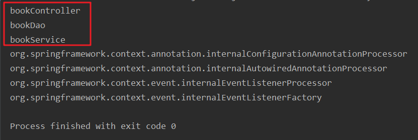

# ①导入坐标并创建配置文件

```xml
<!--引入spring核心容器-->
<dependency>
  <groupId>org.springframework</groupId>
  <artifactId>spring-context</artifactId>
  <version>5.1.5.RELEASE</version>
</dependency>
```

---

- 创建配置文件applicationContext.xml


```xml
<?xml version="1.0" encoding="UTF-8"?>
<beans xmlns="http://www.springframework.org/schema/beans"
       xmlns:xsi="http://www.w3.org/2001/XMLSchema-instance"
       xsi:schemaLocation="http://www.springframework.org/schema/beans http://www.springframework.org/schema/beans/spring-beans.xsd">

</beans>
```

# ②通过注解分别创建Dao/Service/Controller

- Controller：控制器，控制网站跳转逻辑
- Spring有四个注解：通过给bean上添加下列注解可以快速的将bean添加到IOC容器中
  - @Controller：控制器；我们推荐给控制器层（servlet包下的这些）的组件加这个注解
  - @Service：业务逻辑；我们推荐业务逻辑层的组件添加这个注解；BookService
  - @Repository：给数据库层（持久化层，dao层）的组件添加这个注解
  - @Component：给不属于以上几层的组件添加这个注解

>- 注解可以随便加；Spring底层不会去验证你的这个组件，是否如你注解所说就是一个dao层的或者就是一个servlet层的组件；
>- 我们推荐各自层加各自注解；给我们程序员看的；

---

1. 给要添加的组件上标四个注解的任何一个

```java
package org.example.dao;

import org.springframework.stereotype.Repository;

@Repository
public class BookDao {
}
```

```java
package org.example.service;

import org.springframework.stereotype.Service;

@Service
public class BookService {
}
```

```java
package org.example.controller;

import org.springframework.stereotype.Controller;

@Controller
public class BookController {
}
```

2. 告诉Spring，自动扫描加了注解的组件，需要依赖context名称空间

```xml
<?xml version="1.0" encoding="UTF-8"?>
<beans xmlns="http://www.springframework.org/schema/beans"
       xmlns:context="http://www.springframework.org/schema/context"
       xmlns:xsi="http://www.w3.org/2001/XMLSchema-instance"
       xsi:schemaLocation="http://www.springframework.org/schema/beans
                           http://www.springframework.org/schema/beans/spring-beans-4.0.xsd
                           http://www.springframework.org/schema/context
                           http://www.springframework.org/schema/context/spring-context-4.0.xsd">

    <!-- context:component-scan组件自动扫描，配合注解来确定加载哪些类 -->
    <!--base-package指定扫描的基础包，把基础包和其子包下所有加了注解的类都扫描进ioc容器-->
    <context:component-scan base-package="org.example"/>
</beans>
```

- 加载配置类，获取IOC容器，从容器中取出对应的bean对象
- 加了注解的类，在容器中的id名就是类名首字母小写

```java
package org.example;

import org.junit.Test;
import org.springframework.context.ApplicationContext;
import org.springframework.context.support.ClassPathXmlApplicationContext;

public class AnnotationTest {
    @Test
    public void test1(){
        ApplicationContext ioc = new ClassPathXmlApplicationContext("applicationContext.xml");
        //获取容器中所有的组件id
        final String[] names = ioc.getBeanDefinitionNames();
        for (String name : names) {
            System.out.println(name);
        }
    }
}
```

- 三个组件成功注册进容器



- 注意：要使用注解必须引入aop包，但是我们在导入核心容器的坐标时，maven已经自动导入了

# ③指定扫描包时排除不要的组件


## context:exclude-filter


- type="annotation"：指定排除规则，按照注解进行排除，标注了指定注解的组件不加入容器
- type="aspectj"：指定排除具体的类，按照类来排除
- expression：指定要排除的注解，需要使用全类名

```java
<!-- context:component-scan组件自动扫描，配合注解来确定加载哪些类 -->
<!--base-package指定扫描的基础包，把基础包和其子包下所有加了注解的类都扫描进ioc容器-->
<context:component-scan base-package="org.example">
    <context:include-filter type="annotation" expression="org.springframework.stereotype.Controller"/>
</context:component-scan>
```

- 打印容器中所有的组件id

```java
public class AnnotationTest {
    @Test
    public void test1(){
        ApplicationContext ioc = new ClassPathXmlApplicationContext("applicationContext.xml");
        //获取容器中所有的组件id
        final String[] names = ioc.getBeanDefinitionNames();
        for (String name : names) {
            System.out.println(name);
        }
    }
}
```

- bookController组件被排除成功


## context:include-filter

- 指定只要那些组件
- 注意：默认的use-default-filters（默认的过滤规则）为true，必须指定为false之后context:include-filter的排除规则才会生效

```java
<context:component-scan base-package="org.example" use-default-filters="false">
        <context:include-filter type="annotation"
                                expression="org.springframework.stereotype.Controller"/>
    </context:component-scan>
```

- 再次打印id


# ④使用@Autowired实现根据类型自动装配

```java
@Service
public class BookService {
    @Autowired
    private BookDao bookDao;

    public void save(){
        bookDao.save();
    }
}
```

- @Autowired的匹配原理
  - 先按照类型去容器中找对应的组件
    - 找到一个，就赋值
    - 没有找到，就报错
    - 找多多个相同类型的，就把属性名作为id去容器中继续查找
  - 按照id去容器中查找的情况
    - 匹配上了，就装配
    - 匹配不上就不报错
- @Autowired(required = false)注解中有一个属性required ，默认为true，只要装配不上就会报错，但是我们可以将属性required = false设置为false，这种情况装配不上的时候就会为属性赋值为null，不会报错了

---

- @Autowired源码：可以作用在构造器上、方法上、方法参数上和类的属性上

```java
@Target({ElementType.CONSTRUCTOR, ElementType.METHOD, ElementType.PARAMETER, ElementType.FIELD, ElementType.ANNOTATION_TYPE})
@Retention(RetentionPolicy.RUNTIME)
@Documented
public @interface Autowired {

   /**
    * Declares whether the annotated dependency is required.
    * <p>Defaults to {@code true}.
    */
   boolean required() default true;

}
```

# ⑤使用Qualifier按照指定的id去容器中装配组件

```java
@Service
public class BookService {
    @Autowired
    @Qualifier(value = "myBookDao")
    private BookDao bookDao;

    public void save(){
        bookDao.save();
    }
}
```

- **@Qualifier需要和@Autowired注解一起使用**
  - 一开始还是按照类型去找，如果找到了多个类型相同的组件就按照@Qualifier注解所指定的id去容器中查找组件
    - 如果找到就装配
    - 找不到就报错

# ⑥使用@Resource和@Autowired的区别

- @Resource注解能实现和@Autowired一样的自动装配
- @Resource注解是java扩展包中的，是java的标准，若要使用，需要导入对应的坐标

```java
<!-- https://mvnrepository.com/artifact/javax.annotation/javax.annotation-api -->
<dependency>
  <groupId>javax.annotation</groupId>
  <artifactId>javax.annotation-api</artifactId>
  <version>1.3.2</version>
</dependency>
```

- @Resource没有@Autowired功能强大，@Autowired是spring里的，离开sprig框架@Autowired就没有用了，@Resource的扩展性较强，在其他框架也可以使用

# ⑦spring的单元测试

- 首先需要导入spring的单元测试坐标

```xml
<!-- https://mvnrepository.com/artifact/org.springframework/spring-test -->
<dependency>
    <groupId>org.springframework</groupId>
    <artifactId>spring-test</artifactId>
    <version>5.1.13.RELEASE</version>
    <scope>test</scope>
</dependency>
```

- 注意这里的Junit版本要4.13及其以上的版本

```xml
<dependency>
    <groupId>junit</groupId>
    <artifactId>junit</artifactId>
    <version>4.13</version>
    <scope>test</scope>
</dependency>
```

- 单元测试

```java
package org.example;

import org.example.service.BookService;
import org.junit.Test;
import org.junit.runner.RunWith;
import org.springframework.beans.factory.annotation.Autowired;
import org.springframework.test.context.ContextConfiguration;
import org.springframework.test.context.junit4.SpringJUnit4ClassRunner;

//@ContextConfiguration指定加载类路径下的配置文件
@ContextConfiguration(locations = "classpath:applicationContext.xml")
/*
   @RunWith指定用哪种驱动使用单元测试，默认就是使用Junit,下面我们指定使用spring的单元测试
       1.没有指定时是按照junit的@Test方法来执行单元测试的
       2.指定后就是由spring中的@Test方法来执行单元测试
 */
@RunWith(SpringJUnit4ClassRunner.class)
public class AnnotationTest {
    
    @Autowired
    private BookService bookService;

    @Test
    public void test1() {
        System.out.println(bookService);
    }
}
```

- 需要将单元测试托管给spring容器，这样就可以在测试类中为属性实现自动注入，也省去了使用getBean的方法
- 如果不托管给sping容器，还是使用Junit，那么该测试类就不会被注册到容器中，spring无法识别，@Autowired也没有作用，自然也就不能为其中的属性实现自动注入

# ⑧IOC总结

- IOC是什么？
  - IOC是一个容器，它能够帮我们管理所有的组件
- IOC的作用？
  - 能够为我们实现依赖注入，@Autowired，自动赋值
  - 某个组件想要使用spring的强大功能(IOC，AOP)，就必须注册到容器中
- 其他细节
  - 容器启动的时候创建所有的单实例bean
  - @Autowired实现自动装配，是从容器中查找符合这些要求的bean
  - 容器中保存了所有的bean
- 容器到底是什么？
  - 容器实际上就是一个map，这个map中保存所有创建好的bean，为外界提供获取需求

