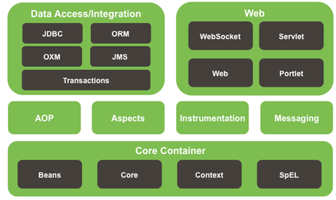

# 环境搭建总体流程


# ①引入坐标



1. 导入核心容器坐标

```xml
<!--引入spring核心容器-->
<dependency>
    <groupId>org.springframework</groupId>
    <artifactId>spring-context</artifactId>
    <version>5.1.5.RELEASE</version>
</dependency>
```

2. 导入web模块和servet模块所需要的坐标

```xml
<!--引入spring-web模块-->
<!-- https://mvnrepository.com/artifact/org.springframework/spring-webmvc -->
<dependency>
    <groupId>org.springframework</groupId>
    <artifactId>spring-webmvc</artifactId>
    <version>5.2.6.RELEASE</version>
</dependency>

<!--用于整合原生的web模块-->
<!-- https://mvnrepository.com/artifact/org.springframework/spring-web -->
<dependency>
    <groupId>org.springframework</groupId>
    <artifactId>spring-web</artifactId>
    <version>5.2.2.RELEASE</version>
</dependency>
```

# ②编写配置文件

- SpringMVC有一个重要的思想是有一个前端控制器能拦截所有的请求，并且智能派发

```java
public class DispatcherServlet extends FrameworkServlet {
    //.......
}
```

- 通过名字的后缀可以看出前端控制器实际上是一个Servlet，那么配置它就需要在web.xml中进行
- 在main目录下创建配置文件
- 在web.xml中配置前端控制器

```xml
<!DOCTYPE web-app PUBLIC
 "-//Sun Microsystems, Inc.//DTD Web Application 2.3//EN"
 "http://java.sun.com/dtd/web-app_2_3.dtd" >

<web-app>
    <display-name>Archetype Created Web Application</display-name>

    <servlet>
        <servlet-name>dispatcherServlet</servlet-name>
        <servlet-class>org.springframework.web.servlet.DispatcherServlet</servlet-class>
        <!--Servlet的初始化参数-->
        <init-param>
            <param-name>contextConfigLocation</param-name>
            <!--指定配置文件的位置-->
            <param-value>classpath:spring-mvc.xml</param-value>
        </init-param>
        <!--Servlet原本是第一次访问时创建对象
        load-on-startup设置为服务器启动时创建对象
        值越小，优先级越高，越先创建对象-->
        <load-on-startup>1</load-on-startup>
    </servlet>

    <servlet-mapping>
        <servlet-name>dispatcherServlet</servlet-name>
        <!--设置为拦截所有请求
        /和/*都是拦截所有请求
        /*的作用范围更大，还会拦截到jsp页面请求，一旦拦截，那么jsp页面就不能显示-->
        <url-pattern>/</url-pattern>
    </servlet-mapping>

</web-app>
```

- 在配置文件spring-mvc.xml中扫描包

```xml
<?xml version="1.0" encoding="UTF-8"?>
<beans xmlns="http://www.springframework.org/schema/beans"
       xmlns:xsi="http://www.w3.org/2001/XMLSchema-instance"
       xmlns:context="http://www.springframework.org/schema/context"
       xsi:schemaLocation="http://www.springframework.org/schema/beans http://www.springframework.org/schema/beans/spring-beans.xsd http://www.springframework.org/schema/context http://www.springframework.org/schema/context/spring-context.xsd">

    <!--扫描包，将组件加入容器-->
    <context:component-scan base-package="com.kl"/>
</beans>
```

# ③编写页面和控制器

```java
package com.kl.controller;

import org.springframework.stereotype.Controller;
import org.springframework.web.bind.annotation.RequestMapping;

@Controller //告诉springMVC这是一个处理器,可以处理请求
public class MyFirstController {

    /**
     *  /代表从当前项目下开始,处理hello请求
     * @return 跳转到success.jsp页面
     */
    @RequestMapping(value = "/hello")
    public String sayHello(){
        return "/WEB-INF/pages/success.jsp";
    }
}
```

# ④配置视图解析器

- 页面跳转的路径前缀是/WEB-INF/pages/，后缀是.jsp，这些都是固定了，我们可以配置一个视图解析器来帮我们拼接跳转路径的前缀和后缀


- 在spring-mvc.xml文件中进行配置

```java
<beans xmlns="http://www.springframework.org/schema/beans"
       xmlns:xsi="http://www.w3.org/2001/XMLSchema-instance"
       xmlns:context="http://www.springframework.org/schema/context"
       xsi:schemaLocation="http://www.springframework.org/schema/beans http://www.springframework.org/schema/beans/spring-beans.xsd http://www.springframework.org/schema/context http://www.springframework.org/schema/context/spring-context.xsd">

    <!--扫描包，将组件加入容器-->
    <context:component-scan base-package="com.kl"/>

    <!-- 对转向页面的路径解析
         prefix：跳转页面的前缀
         suffix：跳转页面的后缀 -->
    <bean id="viewResolver" class="org.springframework.web.servlet.view.InternalResourceViewResolver">
        <property name="prefix" value="/WEB-INF/pages/"/>
        <property name="suffix" value=".jsp"/>
    </bean>
</beans>
```

- 简化控制器的跳转请求

```java
@Controller 
public class MyFirstController {

    @RequestMapping(value = "/hello")
    public String sayHello(){
        return "success"; //由于视图解析器可以自动帮我们拼接前缀和后缀,这里只用返回页面名称即可
    }
}
```

# ⑤浏览器发送请求的过程分析

1. 客户端浏览器访问http://localhost:8080/springMVC/hello
2. 该请求来到tomcat服务器
3. SpringMVC前端控制器收到所有请求
4. 前端控制器判断请求地址和@RequestMapping注解标注的哪一个匹配，来找到到底是哪一个类的哪一个方法
5. 前端控制器找到了目标处理器类和目标方法后直接利用反射执行目标方法
6. 方法执行完成后会有一个返回值，SpringMVC就认为这个返回值就是要去的页面地址
7. 拿到方法返回值以后，就使用容器中的视图解析器进行拼串得到完整的页面地址
8. 拿到完整的页面地址后，再由前端控制器帮我们转发页面

#  ⑥使用@RequestMapping注解

## 接口方法功能介绍

- 告诉SpringMVC要处理什么请求
- /可以省略，即使省略了也是从当前项目下开始

```java
@Target({ElementType.TYPE, ElementType.METHOD})
@Retention(RetentionPolicy.RUNTIME)
@Documented
@Mapping
public @interface RequestMapping {
    //......
}
```

- 可以作用在方法上，也可以作用在类上，该接口中总共有7个方法


- value：`@RequestMapping(value = "/hello")`，指定访问地址
- method：`@RequestMapping(value = "/hello",method = RequestMethod.GET)`，指定接收的请求是get请求，默认情况下接收所有的请求
- params：规定请求参数
  - `@RequestMapping(value = "/hello",params = {"username"})`请求地址必须带一个叫username参数
  - `@RequestMapping(value = "/hello",params = {"!username"})`请求地址必须没有username参数
  - `@RequestMapping(value = "/hello",params = {"username=123"})`请求地址必须带一个叫username的参数，且值为123
  - `@RequestMapping(value = "/hello",params = {"username=lkl,password,!age"})`请求地址必须带一个username=lkl，并且还要有password的参数，不能懈怠有age参数 
- headers：规定请求头，User-Agent=“对应浏览器的请求头信息”
  - `@RequestMapping(value = "/hello",headers = {"User-Agent=Mozilla/5.0 (Windows NT 10.0; Win64; x64) AppleWebKit/537.36 (KHTML, like Gecko) Chrome/83.0.4103.106 Safari/537.36"})`，设置为谷歌浏览器的请求头，就是规定只有谷歌浏览器能够访问
- consumes：只接收内容类型是那种请求，规定请求头中得content-Type


## ant风格的url

- URL地址可以写模糊的通配符
  - ？：能代替任意一个字符
  - `*`：能代替任意多个字符和一层路径
  - `**`：能代替多层路径
- `@RequestMapping(value = "/hello")`这是精确请求

---

- 使用？通配符：`@RequestMapping(value = "/hello?")`
  - 不论是请求`/hello1`还是`/hello2`都可以，任意一个字符都可以，但不能是`/`这样的特殊字符
  - 模糊和精确多个匹配情况下，精确路径请求优先

---

- 可以在任意一个路径上写占位符，占位符语法就是/{变量名}
- 路径上的占位符只能占一层路径
- @PathVariable获取路径上的占位符
- http://localhost:8080/springMVC/hello/520

```java
@Controller //告诉springMVC这是一个处理器,可以处理请求
public class MyFirstController {

    @RequestMapping(value = "/hello/{id}")
    public String sayHello(@PathVariable String id) {
        System.out.println("获取路径上的占位符 = " + id); //520
        return "success";
    }
}
```

# ⑦Rest风格

## 增删改查环境搭建

- 什么是rest风格？简而言之就是通过资源名/资源id来访问具体的方法，根据请求的方式来调用对应的增删改查方法
- 以图书的增删改查为例搭建Rest环境

```java
package com.kl.controller;

import org.springframework.stereotype.Controller;
import org.springframework.web.bind.annotation.PathVariable;
import org.springframework.web.bind.annotation.RequestMapping;
import org.springframework.web.bind.annotation.RequestMethod;

@Controller //告诉springMVC这是一个处理器,可以处理请求
public class MyFirstController {

    @RequestMapping(value = "/book/{id}",method = RequestMethod.PUT)
    public String addBook(@PathVariable Integer id){
         System.out.println("添加了图书");
        return "success";
    }

    @RequestMapping(value = "/book/{id}",method = RequestMethod.DELETE)
    public String deleteBook(@PathVariable Integer id){
        System.out.println("删除了"+id+"号图书");
        return "success";
    }

    @RequestMapping(value = "/book/{id}",method = RequestMethod.POST)
    public String updateBook(@PathVariable Integer id){
        System.out.println("更新了"+id+"号图书");
        return "success";
    }

    @RequestMapping(value = "/book/{id}",method = RequestMethod.GET)
    public String findBook(@PathVariable Integer id){
        System.out.println("查找了"+id+"号图书");
        return "success";
    }
}
```

- 页面请求及效果：
  - 超链接默认是发送GET请求
  - 表单提交只有两种方法：GET和POST
  - 对于添加图书需要对应PUT请求
  - 对于删除图书需要对应DELETE请求

```jsp
<%@ page contentType="text/html;charset=UTF-8" language="java" %>
<html>
    <head>
        <title>Title</title>
    </head>
    <body>
        <form action="book/1">
            <input type="submit" value="添加图书">
        </form>
        <br/>
        <form action="book/1">
            <input type="submit" value="删除图书">
        </form>
        <br/>
        <form action="book/1" method="post">
            <input type="submit" value="修改图书">
        </form>
        <br/>
        <form action="book/1" method="get">
            <input type="submit" value="查询图书">
        </form>
    </body>
</html>
```

- 问题：表单只有两种请求可以选择，只有查询方法和更新方法会被执行，而我们总共需要四种不同的请求方式
- 解决：SpringMVC中有一个Filter过滤器，它可以把普通的请求转换为规定的请求

## 实现完整的Rest风格

- 需要配置Filter过滤器，Filter属于web的三大组件之一，那么就需要到web.xml中进行配置

```xml
<filter>
    <filter-name>methodFilter</filter-name>
    <filter-class>org.springframework.web.filter.HiddenHttpMethodFilter</filter-class>
</filter>
<filter-mapping>
    <filter-name>methodFilter</filter-name>
    <!--拦截所有的请求-->
    <url-pattern>/*</url-pattern>
</filter-mapping>
```

- 如何使用这个过滤器？

---

1. 创建一个POST请求的表单
2. 表单中携带一个_method的参数
3. 这个_method参数的value值就是要发送的请求

```jsp
<form action="book/1" method="post">
    <input name="_method" value="put">
    <input type="submit" value="添加图书">
</form>
<br/>
<form action="book/1" method="post">
    <input name="_method" value="delete">
    <input type="submit" value="删除图书">
</form>
```

- 注意：8.0以上的tomcatPUT方法和DELETE方法请求不了，会拒绝访问


- 但是当点击按钮进行请求时，控制器中的方法还是会被执行


- 分析：可以发现是经过了方法，但是返回到页面确是405，说明能正常发和收到请求，但是返回页面会报405，于是我们可以利用这点：即对应的PUT方法和delete方法可以重定向到一个地址然后返回页面，就可以正确的到达页面，记得设置页面的isErrorPage=true

```java
@Controller //告诉springMVC这是一个处理器,可以处理请求
public class MyFirstController {

    @RequestMapping(value = "/book/{id}",method = RequestMethod.PUT)
    public String addBook(@PathVariable Integer id){
        System.out.println("添加了图书"+id);
        return "redirect:/hello.jsp";
    }

    @RequestMapping(value = "/book/{id}",method = RequestMethod.DELETE)
    public String deleteBook(@PathVariable Integer id){
        System.out.println("删除了"+id+"号图书");
        return "redirect:/hello.jsp";
    }

    @RequestMapping(value = "/book/{id}",method = RequestMethod.POST)
    public String updateBook(@PathVariable Integer id){
        System.out.println("更新了"+id+"号图书");
        return "success";
    }

    @RequestMapping(value = "/book/{id}",method = RequestMethod.GET)
    public String findBook(@PathVariable Integer id){
        System.out.println("查找了"+id+"号图书");
        return "success";
    }

    //增加一个方法帮助PUT和DELETE请求进行页面跳转
    @RequestMapping(value = "jump")
    public String assistJump(){
        return "success";
    }
}
```

- 在hello.jsp访问http://localhost:8080/springMVC/jump就可以跳转到想要的页面

```jsp
<%@ page contentType="text/html;charset=UTF-8" language="java" %>
<html>
    <head>
        <title>Title</title>
    </head>
    <body>
        <jsp:forward page="/jump"/>
    </body>
</html>
```

# ⑧请求处理 


## @RequestMapping获取请求参数的值

- 默认获取请求参数：直接在方法上写一个和请求参数名相同的变量，这个方法上的参数就会接收请求参数的值，如果没有带参数就为null
- 如，在页面有一个这样的超链接`<a href="hello?username=superlkl">请求参数测试</a>`，请求参数为username，值为superlkl
- 在控制器中通过@RequestMapping获取请求参数

```java
@Controller //告诉springMVC这是一个处理器,可以处理请求
public class MyFirstController {

    @RequestMapping(value = "/hello")
    public String hello(String username){
        System.out.println("请求参数为 = " + username);
        return "success";
    }
}
```

---

- 如果我们的方法参数和请求参数的名字不一样，就无法赋值成功，在这种情况下，我们可以使用注解
- 如`<a href="hello?user=superlkl">请求参数测试</a>`，请求参数名是user
- 控制器中使用`@RequestParam("user")`就等同于`username=request.getParameter("user")`
- 注意，如果标注了@RequestMapping注解，默认情况是必须带这个参数，如果没有就会报错

```java
@Controller //告诉springMVC这是一个处理器,可以处理请求
public class MyFirstController {

    @RequestMapping(value = "/hello")
    public String hello(@RequestParam("user") String username){
        System.out.println("请求参数为 = " + username);
        return "success";
    }
}
```

- @RequestMapping注解中有一个require属性，设置为false不带参数也不会报错了`@RequestParam(value = "user",required = false)`
- @RequestMapping注解中还有一个属性defaultValue可以指定默认值，如果没有请求参数就用默认值来给方法中的参数赋值`@RequestParam(value = "user",required = false,defaultValue = "默认值")`


## @RequestHeader获取请求头中的信息

- 以前获取请求头信息的方式`request.getHeader("User-Anget")`
- 直接在方法参数位置使用

```java
@Controller //告诉springMVC这是一个处理器,可以处理请求
public class MyFirstController {

    @RequestMapping(value = "/hello")
    public String hello(String username, @RequestHeader("User-Agent") String userAgent){
        System.out.println("请求参数为 = " + username);
        System.out.println("请求头信息为 = " + userAgent);
        return "success";
    }
}
```

- 如果请求头中没有规定的值就会报错


## @CookieValue获取某个Cookie的值

- 以前的获取方式

```java
Cookies[] cookie = request.getCookies
```

- 现在的方式：在方法中直接使用，@CookieValue中属性value的值指定要获取的cookies名即可

```java
@Controller //告诉springMVC这是一个处理器,可以处理请求
public class MyFirstController {

    @RequestMapping(value = "/hello")
    public String hello(String username, @CookieValue("JSESSIONID") String jId){
        System.out.println("请求参数为 = " + username);
        System.out.println("JSESSIONID = " + jId);
        return "success";
    }
}
```

## 传入POJO-SpringMVC自动封装

### 实现普通封装

- 假设有一个图书表单，需要填写书名，作者和价格

```jsp
<form action="hello">
    书名：<input type="text" name="bookName"><br/>
    作者：<input type="text" name="author"><br/>
    价格：<input type="text" name="price"><br/>
    <input type="submit">
</form>
```

- 根据这份表单信息创建一个Book对象，属性名和表单的name保持一致

```java
public class Book {
    private String bookName;
    private String author;
    private Float price;
    //......
}
```

- 在控制器中直接将Book对象方法参数位置即可实现自动封装

```java
@Controller //告诉springMVC这是一个处理器,可以处理请求
public class MyFirstController {

    @RequestMapping(value = "/hello")
    public String hello(Book book){
        System.out.println(book);
        return "success";
    }
}
```

- **原理：SringMVC会将POJO中的每一个属性，从request域中尝试取出来，再调用对应的setter方法对属性进行赋值，封装**
- SringMVC强大之处不仅在于可以实现POJO对象的自动封装，还可以实现级联封装

### 实现级联封装

- 在Book中增加一个地址信息

```java
public class Address {
    private String province;
    private String street;
    //......
}
```

```java
public class Book {
    private String bookName;
    private String author;
    private Float price;

    private Address address;
    //......
}
```

- 填写表单，注意级联属性的name值，需要提交属性的属性才可以

```java
<form action="hello" method="get">
    书名：<input type="text" name="bookName"><br/>
    作者：<input type="text" name="author"><br/>
    价格：<input type="text" name="price"><br/>
    省份：<input type="text" name="address.province"><br/>
    街道：<input type="text" name="address.street"><br/>
    <input type="submit">
</form>
```

- 控制器获取封装后的Book

```java
@Controller //告诉springMVC这是一个处理器,可以处理请求
public class MyFirstController {

    @RequestMapping(value = "/hello")
    public String hello(Book book){
        System.out.println(book);
        return "success";
    }
}
```

### CharacterEncodingFilter解决字符乱码

- 在提交表单时，如果表单提交项中有中文的请求
  - 发送GET请求，一切正常
  - 发送POST请求，会出现中文乱码
- 中文乱码的情况
  1. 请求乱码：分为GET和POST请求
  2. 响应乱码：`response.setContentType("text/html",charset=UTF-8)`

---

- SpringMVC为我们提供了一个字符过滤器，可以为了们解决中文乱码的问题
- CharacterEncodingFilter类中有关键的两个参数`encoding`和`forceRequestEncoding`

```java
public class CharacterEncodingFilter extends OncePerRequestFilter {
    @Nullable
    private String encoding;
    private boolean forceRequestEncoding;
    private boolean forceResponseEncoding;

    public CharacterEncodingFilter() {
        this.forceRequestEncoding = false;
        this.forceResponseEncoding = false;
    }
    
    //该方法会设置字符编码
    protected void doFilterInternal(HttpServletRequest request, HttpServletResponse response, FilterChain filterChain) throws ServletException, IOException {
        String encoding = this.getEncoding(); 
        if (encoding != null) {
            if (this.isForceRequestEncoding() || request.getCharacterEncoding() == null) {
                request.setCharacterEncoding(encoding); //使用我们在web.xml中配置的UTF-8编码
            }

            if (this.isForceResponseEncoding()) {
                response.setCharacterEncoding(encoding); //使用encoding值设置响应编码
            }
        }

        filterChain.doFilter(request, response);
    }
}
```

- 过滤器属于Web三大组件之一，所以在web.xml中配置

```xml
<!--配置字符过滤器,注意：字符过滤器一定要在其他过滤器之前配置，否则没有作用-->
<filter>
    <filter-name>encodingFilter</filter-name>
    <filter-class>org.springframework.web.filter.CharacterEncodingFilter</filter-class>
    <!--设置POST请求的字符编码为UTF-8-->
    <init-param>
        <param-name>encoding</param-name>
        <param-value>UTF-8</param-value>
    </init-param>
    <!--顺便解决响应乱码-->
    <init-param>
        <param-name>forceRequestEncoding</param-name>
        <param-value>true</param-value>
    </init-param>
</filter>
<filter-mapping>
    <filter-name>encodingFilter</filter-name>
    <url-pattern>/*</url-pattern>
</filter-mapping>
```

- 配置完成后再次提交表单，封装后的Book对象就不会有乱码的情况了

## 在SpringMVC中使用原生API

- 只能在方法中传入下列对象

>- HttpServletRequest 
>- HttpServletResponse
>-  HttpSession 
>- java.security.Principal 
>- Locale 
>- Inputstream 
>- OutputStream
>-  Reader
>- Writer

- 需要使用原生API，就要有原生的setvlet对象，需要配置配置servlet-api.jar包，在pom.xml导入对应坐标

```xml
<!-- https://mvnrepository.com/artifact/javax.servlet/javax.servlet-api -->
<dependency>
    <groupId>javax.servlet</groupId>
    <artifactId>javax.servlet-api</artifactId>
    <version>4.0.1</version>
    <scope>provided</scope>
</dependency>
```

- 简单使用

```java
@RequestMapping("/selectUser")
public String selectUser3(HttpServletRequest request, HttpServletResponse response,HttpSession session){
    request.setAttribute("msg","放入请求域");
    session.setAttribute("username","放入session域");
    return "success";
}
```

# ⑨数据传输

## Model、Map、ModelMap

- 在方法处传入Model、Map、ModelMap，给这些参数里保存的数据最终都会放到request域中

```java
package com.kl.controller;

import org.springframework.stereotype.Controller;
import org.springframework.ui.Model;
import org.springframework.ui.ModelMap;
import org.springframework.web.bind.annotation.RequestMapping;

import java.util.Map;

@Controller //告诉springMVC这是一个处理器,可以处理请求
public class MyFirstController {

    @RequestMapping(value = "/model")
    public String modelTest(Model model) {
        model.addAttribute("msg", "model保存的信息");
        System.out.println("Model的类型是：" + model.getClass());
        return "success";
    }

    @RequestMapping(value = "/map")
    public String mapTest(Map<String, String> map) {
        map.put("msg", "map保存的信息");
        System.out.println("Map的类型是：" + map.getClass());
        return "success";
    }

    @RequestMapping(value = "/modelMap")
    public String ModelMapTest(ModelMap modelMap) {
        modelMap.addAttribute("msg", "modelMap保存的信息");
        System.out.println("ModelMap的类型是：" + modelMap.getClass());
        return "success";
    }
}
```

- 在浏览器依次进行请求访问，并在success.jsp页面取出request中的msg信息，都没问题
- 在控制台打印出了他们的实际类型，发现最终都是BindingAwareModelMap类在工作，也就是说BindingAwareModelMap类中保存的值会默认存放在request域中 


## 方法返回值为ModelAndView

```java
@RequestMapping(value = "/modelAndView")
public ModelAndView ModelAndViewTest() {
    ModelAndView mv = new ModelAndView();
    //视图名就是我们之前返回的字符串,视图解析器会根据视图名给我们进行拼串,返回真实的页面路径
    mv.setViewName("success");
    mv.addObject("msg", "ModelAndView保存的信息");
    return mv;
}
```

- ModelAndView中既包含视图信息（页面地址），也包含模型数据（给页面带去的数据）
- ModelAndView中数据默认放在请求域中

## @SessionAttributes给Session域中暂存数据

- 这个注解只能作用在类上

```java
@Target({ElementType.TYPE})
@Retention(RetentionPolicy.RUNTIME)
@Inherited
@Documented
public @interface SessionAttributes {
    @AliasFor("names")
    String[] value() default {};

    @AliasFor("value")
    String[] names() default {};

    Class<?>[] types() default {};
}
```

- value属性指定要放入session中的key
- `@SessionAttributes(value = {"msg"})`，使用BindingAwareModelMap类或者ModelAndView类给请求域中保存数据时，也会在session域中放置一份
- 例如`model.addAttribute("msg", "model保存的信息");`，这里的key和`@SessionAttributes(value = {"msg"})`注解中指定的value值相等，那么msg对应的value值就会在session中也放置一份

```java
@SessionAttributes(value = {"msg"})
@Controller //告诉springMVC这是一个处理器,可以处理请求
public class MyFirstController {

    @RequestMapping(value = "/model")
    public String modelTest(Model model) {
        model.addAttribute("msg", "model保存的信息");
        System.out.println("Model的类型是：" + model.getClass());
        return "success";
    }
}
```

- 也可以指定类型`@SessionAttributes(types = String.class)`，只要有String类型的数据被放入请求域，那么在session域中也会放一份
- **@SessionAttributes注解不推荐使用，可能会引发异常，建议使用原生API**

# ⑩视图解析


- 我们配置好视图解析器后，在控制器的方法中返回的字符串会被自动拼接，然后跳转到拼接后的路径下
- 一般都是WEN-INF/pages/

```java
@Controller //告诉springMVC这是一个处理器,可以处理请求
public class MyFirstController {
    @RequestMapping(value = "/hello")
    public String hello() {
        return "success";
    }
}
```

- 如果我们需要跳转的页面就在项目路径下怎么办？就要求跳转到hello.jsp页面


## 可以使用相对路径

```java
@Controller //告诉springMVC这是一个处理器,可以处理请求
public class MyFirstController {
    
    @RequestMapping(value = "/hello")
    public String hello() {
        return "../../hello";
    }
}
```

## forward前缀指定一个转发操作

```java
@Controller //告诉springMVC这是一个处理器,可以处理请求
public class MyFirstController {
    /**
     * forward:转发到一个页面
     * forward前缀的转发,视图解析器不会进行自动拼串
     * /映射到工程路径下
     * 一定要加上/,如果不加/就是相对路径,容器出问题
     * @return 请求转发到项目路径下的hello.jsp
     */
    @RequestMapping(value = "/hello")
    public String hello() {
        return "forward:/hello.jsp";
    }
}
```

- 可以实现请求分发
- 当访问http://localhost:8080/springMVC/hello2时会请求分发到http://localhost:8080/springMVC/hello进行处理

```java
@Controller //告诉springMVC这是一个处理器,可以处理请求
public class MyFirstController {
    
    @RequestMapping(value = "/hello")
    public String hello() {
        System.out.println("hello......");
        return "forward:/hello.jsp";
    }

    @RequestMapping(value = "/hello2")
    public String hello2() {
        System.out.println("hello2......");
        return "forward:/hello";
    }
}
```

## redirect前缀指定重定向页面

```java
@Controller //告诉springMVC这是一个处理器,可以处理请求
public class MyFirstController {
    /**
     * redirect前缀:重定向到一个页面
     * 视图解析器不会进行自动拼串
     * 重定向是由浏览器解析,原生的重定向/映射到端口号,需要加上项目名才能成功
     * SpringMVC中的重定向会自动为我们拼接上项目名
     * @return 重定向到项目路径下的hello.jsp
     */
    @RequestMapping(value = "/hello")
    public String hello() {
        return "redirect:/hello.jsp";
    }
}
```

# SpringMVC运行流程

1. *所有请求，前端控制器（DispatcherServlet）收到请求，调用doDispatch进行处理*
2. *根据HandlerMapping中保存的请求映射信息找到，处理当前请求的，处理器执行链（包含拦截器）*
3. *根据当前处理器找到他的HandlerAdapter（适配器）*
4. *拦截器的preHandle先执行*
5. *适配器执行目标方法*
   1. ModelAttribute注解标注的方法提前运行
   2. 执行目标方法的时候（确定目标方法用的参数）
      1. 有注解
      2. 没注解
         1. 看是否Model，Map以及其他的
         2. 如果是自定义类型
            1. 从隐含模型中看有没有，如果有就从隐含模型中拿
            2. 如果没有，再看是否SessionAttributes标注的属性，如果是以Session中拿，如果拿不到会抛异常
            3. 都不是，就利用反射创建对象
6. *拦截器的postHandle执行*
7. *处理结果（页面渲染流程）*
   1. *如果有异常使用异常解析器处理异常；处理完后还会返回ModelAndView*
   2. *调用render进行页面渲染*
      1. 视图解析器根据视图名得到视图对象
      2. 视图对象调用render方法
   3. *执行拦截器的afterCompletion*