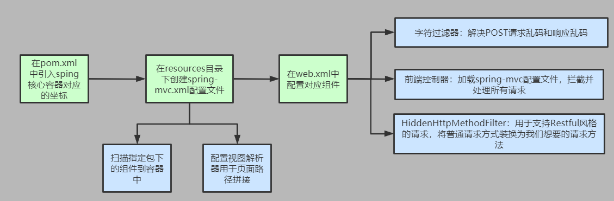
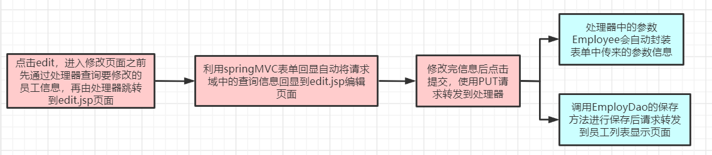

# ①RestfulCRUD

- 利用SpringMVC做一个CRUD（增删改查）符合Rest风格的
- C：Create：创建
- R：Retrieve：查询
- U：Update：更新
- D：Delete：删除

---

## 基础环境搭建



## 创建dao

- 使用Map来存储数据，模拟数据库表
- DepartmentDao

```java
package com.kl.dao;

import java.util.Collection;
import java.util.HashMap;
import java.util.Map;

import com.kl.bean.Department;
import org.springframework.stereotype.Repository;


@Repository
public class DepartmentDao {

   private static Map<Integer, Department> departments = null;
   
   static{
      departments = new HashMap<Integer, Department>();
      
      departments.put(101, new Department(101, "D-AA"));
      departments.put(102, new Department(102, "D-BB"));
      departments.put(103, new Department(103, "D-CC"));
      departments.put(104, new Department(104, "D-DD"));
      departments.put(105, new Department(105, "D-EE"));
   }
   
    //返回所有的部门
   public Collection<Department> getDepartments(){
      return departments.values();
   }
   
    //根据部门id返回部门信息
   public Department getDepartment(Integer id){
      return departments.get(id);
   }
   
}
```

- EmployeeDao

```java
package com.kl.dao;

import java.util.Collection;
import java.util.HashMap;
import java.util.Map;

import com.kl.bean.Department;
import com.kl.bean.Employee;
import org.springframework.beans.factory.annotation.Autowired;
import org.springframework.stereotype.Repository;

@Repository
public class EmployeeDao {

    //员工表
   private static Map<Integer, Employee> employees = null;
   
   @Autowired
   private DepartmentDao departmentDao;
   
   static{
      employees = new HashMap<Integer, Employee>();

      employees.put(1001, new Employee(1001, "E-AA", "aa@163.com", 1, new Department(101, "D-AA")));
      employees.put(1002, new Employee(1002, "E-BB", "bb@163.com", 1, new Department(102, "D-BB")));
      employees.put(1003, new Employee(1003, "E-CC", "cc@163.com", 0, new Department(103, "D-CC")));
      employees.put(1004, new Employee(1004, "E-DD", "dd@163.com", 0, new Department(104, "D-DD")));
      employees.put(1005, new Employee(1005, "E-EE", "ee@163.com", 1, new Department(105, "D-EE")));
   }
   
    //初始id,新增员工就从1006开始
   private static Integer initId = 1006;
   
    //员工更新、保存二合一方法
   public void save(Employee employee){
      if(employee.getId() == null){
         employee.setId(initId++);
      }
      
       //根据部门id单独查出部门信息设置到员工对象中,页面提交的只需要提交部门id
      employee.setDepartment(departmentDao.getDepartment(employee.getDepartment().getId()));
      employees.put(employee.getId(), employee);
   }
   
    //查询所有员工的方法
   public Collection<Employee> getAll(){
      return employees.values();
   }
   
    //根据员工id查询员工信息
   public Employee get(Integer id){
      return employees.get(id);
   }
   
    //删除对应的员工信息
   public void delete(Integer id){
      employees.remove(id);
   }
}
```

## 创建bean

- 部门类Department

```java
package com.kl.bean;

public class Department {

   private Integer id;
   private String departmentName;

   public Department() {
   }
   
   public Department(int i, String string) {
      this.id = i;
      this.departmentName = string;
   }
   //......
}
```

- 员工类Employee

```java
package com.kl.bean;


public class Employee {

   private Integer id;
   private String lastName;
   private String email;
   //1 male, 0 female
   private Integer gender;  
   private Department department;

   public Employee(Integer id, String lastName, String email, Integer gender,
         Department department) {
      super();
      this.id = id;
      this.lastName = lastName;
      this.email = email;
      this.gender = gender;
      this.department = department;
   }

   public Employee() {   }
   
    //......
}
```

## 风格要求


## 员工展示


### 1.预期页面


### 2.在控制器中查询所有

```java
@Controller //告诉springMVC这是一个处理器,可以处理请求
public class EmployeeController {

    @Autowired
    EmployeeDao employeeDao;

    @RequestMapping(value = "/emps")
    public String getAllEmp(ModelMap modelMap) {
        Collection<Employee> all = employeeDao.getAll();
        modelMap.addAttribute("emps",all);
        return "employee";
    }
}
```

### 3.在index.jsp请求转发

```jsp
<head>
    <title>index.jsp</title>
    <jsp:forward page="/emps"/>
</head>
```

### 4.在employee.jsp页面处理查询的数据

```jsp
<%@ page contentType="text/html;charset=UTF-8" language="java" isELIgnored="false" %>
<%@ taglib uri="http://java.sun.com/jsp/jstl/core" prefix="c" %>
<html>
<head>
    <title>Title</title>
</head>
<body>
<table border="1" cellspacing="0" cellpadding="5">
    <tr>
        <th>ID</th>
        <th>lastName</th>
        <th>email</th>
        <th>gender</th>
        <th>departmentName</th>
        <th>EDIT</th>
        <th>DELETE</th>
    </tr>
    <c:forEach items="${emps}" var="emp">
        <tr>
            <td>${emp.id}</td>
            <td>${emp.lastName}</td>
            <td>${emp.email}</td>
            <td>${emp.gender == 0 ? "女" : "男"}</td>
            <td>${emp.department.departmentName}</td>
            <td><a href="#">编辑</a></td>
            <td><a href="#">删除</a></td>
        </tr>
    </c:forEach>
</table>
</body>
</html>
```

### 5.需要导入JSTL库

```xml
<!-- https://mvnrepository.com/artifact/javax.servlet/jstl -->
<dependency>
  <groupId>javax.servlet</groupId>
  <artifactId>jstl</artifactId>
  <version>1.2</version>
</dependency>
```

### 6.在employee.jsp页面引入JSTL库

```jsp
<%@ page contentType="text/html;charset=UTF-8" language="java" isELIgnored="false" %>
<%@ taglib uri="http://java.sun.com/jsp/jstl/core" prefix="c" %>
```

- 还要记得设置`isELIgnored="false"`，表示不忽略EL表达式

## 员工添加


- 在展示员工列表点击添加通过控制器跳转进入员工添加页面

```jsp
<%--又浏览器发请求，加/是映射到端口号--%>
<a href="jumpToAdd">员工添加</a>
```

- 控制器先查询出部门的全部信息存入请求域中再跳转到add.jsp页面

```java
@RequestMapping(value = "/jumpToAdd")
public String jumpToAddPage(Model model){
    Collection<Department> departments = departmentDao.getDepartments();
    model.addAttribute("depts", departments);
    return "add";
}
```

- add.jsp取出请求域中的部门信息，展示在多选下拉列表给用户选择


```jsp
<%@ page contentType="text/html;charset=UTF-8" language="java" isELIgnored="false" %>
<%@ taglib uri="http://java.sun.com/jsp/jstl/core" prefix="c" %>
<%
    /*得到工程名--->  /springMVC  */
    pageContext.setAttribute("path",request.getContextPath());
%>
<html>
<head>
    <title>添加页面</title>
</head>
<body>
<%--尽量保证标签中的name属性和employee对象中的属性名一样，这样就可以实现自动封装带bean对象中--%>
<%--表单以name=value的形式提交--%>
<form action="${path}/emp" method="post">
    lastName:<input type="text" name="lastName"><br/>
    email:<input type="text" name="email"><br/>
    gender:<input type="radio" name="gender" value="1">男
    <input type="radio" name="gender" value="0">女<br/>
    dept:
    <select name="department.id">
        <c:forEach items="${depts}" var="dept">
            <option value="${dept.id}">
                ${dept.departmentName}
            </option>
        </c:forEach>
    </select><br/>
    <input type="submit" value="保存">
</form>
</body>
</html>
```

- 要想使用`pageContext.setAttribute`方法就需要导入jsp-api的坐标

```xml
<!-- https://mvnrepository.com/artifact/javax.servlet.jsp/javax.servlet.jsp-api -->
<dependency>
    <groupId>javax.servlet.jsp</groupId>
    <artifactId>javax.servlet.jsp-api</artifactId>
    <version>2.2.1</version>
    <scope>provided</scope>
</dependency>
```

- 控制器执行添加方法并返回到员工列表页面

```java
@RequestMapping(value = "/emp",method = RequestMethod.POST)
public String addEmp(Employee employee){
    System.out.println("要保存的员工信息："+employee);
    employeeDao.save(employee);
    return "redirect:/emps"; //重定向,重新查询员工列表信息
}
```

## 员工修改



- edit连接

```jsp
<a href="${path}/emp/${emp.id}">编辑</a>
```

- 控制器查询要修改的员工信息和部门信息以便在edit.jsp显示

```java
@RequestMapping(value = "/emp/{id}",method = RequestMethod.GET)
public String getEmp(@PathVariable("id") Integer id, Model model){
    System.out.println("执行-----------");
    //根据要修改的employee的ID值查出要修改的对象信息并放入请求域
    Employee employee = employeeDao.get(id);
    model.addAttribute("employee",employee);
    //再查出所有部门的信息给用户选择
    Collection<Department> departments = departmentDao.getDepartments();
    model.addAttribute("depts",departments);
    return "edit";
}
```

- edit.jsp页面


```jsp
<%@ page contentType="text/html;charset=UTF-8" language="java" isELIgnored="false" %>
<%@ taglib prefix="form" uri="http://www.springframework.org/tags/form" %>

<%
/*得到工程名--->  /springMVC  */
pageContext.setAttribute("path",request.getContextPath());
%>
<html>
    <head>
        <title>编辑页面</title>
    </head>
    <%--使用springMVC的表单回显--%>
    <body>
        <%--modelAttribute指定从请求域中要取出的key名--%>
        <%--springMVC会取出key，再将这个key中的value与path比对，只要名字相同就会自动赋值--%>
        <form:form action="${path}/emp/${employee.id}" modelAttribute="employee">
            <%--使用PUT请求提交要修改的信息--%>
            <input type="hidden" name="_method" value="put">
            lastName:<input type="text" readonly="readonly" name="lastName" value="${employee.lastName}"><br/>
            email:<form:input path="email"/><br/>
            gender:<form:radiobutton path="gender" value="1"/>男
            <form:radiobutton path="gender" value="0"/>女<br/>
            dept:
            <%--path相当于html表单中的name--%>
            <%--items自定遍历出所有的信息，没一个遍历到的对象都是Department--%>
            <%--itemLabel指定下拉列表要展示的信息--%>
            <%--itemValue为表单真正要提交的信息--%>
            <form:select path="department.id" items="${depts}"
                         itemLabel="departmentName" itemValue="id">
            </form:select><br/>
            <input type="submit" value="提交修改">
        </form:form>
    </body>
</html>
```

- 提交修改进行在控制器中进行处理

```java
@RequestMapping(value = "/emp/{id}",method = RequestMethod.PUT)
public String updateEmp(Employee employee){
    employeeDao.save(employee);
    System.out.println(employee);
    return "redirect:/emps";
}
```

- 主：上面传来的id信息也会被自动封装到Employee对象中

## 员工删除


- 删除请求

```jsp
<td><a href="${path}/emp/${emp.id}">编辑</a></td>
<td>
    <form action="${path}/emp/${emp.id}" method="post">
        <input type="hidden" name="_method" value="delete">
        <input type="submit" value="删除">
    </form>
</td>
```

- 处理器拿到id信息进行处理

```java
@RequestMapping(value = "emp/{id}",method = RequestMethod.DELETE)
public String deleteEmp(@PathVariable("id") Integer id){
    System.out.println("删除方法...");
    employeeDao.delete(id);
    return "redirect:/emps";
}
```

- 重新查询并返回展示页面

```java
@RequestMapping(value = "/emps",method = RequestMethod.GET)
public String getAllEmp(ModelMap modelMap) {
    Collection<Employee> all = employeeDao.getAll();
    modelMap.addAttribute("emps",all);
    return "employee";
}
```

## 引入jQuery文件情态资源访问

- 针对上面的删除操作，相当于每个删除按钮都是一个表单，那么当数据量很大的时候就会有很多表单，这样页面的负荷就太大了
- 问题：如果我们不使用表单，那么怎么进行DELETE请求了？
  - 我们可以引入jQuery，将删除方式改为超链接，再为对应的超链接注册点击事件，由jQuery来帮我们发送DELETE请求


- 对于静态资源的访问，需要在spring-mvc.xml配置文件中进行注册

```xml
<!--默认前端处理器是拦截所有请求(除了jsp),如果要使用jQuery,在前端控制器是没有映射的,它处理不了-->
<!--前端处理器处理不了的映射请求就默认交给tomcat服务器进行处理-->
<mvc:default-servlet-handler/>

<!--当为了处理静态资源问题而加入mvc:default-servlet-handler时,
    一定要加入mvc:annotation-driven,不然requestMapping会失效,动态资源也会访问不了-->
<!--当使用自定义类型转换器的时候需要加上mvc:annotation-driven标签-->
<!--当使用mvc:view-controller标签时一定要加入mvc:annotation-driven,不然会使requestMapping失效-->
<mvc:annotation-driven/>
```

- 注意：在IDEA中静态资源一定要放在webapp目录下创建一个static目录，再将静态资源放入才可以访问得到


- 在头标签下引入jquery

```jsp
<script type="text/javascript" src="${path}/static/scripts/jquery-1.9.1.min.js"></script>
```

- 使用jquery

```jsp
           <%---------------------------------------%>
<td><a href="${path}/emp/${emp.id}">编辑</a></td>
            <td><a href="${path}/emp/${emp.id}" class="delete_btn">删除</a></td>
        </tr>
    </c:forEach>
</table>
<%--又浏览器发请求，加/是映射到端口号--%>
<a href="jumpToAdd">员工添加</a>

<form action="" method="post" id="deleteFrom">
    <input type="hidden" name="_method" value="delete">
</form>
<script type="text/javascript">
    $(function () {
        $(".delete_btn").click(function(){
            //1.修改表单中的提交地址
            $("#deleteFrom").attr("action",this.href);
            //2.提交表单
            $("#deleteFrom").submit();
            //禁用默认行为
            return false;
        });
    })
</script>
```

- 小细节要注意
  - `type="text/javascript"`，不要写成`"javascript"`
  - `this.herf`不要写成t`his.herf()`
  - `$("#deleteFrom").submit()`不要写成`$("#deleteFrom").submit`

# ②mvc:annotation-drivern


# ③数据校验

- 数据校验；只做前端校验是不安全的；在重要数据一定要加上后端验证；
- 可以写程序将我们每一个数据取出进行校验，如果失败直接来到添加页面，提示其重新填写；
- springMVC；可以JSR303来做数据校验JDBC：规范---实现（各个厂商的驱动包）
- JSR303：规范-----ibernate validator（第三方校验）

## JSR303

- JSR 303是Java为Bean数据合法性校验提供的标准框架它已经包含在JavaEE 6.0中
- JSR 303通过在Bean属性上标注类似于@NotNull.@Max等标准的注解指定校验规则，并通过标准的验证接口对Bean进行验证


## 注册检验测试

- 导入校验框架的jar坐标

```xml
<!-- https://mvnrepository.com/artifact/org.hibernate.validator/hibernate-validator -->
<dependency>
  <groupId>org.hibernate.validator</groupId>
  <artifactId>hibernate-validator</artifactId>
  <version>6.1.5.Final</version>
</dependency>
```

- 接着只需要给javabean的属性添加上校验注解

```java
package com.kl.bean;

import org.hibernate.validator.constraints.Length;
import org.springframework.format.annotation.DateTimeFormat;

import javax.validation.constraints.Email;
import javax.validation.constraints.NotEmpty;
import javax.validation.constraints.Pattern;
import java.util.Date;

public class User {
    @NotEmpty
    @Pattern(regexp = "/^[a-zA-Z0-9_-]{4,16}$/",message = "4到16位（字母，数字，下划线，减号）")
    private String username;

    @NotEmpty
    @Length(min = 6,max = 10)
    private String password;

    @NotEmpty
    @Email
    private String email;

    @DateTimeFormat(pattern = "yyyy-MM-dd")
    private Date birth;

    //................
}
```

- 发送请求到控制器，由控制器跳转到注册页面

```jsp
<jsp:forward page="/register"/>
```

- 控制器

```java
@Controller
public class UserController {

    //用于跳转到注册页面
    @RequestMapping(value = "/register")
    public String jumpToRgs(Model model){
        System.out.println("执行...");
        model.addAttribute("user",new User());
        return "register";
    }

    //检查校验是否合格
    @RequestMapping(value = "/rgs")
    //增加@Valid注解，验证失败会报错
    //在User user参数后要紧跟BindingResult result
    private String register(@Valid User user, BindingResult result) {
        if (result.hasErrors()) {
            System.out.println("======有校验错误======");
            return "register";
        }
        System.out.println(user + "注册成功");
        return "success";
    }
}
```

- 注册页面

```jsp
<%@ page contentType="text/html;charset=UTF-8" language="java" isELIgnored="false" %>
<%@ taglib prefix="form" uri="http://www.springframework.org/tags/form" %>
<%@ taglib uri="http://java.sun.com/jsp/jstl/core" prefix="c" %>
<%
/*得到工程名--->  /springMVC  */
pageContext.setAttribute("path",request.getContextPath());
%>
<html>
    <head>
        <title>注册</title>
    </head>
    <body>
        <form:form action="${path}/rgs" modelAttribute="user">
            <%--form:errors用于错误信息的回显--%>
            用户名：<form:input path="username" /><form:errors path="username"/><br/>
            密 码：<form:input path="password"/><form:errors path="password"/><br/>
            邮 箱：<form:input path="email"/><form:errors path="email"/><br/>
            生 日：<form:input path="birth"/><form:errors path="birth"/><br/>
            <input type="submit" value="注册">
        </form:form>
    </body>
</html>
```

- 点击注册后会自动回显错误信息


# ④ajax

- 原生的javaweb
  - 导入GSON
  - 返回的数据用GSON转成json
  - 写出去
- 使用springMVC

---

## 导入jackson坐标

```xml
<!-- https://mvnrepository.com/artifact/com.fasterxml.jackson.core/jackson-databind -->
<dependency>
  <groupId>com.fasterxml.jackson.core</groupId>
  <artifactId>jackson-databind</artifactId>
  <version>2.11.0</version>
</dependency>
```

```xml
<!-- https://mvnrepository.com/artifact/com.fasterxml.jackson.core/jackson-core -->
<dependency>
  <groupId>com.fasterxml.jackson.core</groupId>
  <artifactId>jackson-core</artifactId>
  <version>2.11.0</version>
</dependency>
```

```xml
<!-- https://mvnrepository.com/artifact/com.fasterxml.jackson.core/jackson-annotations -->
<dependency>
  <groupId>com.fasterxml.jackson.core</groupId>
  <artifactId>jackson-annotations</artifactId>
  <version>2.11.0</version>
</dependency>
```

## 浏览器获取json数据

### 写配置

- 点击超链接就会发送请求到控制器中的getAll方法查询所有的数据

```jsp
<%
/*得到工程名--->  /springMVC  */
pageContext.setAttribute("path",request.getContextPath());
%>
<%@ page contentType="text/html;charset=UTF-8" language="java" isErrorPage="true" %>
<html>
    <head>
        <title>index.jsp</title>
    </head>
    <body>
        <a href="${path}/ajax">ajax</a>
    </body>
</html>
```

### @ResponseBody测试

- 根据前端发来的请求，配置上@ResponseBody注解就会将查询到的所有数据以json的格式返回到浏览器

```java
@Controller
public class AjaxController {
    @Autowired
    EmployeeDao employeeDao;

    /**
     * @ResponseBody 将返回的数据放在响应体中
     * @return 如果返回的是对象，jackson包自动将对象转换成json格式
     */
    @ResponseBody
    @RequestMapping("/ajax")
    public Collection<Employee> getAll(){
        return employeeDao.getAll();
    }
}
```


## @RequestBody

### 获取请求体

- 表单项

```jsp
<form action="${path}/requestBody" method="post">
    <input type="text" name="username" value="admin"><br/>
    <input type="text" name="password" value="123456"><br/>
    <input type="submit">
</form>
```

- 在后台获取请求体
- 注意：只有POST请求方式有请求体

```java
@RequestMapping(value = "requestBody")
public String requestBody(@RequestBody String body){
    System.out.println("请求体："+body);
    return "success";
}
```


### 使用springMVC发送ajax请求

- 使用springMVC发送ajax请求
- 注意：若设置contentType : ‘application/json’发起请求，data必须将JavaScript对象转换成json字符串，否则后台接收不到参数，导致报错
- contentType:'application/x-www-form-urlencoded',(默认设置)最终参数是以username=admin&password=123456这个格式传至后台

```jsp
<%@ taglib prefix="form" uri="http://www.springframework.org/tags/form"%>
<%@ taglib uri="http://java.sun.com/jsp/jstl/core" prefix="c" %>
<%
/*得到工程名--->  /springMVC  */
pageContext.setAttribute("path",request.getContextPath());
%>
<%@ page contentType="text/html;charset=UTF-8" language="java" isErrorPage="true" isELIgnored="false" %>
<html>
    <head>
        <title>index.jsp</title>
    </head>
    <script type="text/javascript" src="${path}/static/scripts/jquery-1.9.1.min.js"></script>
    <script type="text/javascript">
        $(function () {
            $("a:first").click(function () {
                const js = {                        
                    username: "庄周",
                    password: "520"
                };
                const postData = JSON.stringify(js); //JavaScript对象转换json字符串
                $.ajax({
                    contentType : 'application/json',//指定发送至服务器的信息的类型
                    url:"${path}/ajaxData",          //请求的地址
                    type:"POST",                     //请求的方式
                    dataType:"json",                 //预期服务器返回的类型
                    data:postData,                   //要发送的json数据
                    success:function (data) {        //请求成功后的回调函数
                        alert(data.username);        //参数:由服务器返回,并根据dataType参数进行处理后的数据
                        alert(data.password);
                    },
                    error:function () {              //请求失败时调用此函数
                        alert("请求失败")
                    }
                });
            })
        })
    </script>
    <body>
        <a href="">通过ajax发送json数据到控制器</a>
    </body>
</html>
```

- 将页面发送来的json数据自动封装到javabean对象中

```java
/**
 * @ResponseBody 返回json数据
 * @RequestBody 接收json数据
 * @param account 将传来的json数据封装到Account对象中
 * @return jackson包自动将对象转换成json格式返回ajax的回调函数中
 */
@RequestMapping(value = "/ajaxData",method = RequestMethod.POST)
@ResponseBody
public Account ajaxData(@RequestBody Account account){
    System.out.println(account);
    return account;
}
```

# ⑤文件上传

## 文件上传表单

```jsp
<%@ taglib prefix="form" uri="http://www.springframework.org/tags/form"%>
<%@ taglib uri="http://java.sun.com/jsp/jstl/core" prefix="c" %>
<%
/*得到工程名--->  /springMVC  */
pageContext.setAttribute("path",request.getContextPath());
%>
<%@ page contentType="text/html;charset=UTF-8" language="java" isErrorPage="true" isELIgnored="false" %>
<html>
    <head>
        <title>index.jsp</title>
    </head>
    <body>
        <form action="${path}/upload" method="post" enctype="multipart/form-data">
            用户头像：<input type="file" name="headerImg"><br/>
            用户名：<input type="text" name="username"><br/>
            <input type="submit">
        </form>
    </body>
</html>
```

## 导入文件上传坐标

```xml
<!-- 文件上传 -->
<dependency>
    <groupId>commons-fileupload</groupId>
    <artifactId>commons-fileupload</artifactId>
    <version>1.3.1</version>
</dependency>
<dependency>
    <groupId>commons-io</groupId>
    <artifactId>commons-io</artifactId>
    <version>2.4</version>
</dependency>
```

## 配置文件上传解析器

```xml
<!--配置文件上传解析器-->
<bean id="multipartResolver" class="org.springframework.web.multipart.commons.CommonsMultipartResolver">
    <!--允许上传文件的最大值20MB-->
    <!--#{}是spring专有的EL表达式语言，可以在大括号内直接进行计算-->
    <property name="maxUploadSize" value="#{1024*1024*20}"/>
    <!--文件的字符编码设置-->
    <property name="defaultEncoding" value="UTF-8"/>
</bean>
```

## 文件上传处理请求

- 只需要在方法参数中添加`@RequestParam("headerImg")MultipartFile file`
- MultipartFile 对象就会保存上传到服务器的文件信息

```java
@Controller
public class FileUploadController {

    @RequestMapping(value = "/upload")
    public String fileUpload(@RequestParam("username") String username,
                             @RequestParam("headerImg")MultipartFile file,
                             Model model) {
        System.out.println("得到上传表单中文件项的名字"+file.getName());
        String filename = file.getOriginalFilename();
        System.out.println("得到上传文件的真实名字"+filename);
        //保存文件
        try {
            file.transferTo(new File("D:\\test\\"+filename));
            model.addAttribute("msg","文件上传成功");
        } catch (IOException e) {
            model.addAttribute("msg","文件上传失败");
            e.printStackTrace();
        }
        return "success";
    }
}
```

# ⑥多文件上传

- 上传文件的表单
  - 注意这里文件的name都是一样的，这样在控制器就可以只用用一个数组参数接收

```jsp
<%@ taglib prefix="form" uri="http://www.springframework.org/tags/form"%>
<%@ taglib uri="http://java.sun.com/jsp/jstl/core" prefix="c" %>
<%
/*得到工程名--->  /springMVC  */
pageContext.setAttribute("path",request.getContextPath());
%>
<%@ page contentType="text/html;charset=UTF-8" language="java" isErrorPage="true" isELIgnored="false" %>
<html>
    <head>
        <title>index.jsp</title>
    </head>
    <body>
        <form action="${path}/upload" method="post" enctype="multipart/form-data">
            用户头像：<input type="file" name="headerImg"><br/>
            用户头像：<input type="file" name="headerImg"><br/>
            用户头像：<input type="file" name="headerImg"><br/>
            用户名：<input type="text" name="username"><br/>
            <input type="submit">
        </form>
    </body>
</html>
```

- 处理上传请求
  - 多文件上传就接收数组类型的文件`MultipartFile[] files`
  - 对上传的文件逐一遍历，保存到对应的路径下即可

```java
@Controller
public class FileUploadController {

    @RequestMapping(value = "/upload")
    public String fileUpload(@RequestParam("username") String username,
                             @RequestParam("headerImg")MultipartFile[] files,
                             Model model) {
        for (MultipartFile file : files) {
            if (!file.isEmpty()){
                try {
                    //保存文件
                    file.transferTo(new File("D:\\test\\"+file.getOriginalFilename()));
                    model.addAttribute("msg","文件上传成功");
                } catch (IOException e) {
                    model.addAttribute("msg","文件上传失败");
                    e.printStackTrace();
                }
            }
        }
        return "success";
    }
}
```

# ⑦文件下载

## SpringMVC方式

```java
/**
 * ResponseEntity
 * @param-body 文件流字节数组
 * @param-headers 响应头
 * @param-status 响应状态码
 */
@RequestMapping(value = "/download")
public ResponseEntity<byte[]> download(HttpServletRequest request) throws IOException {
    //获取服务器中要下载的文件的真实路径
    ServletContext servletContext = request.getServletContext();
    String realPath = servletContext.getRealPath("/static/scripts/jquery-1.9.1.min.js");
    //拿到具体文件
    File file = new File(realPath);
    //得到该文件的流
    FileInputStream in = new FileInputStream(file);
    //用字节数组读取文件流
    byte[] bytes = new byte[in.available()];
    in.read(bytes);
    in.close();
    //将要下载的文件流返回
    HttpHeaders headers = new HttpHeaders();
    headers.add("Content-Disposition", "attachment;filename=" + file.getName());
    return new ResponseEntity<>(bytes, headers, HttpStatus.OK);
}
```

## JavaWeb方式下载文件

- 默认情况下，如果我们不指定content-type的时候，浏览器是无法判断如何去解析这个页面的

```java
@RequestMapping(value = "/download")
public void download(HttpServletResponse response) throws IOException {
    response.getWriter().println("hello");
    response.addHeader("Content-Disposition","attachment");
}
```

- 访问下载方法浏览器就下载一个名为download.txt的文件，文件中的内容就是"hello"

---

- 使用javaweb方式下载文件

```java
@RequestMapping(value = "/download")
public void download(HttpServletResponse response,HttpServletRequest request) throws IOException {
    //得到文件在服务器中的真实路径
    ServletContext servletContext = request.getServletContext();
    String realPath = servletContext.getRealPath("/static/scripts/jquery-1.9.1.min.js");
    //使用File包装,使得该路径下的文件可操作
    File file = new File(realPath);
    //设置响应头
    response.setHeader("Content-Disposition", "attachment;filename=" + file.getName());
    //获取文件的流并输出
    FileInputStream in = new FileInputStream(file);
    byte[] bytes = new byte[in.available()];
    ServletOutputStream out = response.getOutputStream();
    out.write(bytes);
}
```

- File类:表示文件或者目录的路径的抽象表现形式，IO流就是对文件进行操作的 
- File类的功能

```java
A:创建功能
    public boolean createNewFile();
    public boolean mkdir();
    public boolean mkdirs();
B:删除功能
    public boolean delete()
C:重命名功能
    public boolean renameTo(File file)
D:判断功能
    public boolean isDirectory();
    public boolean isFile();
    public boolean exists();
    public boolean canRead()
    public boolean canWrite()
    public boolean isHidden()
    E:获取功能
    public String getName();
    public String getAbsolutePath();//获取绝对路径，如果file对象中本身就是绝对路径，就和getPath()相同
    public String getPath();
    public long length();
    public long lastModified();
F:高级获取功能
    public String[] list()
    public File[] listFiles() 
G:过滤器功能
    public String[] list(FileNameFilter filter)
    public File[] listFiles(FileNameFilter filter)
```

