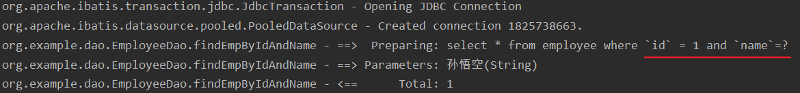
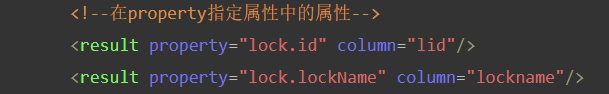
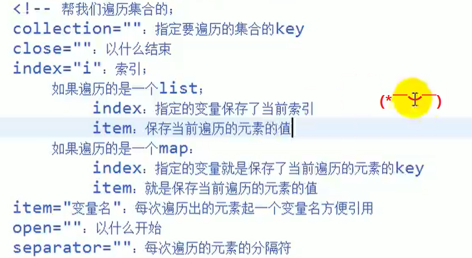

# Myabtis

## ①mybatis简洁

1. MyBatis；和数据库进行交互；持久化层框架（SQL映射框架）

2. 从原始的JDBC----dbutils（QueryRunner）----dbTemplate---xxx；不用的称为工具；

   - 工具：一些功能的简单封装
   - 框架：某个领域的整体解决方案；缓存，考虑异常处理问题，考虑部分字段映射问题。

   - 不用生JDBC：
     1. 麻烦；
     2. sql语句是硬编码在程序中的；耦合（数据库层的和java编码耦合，sql语言是直接在dao层编写）

3. Hibernate-数据库交互的框架（ORM框架）（使用各种框架）

   - ORM（Object Relation Mapping）对象关系映射创建好javaBean；

---

- 原生的JDBC执行流程


- Hibernate与数据库交互，零SQL语句编写


- Mybatis与数据库交互，只需要自己写sql语句就行了


1. Mybatis将重要的编写sql语句步骤抽取出来交给开发者自由定制，其他流程全部实现自动化
2. 在配置文件中编写sql（利于维护）
3. 完全解决数据库优化的问题
4. Mybatis底层就是对原生JDBC的一个简单封装
5. 既将java编码与sql语句抽取了出来，还不会失去自动化的功能，属于半自动的持久层框架
6. Mybatis是一个轻量级的框架

## ②环境搭建

### 导坐标

- 导入mybatis坐标

```xml
<!-- https://mvnrepository.com/artifact/org.mybatis/mybatis -->
<dependency>
    <groupId>org.mybatis</groupId>
    <artifactId>mybatis</artifactId>
    <version>3.4.6</version>
</dependency>
```

- 导入数据库连接池坐标

```xml
<!-- https://mvnrepository.com/artifact/mysql/mysql-connector-java -->
<dependency>
    <groupId>mysql</groupId>
    <artifactId>mysql-connector-java</artifactId>
    <version>5.1.38</version>
</dependency>
```

- 建议导入日志包；这样的化在mybatis关键的环节就会有日志打印，log4j（日志框架）

```xml
<!-- https://mvnrepository.com/artifact/log4j/log4j -->
<dependency>
    <groupId>log4j</groupId>
    <artifactId>log4j</artifactId>
    <version>1.2.17</version>
</dependency>
```

- 依赖类路径下一个log4j.properties配置文件

```properties
log4j.rootLogger=DEBUG,CONSOLE,file
#log4j.rootLogger=ERROR,ROLLING_FILE
log4j.logger.cn.smbms.dao=debug
log4j.logger.com.ibatis=debug
log4j.logger.com.ibatis.common.jdbc.SimpleDataSource=debug
log4j.logger.com.ibatis.common.jdbc.ScriptRunner=debug
log4j.logger.com.ibatis.sqlmap.engine.impl.SqlMapClientDelegate=debug
log4j.logger.java.sql.Connection=debug
log4j.logger.java.sql.Statement=debug
log4j.logger.java.sql.PreparedStatement=debug
log4j.logger.java.sql.ResultSet=debug
log4j.logger.org.tuckey.web.filters.urlrewrite.UrlRewriteFilter=debug

######################################################################################
# Console Appender  \u65e5\u5fd7\u5728\u63a7\u5236\u8f93\u51fa\u914d\u7f6e
######################################################################################
log4j.appender.CONSOLE=org.apache.log4j.ConsoleAppender
log4j.appender.Threshold=error
log4j.appender.CONSOLE.Target=System.out
log4j.appender.CONSOLE.layout=org.apache.log4j.PatternLayout
log4j.appender.CONSOLE.layout.ConversionPattern= [%p] %d %c - %m%n


######################################################################################
# DailyRolling File  \u6bcf\u5929\u4ea7\u751f\u4e00\u4e2a\u65e5\u5fd7\u6587\u4ef6\uff0c\u6587\u4ef6\u540d\u683c\u5f0f:log2009-09-11
######################################################################################
log4j.appender.file=org.apache.log4j.DailyRollingFileAppender
log4j.appender.file.DatePattern=yyyy-MM-dd
log4j.appender.file.File=log.log
log4j.appender.file.Append=true
log4j.appender.file.Threshold=error
log4j.appender.file.layout=org.apache.log4j.PatternLayout
log4j.appender.file.layout.ConversionPattern=%d{yyyy-M-d HH:mm:ss}%x[%5p](%F:%L) %m%n


log4j.logger.com.opensymphony.xwork2=error  
```

### 写配置(全局配置文件和SQL映射文件)

- 先根据数据库表创建bean对象


- Employee类

```java
public class Employee {
    private Integer id;
    private String name;
    private String email;
    //.........
}
```

- 创建持久层接口

```java
public interface EmployeeDao {
    public Employee findEmpById(Integer id);
}
```

1. 第一个配置文件；（称为mybatis的全局配置文件，指导mybatis如何正确运行，比如连接向哪个数据库）
   - mybatis-config.xml

```xml
<?xml version="1.0" encoding="UTF-8" ?>
<!DOCTYPE configuration
        PUBLIC "-//mybatis.org//DTD Config 3.0//EN"
        "http://mybatis.org/dtd/mybatis-3-config.dtd">
<configuration>
    <environments default="development">
        <environment id="development">
            <transactionManager type="JDBC"/>
            <dataSource type="POOLED">
                <property name="driver" value="com.mysql.jdbc.Driver"/>
                <property name="url" value="jdbc:mysql:///jdbc"/>
                <property name="username" value="root"/>
                <property name="password" value="root"/>
            </dataSource>
        </environment>
    </environments>
    <!--引入我们编写的实现每一个接口方法的配置文件-->
    <mappers>
        <!--resource从类路径下开始找-->
        <mapper resource="EmployeeDao.xml"/>
    </mappers>
</configuration>
```

2. 第二个配置文件：（SQL映射文件：EmployeeDao.xml，相当于是对Dao接口的一个实现描述细节）

   1. 将mapper的namespace属性改为接口的全类名
   2. 配置细节

   - EmployeeDao.xml

```xml
<?xml version="1.0" encoding="UTF-8" ?>
<!DOCTYPE mapper
        PUBLIC "-//mybatis.org//DTD Mapper 3.0//EN"
        "http://mybatis.org/dtd/mybatis-3-mapper.dtd">
<!--namespace:名称空间；写接口的全类名，相当于告诉MyBatis这个配置文件是实现哪个接口的-->
<mapper namespace="org.example.dao.EmployeeDao">
    <!-- public Employee findEmpById(Integer id);-->
     <!--select标签用来定义一个查询操作-->
    <!--id:方法名，相当于这个配置是对某个方法的实现-->
    <!--resultType:指定方法运行后的返回值类型（查询操作必须指定）-->
    <!--#{id}代表某个传递过来的参数的值-->
    <select id="findEmpById" resultType="org.example.bean.Employee">
    select * from employee where id = #{id}
</select>
</mapper>
```

3. 我们写的dao接口的实现文件，mybatis默认是不知道的，需要在全局配置文件中注册

## ③测试使用Mybatis框架

```java
public class MybatisTest {
    /**
     * 1.根据全局配置文件创建出一个SqlSessionFactory
     *       SqlSessionFactory：是SqlSession工厂，负责创建SqlSession对象
     *       SqlSession：sql会话（代表和数据库的一次会话）
     * 2.获取和数据库的一次会话：相当于getConnection()
     * 3.使用SqlSession操作数据库，getMapper获取EmployeeDao接口的代理对象
     * 4.最后关闭资源
     */
      @Test
    public void test1() throws IOException {
        String resource = "mybatis.xml";
        InputStream inputStream = Resources.getResourceAsStream(resource);
        SqlSessionFactory factory = new SqlSessionFactoryBuilder().build(inputStream);

        SqlSession sqlSession = factory.openSession();
        EmployeeDao employeeDao = sqlSession.getMapper(EmployeeDao.class);
        Employee emp = employeeDao.findEmpById(1);
        System.out.println(emp);
        sqlSession.close();
        inputStream.close();
    }
}
```

## ④执行完整的CRUD操作

- 在EmployeeDao接口中添加完整的CRUD方法

```java
public interface EmployeeDao {
    Employee findEmpById(Integer id);

    int insertEmp(Employee emp);

    boolean deleteEmp(Integer id);

    int updateEmp(Employee emp);
}
```

- 在EmployeeDao.xml配置文件中编写与EmployeeDao接口中方法对应的SQL语句

```xml
<?xml version="1.0" encoding="UTF-8" ?>
<!DOCTYPE mapper
        PUBLIC "-//mybatis.org//DTD Mapper 3.0//EN"
        "http://mybatis.org/dtd/mybatis-3-mapper.dtd">
<!--namespace:名称空间；写接口的全类名，相当于告诉MyBatis这个配置文件是实现哪个接口的-->
<mapper namespace="org.example.dao.EmployeeDao">
    <!-- public Employee findEmpById(Integer id);-->
    <!--select标签用来定义一个查询操作-->
    <!--id:方法名，相当于这个配置是对某个方法的实现-->
    <!--resultType:指定方法运行后的返回值类型（查询操作必须指定）-->
    <!--#{id}代表某个传递过来的参数的值-->
    <select id="findEmpById" resultType="org.example.bean.Employee">
        select * from employee where id = #{id}
    </select>
    <!--增删改返回值类型和参数类型都不用在标签指定-->
    <!--#{}直接取出方法参数中的值,如果是自定义对象就直接取出对应属性的值-->
    <!--int insertEmp(Employee emp)-->
    <insert id="insertEmp">
        insert into employee(`name`,`emial`) values (#{name},#{email})
    </insert>
    <!--boolean deleteEmp(Integer id)-->
    <delete id="deleteEmp">
        delete from employee where id = #{id}
    </delete>
    <!--int updateEmp(Employee emp)-->
    <update id="updateEmp">
        update from employee set `name`=#{name},`eamil`=#{email}
    </update>
</mapper>
```

1. 根据全局配置文件创建出一个SqlSessionFactory
   - SqlSessionFactory：是SqlSession工厂，负责创建SqlSession对象
   - SqlSession：sql会话（代表和数据库的一次会话）
2. 获取和数据库的一次会话：相当于getConnection()
3. 使用SqlSession操作数据库，getMapper获取EmployeeDao接口的代理对象(映射器)

```java
package org.example;

import org.apache.ibatis.io.Resources;
import org.apache.ibatis.session.SqlSession;
import org.apache.ibatis.session.SqlSessionFactory;
import org.apache.ibatis.session.SqlSessionFactoryBuilder;
import org.example.bean.Employee;
import org.example.dao.EmployeeDao;
import org.junit.After;
import org.junit.Before;
import org.junit.Test;

import java.io.IOException;
import java.io.InputStream;

public class MybatisTest {

    /**
     * 1.根据全局配置文件创建出一个SqlSessionFactory
     *       SqlSessionFactory：是SqlSession工厂，负责创建SqlSession对象
     *       SqlSession：sql会话（代表和数据库的一次会话）
     * 2.获取和数据库的一次会话：相当于getConnection()
     * 3.使用SqlSession操作数据库，getMapper获取EmployeeDao接口的代理对象(映射器)
     */

    private InputStream inputStream;
    private SqlSession sqlSession;
    private EmployeeDao employeeDao;

    @Before
    public void init() throws IOException {
        String resource = "mybatis.xml";
        inputStream = Resources.getResourceAsStream(resource);
        SqlSessionFactory factory = new SqlSessionFactoryBuilder().build(inputStream);
        sqlSession = factory.openSession();
        employeeDao = sqlSession.getMapper(EmployeeDao.class);
    }

    @After
    public void destroy() throws IOException {
        sqlSession.commit();
        inputStream.close();
        sqlSession.close();
    }

    /**
     * 查询
     */
    @Test
    public void testRead(){
        Employee emp = employeeDao.findEmpById(8);
        System.out.println(emp);
    }

    /**
     * 添加
     */
    @Test
    public void testAdd(){
        Employee employee = new Employee();
        employee.setId(null);
        employee.setName("小兵张嘎");
        employee.setEmail("solider@163.com");
        int i = employeeDao.insertEmp(employee);
        System.out.println(i);
    }

    /**
     * 删除
     */
    @Test
    public void testDelete(){
        boolean b = employeeDao.deleteEmp(8);
        System.out.println(b);
    }

    /**
     * 更新
     */
    @Test
    public void testUpdate(){
        Employee employee = new Employee();
        employee.setId(4);
        employee.setName("二郎神");
        employee.setEmail("secondGod@163.com");
        int i = employeeDao.updateEmp(employee);
        System.out.println(i);
    }
}
```

- mybatis的事务自动提交默认是关闭的，需要手动提交


- 需要设置`sqlSession.commit()`增删改才会有作用

---

- 也可以在使用工厂创建SqlSession对象的时候设置事务为自动提交


## ⑤全局配置文件

- 在使用mybatis框架之前我们需要编写两个配置文件：
  1. 全局配置文件：mybatis-config.xml；指导mybatis正确运行的一些全局设置；
  2. SQL映射文件：EmployeeDao.xml；相当于是对Dao接口的一个实现描述细节：
     - 获取到的是接口的代理对象；mybatis自动创建的；
     - SqlSessionFactory和SqlSession；SqlSessionFactory创建SqlSession对象，Factory只new-次就行SalSession：相当于connection和数据库进行交互的，和数据库的一次会话，就应该创建一个新的sqlSession；

---

- 我们先来看看全局配置文件中可以使用的标签和配置的信息，SQL映射文件下面会说到
- configuration 配置
  - properties 属性
  - settings 设置
  - typeAliases 类型命名
  - typeHandlers 类型处理器
  - objectFactory 对象工厂
  - plugins 插件
  - environments 环境
    - environment 环境变量
      - transactionManager 事务管理器
      - dataSource 数据源
  - databaseIdProvider 数据库厂商标识
  - mappers 映射器

### properties 属性

- 在resources目录下编写dbConfig.properties配置文件

```properties
driveClass=com.mysql.jdbc.Driver
jdbcUrl=jdbc:mysql://localhost:3306/jdbc
username=root
password=root
```

- 引入dbConfig.properties配置文件并去出dbConfig.properties配置文件中的value值

```xml
<?xml version="1.0" encoding="UTF-8" ?>
<!DOCTYPE configuration
        PUBLIC "-//mybatis.org//DTD Config 3.0//EN"
        "http://mybatis.org/dtd/mybatis-3-config.dtd">
<configuration>
    <!--和Spring的context：property-placeholder标签 一样:引用外部配置文化-->
    <!--resource:引用类路径下的资源-->
    <!--url:引用磁盘路径或网络路径下的资源-->
    <properties resource="dbConfig.properties"/>

    <environments default="development">
        <environment id="development">
            <transactionManager type="JDBC"/>
            <dataSource type="POOLED">
                <!--使用${}取出dbConfig.properties中的value-->
                <property name="driver" value="${driveClass}"/>
                <property name="url" value="${jdbcUrl}"/>
                <property name="username" value="${username}"/>
                <property name="password" value="${password}"/>
            </dataSource>
        </environment>
    </environments>
    <!--引入我们编写的实现每一个接口方法的配置文件-->
    <mappers>
        <!--resource从类路径下开始找-->
        <mapper resource="EmployeeDao.xml"/>
    </mappers>
</configuration>
```

### setting 设置:smile:

- 这是 MyBatis 中极为重要的调整设置，它们会改变 MyBatis 的运行时行为
- 属性mapUnderscoreToCamelCase：是否开启自动驼峰命名规则（camel case）映射，即从经典数据库列名 A_COLUMN 到经典 Java 属性名 aColumn 的类似映射

---

- 如果数据库中有形如login_account这样的列名，在javaBean对应字段就会有loginAccount这样的属性名，但是他们并不是对应的，在执行查询语句的时候需要为login_account列名起别名为loginAccount才能封装成功
- 如果将setting设置中的mapUnderscoreToCamelCase设置为true，那么就不需要在查询语句中起别名，mybatis会自动为我们封装

```xml
<settings>
    <setting name="mapUnderscoreToCamelCase" value="true"/>
</settings>
```

### typeAliases 类型命名

```xml
<!--为我们常用的的类型（如javabean）起别名,以后在用到该对象的地方都可以使用别名-->
<typeAliases>
    <!--一个typeAlias标签就是为一个javabean对象起别名，不指定别名默认为类名，且不区分大小写-->
    <!--alias指定javabean对象的别名-->
    <typeAlias type="org.example.bean.Employee" alias="emp"/>
</typeAliases>
```

- 在实际开发中，我们的javabean对象可能会很多，如果为每一个bean对象都起别名，就需要使用很多次typeAlias标签，会很麻烦。在这种情况下我们可以选择批量取别名的方式

```xml
<!--为我们常用的的类型（如javabean）起别名,以后在用到该对象的地方都可以使用别名-->
<typeAliases>
    <!--package为指定包下的所有类都起别名，别名默认就是类名，且不区分大小写-->
   <package name="org.example.bean"/>
</typeAliases>
```

---

- 使用场景，在SQL映射文件中我们需要编写对应接口SQL语句，其中查询方法就需要在select标签中加上属性resultType（指定方法运行后的返回值类型），这个时候就可以使用别名
- 没有使用别名之前


- 使用别名之后就简洁很多了


- **注：还是不推荐使用别名，虽然看起来简洁了很多，但是这样也让代码的可读性降低了**

### mappers 映射器:smile:

```xml
<!--引入我们编写的SQL映射文件-->
<mappers>
    <!--url:从磁盘路径或网络路径开始找-->
    <!--resource:从类路径下开始找-->
    <!--class:直接引用接口的全类名
              此时对应的映射文件必须与接口位于同一路径下，并且名称相同
              如果mapper接口采用注解的方式，则无需映射文件(需要删除),只能使用class指定对应接口的全类名-->
    <mapper class="org.example.dao.EmployeeDao"/>
</mappers>
```

- 此时需要在resource目录下创建和dao接口对应的同级目录

---

- 注解版不需要编写SQL映射文件

```java
public interface EmployeeDao {
    @Select("select * from employee where id = #{id}")
    Employee findEmpById(Integer id);

    @Insert("insert into employee(`name`,`email`) values (#{name},#{email})")
    int insertEmp(Employee emp);

    @Delete("delete from employee where id = #{id}")
    boolean deleteEmp(Integer id);

    @Update("update employee set `name`=#{name},`email`=#{email} where id=#{id}")
    int updateEmp(Employee emp);
}
```

- 将EmployeeDao.xml配置文件删除，只读取mybatis-config.xml配置文件即可

---

- **注意：建议注解和XML两种方式混合使用，简单的SQL语句就直接可以使用注解标注在方法上，对于复杂重要的SQL语句还是在XML中编写**

---

- 在未来的开发中可能会有多个dao接口类，那么就会对于多个dao接口的SQL映射文件，如果我们在全局配置文件中的mappers中一条一条的注册就太麻烦了，这种情况下就可以使用批量注册

```xml
<!--引入我们编写的SQL映射文件-->
<mappers>
    <!--name:指定dao所在的包名
             必须在resources目录下创建和dao所在包相同的目录结构-->
    <package name="org.example.dao"/>
</mappers>
```

## ⑥SQL映射文件

### 获取自增id的值

- 在SQL映射文件中，以插入为例

```xml
<!--int insertEmp(Employee emp)-->
<!--如何在插入一条数据后让MyBatis自动的将自增id赋值给传入的employee对象的id属性
    useGeneratedKeys="true"：实际是调用原生jdbc获取自增主键的方法
    keyProperty=""：将获取到的自增的id赋值给哪个属性-->
<insert id="insertEmp" useGeneratedKeys="true" keyProperty="id">
    insert into employee(`name`,`email`) values (#{name},#{email})
</insert>
```

### 参数的各种取值


#### 单个参数

- 基本类型取值：#{随便写}
- 传入pojo：#{pojo的属性名}

#### 多个参数

- 如果在dao接口中增加了这个方法

```java
public Employee getEmpByIdAndEmpName（Integer id，string empName）
```

- 接着就需要在SQL映射文件中根据对应的方法编写对应的SQL语句

```xml
<!--Employee findEmpByIdAndName(Integer id,String name)-->
<select id="findEmpByIdAndName" resultType="org.example.bean.Employee">
    select * from employee where id = #{id} and name=#{name}
</select>
```

- 传参进行测试

```java
@Test
public void testRead2(){
    Employee emp = employeeDao.findEmpByIdAndName(1,"孙悟空");
    System.out.println(emp);
}
```

- 一运行就报参数绑定异常


- 取值：#{参数名}是无效了；可用：0，1（参数的索引）或者param1，param2（第几个参数paramN）
- 原因：只要传入了多个参数；mybatis会自动的将这些参数封装在一个map中；封装时使用的key就是参数的索引和参数的第几个表示，形如

```java
Map<String,Object> map = new HashMap;
map.put("param1",传入的值1);
map.put("param2",传入的值2);
//需要根据对应的key值取出对应的value值
```


---

- 解决方式一：id是第一个参数就写param1，name是第二个参数就写param2

```xml
<!--Employee findEmpByIdAndName(Integer id,String name)-->
<select id="findEmpByIdAndName" resultType="org.example.bean.Employee">
    select * from employee where `id` = #{param1} and `name`=#{param2}
</select>
```

---

- 解决方式二：使用命名参数，@Param，为参数指定key（推荐使用:fire:）
- 命名参数；我们可以告诉mybatis，封装参数map的时候别乱来，使用我们指定的key
- 在dao接口方法处添加注解@Param即可

```java
Employee findEmpByIdAndName(@Param("id") Integer id, @Param("name") String name);
```

- 在SQL映射文件中就可使用指定的key取值

```xml
<!--Employee findEmpByIdAndName(Integer id,String name)-->
<select id="findEmpByIdAndName" resultType="org.example.bean.Employee">
    select * from employee where id = #{id} and name=#{name}
</select>
```

#### 传入map

```java
Employee findEmpByIdAndName(Map<String,Object> map);
```

- 在方法中传入map

```java
@Test
public void testRead2(){
    Map<String,Object> map = new HashMap<>();
    map.put("id",1);
    map.put("name","孙悟空");
    Employee emp = employeeDao.findEmpByIdAndName(map);
    System.out.println(emp);
}
```

- SQL映射文件中的SQL语句根据对应的key取值即可

```xml
<!--Employee findEmpByIdAndName(Integer id,String name)-->
<select id="findEmpByIdAndName" resultType="org.example.bean.Employee">
    select * from employee where `id` = #{id} and `name`=#{name}
</select>
```

#### 传入list

```java
List<User> findUserList(@Param("ids") List<Integer> ids);
```

- 需要使用命名参数的形式

#### 多种类型的参数


- 无论传入什么参数，都要能正确的取出值

### #{}和${}取值的区别

- #{}：是参数预编译的方法，参数位置用?代替，可以解决SQL注入的问题，安全
- ${}：不是参数预编译，直接和SQL语句进行拼串，是不安全的

```xml
<!--Employee findEmpByIdAndName(Integer id,String name)-->
<select id="findEmpByIdAndName" resultType="org.example.bean.Employee">
    select * from employee where `id` = ${id} and `name`=#{name}
</select>
```

- 运行这个SQL语句查看日志输出，id使用${}直接拼串了,#{}使用?代替参数位置，是预编译



- 注：只有sql的参数位置是支持预编译的
- 一般都是使用#{}，在不支持参数预编译的位置要取值就使用${}
- 例如：如果表名需要动态取值，那么就可以使用${}

```java
@Test
public void testRead2(){
    Map<String,Object> map = new HashMap<>();
    map.put("emp","employee");
    map.put("id",1);
    map.put("name","孙悟空");
    Employee emp = employeeDao.findEmpByIdAndName(map);
    System.out.println(emp);
}
```

- SQL映射文件

```xml
<!--Employee findEmpByIdAndName(Integer id,String name)-->
<select id="findEmpByIdAndName" resultType="org.example.bean.Employee">
    select * from ${emp} where `id` = #{id} and `name`=#{name}
</select>
```


### 查询返回list集合

```java
List<Employee> findAll();
```

- SQL映射文件

```xml
<!--List<Employee> findAll()-->
<!--resultType:返回结果的类型,如果是集合写的就是集合里面的元素类型 -->
<select id="findAll" resultType="org.example.bean.Employee">
    select * from employee
</select>
```

- 查询测试

```java
@Test
public void testReadAll(){
    List<Employee> employees = employeeDao.findAll();
    for (Employee employee : employees) {
        System.out.println(employee);
    }
}
```

### 查询一条记录封装map

```java
@MapKey("id") //指定使用列名为id的值作为封装到map中的key
Map<Integer,Employee> findById(Integer id);
```

- SQL映射文件

```xml
<!--Map<Integer,Employee> findById(Integer id)-->
<!--resultType:一条记录返回类型填实际的value类型-->
<select id="findById" resultType="org.example.bean.Employee">
    select * from employee where id = #{id}
</select>
```

- 查询结果


### 查询多条记录封装map

```java
@MapKey("id")
Map<Integer,Employee> findAllTOMap();
```

- SQL映射文件

```xml
<!--Map<Integer,Employee> findAllTOMap()-->
<!--resultType:一条记录返回类型填实际的value类型-->
<select id="findAllTOMap" resultType="org.example.bean.Employee">
    select * from employee
</select>
```

- 查询结果


### resultMap自定义封装规则

- resultMap大标签中总共有6种小标签可以使用


#### 问题引入

- jdbc数据库中有一张这样的user表


- 创建一个对应的bean对象(这个User对象只有id属性和表中的列名对应了)

```java
public class User {
    private Integer id;
    private String username;
    private String netName;
    //....
}
```

- UserDao

```java
public interface UserDao {
    User findById(Integer id);
}
```

- UserDao.xmlSQL映射文件

```xml
<?xml version="1.0" encoding="UTF-8" ?>
<!DOCTYPE mapper
        PUBLIC "-//mybatis.org//DTD Mapper 3.0//EN"
        "http://mybatis.org/dtd/mybatis-3-mapper.dtd">
<!--namespace:名称空间；写接口的全类名，相当于告诉MyBatis这个配置文件是实现哪个接口的-->
<mapper namespace="org.example.dao.UserDao">
    <!--User findById(Integer id)-->
    <select id="findById" resultType="org.example.bean.User">
        select * from user where id=#{id}
    </select>
</mapper>
```

- 使用测试

```java
package org.example;

import org.apache.ibatis.io.Resources;
import org.apache.ibatis.session.SqlSession;
import org.apache.ibatis.session.SqlSessionFactory;
import org.apache.ibatis.session.SqlSessionFactoryBuilder;
import org.example.bean.User;
import org.example.dao.EmployeeDao;
import org.example.dao.UserDao;
import org.junit.After;
import org.junit.Before;
import org.junit.Test;

import java.io.IOException;
import java.io.InputStream;

public class ResultMapTest {

    private InputStream inputStream;
    private SqlSession sqlSession;
    private UserDao userDao;

    @Before
    public void init() throws IOException {
        String resource = "mybatis.xml";
        inputStream = Resources.getResourceAsStream(resource);
        SqlSessionFactory factory = new SqlSessionFactoryBuilder().build(inputStream);
        sqlSession = factory.openSession(true);
        userDao = sqlSession.getMapper(UserDao.class);
    }

    @After
    public void destroy() throws IOException {
        inputStream.close();
        sqlSession.close();
    }

    @Test
    public void testFind(){
        User user = userDao.findById(1);
        System.out.println(user);
    }
}
```

- 从testFind()方法运行的结果来看，只有id属性注入成功，因为User对象中只有id属性和user表中的列名对应了


#### 使用resultMap中的id和result标签自定义封装规则

```xml
<?xml version="1.0" encoding="UTF-8" ?>
<!DOCTYPE mapper
        PUBLIC "-//mybatis.org//DTD Mapper 3.0//EN"
        "http://mybatis.org/dtd/mybatis-3-mapper.dtd">
<!--namespace:名称空间；写接口的全类名，相当于告诉MyBatis这个配置文件是实现哪个接口的-->
<mapper namespace="org.example.dao.UserDao">

    <!--resultMap自己定义表中的每一列数据和javabean对象的映射规则-->
    <!--type指定为哪一个javabean自定义封装规则-->
    <!--id唯一标识，让定义的别名在后面引用-->
    <resultMap id="user" type="org.example.bean.User">
        <!--id指定主键列的对应规则-->
        <!--property:对应javabean中的属性-->
        <!--column:对应数据库表中的列名-->
        <!--意味着指定了javabean中的id属性对应着数据库表中名为id的列-->
        <id property="id" column="id"/>

        <!--result指定普通列的对应规则-->
        <result property="username" column="name"/>
        <result property="netName" column="nickname"/>
    </resultMap>


    <!--User findById(Integer id)-->
    <!--resultType="org.example.bean.User"使用默认规则，属性和列名要一一对应-->
    <!--resultMap="user"查出数据封装结果的时候使用user自定义的规则-->
    <select id="findById" resultMap="user">
        select * from user where id=#{id}
    </select>
</mapper>
```

- 再次进行同样的测试，数据结果封装完整


#### 使用resultMap中的association标签进行联合查询

##### 问题引入

- 数据库中有一张key钥匙表，一把钥匙对应一把锁


- 数据库中还有一张lock锁表


- 在key表中建立与lock表的外键关联


- 再根据两张表创建对应的javabean

```java
public class Key {
    private Integer id;
    private String keyName;

    private Lock lock; //一把钥匙对应一把锁
    //...
}
```

```java
public class Lock {
    private Integer id;
    private String lockName;
    //...
}
```

- 再创建对应的接口

```java
public interface KeyDao {
    Key findAKeyAndLock(Integer id);
}
```

- 根据接口方法编写SQL映射文件KeyDao.xml

```xml
<?xml version="1.0" encoding="UTF-8" ?>
<!DOCTYPE mapper
        PUBLIC "-//mybatis.org//DTD Mapper 3.0//EN"
        "http://mybatis.org/dtd/mybatis-3-mapper.dtd">
<!--namespace:名称空间；写接口的全类名，相当于告诉MyBatis这个配置文件是实现哪个接口的-->
<mapper namespace="org.example.dao.KeyDao">
    <!--Key findAKeyAndLock(Integer id)-->
    <!--查询出来的结果字段为
        id   keyname   lockid  lid  lockname -->
    <select id="findAKeyAndLock" resultMap="key">
        select k.*,l.id lid,l.lockname
        from `key` k left join `lock` l
        on k.`lockid` = l.`id`
        where l.`id` = #{id}
    </select>

    <!--对于复杂的表查询一般都用resultMap来指定javabean属性和列名的对应关系-->
    <!--自定义封装规则，使用级联属性封装联合查询出的结果-->
    <resultMap id="key" type="org.example.bean.Key">
        <id property="id" column="id"/>
        <result property="keyName" column="keyname"/>
        <!--在property指定属性中的属性-->
        <result property="lock.id" column="lid"/>
        <result property="lock.lockName" column="lockname"/>
    </resultMap>
</mapper>
```

- 加载全局配置文件，获取KeyDao代理对象，调用方法进行测试

```java
public class KeyTest {
    private InputStream inputStream;
    private SqlSession sqlSession;
    private KeyDao keyDao;

    @Before
    public void init() throws IOException {
        String resource = "mybatis.xml";
        inputStream = Resources.getResourceAsStream(resource);
        SqlSessionFactory factory = new SqlSessionFactoryBuilder().build(inputStream);
        sqlSession = factory.openSession(true);
        keyDao = sqlSession.getMapper(KeyDao.class);
    }

    @After
    public void destroy() throws IOException {
        //sqlSession.commit();
        inputStream.close();
        sqlSession.close();
    }

    @Test
    public void test1(){
        Key keyAndLock = keyDao.findAKeyAndLock(1);
        System.out.println(keyAndLock);
    }
}
```


##### 使用association标签

- 从上面的测试中我们在resultMap中使用了property指定属性中的属性



- mybatis推荐我们使用association标签进行级联查询封装

```xml
<!--对于复杂的表查询一般都用resultMap来指定javabean属性和列名的对应关系-->
<!--自定义封装规则，使用级联属性封装联合查询出的结果-->
<resultMap id="key" type="org.example.bean.Key">
    <id property="id" column="id"/>
    <result property="keyName" column="keyname"/>
    <!--接下来的属性是一个对象，自定义这个对象的封装规则，使用association标签表示联合了一个对象-->
    <!--property属性的名称-->
    <!--javaType属性的类型-->
    <association property="lock" javaType="org.example.bean.Lock">
        <id property="id" column="lid"/>
        <result property="lockName" column="lockname"/>
    </association>
</resultMap>
```

#### 使用colloection定义集合类型的属性

- 数据库key表中有多把钥匙对应同一把锁


- 在Lock类中获取所有能开这把锁的钥匙

```java
LockDaopublic class Lock {
    private Integer id;
    private String lockName;

    /**
     * 1-1关联，1-n关联，n-1关联，n-n关联
     * 从一把key开一把lock开看是1-1关联
     * 从多把key都可以开一把lock来看是n-1关联
     * 从一把lock可以被多把key开来看是n-1关联
     * 从一个学生可以有多个老师，一个老师可以教多个学生来看是n-n关联
     * 
     * 1-n或是n-1:外键应该放在n的一段
     * n-n关系应该建立一张中间表来存储对应关系
     */
    List<Key> keys;
    
    //...
}
```

- LockDao接口

```java
public interface LockDao {

    //查锁的时候也将对应的锁查出来
    Lock findLockById(Integer id);
}
```

- SQL映射文件

```xml
<?xml version="1.0" encoding="UTF-8" ?>
<!DOCTYPE mapper
        PUBLIC "-//mybatis.org//DTD Mapper 3.0//EN"
        "http://mybatis.org/dtd/mybatis-3-mapper.dtd">
<!--namespace:名称空间；写接口的全类名，相当于告诉MyBatis这个配置文件是实现哪个接口的-->
<mapper namespace="org.example.dao.LockDao">
    <!--Lock findLockById(Integer id)-->
    <select id="findLockById" resultMap="lock">
        select l.*,k.id kid,k.`keyname`,k.`lockid`
        from `lock` l left join `key` k on l.`id` = k.`lockid`
        where l.`id` = #{id};
    </select>

    <!-- id  lockname    kid   keyname        lockid
         3  666办公室锁    3  666办公室钥匙1      3
         3  666办公室锁    4  666办公室钥匙2      3
         3  666办公室锁    5  666办公室钥匙3      3
     -->
    <resultMap id="lock" type="org.example.bean.Lock">
        <id property="id" column="id"/>
        <result property="lockName" column="lockname"/>
        <!--指定集合属性的封装规则-->
        <!--property是集合类型的属性名-->
        <!--javaType:在association标签中指定属性的类型
            ofType:在collection标签中指定集合中的类型
        -->
        <collection property="keys" ofType="org.example.bean.Key">
            <!--标签体指定这个集合中元素的封装规则-->
            <id property="id" column="kid"/>
            <result property="keyName" column="keyname"/>
        </collection>
    </resultMap>
</mapper>
```

- 接口方法测试

```java
public class LockTest {
    private InputStream inputStream;
    private SqlSession sqlSession;
    private LockDao lockDao;

    @Before
    public void init() throws IOException {
        String resource = "mybatis.xml";
        inputStream = Resources.getResourceAsStream(resource);
        SqlSessionFactory factory = new SqlSessionFactoryBuilder().build(inputStream);
        sqlSession = factory.openSession(true);
        lockDao = sqlSession.getMapper(LockDao.class);
    }

    @After
    public void destroy() throws IOException {
        //sqlSession.commit();
        inputStream.close();
        sqlSession.close();
    }

    @Test
    public void test1(){
        Lock lock = lockDao.findLockById(3);
        System.out.println(lock);
    }
}
```


## ⑦动态sql(OGNL)

- Person.lastName就可以取到lastName的值
- Person.Address.city就可以取到city的值
- ......以此类推，这就是对象导航图OGNL


### if标签和where标签

```xml
<!--User findUserByCondition(User user)-->
<!--where标签会为我们拼接where在sql语句后面，并且帮我们去掉判断语句中前面多余的and-->
<!--if标签中的test填写判断条件，id!=null，取出javabean中id的属性值进行判断，不为null就拼接上id=?-->
<select id="findUserByCondition" resultMap="user">
    select * from user
    <where>
    <if test="id!=null">
        and id=#{id}
    </if>
    <if test="username!=null and username!=''">
        and name=#{username}
    </if>
    </where>
</select>
```

### collection标签



```xml
<!--List<User> findUserList(@Param("ids") List<Integer> ids)-->
<select id="findUserList" resultMap="user">
    select * from user
    <where>
        id in
        <foreach collection="ids" open="(" close=")" separator="," item="id_item">
            id=#{id_item}
        </foreach>
    </where>
</select>
```

### choose分支选择标签

```xml
<!--List<User> findByChoose(User user)-->
<select id="findByChoose" resultMap="user">
    select * from user
    <where>
        <choose>
            <when test="id!=null">
                id=#{id}
            </when>
            <when test="username!=null">
                `name`=#{username}
            </when>
            <otherwise>
                1=1
            </otherwise>
        </choose>
    </where>
</select>
```

### set标签完成mybatis的动态更新

```xml
<!--int updateUser(User user)-->
<update id="updateUser">
    update user
    <set>
        <!--username不为null且不为空字符串-->
        <if test="username!=null and !username.equals(&quot;&quot;)">
            `name`=#{username},
        </if>
        <if test="netName!=null and !netName.equals(&quot;&quot;)">
            `nickname`=#{netName},
        </if>
    </set>
    <where>
        id=#{id}
    </where>
</update>
```

## ⑧缓存

- MyBatis缓存机制：缓存数据保存在一个Map中；能保存查询出的一些数据
- 一级缓存：线程级别的缓存；本地缓存；SqlSession级别的缓存
- 二级缓存：全局范围的缓存；除过当前线程；SqlSession能用外其他也可以使用

### 一级缓存

- SqlSession级别的缓存，默认开启


- 每次查询，先看一级缓存中有没有，如果没有就去发送新的sql，每个sqlSession拥有自己的一级缓存

### 二级缓存

- namesapce级别的缓存（在特定的dao.xml文件中开启），需要手动开启


- SqISession关闭或者提交以后，一级缓存的数据会放在二级缓存中
- 二级缓存默认没有开启

---

1. 使用二级缓存需要先在全局配置文件中配置

```xml
<!--settings开启全局配置-->
<settings>
    <!--cacheEnabled开启二级缓存-->
    <setting name="cacheEnabled" value="true"/>
</settings>
```

2. 配置某个dao的SQL映射文件，让其使用二级缓存

```xml
<!--使用二级缓存-->
<cache/>
```

### 缓存的查询顺序


### 缓存的原理

- 没有Dao有它自己的二级缓存


### 缓存有关的属性


### 整合第三方缓存

- MyBatis框架的环境机制内部就是一个Map，做的很简陋，所以Mybatis开放了Cache接口，可以整合第三方的缓存机制
- 整合ehcache，ehcache是非常专业的java进程内的缓存框架

---

- 导入ehcache-core核心包

```xml
<!-- https://mvnrepository.com/artifact/net.sf.ehcache/ehcache-core -->
<dependency>
    <groupId>net.sf.ehcache</groupId>
    <artifactId>ehcache-core</artifactId>
    <version>2.6.11</version>
</dependency>
```

- 导入mybatis-ehcache整合包

```xml
<!-- https://mvnrepository.com/artifact/org.mybatis.caches/mybatis-ehcache -->
<dependency>
    <groupId>org.mybatis.caches</groupId>
    <artifactId>mybatis-ehcache</artifactId>
    <version>1.1.0</version>
</dependency>
```

- 还要依赖两个日志包

```xml
<!-- https://mvnrepository.com/artifact/org.slf4j/slf4j-api -->
<dependency>
    <groupId>org.slf4j</groupId>
    <artifactId>slf4j-api</artifactId>
    <version>2.0.0-alpha1</version>
</dependency>
```

```xml
<!-- https://mvnrepository.com/artifact/org.slf4j/slf4j-log4j12 -->
<dependency>
    <groupId>org.slf4j</groupId>
    <artifactId>slf4j-log4j12</artifactId>
    <version>2.0.0-alpha1</version>
    <scope>test</scope>
</dependency>
```

- 还需要创建ehcache.xml配置文件，放在类路径下

```xml
<?xml version="1.0" encoding="UTF-8"?>
<ehcache xmlns:xsi="http://www.w3.org/2001/XMLSchema-instance"
         xsi:noNamespaceSchemaLocation="http://ehcache.org/ehcache.xsd">
 <!-- 磁盘保存路径 -->
 <diskStore path="D:\44\ehcache" />
 
 <defaultCache 
   maxElementsInMemory="1" 
   maxElementsOnDisk="10000000"
   eternal="false" 
   overflowToDisk="true" 
   timeToIdleSeconds="120"
   timeToLiveSeconds="120" 
   diskExpiryThreadIntervalSeconds="120"
   memoryStoreEvictionPolicy="LRU">
 </defaultCache>
</ehcache>
 
<!-- 
属性说明：
l diskStore：指定数据在磁盘中的存储位置。
l defaultCache：当借助CacheManager.add("demoCache")创建Cache时，EhCache便会采用<defalutCache/>指定的的管理策略
 
以下属性是必须的：
l maxElementsInMemory - 在内存中缓存的element的最大数目 
l maxElementsOnDisk - 在磁盘上缓存的element的最大数目，若是0表示无穷大
l eternal - 设定缓存的elements是否永远不过期。如果为true，则缓存的数据始终有效，如果为false那么还要根据timeToIdleSeconds，timeToLiveSeconds判断
l overflowToDisk - 设定当内存缓存溢出的时候是否将过期的element缓存到磁盘上
 
以下属性是可选的：
l timeToIdleSeconds - 当缓存在EhCache中的数据前后两次访问的时间超过timeToIdleSeconds的属性取值时，这些数据便会删除，默认值是0,也就是可闲置时间无穷大
l timeToLiveSeconds - 缓存element的有效生命期，默认是0.,也就是element存活时间无穷大
 diskSpoolBufferSizeMB 这个参数设置DiskStore(磁盘缓存)的缓存区大小.默认是30MB.每个Cache都应该有自己的一个缓冲区.
l diskPersistent - 在VM重启的时候是否启用磁盘保存EhCache中的数据，默认是false。
l diskExpiryThreadIntervalSeconds - 磁盘缓存的清理线程运行间隔，默认是120秒。每个120s，相应的线程会进行一次EhCache中数据的清理工作
l memoryStoreEvictionPolicy - 当内存缓存达到最大，有新的element加入的时候， 移除缓存中element的策略。默认是LRU（最近最少使用），可选的有LFU（最不常使用）和FIFO（先进先出）
 -->
```

- 在对应Dao的SQL映射文件中配置使用自定义的cache

```xml
<!--使用ehcache缓存-->
<cache type="org.mybatis.caches.ehcache.EhcacheCache"/>
```

- 还有可以不同的Dao共用缓存

```xml
<mapper namespace="org.example.dao.EmployeeDao">
    <!--和userDao共用一块缓存-->
    <cache-ref namespace="org.example.dao.UserDao"/>
```

