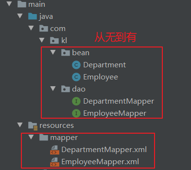

# 逆向工程

## 坐标和配置

- 导入逆向工程核心包

```xml
<!-- https://mvnrepository.com/artifact/org.mybatis.generator/mybatis-generator-core -->
<dependency>
    <groupId>org.mybatis.generator</groupId>
    <artifactId>mybatis-generator-core</artifactId>
    <version>1.3.7</version>
</dependency>
```

- 再工程下创建mbg.xml逆向工程配置文件

```xml
<?xml version="1.0" encoding="UTF-8"?>
<!DOCTYPE generatorConfiguration
        PUBLIC "-//mybatis.org//DTD MyBatis Generator Configuration 1.0//EN"
        "http://mybatis.org/dtd/mybatis-generator-config_1_0.dtd">
<generatorConfiguration>

    <context id="DB2Tables" targetRuntime="MyBatis3Simple">
        <commentGenerator>
            <property name="suppressAllComments" value="true" />
        </commentGenerator>
        <!-- 配置数据库连接 -->
        <jdbcConnection driverClass="com.mysql.jdbc.Driver"
                        connectionURL="jdbc:mysql://localhost:3306/ssm_crud"
                        userId="root"
                        password="root">
        </jdbcConnection>

        <javaTypeResolver>
            <property name="forceBigDecimals" value="false" />
        </javaTypeResolver>

        <!--生成POJO-->
        <!--targetPackage指定javaBean生成放在哪一个包下 -->
        <!--targetProject指定javaBean生成放在哪一个工程路径下-->
        <javaModelGenerator targetPackage="com.kl.bean"
                            targetProject=".\src\main\java">
            <property name="enableSubPackages" value="true" />
            <property name="trimStrings" value="true" />
        </javaModelGenerator>

        <!--指定sql映射文件生成的位置 -->
        <sqlMapGenerator targetPackage="mapper" targetProject=".\src\main\resources">
            <property name="enableSubPackages" value="true" />
        </sqlMapGenerator>

        <!-- 指定dao接口生成的位置，mapper接口 -->
        <javaClientGenerator type="XMLMAPPER"
                             targetPackage="com.kl.dao" targetProject=".\src\main\java">
            <property name="enableSubPackages" value="true" />
        </javaClientGenerator>


        <!-- table指定每个表的生成策略 -->
        <!--tableName数据库中的表名-->
        <!--domainObjectName这张表对应的对象名-->
        <table tableName="tbl_emp" domainObjectName="Employee"/>
        <table tableName="tbl_dept" domainObjectName="Department"/>
    </context>
</generatorConfiguration>
```

- 通过运行java代码的方式来触发逆向工程的创建

```java
public class MGBTest {
    @Test
    public void testMBG() throws Exception {
        List<String> warnings = new ArrayList<String>();
        boolean overwrite = true;
        File configFile = new File("mbg.xml");
        ConfigurationParser cp = new ConfigurationParser(warnings);
        Configuration config = cp.parseConfiguration(configFile);
        DefaultShellCallback callback = new DefaultShellCallback(overwrite);
        MyBatisGenerator myBatisGenerator = new MyBatisGenerator(config, callback, warnings);
        myBatisGenerator.generate(null);
    }
}
```



## mapper接口中的方法解析

- mapper接口中的函数及方法

| 方法                                                         | 功能说明                                                     |
| ------------------------------------------------------------ | ------------------------------------------------------------ |
| int countByExample(UserExample example) thorws SQLException  | 按条件计数                                                   |
| int deleteByPrimaryKey(Integer id) thorws SQLException       | 按主键删除                                                   |
| int deleteByExample(UserExample example) thorws SQLException | 按条件查询                                                   |
| String/Integer insert(User record) thorws SQLException       | 插入数据（返回值为ID）                                       |
| User selectByPrimaryKey(Integer id) thorws SQLException      | 按主键查询                                                   |
| ListselectByExample(UserExample example) thorws SQLException | 按条件查询                                                   |
| ListselectByExampleWithBLOGs(UserExample example) thorws SQLException | 按条件查询（包括BLOB字段）。只有当数据表中的字段类型有为二进制的才会产生。 |
| int updateByPrimaryKey(User record) thorws SQLException      | 按主键更新                                                   |
| int updateByPrimaryKeySelective(User record) thorws SQLException | 按主键更新值不为null的字段                                   |
| int updateByExample(User record, UserExample example) thorws SQLException | 按条件更新                                                   |
| int updateByExampleSelective(User record, UserExample example) thorws SQLException | 按条件更新值不为null的字段                                   |

## example实例解析

- mybatis的逆向工程中会生成实例及实例对应的example，example用于添加条件，相当where后面的部分

```java
xxxExample example = new xxxExample();
Criteria criteria = new Example().createCriteria();
```

| 方法                                       | 说明                                          |
| ------------------------------------------ | --------------------------------------------- |
| example.setOrderByClause(“字段名 ASC”);    | 添加升序排列条件，DESC为降序                  |
| example.setDistinct(false)                 | 去除重复，boolean型，true为选择不重复的记录。 |
| criteria.andXxxIsNull                      | 添加字段xxx为null的条件                       |
| criteria.andXxxIsNotNull                   | 添加字段xxx不为null的条件                     |
| criteria.andXxxEqualTo(value)              | 添加xxx字段等于value条件                      |
| criteria.andXxxNotEqualTo(value)           | 添加xxx字段不等于value条件                    |
| criteria.andXxxGreaterThan(value)          | 添加xxx字段大于value条件                      |
| criteria.andXxxGreaterThanOrEqualTo(value) | 添加xxx字段大于等于value条件                  |
| criteria.andXxxLessThan(value)             | 添加xxx字段小于value条件                      |
| criteria.andXxxLessThanOrEqualTo(value)    | 添加xxx字段小于等于value条件                  |
| criteria.andXxxIn(List<？>)                | 添加xxx字段值在List<？>条件                   |
| criteria.andXxxNotIn(List<？>)             | 添加xxx字段值不在List<？>条件                 |
| criteria.andXxxLike(“%”+value+”%”)         | 添加xxx字段值为value的模糊查询条件            |
| criteria.andXxxNotLike(“%”+value+”%”)      | 添加xxx字段值不为value的模糊查询条件          |
| criteria.andXxxBetween(value1,value2)      | 添加xxx字段值在value1和value2之间条件         |
| criteria.andXxxNotBetween(value1,value2)   | 添加xxx字段值不在value1和value2之间条件       |

## 应用举例

### 查询

- selectByPrimaryKey()

```java
User user = XxxMapper.selectByPrimaryKey(100); //相当于select * from user where id = 100
```

- selectByExample() 和 selectByExampleWithBLOGs()

```java
UserExample example = new UserExample();
Criteria criteria = example.createCriteria();
criteria.andUsernameEqualTo("鲁班七号");
criteria.andUsernameIsNull();
example.setOrderByClause("username asc,email desc");
List<?>list = XxxMapper.selectByExample(example);
//相当于：select * from user where username = '鲁班七号' and  username is null order by username asc,email desc
```

- 注：在iBator逆向工程生成的文件XxxExample.java中包含一个static的内部类Criteria，Criteria中的方法是定义SQL 语句where后的查询条件

### 插入数据

- insert()

```java
User user = new User();
user.setId("1");
user.setUsername("admin");
user.setPassword("123456")
user.setEmail("lkl@163.com");
XxxMapper.insert(user);
//相当于：insert into user(ID,username,password,email) values ('1','admin','123456','lkl@126.com');
```

### 更新数据

- updateByPrimaryKey()

```java
User user =new User();
user.setId("1");
user.setUsername("admin");
user.setPassword("123456");
user.setEmail("lkl@163.com");
XxxMapper.updateByPrimaryKey(user);
//相当于：update user set username='admin', password='123456', email='lkl@163.com' where id='1'
```

- updateByPrimaryKeySelective()

```java
User user = new User();
user.setId("1");
user.setPassword("123456");
XxxMapper.updateByPrimaryKey(user);
//相当于：update user set password='123456' where id='1'
```

- updateByExample() 和 updateByExampleSelective()

```java
UserExample example = new UserExample();
Criteria criteria = example.createCriteria();
criteria.andUsernameEqualTo("admin");
User user = new User();
user.setPassword("123456");
XxxMapper.updateByPrimaryKeySelective(user,example);
//相当于：update user set password='123456' where username='admin'
```

- updateByExample()更新所有的字段，包括字段为null的也更新，建议使用 updateByExampleSelective()更新想更新的字段

### 删除数据

- deleteByPrimaryKey()

```java
XxxMapper.deleteByPrimaryKey(1);  //相当于：delete from user where id=1
```

- deleteByExample()

```java
UserExample example = new UserExample();
Criteria criteria = example.createCriteria();
criteria.andUsernameEqualTo("admin");
XxxMapper.deleteByExample(example);
//相当于：delete from user where username='admin'
```

### 查询数据数量

- countByExample()

```java
UserExample example = new UserExample();
Criteria criteria = example.createCriteria();
criteria.andUsernameEqualTo("老夫子");
int count = XxxMapper.countByExample(example);
//相当于：select count(*) from user where username='老夫子'
```

# 分页工具

## 坐标和配置

```xml
<dependency>
  <groupId>com.github.pagehelper</groupId>
  <artifactId>pagehelper</artifactId>
  <version>5.2.0</version>
</dependency>
```

- #### 在 MyBatis全局配置文件中 配置拦截器插件

```xml
<plugins>
    <plugin interceptor="com.github.pagehelper.PageInterceptor">
    </plugin>
</plugins>
```

- #### 在 Spring 配置文件中配置拦截器插件

- 使用 spring 的属性配置方式，可以使用 `plugins` 属性像下面这样配置：

```xml
<bean id="sqlSessionFactory" class="org.mybatis.spring.SqlSessionFactoryBean">
  <!-- 注意其他配置 -->
  <property name="plugins">
    <array>
      <bean class="com.github.pagehelper.PageInterceptor">
        <property name="properties">
          <!--使用下面的方式配置参数，一行配置一个,可以不配置 -->
          <value>
            params=value1
          </value>
        </property>
      </bean>
    </array>
  </property>
</bean>
```

## 方法调用

- 使用PageHelper.startPage 静态方法调用startPage
- Service层示例代码

```java
public PageInfo findPage(int page,int pageSize){
    PageHelper.startPage(page,pageSize);
    List<Company> List=companyDao.selectAll();
    PageInfo pageInfo = new PageInfo(list);
    return pageInfo;
}
```

1. 静态方法，传递两个参数（当前页码，每页查询条数）
2. 使用pageHelper 分页的时候，不再关注分页语句，查询全部的语句
3. 自动的对PageHelper.startPage 方法下的第一个sql 查询进行分页
   - `PageHelper.startPage(1,5);`
4. 紧跟着的第一个select 方法会被分页：
   - `List<Country> list = countryMapper.findAll();`
5. 也就是说再Service层PageHelper.startPage(1,5);语句后一定是紧跟查询语句

## pageInfo对象

```java
public class PageInfo<T> implements Serializable {
    private static final long serialVersionUID = 1L;
    //当前页
    private int pageNum;
    //每页的数量
    private int pageSize;
    //当前页的数量
    private int size;
    //由于startRow 和endRow 不常用，这里说个具体的用法
    //可以在页面中"显示startRow 到endRow 共size 条数据"
    //当前页面第一个元素在数据库中的行号
    private int startRow;
    //当前页面最后一个元素在数据库中的行号
    private int endRow;
    //总记录数
    private long total;
    //总页数
    private int pages;
    //结果集
    private List<T> list;
    //前一页
    private int prePage;
    //下一页
    private int nextPage;
    //是否为第一页
    private boolean isFirstPage = false;
    //是否为最后一页
    private boolean isLastPage = false;
    //是否有前一页
    private boolean hasPreviousPage = false;
    //是否有下一页
    private boolean hasNextPage = false;
    //导航页码数
    private int navigatePages;
    //所有导航页号
    private int[] navigatepageNums;
    //导航条上的第一页
    private int navigateFirstPage;
    //导航条上的最后一页
    private int navigateLastPage;
}
```

## 使用

- 在Controller中的使用是将Service层返回来的PageInfo对象放入request域中
- 在jsp页面中的取值根据PageInfo中的get方法，使用EL表达式取出保存的值

