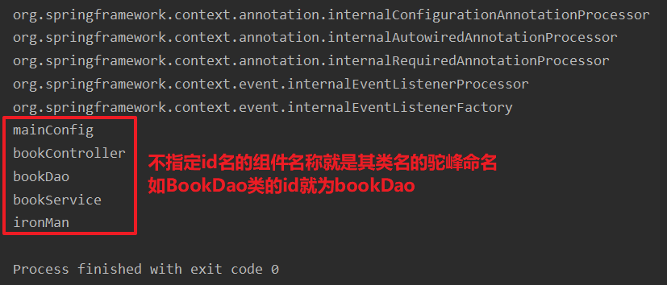
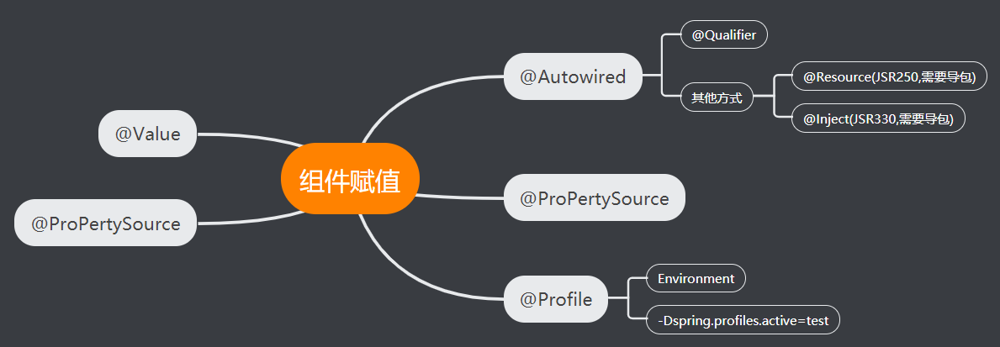

# 一、Spring注解驱动开发预览


# 二、bean的组件注册


## 1.使用XML配置注入到bean对象

- 第一：需要往下面这个bean类注入数据

```java
package com.kl.bean;

public class Person {
    private String name;
    private Integer age;
    
    //...........
}
```

- 第二：在resource目录下创建spring的bean.xml文件，并为bean类的属性赋值

```xml
<?xml version="1.0" encoding="UTF-8"?>
<beans xmlns="http://www.springframework.org/schema/beans"
       xmlns:xsi="http://www.w3.org/2001/XMLSchema-instance"
       xsi:schemaLocation="http://www.springframework.org/schema/beans http://www.springframework.org/schema/beans/spring-beans.xsd">

    <bean class="com.kl.bean.Person" id="person">
        <property name="name" value="蝙蝠侠"/>
        <property name="age" value="20"/>
    </bean>
</beans>
```

- 读取该bena.xml配置文件的信息，将对象放入到IOC容器中并注入数据

```java
public class PersonTest {

    @Test
    public void test1(){
        ApplicationContext ioc = new ClassPathXmlApplicationContext("bean.xml");
        Person person = ioc.getBean("person", Person.class);
        System.out.println(person); //Person{name='蝙蝠侠', age=20}
    }
}
```

## 2.使用@Configuration和@bean来为容器中注册组件

- 使用XML方式进行配置太麻烦了！！！
- 使用注解将对象添加到IOC容器里
- 第一：先创建一个配置类

```java
package com.kl.config;

import com.kl.bean.Person;
import org.springframework.context.annotation.Bean;
import org.springframework.context.annotation.Configuration;


@Configuration //告诉spring这是一个配置类,配置类 = 配置文件
public class MainConfig {

    @Bean //给容器中注入一个bean对象,类型为返回值类型,默认使用方法名作为id
    public Person person(){
        return new Person("钢铁侠",30);
    }
}
```

- 第二：获取容器中的对象即可

```java
public class PersonTest {

    @Test
    public void test2(){
        ApplicationContext ioc = new AnnotationConfigApplicationContext(MainConfig.class);
        Person person = ioc.getBean(Person.class);
        System.out.println(person); //Person{name='钢铁侠', age=30}
    }
}
```

---

- 可以手动更改bean对象在IOC容器中的名称，即id

```java
@Configuration
public class MainConfig {

    @Bean(value = "ironMan")
    public Person person(){
        return new Person("钢铁侠",30);
    }
}
```

- 再次获取

```java
public class PersonTest {
    
    @Test
    public void test2(){
        ApplicationContext ioc = new AnnotationConfigApplicationContext(MainConfig.class);
        Person person = ioc.getBean("ironMan",Person.class);
        System.out.println(person);
    }
}
```

## 3.使用@ComponentScan自动扫描组件

- 若使用XML文件

```xml
<?xml version="1.0" encoding="UTF-8"?>
<beans xmlns="http://www.springframework.org/schema/beans"
       xmlns:xsi="http://www.w3.org/2001/XMLSchema-instance"
       xmlns:context="http://www.springframework.org/schema/context"
       xsi:schemaLocation="http://www.springframework.org/schema/beans http://www.springframework.org/schema/beans/spring-beans.xsd http://www.springframework.org/schema/context http://www.springframework.org/schema/context/spring-context.xsd">

    <!--配置文件被加载时会自动扫描com.kl包下带有@Controller,@Service,@Repository,@Component注解的类,将其加入到springIoc容器中-->
    <context:component-scan base-package="com.kl"/>
      
    <bean class="com.kl.bean.Person" id="person">
        <property name="name" value="蝙蝠侠"/>
        <property name="age" value="20"/>
    </bean>
</beans>
```

- 使用注解的方式扫描组件
- 第一：在com.kl包下创建业务类，控制类和持久层类

```java
package com.kl.dao;

import org.springframework.stereotype.Repository;

@Repository
public class BookDao {
}

-----------------------------------------------------------------
package com.kl.controller;

import org.springframework.stereotype.Controller;

@Controller
public class BookController {
}

-----------------------------------------------------------------
package com.kl.service;

import org.springframework.stereotype.Service;

@Service
public class BookService {
}
   
```

- 第二：在配置类上使用注解@ComponentScan

```java
@Configuration //告诉spring这是一个配置类,配置类 = 配置文件
@ComponentScan(value = "com.kl") //指明要扫描的包
public class MainConfig {

    @Bean(value = "ironMan") //给容器中注入一个bean对象,类型为返回值类型,默认使用方法名作为id
    public Person person(){
        return new Person("钢铁侠",30);
    }
}
```

- 第三：当配置类被加载时com.kl包下的组件就会被加入到Ioc容器中

```java
public class IocTest {
    @Test
    public void test1(){
        ApplicationContext ioc = new AnnotationConfigApplicationContext(MainConfig.class);
        String[] names = ioc.getBeanDefinitionNames(); //得到Ioc容器中所有bean对象的id名称
        for (String name : names) {
            System.out.println(name);
        }
    }
}
```



---

- 还可以指定不扫描com.kl包下的某些内容，过滤规则可以是根据注解名称排除，也可以根据类等来排除

```java
@Configuration //告诉spring这是一个配置类,配置类 = 配置文件c
@ComponentScan(value = "com.kl",excludeFilters = {@ComponentScan.Filter(type = FilterType.ANNOTATION,classes = {Controller.class, Service.class})}) //不加入@Controller和@Service注解标注的bean对象
public class MainConfig {

    @Bean(value = "ironMan") //给容器中注入一个bean对象,类型为返回值类型,默认使用方法名作为id
    public Person person(){
        return new Person("钢铁侠",30);
    }
}
```


- 也可以设置扫描只包含指定注解的bean
- 注意：只包含扫描默认情况下扫描com.kl包下的全部注解内容，若想要该方法生效，必须改变默认值`useDefaultFilters = false`

```java
@Configuration //告诉spring这是一个配置类,配置类 = 配置文件c
@ComponentScan(value = "com.kl",includeFilters = {@ComponentScan.Filter(type = FilterType.ANNOTATION,
        classes = {Controller.class, Service.class})},useDefaultFilters = false) //只扫描@Controller和@Service注解标注的bean对象
public class MainConfig {

    @Bean(value = "ironMan") //给容器中注入一个bean对象,类型为返回值类型,默认使用方法名作为id
    public Person person(){
        return new Person("钢铁侠",30);
    }
}
```

- 再次运行测试类，BookDao确实没有被扫描进IOC容器


---

- 根据类的类型来排除
- 可以设置多个@ComponentScan.Filte

```java
@Configuration //告诉spring这是一个配置类,配置类 = 配置文件c
@ComponentScan(value = "com.kl",includeFilters = {@ComponentScan.Filter(type = FilterType.ANNOTATION,
        classes = {Controller.class}),@ComponentScan.Filter(type = FilterType.ASSIGNABLE_TYPE,
        classes = {BookDao.class})},useDefaultFilters = false) //扫描BookDao类和@Controller注解
public class MainConfig {

    @Bean(value = "ironMan") //给容器中注入一个bean对象,类型为返回值类型,默认使用方法名作为id
    public Person person(){
        return new Person("钢铁侠",30);
    }
}
```


## 4.使用@Scope设置组件作用域

- 第一：重新创建一个配置文件

```java
package com.kl.config;

import com.kl.bean.Person;
import com.kl.dao.BookDao;
import org.springframework.context.annotation.Bean;
import org.springframework.context.annotation.ComponentScan;
import org.springframework.context.annotation.Configuration;
import org.springframework.context.annotation.FilterType;
import org.springframework.stereotype.Controller;


@Configuration//告诉spring这是一个配置类,配置类 = 配置文件c
public class MainConfig2 {

    @Bean(value = "batman") //给容器中注入一个bean对象,类型为返回值类型,设置id名为batman
    public Person person(){
        return new Person("蝙蝠侠",30);
    }
}
```

- 第二：测试从容器中取两次bean对象

```java
public class IocTest {
    @Test
    public void test1(){
        ApplicationContext ioc = new AnnotationConfigApplicationContext(MainConfig.class);
        String[] names = ioc.getBeanDefinitionNames();
        for (String name : names) {
            System.out.println(name);
        }
    }

    @Test
    public void test2(){
        ApplicationContext ioc = new AnnotationConfigApplicationContext(MainConfig2.class);
        String[] names = ioc.getBeanDefinitionNames();
        for (String name : names) {
            System.out.println(name);
        }
        //根据id从IOC容器中取出bean对象
        Person p1 = ioc.getBean("batman",Person.class);
        Person p2 = ioc.getBean("batman",Person.class);
        System.out.println(p1 == p2);
    }
}
```

- 可以看到加载配置类MainConfig2后该类和Person类都被加入到了IOC容器中，并且两次取出的PersonBean对象都是同一对象，这说明系统默认的是单例模式


---

- 我们可以使用@Scope注解来调整bean对象的作用范围

```java
@Configuration//告诉spring这是一个配置类,配置类 = 配置文件c
public class MainConfig2 {

    /**
     * prototype：多实例的：ioc容器启动并不会去调用方法创建对象放在容器中。
     * 每次获取的时候才会调用方法创建对象；
     * singleton：单实例的（默认值）：ioc容器启动会调用方法创建对象放到ioc容器中。
     * 以后每次获取就是直接从容器(map.get())拿
     */
    @Scope(value = "prototype")
    @Bean(value = "batman") //给容器中注入一个bean对象,类型为返回值类型,设置id名为batman
    public Person person(){
        return new Person("蝙蝠侠",30);
    }
}
```

- 测试说明

```java
@Test
public void test2(){
    ApplicationContext ioc = new AnnotationConfigApplicationContext(MainConfig2.class);
    //根据id从IOC容器中取出bean对象,在单实例的情况下MainConfig2.class被加载后加会马上调用被@bean修饰的方法添加对象到IOC容器中;在多实例的情况下只有getBean方法被调用时才会添加对应id的bean对象到容器中
    Person p1 = ioc.getBean("batman",Person.class); 
    Person p2 = ioc.getBean("batman",Person.class);
    System.out.println(p1 == p2); //多实例下为false
}
```

## 5.使用@Lazy懒加载

- 懒加载只针对单实例的情况
- 在默认为sington单实例的情况下

```java
@Configuration
public class MainConfig2 {
    
    @Bean(value = "batman") //给容器中注入一个bean对象,类型为返回值类型,设置id名为batman
    public Person person(){
        System.out.println("将Person对象加入IOC容器中......");
        return new Person("蝙蝠侠",30);
    }
}
```

- 测试一：还未获取bean对象

```java
public class IocTest {

    @Test
    public void test3(){
        ApplicationContext ioc = new AnnotationConfigApplicationContext(MainConfig2.class);
        System.out.println("IOC容器加载完成......");
    }
}
```

- 可以看出MainConfig2配置类被读取后，Person对象就被加入到了IOC容器里


---

- 添加

```java
@Configuration
public class MainConfig2 {

    @Lazy //使用懒加载
    @Bean(value = "batman") //给容器中注入一个bean对象,类型为返回值类型,设置id名为batman
    public Person person(){
        System.out.println("将Person对象加入IOC容器中......");
        return new Person("蝙蝠侠",30);
    }
}
```
- 在测试代码不变的情况下并未将Person对象放入IOC容器
- 修改测试代码，添加获取bean对象的方法

```java
public class IocTest {

    @Test
    public void test3(){
        ApplicationContext ioc = new AnnotationConfigApplicationContext(MainConfig2.class);
        System.out.println("IOC容器加载完成......");
        //根据id从IOC容器中取出bean对象
        Person p1 = ioc.getBean("batman",Person.class);
        Person p2 = ioc.getBean("batman",Person.class);
        System.out.println(p1 == p2);
    }
}
```

- 可以看出在懒加载注解下只有bean对象被使用的时候才会被加入IOC容器中,并且只会加入一次


## 6.在@Import中使用类名.class给容器中快速导入组件

- 创建一个dog类

```java
package com.kl.bean;

public class Dog {
}
```

- 配置类：在该配置类中很明显，当该类被加载时MainConfig2类和Person类就会被导入IOC容器中

```java
@Configuration//告诉spring这是一个配置类,配置类 = 配置文件
public class MainConfig2 {

    @Lazy
    @Bean(value = "batman") //给容器中注入一个bean对象,类型为返回值类型,设置id名为batman
    public Person person(){
        System.out.println("将Person对象加入IOC容器中......");
        return new Person("蝙蝠侠",30);
    }
}
```

- 测试

```java
public class IocTest {
    @Test
    public void test4(){
        ApplicationContext ioc = new AnnotationConfigApplicationContext(MainConfig2.class);
        System.out.println("IOC容器加载完成......");
        String[] names = ioc.getBeanDefinitionNames();
        for (String name : names) {
            System.out.println(name);
        }
    }
}
```

- 确实只导入了MainConfig2类和Person类


---

- 如果我们想要导入Dog类，但又不想通过new一个Dog对象再加上@Bean注解的方式，我们就可以使用@Import注解快速导入
- 在配置类中使用该注解

```java
@Configuration//告诉spring这是一个配置类,配置类 = 配置文件
@Import(Dog.class) //快速导入Dog类到IOC容器中
public class MainConfig2 {
    //........
}
```

- 导入成功，id值为全限定类名


## 7.在@Import中使用ImportSelector给容器中快速导入组件

- 创建一个Cat类和Pig类

```java
package com.kl.bean;

public class Cat {
}

------------------------------
    
package com.kl.bean;

public class Pig {
}

```

- 编写一个类实现ImportSelector接口，并重写方法
- 返回一个String类型的数组，数组中的元素为要导入的类的全限定类名

```java
package com.kl.config;

import org.springframework.context.annotation.ImportSelector;
import org.springframework.core.type.AnnotationMetadata;

public class MyImportSector implements ImportSelector {
    /**
     * @param importingClassMetadata 当前类的注解信息
     * @return 返回需要快速导入的组件的全限定类名数组集合
     */
    @Override
    public String[] selectImports(AnnotationMetadata importingClassMetadata) {
        return new String[]{"com.kl.bean.Cat","com.kl.bean.Pig"};
    }
}
```

- 在配置类中导入该类

```java
@Configuration//告诉spring这是一个配置类,配置类 = 配置文件
@Import({Dog.class,MyImportSector.class}) //加入了MyImportSector.class

public class MainConfig2 {
    //...........
}
```

- 加载MainConfig2并输出IOC容器中的bean组件的id值，导入成功


## 8.在@Import中使用ImportBeanDefinitionRegistrar给容器中快速导入组件

- 创建一个Snack类

```java
package com.kl.bean;

public class Snack {
}
```

- 实现ImportBeanDefinitionRegistrar接口

```java
package com.kl.config;

import com.kl.bean.Snack;
import org.springframework.beans.factory.parsing.BeanComponentDefinition;
import org.springframework.beans.factory.support.BeanDefinitionRegistry;
import org.springframework.beans.factory.support.RootBeanDefinition;
import org.springframework.context.annotation.ImportBeanDefinitionRegistrar;
import org.springframework.core.type.AnnotationMetadata;

public class MyImportBeanDefinitionRegistrar implements ImportBeanDefinitionRegistrar {
    /**
     * @param importingClassMetadata 当前类的注解信息
     * @param registry 注册类,把所有需要添加到容器中的bean调用
     */
    @Override
    public void registerBeanDefinitions(AnnotationMetadata importingClassMetadata, BeanDefinitionRegistry registry) {
        //指定bean的定义信息
        RootBeanDefinition definition = new RootBeanDefinition(Snack.class);
        //注册bean的信息,第一个参数指定bean的id名
        registry.registerBeanDefinition("snack",definition);
    }
}
```

- 在配置类中使用

```java
@Configuration//告诉spring这是一个配置类,配置类 = 配置文件
@Import({Dog.class,MyImportSector.class,MyImportBeanDefinitionRegistrar.class})

public class MainConfig2 {
    //............
}
```

- 加载配置类并输出bean组件的id信息，snack输出成功


## 9.使用FactoryBean注册组件

- 创建一个 Color类

```java
package com.kl.bean;

public class Color {
}
```

- 实现FactoryBean接口

```java
package com.kl.bean;

import org.springframework.beans.factory.FactoryBean;

public class ColorFactoryBean implements FactoryBean<Color> {

    /**
     * @return 返回的对象
     */
    @Override
    public Color getObject() throws Exception {
        return new Color();
    }

    /**
     * @return 返回的对象类型
     */
    @Override
    public Class<?> getObjectType() {
        return Color.class;
    }

    /**
     * @return 返回true为单例 容器中只保存一份
     * 返回false为多例 每次调用方法都创建一份
     */
    @Override
    public boolean isSingleton() {
        return false;
    }
}
```

- 在配置类中注册该实现类

```java
@Configuration//告诉spring这是一个配置类,配置类 = 配置文件
@Import({Dog.class,MyImportSector.class,MyImportBeanDefinitionRegistrar.class})

public class MainConfig2 {

    @Lazy
    @Bean(value = "batman") //给容器中注入一个bean对象,类型为返回值类型,设置id名为batman
    public Person person(){
        System.out.println("将Person对象加入IOC容器中......");
        return new Person("蝙蝠侠",30);
    }

    @Bean(value = "factoryBean")
    public ColorFactoryBean factoryBean(){
        return new ColorFactoryBean();
    }
}
```

- 获取IOC容器中的id值

```java
public class IocTest {
      @Test
    public void test4() {
        ApplicationContext ioc = new AnnotationConfigApplicationContext(MainConfig2.class);
        System.out.println("IOC容器加载完成......");
        String[] names = ioc.getBeanDefinitionNames();
        for (String name : names) {
            System.out.println(name);
        }
        Object bean = ioc.getBean("factoryBean");
        Object bean2 = ioc.getBean("&factoryBean"); //在id前加入&获取的是ColorFactoryBean工厂类本身
        System.out.println("bean的类型 = " + bean.getClass());
        System.out.println("加入&后bean的类型 = " + bean2.getClass());
    }
}
```

- 虽然在配置类中注册的是ColorFactoryBean实现类，但是在IOC容器中取出来的bean对象是Color类型的


## 10.小结：给容器中注册组件的四种方式:fire:

1. 包扫描+组件标注注解（@Controller/@Service/@Repository/@Component:star:
2. @Bean[主要用于导入的第三方包里面的组件]:star:
3. @Import[快速给容器中导入一个组件]
   - @Import（要导入到容器中的组件）；容器中就会自动注册这个组件，id默认是全类名
   - ImportSelector：返回需要导入的组件的全类名数组:star:
   - ImportBeanDefinitionRegistrar：手动注册bean到容器中
4. 使用Spring提供的FactoryBean（工厂Bean）:star:
   - 默认获取到的是工厂bean调用getobject创建的对象
   - 要获取工厂Bean本身，我们需要给id前面加一个&

---

- 前三种方法是直接导入容器中，容器会调用对应的无参构造器，默认创建一个对象，注册在容器中
- 最后一种方法是通过工厂类中的getObject()方法，在该方法中创建一个对象并返回


# 三、bean的生命周期

## 1.@bean指定初始化和销毁方法

- 创建Car类

```java
package com.kl.bean;

public class Car {
    public Car(){
        System.out.println("car的构造方法执行...");
    }

    //定义初始化方法
    public void init(){
        System.out.println("初始化方法执行...");
    }

    //定义销毁方法
    public void destroy(){
        System.out.println("销毁方法执行...");
    }
}
```

- 创建配置类：使用@bean注解的initMethod属性和destroyMethod为属性为当前bean指定初始化和销毁方法

```java
package com.kl.config;

import com.kl.bean.Car;
import org.springframework.context.annotation.Bean;
import org.springframework.context.annotation.Configuration;

@Configuration
public class MainConfigOfLifeCycle {

    @Bean(value = "car",initMethod = "init",destroyMethod = "destroy") //指定当前类中的初始化方法和销毁方法
    public Car car(){
        return new Car();
    }
}
```

- 加载该测试类

```java
package com.kl;

import com.kl.config.MainConfigOfLifeCycle;
import org.junit.Test;
import org.springframework.context.annotation.AnnotationConfigApplicationContext;

public class IocLifeCycle {

    @Test
    public void test1(){
        AnnotationConfigApplicationContext ioc = new AnnotationConfigApplicationContext(MainConfigOfLifeCycle.class);
        System.out.println("Ioc容器创建完成......");
        ioc.close();
    }
}
```

- 在单例模式下且容器关闭时销毁方法才会执行，**如果在@bean注解上再加上@Scopr("prototype")多例模式下容器关闭了销毁方法也不会执行**


## 2.使用JSR250中的@PostConstruct来初始化和@PreDestroy销毁

- 第一：要使用这两个注解首先要导入对应的坐标

```xml
<!-- https://mvnrepository.com/artifact/javax.annotation/javax.annotation-api -->
<dependency>
    <groupId>javax.annotation</groupId>
    <artifactId>javax.annotation-api</artifactId>
    <version>1.3.2</version>
</dependency>
```

- 第二：创建一个Dog类，并使用@Component注解将其注册到容器中 

```java
package com.kl.bean;
import org.springframework.stereotype.Component;

import javax.annotation.PostConstruct;
import javax.annotation.PreDestroy;

@Component //加入容器中
public class Dog {
    public Dog(){
        System.out.println("Dog构造方法调用...");
    }


    //对象创建并赋值之后调用
    @PostConstruct
    public void init(){
        System.out.println("Dog...@PostConstruct初始化方法执行...");
    }


    //容器移除之前调用
    @PreDestroy
    public void destroy(){
        System.out.println("Dog...@PreDestroy销毁方法执行...");
    }
}
```

- 第三：在配置类中开始包的扫描

```java
@Configuration
@ComponentScan(value = "com.kl")
public class MainConfigOfLifeCycle {

    @Bean(value = "car",initMethod = "init",destroyMethod = "destroy")
    public Car car(){
        return new Car();
    }
}
```

- 加载配置类

```java
public class IocLifeCycle {

    @Test
    public void test1(){
        AnnotationConfigApplicationContext ioc = new AnnotationConfigApplicationContext(MainConfigOfLifeCycle.class);
        System.out.println("Ioc容器创建完成......");
        ioc.close();
    }
```


# 四、属性赋值



## 1.@Value给属性赋值

- 创建Person类

```java
package com.kl.bean;

import org.springframework.beans.factory.annotation.Value;

public class Person {
    @Value("蝙蝠侠") //1.基本数组进行赋值
    private String name;
    @Value("#{20-2}") //2.spEL #{} 进行赋值
    private Integer age;
    private String nickName;

    //有参无参,getter,setter......
}
```

- 创建配置文件

```java
package com.kl.config;

import com.kl.bean.Person;
import org.springframework.context.annotation.Bean;
import org.springframework.context.annotation.Configuration;

@Configuration
public class MainConfigOfPropertyValue {

    @Bean
    public Person person(){
        return new Person();
    }
}
```

- 读取配置类

```java
public class IocPropertyValueTest {

    @Test
    public void test1(){
        ApplicationContext ioc = new AnnotationConfigApplicationContext(MainConfigOfPropertyValue.class);
        Person person = ioc.getBean("person",Person.class);
        System.out.println(person);
    }
}
```

- 使用@Value注入成功

## 2.@PropertySource加载外部配置文件

- 在例1的基础上创建配置文件person.properties

```properties
person.nickName=超级英雄
```

- 在配置类中加载配置文件

```java
//读取外部配置文件中的key-value,保存到环境变量中
@PropertySource(value = "classpath:person.properties") //属性来源：类路径下的person.properties配置文件
@Configuration
public class MainConfigOfPropertyValue {

    @Bean
    public Person person(){
        return new Person();
    }
}
```

- 给Person类中的nickName赋值

```java
public class Person {
    @Value("蝙蝠侠") //1.基本数组进行赋值
    private String name;
    @Value("#{20-2}") //2.spEL #{} 进行赋值
    private Integer age;
    @Value("${person.nickName}") //3.${} 取出配置文件中的值(在运行的环境变量中的值)
    private String nickName;
    
    //......
}
```

- 再次加载配置类发现中文乱码了！
- 修改properties文件的字符编码为UTF-8即可，设置步骤：File -> Settings->File Encodings

## 3.@PropertySource引入的配置文件可在环境变量中获取

```java
public class IocPropertyValueTest {

    @Test
    public void test1(){
        AnnotationConfigApplicationContext ioc = new AnnotationConfigApplicationContext(MainConfigOfPropertyValue.class);
        ConfigurableEnvironment environment = ioc.getEnvironment();
        String property = environment.getProperty("person.nickName");
        System.out.println(property); //取出值为"超级英雄"
    }
}
```

# 五、自动装配


## 1.@Autowired装配一个组件

- 默认优先按照类型去容器中找对应的组件：applicationContext.getBean(BookDao.class)
- 如果找到多个相同类型的组件，再将属性的名称作为组件的id去容器中查找plicationContext.getBean("bookDao")

---

- dao层

```java
package com.kl.dao;

import org.springframework.stereotype.Repository;

@Repository //默认id为类名的首字母小写bookDao
public class BookDao {

}
```

- service层

```java
package com.kl.service;

import com.kl.dao.BookDao;
import org.springframework.beans.factory.annotation.Autowired;
import org.springframework.beans.factory.annotation.Qualifier;
import org.springframework.stereotype.Service;

@Service //默认id为类名的首字母小写bookService
public class BookService {
    @Autowired //自动装配,先去IOC容器中找是否有BookDao类型的bean对象,发现存在就取出那个对象装配进来
    private BookDao bookDao;

    @Override
    public String toString() {
        return "BookService{" +
                "bookDao=" + bookDao +
                '}';
    }
}
```

- 配置类

```java
package com.kl.config;

import org.springframework.context.annotation.ComponentScan;
import org.springframework.context.annotation.Configuration;

@Configuration
@ComponentScan(value = {"com.kl.controller","com.kl.service","com.kl.dao"}) //扫描指定的包
public class MainConfigAutowired {
}
```

- 读取配置类，将dao层和service层的类都注册到容器中

```java
public class AutowiredTest {
    @Test
    public void test1(){
        ApplicationContext ioc = new AnnotationConfigApplicationContext(MainConfigAutowired.class);
        BookService service = ioc.getBean(BookService.class);
        BookService service2 = ioc.getBean(BookService.class);
        System.out.println(service);
        System.out.println(service2);
    }
}
```

- 使用Autowired注入成功，并且为单例模式，两次获取到的对象是相同的


## 2.@Autowired装配多个相同类型的组件

- 修改dao类，添加一个label属性作为标识

```java
@Repository
public class BookDao {
    public BookDao(){
        System.out.println("构造函数......");
    }
    private String label = "1";

    public void setLabel(String label) {
        this.label = label;
    }

    @Override
    public String toString() {
        return "BookDao{" +
                "label='" + label + '\'' +
                '}';
    }
}
```

- 修改配置类，再添加一个BookDao

```java
@Configuration
@ComponentScan(value = {"com.kl.controller","com.kl.service","com.kl.dao"}) //扫描指定的包
public class MainConfigAutowired {

    @Bean
    public BookDao bookDao(){
        BookDao bookDao = new BookDao();
        System.out.println("@Bean......BookDao");
        bookDao.setLabel("2"); //设置标识为2
        return bookDao;
    }
}
```

- 加载配置类进行测试

```java
public class AutowiredTest {
    @Test
    public void test1(){
        ApplicationContext ioc = new AnnotationConfigApplicationContext(MainConfigAutowired.class);
        BookService service = ioc.getBean(BookService.class);
        BookService service2 = ioc.getBean(BookService.class);
        System.out.println(service);
        System.out.println(service2);
    }
}
```

- @Bean和@Repository标记的方法默认的id都为bookDao，那么由于配置类中的@Bean先被执行，又是单例模式，所以@Bean下创建的BookDao被注入


---

- 修改配置类，在@Bean注解中指定id属性

```java
@Configuration
@ComponentScan(value = {"com.kl.controller","com.kl.service","com.kl.dao"}) //扫描指定的包
public class MainConfigAutowired {

    @Bean("bookDao2")
    public BookDao bookDao(){
        BookDao bookDao = new BookDao();
        System.out.println("@Bean......BookDao");
        bookDao.setLabel("2"); //设置标识为2
        return bookDao;
    }
}
```

- 再次运行测试代码，@Repository标记的和@Bean标记的BookDao都被创建了。此时由于被@Autowired标记的类先按照类型从IOC容器中找，找到了两个BookDao类型的bean对象，那么就按照@Autowired标记的类的属性名找`BookDao bookDao`，根据需求只有被@Repository标记的bean对象id为bookDao，那么就顺理成章的注入由@Repository标记的bean对象


## 3.@Qualifier指定需要装配的组件的id

- 如果单独使用@Autowired进行自动装配而又遇到多个类型匹配的情况，我们就必须要把需要装配的对象属性名改为和容器中某个bean对象id值相同，才能注入成功
- @Qualifier（"bookDao"）：使用@Qualifier指定需要装配的组件的id，而不是使用属性名
- 业务类

```java
@Service
public class BookService {

    @Autowired
    @Qualifier("bookDao2")
    private BookDao bookDao;

    @Override
    public String toString() {
        return "BookService{" +
                "bookDao=" + bookDao +
                '}';
    }
}
```

- Dao类

```java
@Repository
public class BookDao {
    public BookDao(){
        System.out.println("构造函数......");
    }
    private String label = "1";

    public void setLabel(String label) {
        this.label = label;
    }

    @Override
    public String toString() {
        return "BookDao{" +
                "label='" + label + '\'' +
                '}';
    }
}
```

- 配置类

```java
@Configuration
@ComponentScan(value = {"com.kl.controller","com.kl.service","com.kl.dao"}) //扫描指定的包
public class MainConfigAutowired {

    @Bean("bookDao2")
    public BookDao bookDao(){
        BookDao bookDao = new BookDao();
        System.out.println("@Bean......BookDao");
        bookDao.setLabel("2"); //设置标识为2
        return bookDao;
    }
}
```

- 加载配置类测试，在Service类中使用@Qualifier("bookDao2")和@Autowired结合直接指定了要装配IOC容器中id名为bookDao2的bean对象


## 4.@Primary自动装配时默认使用首选的bean

- @Primary：让Spring进行自动装配的时候，默认使用首选的bean；也可以继续使用@Qualifier指定需要装配的bean的名字
- 使用@Primary将配置类中的bean对象优先级装配设置为最高

```java
@Configuration
@ComponentScan(value = {"com.kl.controller","com.kl.service","com.kl.dao"}) //扫描指定的包
public class MainConfigAutowired {

    @Primary
    @Bean("bookDao2")
    public BookDao bookDao(){
        BookDao bookDao = new BookDao();
        System.out.println("@Bean......BookDao");
        bookDao.setLabel("2"); //设置标识为2
        return bookDao;
    }
}
```

- 在Service类中进行装配，此时和变量的属性名就无关了，在容器中找到BookDao的bean就取出被@Primary修饰的那个进行装配

```java
@Service
public class BookService {

    @Autowired
    private BookDao bookDao; 

    @Override
    public String toString() {
        return "BookService{" +
                "bookDao=" + bookDao +
                '}';
    }
}
```

- 当然，也可以继续使用@Qualifier("bookDao")进行id指定装配


## 5.@Resource

- @Resource：可以和@Autowired一样实现自动装配功能；默认是按照组件名称进行装配的
  - 没有能支持@Primary功能
  - 没有支持@Autowired(reqiured=false)

---

- 这是java规范注解，需要导入坐标才能使用

```xml
<!-- https://mvnrepository.com/artifact/javax.annotation/javax.annotation-api -->
<dependency>
    <groupId>javax.annotation</groupId>
    <artifactId>javax.annotation-api</artifactId>
    <version>1.3.2</version>
</dependency>
```

- 装配使用

```java
@Service
public class BookService {

    //@Autowired
    //@Qualifier("bookDao")
    @Resource(name = "bookDao2") //不指定name就会去容器中找和属性名bookDao的id对象,指定了就会根据指定的去找
    private BookDao bookDao;

    @Override
    public String toString() {
        return "BookService{" +
                "bookDao=" + bookDao +
                '}';
    }
}
```

## 6.@Inject

- 需要导入javax.inject的包，和Autowired的功能一样。没有required=false的功能；
- @Autowired：Spring定义的；@Resource，@Inject都是java规范
- 导入坐标

```xml
<!-- https://mvnrepository.com/artifact/javax.inject/javax.inject -->
<dependency>
    <groupId>javax.inject</groupId>
    <artifactId>javax.inject</artifactId>
    <version>1</version>
</dependency>
```

- 使用

```java
@Service
public class BookService {

    //@Autowired
    //@Qualifier("bookDao")
    //@Resource(name = "bookDao2")
    @Inject
    private BookDao bookDao;

    @Override
    public String toString() {
        return "BookService{" +
                "bookDao=" + bookDao +
                '}';
    }
}
```

## 7.@Autowired标注在方法上

- 创建一个Boss类，并在容器中注册

```java
package com.kl.bean;
import org.springframework.beans.factory.annotation.Autowired;
import org.springframework.stereotype.Component;

@Component
public class Boss {
    private Car car;

    //标注在方法，Spring容器创建当前对象，就会调用方法，完成赋值
    //方法使用的参数，自定义类型的值从ioc容器中获取
    @Autowired
    public void setCar(Car car) {
        this.car = car;
    }

    @Override
    public String toString() {
        return "Boss{" +
            "car=" + car +
            '}';
    }
}
```

- 创建一个Car类并在容器中注册

```java
package com.kl.bean;
import org.springframework.stereotype.Component;

@Component
public class Car {
}
```

- 将这两个组件注册到容器中

```java
@Configuration
@ComponentScan(value = {"com.kl.bean"}) //扫描指定的包
public class MainConfigAutowired {

}
```

- 加载配置类

```java
public class AutowiredTest {
    @Test
    public void test1(){
        ApplicationContext ioc = new AnnotationConfigApplicationContext(MainConfigAutowired.class);
        Boss boss = ioc.getBean(Boss.class);
        Car car = ioc.getBean(Car.class);
        System.out.println(boss);
        System.out.println(car);
    }
}
```

- 从输出结果可以看到自定义类型的值是从ioc容器中获取。
- 先将Boss和Car在容器中注册，再调用Boss中的setter方法从容器中取出Car并注入

## 8.@Autowired标注在构造器上

- 修改Boss类

```java
package com.kl.bean;

import org.springframework.beans.factory.annotation.Autowired;
import org.springframework.stereotype.Component;

@Component //默认加在ioc容器中的组件，容器启动会调用无参构造器创建对象，再进行初始化赋值等操作
public class Boss {
    private Car car;

    //构造器要用的组件，都是从容器中获取
    @Autowired
    public Boss(Car car) {
        System.out.println("构造器...");
        this.car = car;
    }

    @Override
    public String toString() {
        return "Boss{" +
                "car=" + car +
                '}';
    }
}
```

- 如果组件只有一个有参构造器，这个有参构造器的@Autowired可以省略，参数位置的组件还是可以自动从容器中获取

```java
public Boss(Car car) {
    System.out.println("构造器...");
    this.car = car;
}
```

## 9.@Autowired标注在参数位置

```java
public Boss(@Autowired Car car) {
    System.out.println("构造器...");
    this.car = car;
}
```

## 10.Bean标注:fire:

```java
@Configuration
@ComponentScan(value = {"com.kl.bean"}) //扫描指定的包
public class MainConfigAutowired {

    //@Bean标注的方法创建对象的时候，方法参数的值从容器中获取
    //@Bean+方法参数,默认不写@Autowired效果是一样的
    @Bean
    public Boss boss(Car car){
        Boss boss = new Boss();
        boss.setCar(car);
        return boss;
    }
}
```

## 11.Profile环境搭建

- 第一：导入数据库连接池和数据库驱动坐标

```xml
<!-- https://mvnrepository.com/artifact/c3p0/c3p0 -->
<dependency>
    <groupId>c3p0</groupId>
    <artifactId>c3p0</artifactId>
    <version>0.9.1.2</version>
</dependency>


<!-- https://mvnrepository.com/artifact/mysql/mysql-connector-java -->
<dependency>
    <groupId>mysql</groupId>
    <artifactId>mysql-connector-java</artifactId>
    <version>5.1.44</version>
</dependency>
```

- 第二：编写配置文件dbConfig.properties

```properties
db.driverClass=com.mysql.jdbc.driver
db.user=root
db.password=root
```

- 第三：编写配置类，读取配置文件，将配置文件中的k-v值注入对应的属性，将三个数据源组件注册到容器中

```java
package com.kl.config;

import com.mchange.v2.c3p0.ComboPooledDataSource;
import org.springframework.beans.factory.annotation.Value;
import org.springframework.context.annotation.Bean;
import org.springframework.context.annotation.Configuration;
import org.springframework.context.annotation.PropertySource;

import javax.sql.DataSource;
import java.beans.PropertyVetoException;

@PropertySource(value = "classpath:/dbConfig.properties")
@Configuration
public class MainConfigOfProfile {

    @Value("${db.driverClass}")
    private String driverClass;
    @Value("${db.user}")
    private String user;
    @Value("${db.password}")
    private String password;


    @Bean("dbTest") //测试数据源
    public DataSource dataSourceTest() throws PropertyVetoException {
        ComboPooledDataSource source = new ComboPooledDataSource();
        source.setDriverClass(driverClass);
        source.setJdbcUrl("jdbc:mysql://localhost:3306/jdbc");
        source.setUser(user);
        source.setPassword(password);
        return source;
    }

    @Bean("dbDev") //开发数据源
    public DataSource dataSourceDev() throws PropertyVetoException {
        ComboPooledDataSource source = new ComboPooledDataSource();
        source.setDriverClass(driverClass);
        source.setJdbcUrl("jdbc:mysql://localhost:3306/mysql");
        source.setUser(user);
        source.setPassword(password);
        return source;
    }

    @Bean("dbProd") //生产数据源
    public DataSource dataSourceProd() throws PropertyVetoException {
        ComboPooledDataSource source = new ComboPooledDataSource();
        source.setDriverClass(driverClass);
        source.setJdbcUrl("jdbc:mysql://localhost:3306/ssm");
        source.setUser(user);
        source.setPassword(password);
        return source;
    }
}
```

- 第四：加载配置类

```java
public class IocProfileTest {

    @Test
    public void test1(){
        AnnotationConfigApplicationContext ioc = new AnnotationConfigApplicationContext(MainConfigOfProfile.class);
        String[] names = ioc.getBeanDefinitionNames();
        for (String name : names) {
            System.out.println(name);
        }
    }
}
```


## 12.Profile根据环境注册bean

- @Profile：指定组件在哪个环境的情况下才能被注册到容器中，不指定在任何环境下都能注册组件
- <u>加了环境标识的bean，只有这个环境被激活的时候才能注册到容器，默认是default环境</u>
- <u>写在配置类上，只有是指定的环境的时候，整个配置类里面的所有配置才能开始生效</u>
- <u>没有标注环境标识的bean在，任何环境下都是加载的</u>

```java
@PropertySource(value = "classpath:/dbConfig.properties")
@Configuration
public class MainConfigOfProfile {

    @Value("${db.driverClass}")
    private String driverClass;
    @Value("${db.user}")
    private String user;
    @Value("${db.password}")
    private String password;


    @Profile("test")
    @Bean("dbTest") //测试数据源
    public DataSource dataSourceTest() throws PropertyVetoException {
        //.................
        return source;
    }

    @Profile("dev")
    @Bean("dbDev") //开发数据源
    public DataSource dataSourceDev() throws PropertyVetoException {
        //.................
        return source;
    }

    @Profile("prod")
    @Bean("dbProd") //生产数据源
    public DataSource dataSourceProd() throws PropertyVetoException {
        //.................
        return source;
    }
}
```

- 如何激活环境？

---

1. 使用命令行动态参数：在虚拟机参数位置加上`-Dspring.profiles.active=test`


- 再次执行测试代码，只有dbTest测试开发环境下的数据源被激活加入到了容器中


2. 使用代码的形式，在测试类中体现

```java
public class IocProfileTest {

    @Test
    public void test1(){
        //1.创建ioc容器
        AnnotationConfigApplicationContext ioc = new AnnotationConfigApplicationContext();
        //2.设置测试环境
        ioc.getEnvironment().setActiveProfiles("test","dev");
        //3.注册配置类
        ioc.register(MainConfigOfProfile.class);
        //4.刷新容器
        ioc.refresh();
        String[] names = ioc.getBeanDefinitionNames();
        for (String name : names) {
            System.out.println(name);
        }
    }
}
```


# 六、AOP

- AOP：【动态代理】
- 指在程序运行期间动态的将某段代码切入到指定方法指定位置进行运行的编程方式；
  1. 导入aop模块；Spring AOP：（spring-aspects）
  2. 定义一个业务逻辑类（MathCalculator）；在业务逻辑运行的时候将日志进行打印（方法运行之前、方法运行之后，方法正常返回，方法返回异常）
  3. 定义一个日志切面类（LogAspects）：切面类里面的方法需要动态感知MathCalculator.div方法运行到哪一步
  4. 给切面类的目标方法标注何时何地运行（通知注解）
  5. 将切面类和业务逻辑类（目标方法所在类）都加入到容器中
  6. 必须告诉Spring哪个类是切面类（给切面类上加一个注解：@Aspect）
  7. 给配置类中加@EnableAspectJAutoProxy【开启基于主解的aop模式】

---

## 1.功能测试

- 第一步：导入aop模块坐标

```xml
<dependency>
    <groupId>org.springframework</groupId>
    <artifactId>spring-aspects</artifactId>
    <version>4.3.12.RELEASE</version>
</dependency>
```

- 第二步：定义一个业务逻辑类（MathCalculator）

```java
package com.kl.aop;

public class MathCalculator {
    public int div(int i,int j){
        System.out.println("MathCalculator...div方法执行...");
        return  i/j;
    }
}
```

- 第三步：定义一个日志切面类（LogAspects），并给切面类的目标方法标注何时何地运行（通知注解），同时还有告诉Spring该类是切面类（给切面类上加一个注解：@Aspect）

```java
package com.kl.aop;

import org.aspectj.lang.annotation.*;

/**
 * 切面类，需要给方法表中切面注解
 */
@Aspect //标注为切面类
public class LogAspects {

    //本类引用,抽取公共的切入点表达式
    @Pointcut("execution(public int com.kl.aop.MathCalculator.*(..))")
    public void pointCut(){

    }

    @Before("pointCut()")//前置通知(引用切入点表达式)
    public void logBefore(){
        System.out.println("div...方法运行之前");
    }

    @After("pointCut()")//后置通知
    public void logAfter(){
        System.out.println("div...方法运行之后");
    }

    @AfterThrowing("pointCut()")//异常通知
    public void logAfterThrowing(){
        System.out.println("div...方法运行出现异常");
    }

    @AfterReturning("pointCut()")//返回通知
    public void logAfterReturning(){
        System.out.println("div...方法运行结束");
    }
}
```

- 第四步：将切面类和业务逻辑类（目标方法所在类）都加入到容器中，并且给配置类中加@EnableAspectJAutoProxy【开启基于主解的aop模式】

```java
package com.kl.config;

import com.kl.aop.LogAspects;
import com.kl.aop.MathCalculator;
import org.springframework.context.annotation.Bean;
import org.springframework.context.annotation.Configuration;
import org.springframework.context.annotation.EnableAspectJAutoProxy;

@Configuration
@EnableAspectJAutoProxy //开启基于注解的AOP模式
public class MainConfigAop {

    @Bean //业务逻辑类加入的容器中
    public MathCalculator mathCalculator(){
        return new MathCalculator();
    }

    @Bean //切面类加入到容器中
    public LogAspects logAspects(){
        return new LogAspects();
    }
}
```

- 读取配置类，获取容器中的MathCalculator组件

```java
package com.kl;

import com.kl.aop.MathCalculator;
import com.kl.config.MainConfigAop;
import org.junit.Test;
import org.springframework.context.annotation.AnnotationConfigApplicationContext;

public class AopTest {
    @Test
    public void test1(){
        AnnotationConfigApplicationContext ioc = new AnnotationConfigApplicationContext(MainConfigAop.class);
        MathCalculator calculator = ioc.getBean(MathCalculator.class);
        calculator.div(1,1);
    }
}
```

- 切面内动态获取成功，需要注意MathCalculator类不能自己new，一定要使用容器中的AOP才有效


## 2.在切面内中获取方法信息 

- 可以通过JoinPoint获取被切入方法的参数和名字，例如：

```java
@Before("pointCut()")//前置通知(引用切入点表达式)
public void logBefore(JoinPoint joinPoint){ //JoinPoint一定要出现在参数列表的第一位
    Object[] args = joinPoint.getArgs(); //获取方法的参数列表
    String name = joinPoint.getSignature().getName(); //获取方法的名称
    System.out.println("div...方法运行之前");
    System.out.println("参数列表 = "+ Arrays.toString(args));
    System.out.println("方法的名称 = "+name);
}
```

- 可以获取被切入方法的返回值，例如：

```java
@AfterReturning(value = "pointCut()",returning = "result")//返回通知
public void logAfterReturning(Object result){
    System.out.println("div...方法运行结束,返回值="+result);
}
```

- 可以获取被切入方法的异常信息，例如：

```java
@AfterThrowing(value = "pointCut()",throwing = "exception")//异常通知
public void logAfterThrowing(Exception exception){
    System.out.println("div...方法运行出现异常,异常信息="+exception);
}
```