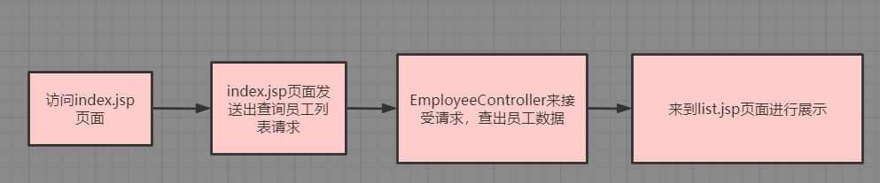

# SSM-CRUD

## 技术点总览


## 基础环境搭建

### 引入spring-webmvc的坐标

```xml
<!-- https://mvnrepository.com/artifact/org.springframework/spring-webmvc -->
<!--导入spring框架需要的核心容器-->
<dependency>
    <groupId>org.springframework</groupId>
    <artifactId>spring-webmvc</artifactId>
    <version>4.3.7.RELEASE</version>
</dependency>
```

### 引入spring-jdbc的坐标

```xml
<!-- https://mvnrepository.com/artifact/org.springframework/spring-jdbc -->
<!--导入spring用于事务控制的包-->
<dependency>
    <groupId>org.springframework</groupId>
    <artifactId>spring-jdbc</artifactId>
    <version>4.3.7.RELEASE</version>
</dependency>
```

### 引入spring-context的坐标

```xml
<!-- https://mvnrepository.com/artifact/org.springframework/spring-context -->
<!--spring用于面向切面编程的包-->
<dependency>
  <groupId>org.springframework</groupId>
  <artifactId>spring-context</artifactId>
  <version>4.3.7.RELEASE</version>
</dependency>
```

### 引入mybatis的坐标

```xml
<!-- https://mvnrepository.com/artifact/org.mybatis/mybatis -->
 <!--和数据库交互-->
<dependency>
  <groupId>org.mybatis</groupId>
  <artifactId>mybatis</artifactId>
  <version>3.4.2</version>
</dependency>
```

### 引入mybatis-spring的坐标

```xml
<!-- https://mvnrepository.com/artifact/org.mybatis/mybatis-spring -->
<!--mybatis整合spring的适配包-->
<dependency>
  <groupId>org.mybatis</groupId>
  <artifactId>mybatis-spring</artifactId>
  <version>1.3.1</version>
</dependency>
```

### 导入数据库连接池的坐标

```xml
<!-- https://mvnrepository.com/artifact/c3p0/c3p0 -->
<!--数据库连接池-->
<dependency>
  <groupId>c3p0</groupId>
  <artifactId>c3p0</artifactId>
  <version>0.9.1</version>
</dependency>
```

### 数据库驱动

```xml
<!-- https://mvnrepository.com/artifact/mysql/mysql-connector-java -->
<!--数据库驱动-->
<dependency>
  <groupId>mysql</groupId>
  <artifactId>mysql-connector-java</artifactId>
  <version>5.1.41</version>
</dependency>
```

### JSTL坐标

```xml
<!-- https://mvnrepository.com/artifact/javax.servlet/jstl -->
<!--jstl-->
<dependency>
  <groupId>javax.servlet</groupId>
  <artifactId>jstl</artifactId>
  <version>1.2</version>
</dependency>
```

### 使用原生的servletAPI

```xml
<!-- https://mvnrepository.com/artifact/javax.servlet/javax.servlet-api -->
<dependency>
    <groupId>javax.servlet</groupId>
    <artifactId>javax.servlet-api</artifactId>
    <version>3.0.1</version>
    <scope>provided</scope>
</dependency>

```

### 单元测试坐标

- 一定要使用4.12及其以上版本

```xml
<dependency>
  <groupId>junit</groupId>
  <artifactId>junit</artifactId>
  <version>4.12</version>
  <scope>test</scope>
</dependency>
```

### 引入bootstrap前端框架

- 去官网下载并将文件复制到web项目下的static文件夹中


- 在index页面引入样式和jquery

```jsp
<%@ page contentType="text/html;charset=UTF-8" language="java" %>
<html>
    <head>
        <title>Title</title>
        <%--引入jquery--%>
        <script type="text/javascript" src="static/js/jquery-1.12.4.min.js"></script>
        <%--引入样式--%>
        <link href="static/bootstrap-3.3.7-dist/css/bootstrap.min.css" rel="stylesheet">
        <script src="static/bootstrap-3.3.7-dist/js/bootstrap.min.js"></script>
    </head>
    <body>
        <button class="btn btn-success">按钮</button>
    </body>
</html>
```

### 编写配置文件

#### web.xml

```xml
<?xml version="1.0" encoding="UTF-8"?>
<web-app xmlns:xsi="http://www.w3.org/2001/XMLSchema-instance"
         xmlns="http://java.sun.com/xml/ns/javaee"
         xsi:schemaLocation="http://java.sun.com/xml/ns/javaee http://java.sun.com/xml/ns/javaee/web-app_2_5.xsd"
         id="WebApp_ID" version="2.5">

    <!--1、启动Spring的容器  -->
    <!-- contextConfigLocation参数用来指定Spring的配置文件 -->
    <!-- needed for ContextLoaderListener -->
    <context-param>
        <param-name>contextConfigLocation</param-name>
        <param-value>classpath:applicationContext.xml</param-value>
    </context-param>

    <!-- 配置spring核心监听器，默认会以 /WEB-INF/applicationContext.xml作为配置文件 -->
    <!-- Bootstraps the root web application context before servlet initialization -->
    <listener>
        <listener-class>org.springframework.web.context.ContextLoaderListener</listener-class>
    </listener>

    <!--2、spring-mvc的前端控制器，拦截所有请求  -->
    <!-- The front controller of this Spring Web application, responsible for handling all application requests -->
    <servlet>
        <servlet-name>dispatcherServlet</servlet-name>
        <servlet-class>org.springframework.web.servlet.DispatcherServlet</servlet-class>
        <load-on-startup>1</load-on-startup>
    </servlet>

    <!-- Map all requests to the DispatcherServlet for handling -->
    <servlet-mapping>
        <servlet-name>dispatcherServlet</servlet-name>
        <url-pattern>/</url-pattern>
    </servlet-mapping>

    <!-- 3、字符编码过滤器，一定要放在所有过滤器之前 -->
    <filter>
        <filter-name>CharacterEncodingFilter</filter-name>
        <filter-class>org.springframework.web.filter.CharacterEncodingFilter</filter-class>
        <init-param>
            <param-name>encoding</param-name>
            <param-value>utf-8</param-value>
        </init-param>
        <!--设置请求字符集-->
        <init-param>
            <param-name>forceRequestEncoding</param-name>
            <param-value>true</param-value>
        </init-param>
        <!--设置响应字符集-->
        <init-param>
            <param-name>forceResponseEncoding</param-name>
            <param-value>true</param-value>
        </init-param>
    </filter>
    <filter-mapping>
        <filter-name>CharacterEncodingFilter</filter-name>
        <url-pattern>/*</url-pattern>
    </filter-mapping>

    <!-- 4、使用Rest风格的URI，将页面普通的post请求转为指定的delete或者put请求 -->
    <filter>
        <filter-name>HiddenHttpMethodFilter</filter-name>
        <filter-class>org.springframework.web.filter.HiddenHttpMethodFilter</filter-class>
    </filter>
    <filter-mapping>
        <filter-name>HiddenHttpMethodFilter</filter-name>
        <url-pattern>/*</url-pattern>
    </filter-mapping>

    <!--在前端使用PUT发送的请求的时候，
  需要在web.xml中配置HttpPutFormContentFilter，
  这样子springMvc才能得到前台发送过来的请求-->
    <filter>
        <filter-name>HttpPutFormContentFilter</filter-name>
        <filter-class>org.springframework.web.filter.HttpPutFormContentFilter</filter-class>
    </filter>
    <filter-mapping>
        <filter-name>HttpPutFormContentFilter</filter-name>
        <url-pattern>/*</url-pattern>
    </filter-mapping>

</web-app>
```

#### SpringMVC的配置文件

- dispatcherServlet-servlet.xml
- 保证前缀和前端控制的id名相同，后缀为-servlet，放在WEN-INF目录下，Tomcat启动时就会自动扫描

```xml
<?xml version="1.0" encoding="UTF-8"?>
<beans xmlns="http://www.springframework.org/schema/beans"
       xmlns:xsi="http://www.w3.org/2001/XMLSchema-instance"
       xmlns:context="http://www.springframework.org/schema/context"
       xmlns:mvc="http://www.springframework.org/schema/mvc"
       xsi:schemaLocation="http://www.springframework.org/schema/mvc http://www.springframework.org/schema/mvc/spring-mvc-4.3.xsd
		http://www.springframework.org/schema/beans http://www.springframework.org/schema/beans/spring-beans-3.2.xsd
		http://www.springframework.org/schema/context http://www.springframework.org/schema/context/spring-context-4.3.xsd">

    <!--SpringMVC的配置文件，包含网站跳转逻辑的控制，配置-->
    <!--只扫描控制器-->
    <context:component-scan base-package="com.kl.crud.controller"/>


    <!--配置视图解析器，方便页面返回  -->
    <bean class="org.springframework.web.servlet.view.InternalResourceViewResolver">
        <property name="prefix" value="/WEB-INF/views/"/>
        <property name="suffix" value=".jsp"/>
    </bean>

    <!--两个标准配置  -->
    <!-- 将spring-mvc不能处理的请求交给tomcat -->
    <mvc:default-servlet-handler/>
    <!-- 能支持spring-mvc更高级的一些功能，JSR303校验，快捷的ajax...映射动态请求-->
    <mvc:annotation-driven/>

</beans>

```

#### sping容器的配置文件

- dbconfig.properties（与数据库源有关的数据配置）

```properties
jdbc.jdbcUrl=jdbc:mysql://localhost:3306/ssm_crud
jdbc.driverClass=com.mysql.jdbc.Driver
jdbc.user=root
jdbc.password=root
```

- applicationContext.xml（sping容器的配置文件）

```xml
<?xml version="1.0" encoding="UTF-8"?>
<beans xmlns="http://www.springframework.org/schema/beans"
       xmlns:xsi="http://www.w3.org/2001/XMLSchema-instance"
       xmlns:context="http://www.springframework.org/schema/context"
       xmlns:aop="http://www.springframework.org/schema/aop"
       xmlns:tx="http://www.springframework.org/schema/tx"
       xsi:schemaLocation="http://www.springframework.org/schema/aop http://www.springframework.org/schema/aop/spring-aop-4.3.xsd
                           http://www.springframework.org/schema/beans http://www.springframework.org/schema/beans/spring-beans-3.2.xsd
                           http://www.springframework.org/schema/tx http://www.springframework.org/schema/tx/spring-tx-4.3.xsd
                           http://www.springframework.org/schema/context http://www.springframework.org/schema/context/spring-context-4.3.xsd">

    <context:component-scan base-package="com.kl">
        <context:exclude-filter type="annotation"
                                expression="org.springframework.stereotype.Controller" />
    </context:component-scan>

    <!-- Spring的配置文件，这里主要配置和业务逻辑有关的 -->
    <!--=================== 数据源，事务控制，xxx ================-->
    <context:property-placeholder location="classpath:dbconfig.properties" />
    <bean id="pooledDataSource" class="com.mchange.v2.c3p0.ComboPooledDataSource">
        <property name="jdbcUrl" value="${jdbc.jdbcUrl}"/>
        <property name="driverClass" value="${jdbc.driverClass}"/>
        <property name="user" value="${jdbc.user}"/>
        <property name="password" value="${jdbc.password}"/>
    </bean>

    <!--================== 配置和MyBatis的整合=============== -->
    <bean id="sqlSessionFactory" class="org.mybatis.spring.SqlSessionFactoryBean">
        <!-- 指定mybatis全局配置文件的位置 -->
        <property name="configLocation" value="classpath:mybatis-config.xml"/>
        <property name="dataSource" ref="pooledDataSource"/>
        <!-- 指定mybatis，mapper，SQL映射文件的位置 -->
        <property name="mapperLocations" value="classpath:mapper/*.xml"/>
    </bean>

    <!-- 配置扫描器，将mybatis接口的实现加入到ioc容器中 -->
    <bean class="org.mybatis.spring.mapper.MapperScannerConfigurer">
        <!--扫描所有dao接口的实现，加入到ioc容器中 -->
        <property name="basePackage" value="com.kl.crud.dao"/>
    </bean>

    <!-- 配置一个可以执行批量的sqlSession -->
    <bean id="sqlSession" class="org.mybatis.spring.SqlSessionTemplate">
        <constructor-arg name="sqlSessionFactory" ref="sqlSessionFactory"/>
        <constructor-arg name="executorType" value="BATCH"/>
    </bean>
    <!--=============================================  -->

    <!-- ===============事务控制的配置 ================-->
    <bean id="transactionManager" class="org.springframework.jdbc.datasource.DataSourceTransactionManager">
        <!--控制住数据源  -->
        <property name="dataSource" ref="pooledDataSource"/>
    </bean>
    <!--开启基于注解的事务，使用xml配置形式的事务（必要主要的都是使用配置式）  -->
    <aop:config>
        <!-- 切入点表达式 -->
        <aop:pointcut expression="execution(* com.kl.crud.service..*(..))" id="txPoint"/>
        <!-- 配置事务增强 -->
        <aop:advisor advice-ref="txAdvice" pointcut-ref="txPoint"/>
    </aop:config>

    <!--配置事务增强，事务如何切入  -->
    <tx:advice id="txAdvice" transaction-manager="transactionManager">
        <tx:attributes>
            <!-- 所有方法都是事务方法 -->
            <tx:method name="*"/>
            <!--以get开始的所有方法  -->
            <tx:method name="get*" read-only="true"/>
        </tx:attributes>
    </tx:advice>

    <!-- Spring配置文件的核心点（数据源、与mybatis的整合，事务控制） -->

</beans>
```

#### Mybatis的配置文件

- 创建数据库员工表


- 创建数据库部门表


- 在员工表中添加和部门表的外键约束


- mybatis-config.xml全局配置文件

```xml
<?xml version="1.0" encoding="UTF-8"?>
<!DOCTYPE configuration
  PUBLIC "-//mybatis.org//DTD Config 3.0//EN"
  "http://mybatis.org/dtd/mybatis-3-config.dtd">
<configuration>
	<!--自动驼峰命名转换-->
	<settings>
		<setting name="mapUnderscoreToCamelCase" value="true"/>
	</settings>
	
	<!--为指定包下的所有类都起别名，别名默认为当前类名，且不区分大小写-->
	<typeAliases>
		<package name="com.kl.crud.bean"/>
	</typeAliases>
	
	<plugins>
		<plugin interceptor="com.github.pagehelper.PageInterceptor">
			<!--分页参数合理化  -->
			<property name="reasonable" value="true"/>
		</plugin>
	</plugins>

</configuration>
```

#### mybatis逆向工程

- 导入mybatis-generator的坐标

```xml
<!-- MBG -->
<!-- https://mvnrepository.com/artifact/org.mybatis.generator/mybatis-generator-core -->
<dependency>
    <groupId>org.mybatis.generator</groupId>
    <artifactId>mybatis-generator-core</artifactId>
    <version>1.3.5</version>
</dependency>
```

在项目路径下编写mbg.xml配置文件

```xml
<?xml version="1.0" encoding="UTF-8"?>
<!DOCTYPE generatorConfiguration
  PUBLIC "-//mybatis.org//DTD MyBatis Generator Configuration 1.0//EN"
  "http://mybatis.org/dtd/mybatis-generator-config_1_0.dtd">
<generatorConfiguration>

    <context id="DB2Tables" targetRuntime="MyBatis3">
        <commentGenerator>
            <property name="suppressAllComments" value="true" />
        </commentGenerator>
        <!-- 配置数据库连接 -->
        <jdbcConnection driverClass="com.mysql.jdbc.Driver"
                        connectionURL="jdbc:mysql://localhost:3306/ssm_crud" userId="root"
                        password="root">
        </jdbcConnection>

        <javaTypeResolver>
            <property name="forceBigDecimals" value="false" />
        </javaTypeResolver>

        <!-- 指定javaBean生成的位置 -->
        <javaModelGenerator targetPackage="com.kl.crud.bean"
                            targetProject=".\src\main\java">
            <property name="enableSubPackages" value="true" />
            <property name="trimStrings" value="true" />
        </javaModelGenerator>

        <!--指定sql映射文件生成的位置 -->
        <sqlMapGenerator targetPackage="mapper" targetProject=".\src\main\resources">
            <property name="enableSubPackages" value="true" />
        </sqlMapGenerator>

        <!-- 指定dao接口生成的位置，mapper接口 -->
        <javaClientGenerator type="XMLMAPPER"
                             targetPackage="com.kl.crud.dao" targetProject=".\src\main\java">
            <property name="enableSubPackages" value="true" />
        </javaClientGenerator>


        <!-- table指定每个表的生成策略 -->
        <table tableName="tbl_emp" domainObjectName="Employee"/>
        <table tableName="tbl_dept" domainObjectName="Department"/>
    </context>
</generatorConfiguration>
```

- 在test包下运行下列代码就会逆向创建bean对象

```java
package com.kl.crud.test;

import java.io.File;
import java.util.ArrayList;
import java.util.List;

import org.mybatis.generator.api.MyBatisGenerator;
import org.mybatis.generator.config.Configuration;
import org.mybatis.generator.config.xml.ConfigurationParser;
import org.mybatis.generator.internal.DefaultShellCallback;

public class MBGTest {

    public static void main(String[] args) throws Exception {
        List<String> warnings = new ArrayList<>();
        boolean overwrite = true;
        File configFile = new File("mbg.xml");
        ConfigurationParser cp = new ConfigurationParser(warnings);
        Configuration config = cp.parseConfiguration(configFile);
        DefaultShellCallback callback = new DefaultShellCallback(overwrite);
        MyBatisGenerator myBatisGenerator = new MyBatisGenerator(config,
                callback, warnings);
        myBatisGenerator.generate(null);
    }
}
```


### 修改Mapper文件

- mybatis逆向工程会为我们创建好对应表的SQL映射文件，里面都是自定为我们生成的增删改查语句，但是有些sql语句不能满足我们的业务需求，我们可以在自动生成的Mapper文件基础上增加我们想要的SQL语句来完成我们想要的功能
- 以上面的员工表和部门表为例说明，我们需要在查询员工信息的时候也同时获取到该员工对应的部门信息，但是下列语句只是给我们获取到了部门的id信息，这就意味着我们想要获取部门信息还需要根据部门ID再次查询数据库

```xml
<select id="selectByPrimaryKey" parameterType="java.lang.Integer" resultMap="BaseResultMap">
    select 
    <include refid="Base_Column_List" />
    from tbl_emp
    where emp_id = #{empId,jdbcType=INTEGER}
</select>
```

- 增加一个级联查询，查询到员工后同时获取到部门的详细信息
- 在EmployeeMapper接口中新定义两个查询方法

```java
List<Employee> selectByExampleWithDept(EmployeeExample example);

Employee selectByPrimaryKeyWithDept(Integer empId);
```

- 在员工类中增加部门属性

```java
//希望查询员工信息的同时部门信息也是查询好的
private Department department;
```

- 在Mapper映射文件中重新抽取一个查询

```xml
<!--定义带部门信息的封装规则-->
<resultMap id="WithDeptResultMap" type="com.kl.crud.bean.Employee">
    <id column="emp_id" jdbcType="INTEGER" property="empId" />
    <result column="emp_name" jdbcType="VARCHAR" property="empName" />
    <result column="gender" jdbcType="CHAR" property="gender" />
    <result column="email" jdbcType="VARCHAR" property="email" />
    <result column="d_id" jdbcType="INTEGER" property="dId" />
    <!--指定联合查询出的部门字段的封装-->
    <association property="department" javaType="com.kl.crud.bean.Department">
        <id property="deptId" column="dept_id"/>
        <id property="deptName" column="dept_name"/>
    </association>
</resultMap>

<!--同时查询部门信息 -->
<sql id="WithDept_Column_List">
    e.emp_id, e.emp_name, e.gender, e.email, e.d_id,d.dept_id,d.dept_name
</sql>

<!--List<Employee> selectByExampleWithDept(EmployeeExample example);-->
<select id="selectByExampleWithDept" resultMap="WithDeptResultMap" parameterType="com.kl.crud.bean.EmployeeExample">
    select
    <if test="distinct">
        distinct
    </if>
    <include refid="WithDept_Column_List" />
    from `tbl_emp` e left join `tbl_dept` d on e.`d_id`=d.`dept_id`
    <if test="_parameter != null">
        <include refid="Example_Where_Clause" />
    </if>
    <if test="orderByClause != null">
        order by ${orderByClause}
    </if>
</select>

<!--Employee selectByPrimaryKeyWithDept(Integer empId);-->
<select id="selectByPrimaryKeyWithDept" resultMap="WithDeptResultMap" parameterType="java.lang.Integer">
    select
    <include refid="WithDept_Column_List" />
    from `tbl_emp` e left join `tbl_dept` d on e.`d_id`=d.`dept_id`
    where emp_id = #{empId,jdbcType=INTEGER}
</select>
```

### 向数据库表中插入数据测试环境是否搭建成功

```xml
<!-- https://mvnrepository.com/artifact/org.springframework/spring-test -->
<!--导入spring的单元测试包-->
<dependency>
    <groupId>org.springframework</groupId>
    <artifactId>spring-test</artifactId>
    <version>4.3.7.RELEASE</version>
    <scope>test</scope>
</dependency>
```

- 如果不是放在和mian包同级的test包下就要删除`<scope>test</scope>`

```java
/**
 * 测试dao层的工作
 * 推荐Spring的项目就可以使用Spring的单元测试，可以自动注入我们需要的组件
 * 1、导入SpringTest模块
 * 2、@ContextConfiguration指定Spring配置文件的位置
 * 3、直接autowired要使用的组件即可
 */

@RunWith(SpringJUnit4ClassRunner.class)
@ContextConfiguration(locations={"classpath:applicationContext.xml"})
public class MapperTest {
   
   @Autowired
   DepartmentMapper departmentMapper;
   
   @Autowired
   EmployeeMapper employeeMapper;
   
   @Autowired
   SqlSession sqlSession;
   
   /**
    * 测试DepartmentMapper
    */
   @Test
   public void testCRUD(){
   /* 1、创建SpringIOC容器
      ApplicationContext ioc = new ClassPathXmlApplicationContext("applicationContext.xml");
      2、从容器中获取mapper
      DepartmentMapper bean = ioc.getBean(DepartmentMapper.class);*/
      System.out.println(departmentMapper);
      
      //1、插入几个部门
      departmentMapper.insertSelective(new Department(null, "开发部"));
      departmentMapper.insertSelective(new Department(null, "测试部"));

      //2、生成员工数据，测试员工插入
      //employeeMapper.insertSelective(new Employee(null, "Jerry", "M", "Jerry@atguigu.com", 1));

      //3、批量插入多个员工；批量，使用可以执行批量操作的sqlSession。
      EmployeeMapper mapper = sqlSession.getMapper(EmployeeMapper.class);
      for(int i = 0;i<1000;i++){
         String uid = UUID.randomUUID().toString().substring(0,5)+i;
         mapper.insertSelective(new Employee(null,uid, "M", uid+"@kl.com", 1));
      }
      System.out.println("批量完成");
   }
}
```

- 批量插入需要在spring配置文件中注册能够实现批量插入的sqlSession

```xml
<!-- 配置一个可以执行批量的sqlSession -->
<bean id="sqlSession" class="org.mybatis.spring.SqlSessionTemplate">
    <!--使用构造函数创建
        public SqlSessionTemplate(SqlSessionFactory sqlSessionFactory, ExecutorType executorType)
       -->
    <constructor-arg name="sqlSessionFactory" ref="sqlSessionFactory"/>
    <constructor-arg name="executorType" value="BATCH"/>
</bean>
```

## 利用spring单元测试模拟客户端发送请求

- 控制器中有一个查询所有员工的方法，查询后的结果集被放入了请求域中

```java
/**
 * 查询员工数据（分页查询）
 */
@RequestMapping(value = "/emps")
public String getEmps(
      @RequestParam(value = "pn", defaultValue = "1") Integer pn,
      Model model) {
   System.out.println("被访问...");
   // 这不是一个分页查询；
   // 引入PageHelper分页插件
   // 在查询之前只需要调用，传入页码，以及每页的大小
   PageHelper.startPage(pn, 5);
   // startPage后面紧跟的这个查询就是一个分页查询
   List<Employee> emps = employeeService.getAll();
   // 使用pageInfo包装查询后的结果，只需要将pageInfo交给页面就行了。
   // 封装了详细的分页信息,包括有我们查询出来的数据，传入连续显示的页数
   PageInfo<Employee> page = new PageInfo<>(emps, 5);
   model.addAttribute("pageInfo", page);
   return "list";
}
```

- 利用Spring的单元测试来模拟客户端想服务器发送请求

```java
/**
 * 使用Spring测试模块提供的测试请求功能，测试curd请求的正确性
 * Spring4测试的时候，需要servlet3.0的支持
 * @author lfy
 *
 */
@RunWith(SpringJUnit4ClassRunner.class)
@WebAppConfiguration
@ContextConfiguration(locations = { "classpath:applicationContext.xml",
      "file:src/main/webapp/WEB-INF/dispatcherServlet-servlet.xml" })
public class MvcTest {
   // 传入SpringMvc的ioc
   @Autowired
   WebApplicationContext context;
   // 虚拟mvc请求，获取到处理结果。
   MockMvc mockMvc;

   @Before
   public void initMockMvc() {
      mockMvc = MockMvcBuilders.webAppContextSetup(context).build();
   }

   @Test
   public void testPage() throws Exception {
      //模拟请求拿到返回值
      MvcResult result = mockMvc.perform(MockMvcRequestBuilders.get("/emps").param("pn", "1"))
            .andReturn();

      //请求成功以后，请求域中会有pageInfo；我们可以取出pageInfo进行验证
      MockHttpServletRequest request = result.getRequest();
      PageInfo<Employee> pi = (PageInfo<Employee>) request.getAttribute("pageInfo");
      System.out.println("当前页码："+pi.getPageNum());
      System.out.println("总页码："+pi.getPages());
      System.out.println("总记录数："+pi.getTotal());
      System.out.println("在页面需要连续显示的页码");
      int[] nums = pi.getNavigatepageNums();
      for (int i : nums) {
         System.out.print(" "+i);
      }

      //获取员工数据
      List<Employee> list = pi.getList();
      for (Employee employee : list) {
         System.out.println("ID："+employee.getEmpId()+"==>Name:"+employee.getEmpName());
      }
   }
}
```

- 如果能取到pageInfo的值，就说明请求成功，数据库层的框架搭建完成


## 搭建bootstrap分页页面

```jsp
<%@ page language="java" contentType="text/html; charset=UTF-8"
    pageEncoding="UTF-8"%>
<%@taglib uri="http://java.sun.com/jsp/jstl/core" prefix="c"%>
<!DOCTYPE html PUBLIC "-//W3C//DTD HTML 4.01 Transitional//EN" "http://www.w3.org/TR/html4/loose.dtd">
<html>
    <head>
        <meta http-equiv="Content-Type" content="text/html; charset=UTF-8">
        <title>员工列表</title>
        <%
        pageContext.setAttribute("APP_PATH", request.getContextPath());
        %>
        <!-- web路径：
不以/开始的相对路径，找资源，以当前资源的路径为基准，经常容易出问题。
以/开始的相对路径，找资源，以服务器的路径为标准(http://localhost:3306)；需要加上项目名
http://localhost:3306/crud
-->
        <script type="text/javascript"
                src="${APP_PATH }/static/js/jquery-1.12.4.min.js"></script>
        <link
              href="${APP_PATH }/static/bootstrap-3.3.7-dist/css/bootstrap.min.css"
              rel="stylesheet">
        <script
                src="${APP_PATH }/static/bootstrap-3.3.7-dist/js/bootstrap.min.js"></script>
    </head>
    <body>
        <!-- 搭建显示页面 -->
        <div class="container">
            <!-- 标题 -->
            <div class="row">
                <div class="col-md-12">
                    <h1>SSM-CRUD</h1>
                </div>
            </div>
            <!-- 按钮 -->
            <div class="row">
                <div class="col-md-4 col-md-offset-8">
                    <button class="btn btn-primary">新增</button>
                    <button class="btn btn-danger">删除</button>
                </div>
            </div>
            <!-- 显示表格数据 -->
            <div class="row">
                <div class="col-md-12">
                    <table class="table table-hover">
                        <tr>
                            <th>#</th>
                            <th>empName</th>
                            <th>gender</th>
                            <th>email</th>
                            <th>deptName</th>
                            <th>操作</th>
                        </tr>
                        <c:forEach items="${pageInfo.list }" var="emp">
                            <tr>
                                <th>${emp.empId }</th>
                                <th>${emp.empName }</th>
                                <th>${emp.gender=="M"?"男":"女" }</th>
                                <th>${emp.email }</th>
                                <th>${emp.department.deptName }</th>
                                <th>
                                    <button class="btn btn-primary btn-sm">
                                        <span class="glyphicon glyphicon-pencil" aria-hidden="true"></span>
                                        编辑
                                    </button>
                                    <button class="btn btn-danger btn-sm">
                                        <span class="glyphicon glyphicon-trash" aria-hidden="true"></span>
                                        删除
                                    </button>
                                </th>
                            </tr>
                        </c:forEach>
                    </table>
                </div>
            </div>

            <!-- 显示分页信息 -->
            <div class="row">
                <!--分页文字信息  -->
                <div class="col-md-6">当前 ${pageInfo.pageNum }页,总${pageInfo.pages }
                    页,总 ${pageInfo.total } 条记录</div>
                <!-- 分页条信息 -->
                <div class="col-md-6">
                    <nav aria-label="Page navigation">
                        <ul class="pagination">
                            <li><a href="${APP_PATH }/emps?pn=1">首页</a></li>
                            <c:if test="${pageInfo.hasPreviousPage }">
                                <li><a href="${APP_PATH }/emps?pn=${pageInfo.pageNum-1}"
                                       aria-label="Previous"> <span aria-hidden="true">&laquo;</span>
                                    </a></li>
                            </c:if>


                            <c:forEach items="${pageInfo.navigatepageNums }" var="page_Num">
                                <c:if test="${page_Num == pageInfo.pageNum }">
                                    <li class="active"><a href="#">${page_Num }</a></li>
                                </c:if>
                                <c:if test="${page_Num != pageInfo.pageNum }">
                                    <li><a href="${APP_PATH }/emps?pn=${page_Num }">${page_Num }</a></li>
                                </c:if>

                            </c:forEach>
                            <c:if test="${pageInfo.hasNextPage }">
                                <li><a href="${APP_PATH }/emps?pn=${pageInfo.pageNum+1 }"
                                       aria-label="Next"> <span aria-hidden="true">&raquo;</span>
                                    </a></li>
                            </c:if>
                            <li><a href="${APP_PATH }/emps?pn=${pageInfo.pages}">末页</a></li>
                        </ul>
                    </nav>
                </div>
            </div>

        </div>
    </body>
</html>
```

## 显示分页数据



- index.jsp页面发送请求

```jsp
<%@ page contentType="text/html;charset=UTF-8" language="java" isELIgnored="false" %>
<%@taglib uri="http://java.sun.com/jsp/jstl/core" prefix="c"%>
<html>
    <head>
        <title>员工列表</title>
        <%
        pageContext.setAttribute("APP_PATH", request.getContextPath());
        %>
        <!-- web路径：
不以/开始的相对路径，找资源，以当前资源的路径为基准，经常容易出问题。
以/开始的相对路径，找资源，以服务器的路径为标准(http://localhost:3306)；需要加上项目名
http://localhost:3306/crud
-->
        <script type="text/javascript"
                src="${APP_PATH }/static/js/jquery-1.12.4.min.js"></script>
        <link
              href="${APP_PATH }/static/bootstrap-3.3.7-dist/css/bootstrap.min.css"
              rel="stylesheet">
        <script
                src="${APP_PATH }/static/bootstrap-3.3.7-dist/js/bootstrap.min.js"></script>
    </head>
    <body>
        <jsp:forward page="${APP_PATH}/emps"/>
    </body>
</html>
```

- EmployeeController控制器接收请求，查询完员工列表后放入请求域中并跳转到list.jsp页面进行展示

```java
/**
 * 查询员工数据（分页查询）
 */
@RequestMapping(value = "/emps")
public String getEmps(
    @RequestParam(value = "pn", defaultValue = "1") Integer pn,
    Model model) {
    System.out.println("被访问...");
    // 这不是一个分页查询；
    // 引入PageHelper分页插件
    // 在查询之前只需要调用，传入页码，以及每页的大小
    PageHelper.startPage(pn, 5);
    // startPage后面紧跟的这个查询就是一个分页查询
    List<Employee> emps = employeeService.getAll();
    // 使用pageInfo包装查询后的结果，只需要将pageInfo交给页面就行了。
    // 封装了详细的分页信息,包括有我们查询出来的数据，传入连续显示的页数
    PageInfo<Employee> page = new PageInfo<>(emps, 5);
    model.addAttribute("pageInfo", page);
    return "list";
}
```


## 返回分页的json数据测试

- 按照上面显示分页数据的方法是直接将查询到的结果对象塞到请求域中，跳转到指定页面后在该页面取出请求域中的对象进行解析
- 这样做有局限性，这种方法只适合于浏览器和服务器的交互，但如果是安卓或IOS客户端就解析不了数据，这两种手机客户端只解析服务器返回的json数据
- 所以说，为了保证通用性，我们也让浏览器解析服务器返回的json数据

---

- 为了让服务器编辑的返回json数据，我们需要引入jackson包
- 这个包和@ResponseBody注解配合使用就可以自动将返回到浏览器的数据转换为json格式的数据，非常方便

```xml
<!-- 返回json字符串的支持 -->
<!-- https://mvnrepository.com/artifact/com.fasterxml.jackson.core/jackson-databind -->
<dependency>
    <groupId>com.fasterxml.jackson.core</groupId>
    <artifactId>jackson-databind</artifactId>
    <version>2.8.8</version>
</dependency>
```

- 创建一个Msg类来封装查询到的数据

```java
public class Msg {
   //状态码   100-成功    200-失败
   private int code;
   //提示信息
   private String msg;
   
   //用户要返回给浏览器的数据
   private Map<String, Object> extend = new HashMap<>();

   public static Msg success(){
      Msg result = new Msg();
      result.setCode(100);
      result.setMsg("处理成功！");
      return result;
   }
   
   public static Msg fail(){
      Msg result = new Msg();
      result.setCode(200);
      result.setMsg("处理失败！");
      return result;
   }
   
   public Msg add(String key,Object value){
      this.getExtend().put(key, value);
      return this;
   }
    //............
}
```

- 修改控制器中处理/emps请求的方法

```java
/**
 * 导入jackson包。
 * @return 将Msg对象转换为json数据返回到客户端
 */
@RequestMapping("/emps")
@ResponseBody
public Msg getEmpsWithJson(
    @RequestParam(value = "pn", defaultValue = "1") Integer pn) {
    // 这不是一个分页查询
    // 引入PageHelper分页插件
    // 在查询之前只需要调用，传入页码，以及每页的大小
    PageHelper.startPage(pn, 5);
    // startPage后面紧跟的这个查询就是一个分页查询
    List<Employee> emps = employeeService.getAll();
    // 使用pageInfo包装查询后的结果，只需要将pageInfo交给页面就行了。
    // 封装了详细的分页信息,包括有我们查询出来的数据，传入连续显示的页数
    PageInfo<Employee> page = new PageInfo<>(emps, 5);
    return Msg.success().add("pageInfo", page);
}
```

- 返回到浏览器的全是json类型的数据


## 使用json数据构造员工列表


- 从测试结果来看，确实拿到了我们想要的json数据，那浏览器要怎么把它展示在页面呢？
- 我们可以使用ajax请求，然后根据回调函数获取到服务器传来的json数据，之后解析json数据并展示即可

---

- 在index.jsp页面进行ajax请求


- 基本的设置和list.jsp页面的设置是一样的，就是多了一个ajax请求，当前页面加载完成后就自动发起ajax请求
- 在将服务器发返回的json数据进行解析展示

```jsp
<%@ page contentType="text/html;charset=UTF-8" language="java" isELIgnored="false" %>
<%@taglib uri="http://java.sun.com/jsp/jstl/core" prefix="c"%>
<html>
    <head>
        <title>员工列表</title>
        <%
        pageContext.setAttribute("APP_PATH", request.getContextPath());
        %>
        <!-- web路径：
不以/开始的相对路径，找资源，以当前资源的路径为基准，经常容易出问题。
以/开始的相对路径，找资源，以服务器的路径为标准(http://localhost:3306)；需要加上项目名
http://localhost:3306/crud
-->
        <script type="text/javascript"
                src="${APP_PATH }/static/js/jquery-1.12.4.min.js"></script>
        <link
              href="${APP_PATH }/static/bootstrap-3.3.7-dist/css/bootstrap.min.css"
              rel="stylesheet">
        <script
                src="${APP_PATH }/static/bootstrap-3.3.7-dist/js/bootstrap.min.js"></script>
    </head>
    <body>
        <!-- 搭建显示页面 -->
        <div class="container">
            <!-- 标题 -->
            <div class="row">
                <div class="col-md-12">
                    <h1>SSM-CRUD</h1>
                </div>
            </div>
            <!-- 按钮 -->
            <div class="row">
                <div class="col-md-4 col-md-offset-8">
                    <button class="btn btn-primary" id="emp_add_modal_btn">新增</button>
                    <button class="btn btn-danger" id="emp_delete_all_btn">删除</button>
                </div>
            </div>
            <!-- 显示表格数据 -->
            <div class="row">
                <div class="col-md-12">
                    <table class="table table-hover" id="emps_table">
                        <thead>
                            <tr>
                                <th>
                                    <input type="checkbox" id="check_all"/>
                                </th>
                                <th>#</th>
                                <th>empName</th>
                                <th>gender</th>
                                <th>email</th>
                                <th>deptName</th>
                                <th>操作</th>
                            </tr>
                        </thead>
                        <tbody>

                        </tbody>
                    </table>
                </div>
            </div>

            <!-- 显示分页信息 -->
            <div class="row">
                <!--分页文字信息  -->
                <div class="col-md-6" id="page_info_area"></div>
                <!-- 分页条信息 -->
                <div class="col-md-6" id="page_nav_area">

                </div>
            </div>

        </div>
    </body>
    <script type="text/javascript">

        var totalRecord,currentPage;
        //1、页面加载完成以后，直接去发送ajax请求,要到分页数据
        $(function(){
            //去首页
            to_page(1);
        });

        function to_page(pn){
            $.ajax({
                url:"${APP_PATH}/emps",
                data:"pn="+pn,
                type:"GET",
                success:function(result){
                    //console.log(result);
                    //1、解析并显示员工数据
                    build_emps_table(result);
                }
            });
        }

        function build_emps_table(result){
            //清空table表格
            $("#emps_table tbody").empty();
            var emps = result.extend.pageInfo.list;
            /*第一个参数是数组的索引，第二个参数是数组中的对象*/
            /*如果是二维数组，那么第一个参数是行，第二个参数是二维数组中的一维数组*/
            $.each(emps,function(index,item){
                var checkBoxTd = $("<td><input type='checkbox' class='check_item'/></td>");
                var empIdTd = $("<td></td>").append(item.empId);
                var empNameTd = $("<td></td>").append(item.empName);
                var genderTd = $("<td></td>").append(item.gender=='M'?"男":"女");
                var emailTd = $("<td></td>").append(item.email);
                var deptNameTd = $("<td></td>").append(item.department.deptName);
                /**
             <button class="">
             <span class="" aria-hidden="true"></span>
             编辑
        </button>
             */
                var editBtn = $("<button></button>").addClass("btn btn-primary btn-sm edit_btn")
                .append($("<span></span>").addClass("glyphicon glyphicon-pencil")).append("编辑");
                //为编辑按钮添加一个自定义的属性，来表示当前员工id
                editBtn.attr("edit-id",item.empId);
                var delBtn =  $("<button></button>").addClass("btn btn-danger btn-sm delete_btn")
                .append($("<span></span>").addClass("glyphicon glyphicon-trash")).append("删除");
                //为删除按钮添加一个自定义的属性来表示当前删除的员工id
                delBtn.attr("del-id",item.empId);
                var btnTd = $("<td></td>").append(editBtn).append(" ").append(delBtn);
                //var delBtn =
                //append方法执行完成以后还是返回原来的元素
                $("<tr></tr>").append(checkBoxTd)
                    .append(empIdTd)
                    .append(empNameTd)
                    .append(genderTd)
                    .append(emailTd)
                    .append(deptNameTd)
                    .append(btnTd)
                    .appendTo("#emps_table tbody");
            });
        }
    </script>
</html>
```

## 构建分页条

- 添加解析分页数据的函数并在首页初始化的时候调用

```jsp
<script type="text/javascript">
     var totalRecord,currentPage;
    //1、页面加载完成以后，直接去发送ajax请求,要到分页数据
    $(function(){
        //去首页
        to_page(1);
    });

    function to_page(pn){
        $.ajax({
            url:"${APP_PATH}/emps",
            data:"pn="+pn,
            type:"GET",
            success:function(result){
                //console.log(result);
                //1、解析并显示员工数据
                build_emps_table(result);
                //2、解析并显示分页信息
                build_page_info(result);
            }
        });
    }
    //.................
    
    //解析显示分页信息
    function build_page_info(result){
        $("#page_info_area").empty();
        $("#page_info_area").append("当前"+result.extend.pageInfo.pageNum+"页,总"+
                                    result.extend.pageInfo.pages+"页,总"+
                                    result.extend.pageInfo.total+"条记录");
        totalRecord = result.extend.pageInfo.total;
        currentPage = result.extend.pageInfo.pageNum;
    }
</script>
```

- 想要取出总页码的数据：result.entend.pageInfo.pages


- 再次运行，分页条展示成功


## 构建导航条


- 导航条总的是一个ul无序列表标签体，每一个子项都是一个li子列表标签
- 需要给导航条上的所有li标签都设置点击事件，每次点击都会发送一次ajax异步请求

```jsp
<script type="text/javascript">
    var totalRecord,currentPage;
    //1、页面加载完成以后，直接去发送ajax请求,要到分页数据
    $(function(){
        //去首页
        to_page(1);
    });

    function to_page(pn){
        $.ajax({
            url:"${APP_PATH}/emps",
            data:"pn="+pn,
            type:"GET",
            success:function(result){
                //console.log(result);
                //1、解析并显示员工数据
                build_emps_table(result);
                //2、解析并显示分页信息
                build_page_info(result);
                //3、解析显示分页条数据
                build_page_nav(result);
            }
        });
    }
    //解析显示分页条，点击分页要能去下一页....
    function build_page_nav(result){
        //page_nav_area
        $("#page_nav_area").empty();
        var ul = $("<ul></ul>").addClass("pagination");

        //构建元素
        var firstPageLi = $("<li></li>").append($("<a></a>").append("首页").attr("href","#"));
        var prePageLi = $("<li></li>").append($("<a></a>").append("&laquo;"));
        if(result.extend.pageInfo.hasPreviousPage == false){
            firstPageLi.addClass("disabled");
            prePageLi.addClass("disabled");
        }else{
            //为元素添加点击翻页的事件
            firstPageLi.click(function(){
                to_page(1);
            });
            prePageLi.click(function(){
                to_page(result.extend.pageInfo.pageNum -1);
            });
        }


        var nextPageLi = $("<li></li>").append($("<a></a>").append("&raquo;"));
        var lastPageLi = $("<li></li>").append($("<a></a>").append("末页").attr("href","#"));
        if(result.extend.pageInfo.hasNextPage == false){
            nextPageLi.addClass("disabled");
            lastPageLi.addClass("disabled");
        }else{
            nextPageLi.click(function(){
                to_page(result.extend.pageInfo.pageNum +1);
            });
            lastPageLi.click(function(){
                to_page(result.extend.pageInfo.pages);
            });
        }


        //添加首页和前一页 的提示
        ul.append(firstPageLi).append(prePageLi);
        //1,2，3遍历给ul中添加页码提示
        $.each(result.extend.pageInfo.navigatepageNums,function(index,item){

            var numLi = $("<li></li>").append($("<a></a>").append(item));
            if(result.extend.pageInfo.pageNum == item){
                numLi.addClass("active");
            }
            numLi.click(function(){
                to_page(item);
            });
            ul.append(numLi);
        });
        //添加下一页和末页 的提示
        ul.append(nextPageLi).append(lastPageLi);

        //把ul加入到nav
        var navEle = $("<nav></nav>").append(ul);
        navEle.appendTo("#page_nav_area");
    }
</script>
```

## 新增员工

### 填充下拉列表功能实现

- 效果预览


- 执行流程


- 导入bootstrap中的对话框模块

```jsp
<!-- 员工添加的模态框 -->
<div class="modal fade" id="empAddModal" tabindex="-1" role="dialog" aria-labelledby="myModalLabel">
    <div class="modal-dialog" role="document">
        <div class="modal-content">
            <div class="modal-header">
                <button type="button" class="close" data-dismiss="modal" aria-label="Close"><span aria-hidden="true">&times;</span></button>
                <h4 class="modal-title" id="myModalLabel">员工添加</h4>
            </div>
            <div class="modal-body">
                <form class="form-horizontal">
                    <div class="form-group">
                        <label class="col-sm-2 control-label">empName</label>
                        <div class="col-sm-10">
                            <input type="text" name="empName" class="form-control" id="empName_add_input" placeholder="empName">
                            <span class="help-block"></span>
                        </div>
                    </div>
                    <div class="form-group">
                        <label class="col-sm-2 control-label">email</label>
                        <div class="col-sm-10">
                            <input type="text" name="email" class="form-control" id="email_add_input" placeholder="email@kl.com">
                            <span class="help-block"></span>
                        </div>
                    </div>
                    <div class="form-group">
                        <label class="col-sm-2 control-label">gender</label>
                        <div class="col-sm-10">
                            <label class="radio-inline">
                                <input type="radio" name="gender" id="gender1_add_input" value="M" checked="checked"> 男
                            </label>
                            <label class="radio-inline">
                                <input type="radio" name="gender" id="gender2_add_input" value="F"> 女
                            </label>
                        </div>
                    </div>
                    <div class="form-group">
                        <label class="col-sm-2 control-label">deptName</label>
                        <div class="col-sm-4">
                            <!-- 部门提交部门id即可 -->
                            <select class="form-control" name="dId">
                            </select>
                        </div>
                    </div>
                </form>
            </div>
            <div class="modal-footer">
                <button type="button" class="btn btn-default" data-dismiss="modal">关闭</button>
                <button type="button" class="btn btn-primary" id="emp_save_btn">保存</button>
            </div>
        </div>
    </div>
</div>
```

- 为新增按钮添加点击事件并填充模块框的下拉列表

```jsp
<script type="text/javascript">

    //.........

    //清空表单样式及内容
    function reset_form(ele){
        $(ele)[0].reset();
        //清空表单样式
        $(ele).find("*").removeClass("has-error has-success");
        $(ele).find(".help-block").text("");
    }

    //点击新增按钮弹出模态框。
    $("#emp_add_modal_btn").click(function(){
        //清除表单数据（表单完整重置（表单的数据，表单的样式））
        reset_form("#empAddModal form");
        //s$("")[0].reset();
        //发送ajax请求，查出部门信息，显示在下拉列表中
        getDepts("#empAddModal select");
        //弹出模态框
        $("#empAddModal").modal({
            backdrop:"static"
        });
    });

    //查出所有的部门信息并显示在下拉列表中
    function getDepts(ele){
        //清空之前下拉列表的值
        $(ele).empty();
        $.ajax({
            url:"${APP_PATH}/depts",
            type:"GET",
            success:function(result){
                //{"code":100,"msg":"处理成功！",
                //"extend":{"depts":[{"deptId":1,"deptName":"开发部"},{"deptId":2,"deptName":"测试部"}]}}
                //console.log(result);
                //显示部门信息在下拉列表中
                //$("#empAddModal select").append("")
                $.each(result.extend.depts,function(){
                    var optionEle = $("<option></option>").append(this.deptName).attr("value",this.deptId);
                    optionEle.appendTo(ele);
                });
            }
        });
    }
</script>
```

- 点击新增按钮时就会发送ajax请求到服务器查询所有的部门信息

```java
@Controller
public class DepartmentController {

    @Autowired
    private DepartmentService departmentService;

    /**
    * 返回所有的部门信息
    */
    @RequestMapping("/depts")
    @ResponseBody
    public Msg getDepts(){
        //查出的所有部门信息
        List<Department> list = departmentService.getDepts();
        return Msg.success().add("depts", list);
    }
}
```

### 保存员工-前端信息校验

- 用户点击保存后前端会向服务器提交异步请求，服务器保存前端传来的用户信息到数据库中，服务器返回是否添加成功的信息
- 根据服务器返回的状态码判断是否保存成功，成功后就关闭模态框，再发送一次异步请求查询到最后一页的数据并展示在员工列表

```jsp
<script type="text/javascript">

    //.........
    //校验表单数据
    function validate_add_form(){
        //1、拿到要校验的数据，使用正则表达式
        var empName = $("#empName_add_input").val();
        var regName = /(^[a-zA-Z0-9_-]{6,16}$)|(^[\u2E80-\u9FFF]{2,5})/;
        if(!regName.test(empName)){
            //alert("用户名可以是2-5位中文或者6-16位英文和数字的组合");
            show_validate_msg("#empName_add_input", "error", "用户名可以是2-5位中文或者6-16位英文和数字的组合");
            return false;
        }else{
            show_validate_msg("#empName_add_input", "success", "");
        };

        //2、校验邮箱信息
        var email = $("#email_add_input").val();
        var regEmail = /^([a-z0-9_\.-]+)@([\da-z\.-]+)\.([a-z\.]{2,6})$/;
        if(!regEmail.test(email)){
            //alert("邮箱格式不正确");
            //应该清空这个元素之前的样式
            show_validate_msg("#email_add_input", "error", "邮箱格式不正确");
            /* $("#email_add_input").parent().addClass("has-error");
        $("#email_add_input").next("span").text("邮箱格式不正确"); */
            return false;
        }else{
            show_validate_msg("#email_add_input", "success", "");
        }
        return true;
    }

    //显示校验结果的提示信息
    function show_validate_msg(ele,status,msg){
        //清除当前元素的校验状态
        $(ele).parent().removeClass("has-success has-error");
        $(ele).next("span").text("");
        if("success"==status){
            $(ele).parent().addClass("has-success");
            $(ele).next("span").text(msg);
        }else if("error" == status){
            $(ele).parent().addClass("has-error");
            $(ele).next("span").text(msg);
        }
    }

    //校验用户名是否可用
    $("#empName_add_input").change(function(){
        //发送ajax请求校验用户名是否可用
        var empName = this.value;
        $.ajax({
            url:"${APP_PATH}/checkuser",
            data:"empName="+empName,
            type:"POST",
            success:function(result){
                if(result.code==100){
                    show_validate_msg("#empName_add_input","success","用户名可用");
                    $("#emp_save_btn").attr("ajax-va","success");
                }else{
                    show_validate_msg("#empName_add_input","error",result.extend.va_msg);
                    $("#emp_save_btn").attr("ajax-va","error");
                }
            }
        });
    });
    //点击保存，保存员工。
    $("#emp_save_btn").click(function(){
        //1、模态框中填写的表单数据提交给服务器进行保存
        //1、先对要提交给服务器的数据进行校验
        if(!validate_add_form()){
            return false;
        };
        //1、判断之前的ajax用户名校验是否成功。如果成功。
        if($(this).attr("ajax-va")=="error"){
            return false;
        }
        //2.发送ajax请求保存员工
        $.ajax({
            url:"${APP_PATH}/emp",
            type:"POST",
            data:$("#empAddModal form").serialize(),
            success:function(result){
                //alert(result.msg);
                if(result.code == 100){
                    //员工保存成功；
                    //1、关闭模态框
                    $("#empAddModal").modal('hide');

                    //2、来到最后一页，显示刚才保存的数据
                    //发送ajax请求显示最后一页数据即可
                    to_page(totalRecord);
                }else{
                    //显示失败信息
                    //console.log(result);
                    //有哪个字段的错误信息就显示哪个字段的；
                    if(undefined != result.extend.errorFields.email){
                        //显示邮箱错误信息
                        show_validate_msg("#email_add_input", "error", result.extend.errorFields.email);
                    }
                    if(undefined != result.extend.errorFields.empName){
                        //显示员工名字的错误信息
                        show_validate_msg("#empName_add_input", "error", result.extend.errorFields.empName);
                    }
                }
            }
        });
    });
</script>
```

- 判断用户名是否可用

```java
@ResponseBody
@RequestMapping("/checkuser")
public Msg checkuser(@RequestParam("empName")String empName){
    //先判断用户名是否是合法的表达式;
    String regx = "(^[a-zA-Z0-9_-]{6,16}$)|(^[\u2E80-\u9FFF]{2,5})";
    if(!empName.matches(regx)){
        return Msg.fail().add("va_msg", "用户名必须是6-16位数字和字母的组合或者2-5位中文");
    }

    //数据库用户名重复校验
    boolean b = employeeService.checkUser(empName);
    if(b){
        return Msg.success();
    }else{
        return Msg.fail().add("va_msg", "用户名不可用");
    }
}
```

### 保存员工-JSR303后端校验

- 导入校验支持的坐标

```xml
<!--JSR303数据校验支持；tomcat7及以上的服务器，
tomcat7以下的服务器：el表达式。额外给服务器的lib包中替换新的标准的el
-->
<!-- https://mvnrepository.com/artifact/org.hibernate/hibernate-validator -->
<dependency>
    <groupId>org.hibernate</groupId>
    <artifactId>hibernate-validator</artifactId>
    <version>5.4.1.Final</version>
</dependency>
```

- 在Employee对象的属性上添加注解

```java
public class Employee {
    private Integer empId;

    @Pattern(regexp="(^[a-zA-Z0-9_-]{6,16}$)|(^[\u2E80-\u9FFF]{2,5})"
             ,message="用户名必须是2-5位中文或者6-16位英文和数字的组合")
    private String empName;

    private String gender;

    //@Email
    @Pattern(regexp="^([a-z0-9_\\.-]+)@([\\da-z\\.-]+)\\.([a-z\\.]{2,6})$",
             message="邮箱格式不正确")
    private String email;

    private Integer dId;

    //希望查询员工的同时部门信息也是查询好的
    private Department department;

    //.................
}
```

- 在保存员工时更加校验的结果来判断是否保存到数据库

```java
@RequestMapping(value="/emp",method=RequestMethod.POST)
@ResponseBody
public Msg saveEmp(@Valid Employee employee,BindingResult result){
    if(result.hasErrors()){
        //校验失败，应该返回失败，在模态框中显示校验失败的错误信息
        Map<String, Object> map = new HashMap<>();
        List<FieldError> errors = result.getFieldErrors();
        for (FieldError fieldError : errors) {
            System.out.println("错误的字段名："+fieldError.getField());
            System.out.println("错误信息："+fieldError.getDefaultMessage());
            map.put(fieldError.getField(), fieldError.getDefaultMessage());
        }
        return Msg.fail().add("errorFields", map);
    }else{
        employeeService.saveEmp(employee);
        return Msg.success();
    }
}
```

## 修改员工信息


```html
<script type="text/javascript">
    //---------------------- 
    
    
    //修改员工信息
    //1、我们是按钮创建之前就绑定了click，所以绑定不上。
    //1）、可以在创建按钮的时候绑定。    2）、绑定点击.live()
    //jquery新版没有live，使用on进行替代
    $(document).on("click",".edit_btn",function(){
        //alert("edit");


        //1、查出部门信息，并显示部门列表
        getDepts("#empUpdateModal select");
        //2、查出员工信息，显示员工信息
        getEmp($(this).attr("edit-id"));

        //3、把员工的id传递给模态框的更新按钮
        $("#emp_update_btn").attr("edit-id",$(this).attr("edit-id"));
        $("#empUpdateModal").modal({
            backdrop:"static"
        });
    });

    function getEmp(id){
        $.ajax({
            url:"${APP_PATH}/emp/"+id,
            type:"GET",
            success:function(result){
                //console.log(result);
                var empData = result.extend.emp;
                $("#empName_update_static").text(empData.empName);
                $("#email_update_input").val(empData.email);
                $("#empUpdateModal input[name=gender]").val([empData.gender]);
                $("#empUpdateModal select").val([empData.dId]);
            }
        });
    }

    //点击更新，更新员工信息
    $("#emp_update_btn").click(function(){
        //验证邮箱是否合法
        //1、校验邮箱信息
        var email = $("#email_update_input").val();
        var regEmail = /^([a-z0-9_\.-]+)@([\da-z\.-]+)\.([a-z\.]{2,6})$/;
        if(!regEmail.test(email)){
            show_validate_msg("#email_update_input", "error", "邮箱格式不正确");
            return false;
        }else{
            show_validate_msg("#email_update_input", "success", "");
        }

        //2、发送ajax请求保存更新的员工数据
        $.ajax({
            url:"${APP_PATH}/emp/"+$(this).attr("edit-id"),
            type:"PUT",
            data:$("#empUpdateModal form").serialize(),
            success:function(result){
                //alert(result.msg);
                //1、关闭对话框
                $("#empUpdateModal").modal("hide");
                //2、回到本页面
                to_page(currentPage);
            }
        });
    });
</script>
```

- 控制器修改员工信息

```java
/**
	 * 如果直接发送ajax=PUT形式的请求
	 * 封装的数据
	 * Employee
	 * [empId=1014, empName=null, gender=null, email=null, dId=null]
	 *
	 * 问题：
	 * 请求体中有数据；
	 * 但是Employee对象封装不上；
	 * update tbl_emp  where emp_id = 1014;
	 *
	 * 原因：
	 * Tomcat：
	 * 		1、将请求体中的数据，封装一个map。
	 * 		2、request.getParameter("empName")就会从这个map中取值。
	 * 		3、SpringMVC封装POJO对象的时候。
	 * 				会把POJO中每个属性的值，request.getParamter("email");
	 * AJAX发送PUT请求引发的血案：
	 * 		PUT请求，请求体中的数据，request.getParameter("empName")拿不到
	 * 		Tomcat一看是PUT不会封装请求体中的数据为map，只有POST形式的请求才封装请求体为map
	 * org.apache.catalina.connector.Request--parseParameters() (3111);
	 *
	 * protected String parseBodyMethods = "POST";
	 * if( !getConnector().isParseBodyMethod(getMethod()) ) {
                success = true;
                return;
            }
	 *
	 *
	 * 解决方案；
	 * 我们要能支持直接发送PUT之类的请求还要封装请求体中的数据
	 * 1、配置上HttpPutFormContentFilter；
	 * 2、他的作用；将请求体中的数据解析包装成一个map。
	 * 3、request被重新包装，request.getParameter()被重写，就会从自己封装的map中取数据
	 *
	 *
	 * 员工更新方法
	 * @param employee 需要更新的员工信息
	 * @return 是否更新成功的信息
	 */

@ResponseBody
@RequestMapping(value="/emp/{empId}",method=RequestMethod.PUT)
public Msg saveEmp(Employee employee,HttpServletRequest request){
    System.out.println("请求体中的值："+request.getParameter("gender"));
    System.out.println("将要更新的员工数据："+employee);
    employeeService.updateEmp(employee);
    return Msg.success()   ;
}

/**
 * 根据id查询员工
 */
@RequestMapping(value="/emp/{id}",method=RequestMethod.GET)
@ResponseBody
public Msg getEmp(@PathVariable("id")Integer id){

    Employee employee = employeeService.getEmp(id);
    return Msg.success().add("emp", employee);
}
```

## 删除员工信息

### 单个删除


```html
<script type="text/javascript">
    //---------------------- 
    
    
    //单个删除
    $(document).on("click",".delete_btn",function(){
        //1、弹出是否确认删除对话框
        var empName = $(this).parents("tr").find("td:eq(2)").text();
        var empId = $(this).attr("del-id");
        //alert($(this).parents("tr").find("td:eq(1)").text());
        if(confirm("确认删除【"+empName+"】吗？")){
            //确认，发送ajax请求删除即可
            $.ajax({
                url:"${APP_PATH}/emp/"+empId,
                type:"DELETE",
                success:function(result){
                    alert(result.msg);
                    //回到本页
                    to_page(currentPage);
                }
            });
        }
    });
</script>
```

- 控制器处理删除请求

```java
@ResponseBody
@RequestMapping(value="/emp/{ids}",method=RequestMethod.DELETE)
public Msg deleteEmp(@PathVariable("ids")String ids){
   //批量删除
   if(ids.contains("-")){
      List<Integer> del_ids = new ArrayList<>();
      String[] str_ids = ids.split("-");
      //组装id的集合
      for (String string : str_ids) {
         del_ids.add(Integer.parseInt(string));
      }
      employeeService.deleteBatch(del_ids);
   }else{
      Integer id = Integer.parseInt(ids);
      employeeService.deleteEmp(id);
   }
   return Msg.success();
}
```

### 批量删除


```html
<script type="text/javascript">
    //......
    
    
    //完成全选/全不选功能
    $("#check_all").click(function(){
        //attr获取checked是undefined;
        //我们这些dom原生的属性；attr获取自定义属性的值；
        //prop修改和读取dom原生属性的值
        $(".check_item").prop("checked",$(this).prop("checked"));
    });

    //check_item
    $(document).on("click",".check_item",function(){
        //判断当前选择中的元素是否5个
        var flag = $(".check_item:checked").length==$(".check_item").length;
        $("#check_all").prop("checked",flag);
    });

    //点击全部删除，就批量删除
    $("#emp_delete_all_btn").click(function(){
        //
        var empNames = "";
        var del_idstr = "";
        $.each($(".check_item:checked"),function(){
            //this
            empNames += $(this).parents("tr").find("td:eq(2)").text()+",";
            //组装员工id字符串
            del_idstr += $(this).parents("tr").find("td:eq(1)").text()+"-";
        });
        //去除empNames多余的,
        empNames = empNames.substring(0, empNames.length-1);
        //去除删除的id多余的-
        del_idstr = del_idstr.substring(0, del_idstr.length-1);
        if(confirm("确认删除【"+empNames+"】吗？")){
            //发送ajax请求删除
            $.ajax({
                url:"${APP_PATH}/emp/"+del_idstr,
                type:"DELETE",
                success:function(result){
                    alert(result.msg);
                    //回到当前页面
                    to_page(currentPage);
                }
            });
        }
    });
</script>
```

- 处理逻辑包含在单个删除处理方法中

## 总结


