# Maven的配置

## 1.安装 Maven 核心程序  
1. 下载地址：http://maven.apache.org/ 
2. 检查 JAVA_HOME 环境变量；Maven 是使用 Java 开发的，所以必须知道当前 系统环境中 JDK的安装目录

>- D:\newJDK

3. 解压Maven的核心程序。 将apache-maven-3.6.3-bin.zip解压到一个非中文无空格的目录下。例如

>- D:\apache-maven-3.6.3

4. 配置环境变量

>- MAVEN_HOME         D:\apache-maven-3.6.3 

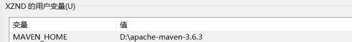

>- path                        %MAVEN_HOME%\bin 

5. 查看Maven版本信息验证安装是否正确 

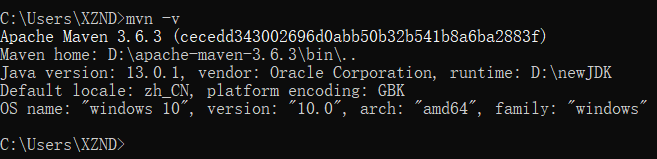

## 2.配置本地仓库和阿里云镜像 

- Maven 的核心程序并不包含具体功能，仅负责宏观调度。具体功能由插 件来完成。Maven 核心程序会到本地仓库中查找插件。如果本地仓库中 没有就会从远程中央仓库下载。此时如果不能上网则无法执行 Maven 的 具体功能。为了解决这个问题，我们可以将 Maven 的本地仓库指向一个 在联网情况下下载好的目录======>因此不建议把下载的jar包放在系统盘，会占空间~~~
- **Maven默认的本地仓库：~\.m2\repository目录**
  - Tips：~表示当前用户的家目录: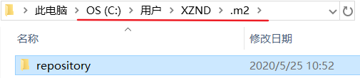
- **找到Maven的核心配置文件settings.xml文件：**  

>- D:\apache-maven-3.6.3\conf\settings.xml 

- **设置方式:**

>- < localRepository >E:\LocalRepository< /localRepository >

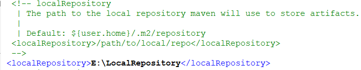

- **配置阿里云镜像** 
- 为了下载jar包方便，在Maven的核心配置文件 settings.xml文件的 `<mirrors></mirrors>`标签里面配置以下标签： 

```xml
<mirror> 
    <id>nexus-aliyun</id> 
    <mirrorOf>central</mirrorOf> 
    <name>Nexus aliyun</name> 
    <url>http://maven.aliyun.com/nexus/content/groups/public</url> 
</mirror> 
```

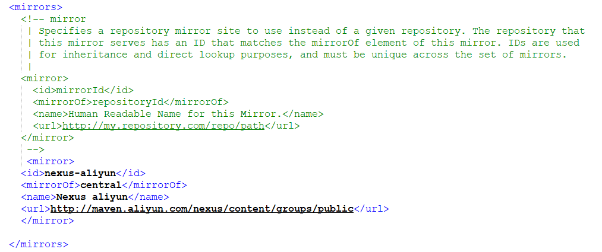

# 在IDEA中配置Maven

1. 可以使用IDEA自带的Maven插件

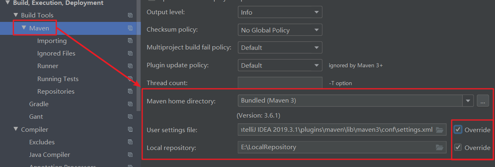

2. 也可以使用我们自己下载安装的Maven插件

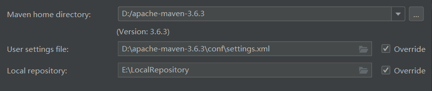

3. 也可以不覆盖

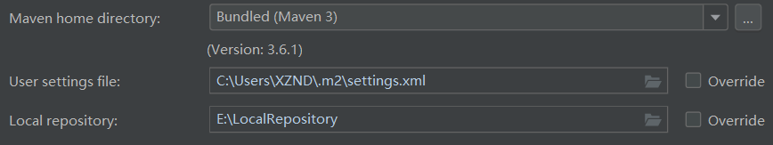

- **上面三种效果都是一样的，关键是在于我们要创建一个本地仓库文件夹，并且在配置文件setting里面修改默认仓库为本地仓库，并且 添加阿里云镜像！！！**

## 3.解决不支持发行版本5的问题

- 打开Project Structure


- File--->setting


# 创建Java工程

- 选中后一直next即可

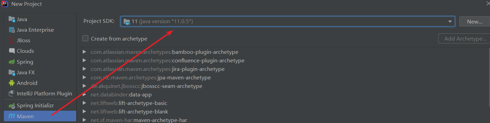

- 在pom.xml中导包

```xml
<dependencies>
    <dependency>
        <groupId>junit</groupId>
        <artifactId>junit</artifactId>
        <version>4.12</version>
        <scope>test</scope>
    </dependency>
</dependencies>
```

- 进行上述配置后系统就会自动导包，在右侧栏目里可以清晰看到包的结构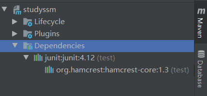

- 在main包下编写程序，在test包下编写测试程序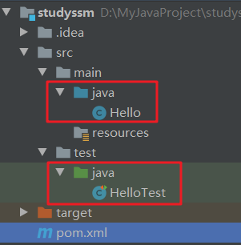
- Hello

```java
public class Hello {
    public String sayHello(String name){
        return name + " say Hello World";
    }
}
```

- HelloTest

```java
import org.junit.Test;

public class HelloTest {
    @Test
    public void testHello(){
        Hello hello = new Hello();
        String say = hello.sayHello("Maven");
        System.out.println(say);
    }
}
```

- 两种运行方式

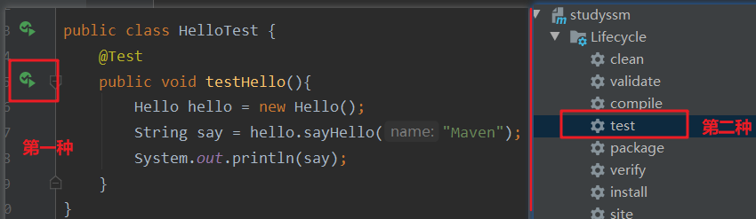

# 创建Web工程

- 先创建一个maven项目
- 在pom.xml中添加

```xml
<!--web工程打包方式-->
<packaging>war</packaging>
```

- 打开Project Structure

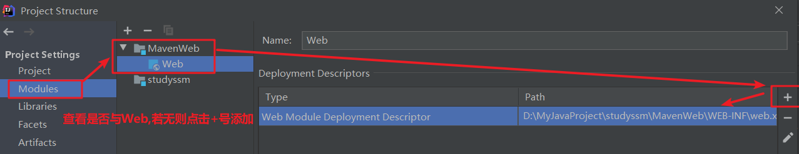

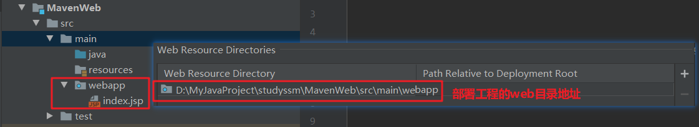

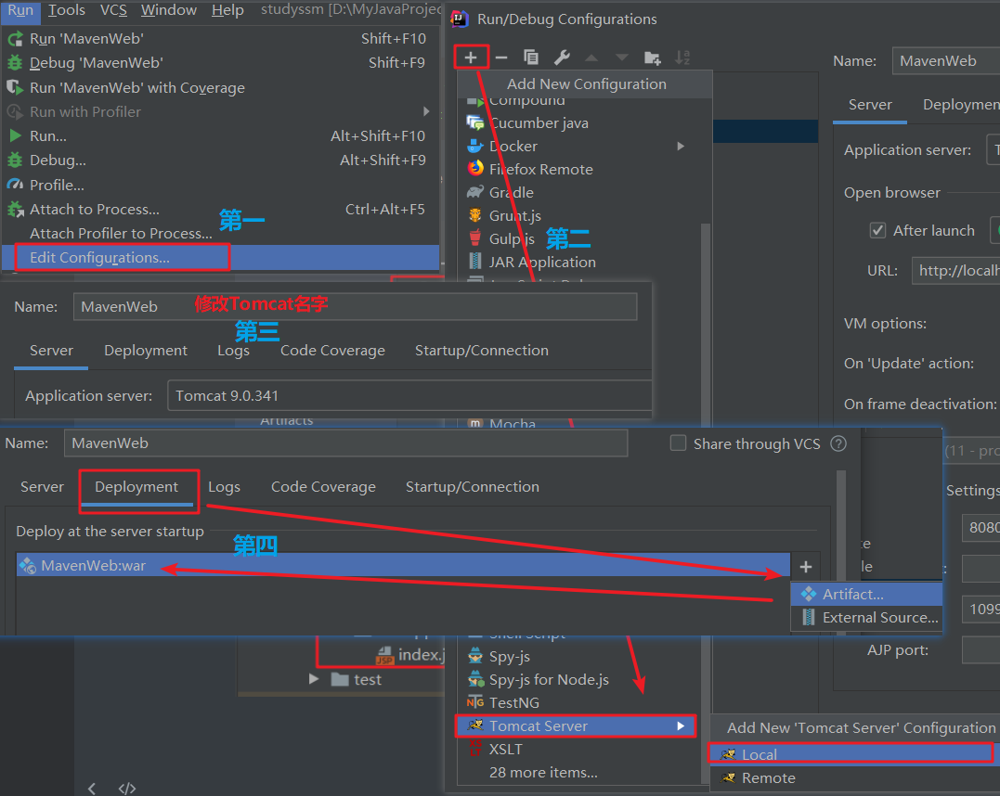