# 一、Spring的初步认识

- Spring是分层的 Java SE/EE应用 full-stack 轻量级开源框架，以 IoC（Inverse Of Control： 反转控制）和 AOP（Aspect Oriented Programming：面向切面编程）为内核，提供了展现层 Spring MVC 和持久层 Spring JDBC 以及业务层事务管理等众多的企业级应用技术，还能整合开源世界众多 著名的第三方框架和类库，逐渐成为使用最多的Java EE 企业应用开源框架

## 1.1Spring 的发展历程 

- 1997 年 IBM提出了EJB 的思想   
- 1998 年，SUN制定开发标准规范 EJB1.0   
- 1999 年，EJB1.1 发布   
- 2001 年，EJB2.0 发布   
- 2003 年，EJB2.1 发布  
-  2006 年，EJB3.0 发布   
- Rod Johnson（spring之父）    

>- Expert One-to-One J2EE Design and Development(2002)    
>- 阐述了 J2EE 使用EJB 开发设计的优点及解决方案   
>-  Expert One-to-One J2EE Development without EJB(2004)    
>- 阐述了 J2EE 开发不使用 EJB的解决方式（Spring 雏形） 

- 2017 年 9 月份发布了 spring 的最新版本 spring 5.0 通用版（GA） 

## 1.2spring 的优势 

- **方便解耦，简化开发**  

>通过 Spring提供的 IoC容器，可以将对象间的依赖关系交由 Spring进行控制，避免硬编码所造 成的过度程序耦合。用户也不必再为单例模式类、属性文件解析等这些很底层的需求编写代码，可 以更专注于上层的应用

-  **AOP编程的支持**  

>通过 Spring的 AOP 功能，方便进行面向切面的编程，许多不容易用传统OOP 实现的功能可以通过 AOP 轻松应付

- **声明式事务的支持**  

>可以将我们从单调烦闷的事务管理代码中解脱出来，通过声明式方式灵活的进行事务的管理， 提高开发效率和质量

- **方便程序的测试**  

>可以用非容器依赖的编程方式进行几乎所有的测试工作，测试不再是昂贵的操作，而是随手可做的事情

- **方便集成各种优秀框架**  

>Spring可以降低各种框架的使用难度，提供了对各种优秀框架（Struts、Hibernate、Hessian、Quartz 等）的直接支持

-  **降低 JavaEE API的使用难度**  

>Spring对 JavaEE API（如 JDBC、JavaMail、远程调用等）进行了薄薄的封装层，使这些 API 的 使用难度大为降低

-  **Java源码是经典学习范例** 

>Spring的源代码设计精妙、结构清晰、匠心独用，处处体现着大师对Java 设计模式灵活运用以 及对 Java技术的高深造诣。它的源代码无意是 Java 技术的最佳实践的范例

## 1.3spring 的体系结构 

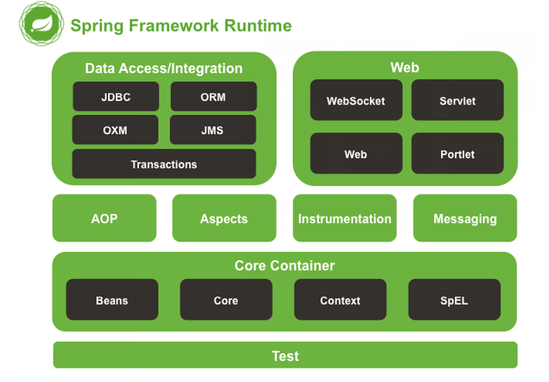

# 二、IOC 的概念和作用 

## 2.1什么是程序的耦合 

- 耦合性(Coupling)，也叫耦合度，是对模块间关联程度的度量。耦合的强弱取决于模块间接口的复杂性、调用模块的方式以及通过界面传送数据的多少
- 模块间的耦合度是指模块之间的依赖关系，包括控制关系、调用关系、数据传递关系。模块间联系越多，其耦合性越强，同时表明其独立性越差( 降低耦合性，可以提高其独立 性)。耦合性存在于各个领域，而非软件设计中独有的，但是我们只讨论软件工程中的耦合。
- 在软件工程中，耦合指的就是就是对象之间的依赖性。对象之间的耦合越高，维护成本越高。因此对象的设计应使类和构件之间的耦合最小。软件设计中通常用耦合度和内聚度作为衡量模块独立程度的标准。划分模块的一个 准则就是高内聚低耦合。 它有如下分类：  

>1. 内容耦合。当一个模块直接修改或操作另一个模块的数据时，或一个模块不通过正常入口而转入另 一个模块时，这样的耦合被称为内容耦合。内容耦合是最高程度的耦合，应该避免使用之
>2. 公共耦合。两个或两个以上的模块共同引用一个全局数据项，这种耦合被称为公共耦合。在具有大 量公共耦合的结构中，确定究竟是哪个模块给全局变量赋了一个特定的值是十分困难的
>3. 外部耦合 。一组模块都访问同一全局简单变量而不是同一全局数据结构，而且不是通过参数表传 递该全局变量的信息，则称之为外部耦合
>4. 控制耦合 。一个模块通过接口向另一个模块传递一个控制信号，接受信号的模块根据信号值而进 行适当的动作，这种耦合被称为控制耦合
>5. 标记耦合 。若一个模块 A 通过接口向两个模块 B 和 C 传递一个公共参数，那么称模块 B 和 C 之间 存在一个标记耦合
>6. 数据耦合。模块之间通过参数来传递数据，那么被称为数据耦合。数据耦合是最低的一种耦合形 式，系统中一般都存在这种类型的耦合，因为为了完成一些有意义的功能，往往需要将某些模块的输出数据作为另
>     一些模块的输入数据
>7. 非直接耦合 。两个模块之间没有直接关系，它们之间的联系完全是通过主模块的控制和调用来实现的

- 总结：  耦合是影响软件复杂程度和设计质量的一个重要因素，在设计上我们应采用以下原则：如果模块间必须 存在耦合，就尽量使用数据耦合，少用控制耦合，限制公共耦合的范围，尽量避免使用内容耦合
- 内聚与耦合  内聚标志一个模块内各个元素彼此结合的紧密程度，它是信息隐蔽和局部化概念的自然扩展。内聚是从 功能角度来度量模块内的联系，一个好的内聚模块应当恰好做一件事。它描述的是模块内的功能联系。耦合是软件结构中各模块之间相互连接的一种度量，耦合强弱取决于模块间接口的复杂程度、进入或访问一个模块的点以及通过接口的数据。 程序讲究的是低耦合，高内聚。就是同一个模块内的各个元素之间要高度紧密，但是各个模块之 间的相互依存度却要不那么紧密。 内聚和耦合是密切相关的，同其他模块存在高耦合的模块意味着低内聚，而高内聚的模块意味着该模块同其他模块之间是低耦合。在进行软件设计时，应力争做到高内聚，低耦合
- 我们在开发中，有些依赖关系是必须的，有些依赖关系可以通过优化代码来解除的

## 2.2JDBC中的耦合演示

- 创建数据库和表

```mysql
create table account(
	id int primary key auto_increment,
	name varchar(40),
	money float
)character set utf8 collate utf8_general_ci;

insert into account(name,money) values('aaa',1000);
insert into account(name,money) values('bbb',1000);
insert into account(name,money) values('ccc',1000);
```

- 在pox.xml声明打包方式并导入mysql坐标

```xml
<packaging>jar</packaging>
<dependencies>
    <dependency>
        <groupId>mysql</groupId>
        <artifactId>mysql-connector-java</artifactId>
        <version>5.1.8</version>
    </dependency>
</dependencies>
```

- 演示

```java
package com.kl.jdbc;

import com.mysql.jdbc.Driver;

import java.sql.*;

/**
 * 演示程序间的耦合
 * 耦合：
 *     类之间的耦合
 *     方法之间的耦合
 * 解耦：降低程序间的依赖关系
 * 实际开发中应该做到编译器不依赖，运行时才依赖
 * 解耦的思路：
 *          1.使用反射来创建对象，避免使用new关键字
 *          2.通过读取配置文件来获取要创建的全限定类名
 */
public class JdbcDemo1 {
    public static void main(String[] args) throws SQLException {
        //1.注册驱动
        DriverManager.registerDriver(new Driver());
        //2.获取连接
        Connection conn = DriverManager.getConnection
                ("jdbc:mysql://localhost:3306/eesy","root","root");
        //3.获取预处理对象
        String sql = "select * from account";
        PreparedStatement statement = conn.prepareStatement(sql);
        //4.执行sql语句,得到结果集
        ResultSet resultSet = statement.executeQuery();
        //5.遍历结果集
        while (resultSet.next()){
            System.out.println(resultSet.getString("name"));
        }
        //6.释放资源
        resultSet.close();
        statement.close();
        conn.close();
    }
}
```

- 上面的程序在注册驱动时程序耦合度很高

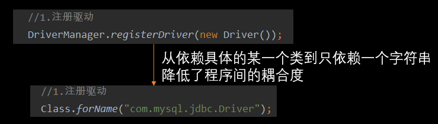

## 2.3javawebMVC中的耦合演示

- dao层

```java
package com.kl.dao;

//账户的持久层接口
public interface IAccountDao {
    void saveAccount();
}

//.......实现..............

package com.kl.dao;

//账户的持久层接口
public interface IAccountDao {
    void saveAccount();
}
```

- 业务层

```java
package com.kl.service;

//账户业务层接口
public interface IAccountService {
    //模拟保存账户,为避免麻烦就不再需要实体类参数
    void saveAccount();
}

//-----------实现--------------
package com.kl.service.impl;

import com.kl.dao.IAccountDao;
import com.kl.dao.impl.AccountImpl;
import com.kl.service.IAccountService;

public class AccountServiceImpl implements IAccountService {
    IAccountDao accountDao = new AccountImpl();
    @Override
    public void saveAccount() {
        accountDao.saveAccount();
    }
}
```

- 模拟表现层

```java
package com.kl.ui;

import com.kl.service.IAccountService;
import com.kl.service.impl.AccountServiceImpl;

public class Client {
    public static void main(String[] args) {
        IAccountService service = new AccountServiceImpl();
        service.saveAccount(); //输出:保存成功
    }
}
```

- 当该程序少了一个下面所示的依赖类程序都将无法运行

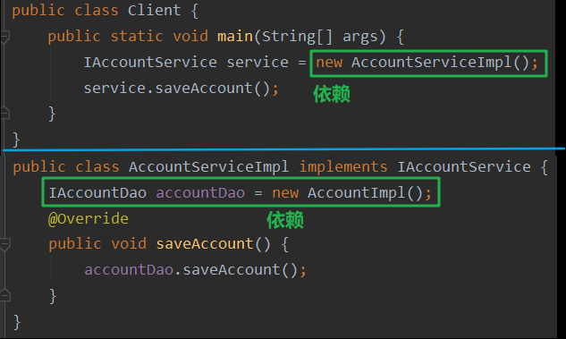

## 2.4如何解耦:工厂模式

1. 在resources目录下创建配置文件bean.properties

```properties
accountDao=com.kl.dao.impl.AccountImpl
accountService=com.kl.service.impl.AccountServiceImpl
```

2. 工厂类

```java
package com.kl.factory;

import java.io.IOException;
import java.io.InputStream;
import java.util.Properties;

/**
 * BeanFactory：一个创建bean对象的工厂
 * Bean：在计算机英语中，有可重用组件的含义
 * JavaBean：用Java语言编写的可重用组件
 *           javabean > 实体类
 *           是创建文明service和dao对象的
 * 工厂模式解耦：
 * 1.需要一个配置文件来配置我们的service和dao
 *   配置的内容：唯一标识 = 全限定类名(key = value)
 * 2.通过读取配置文件中配置的内容，反射创建对象
 *
 * 配置文件可以是xml，也可以是properties
 */
public class BeanFactory {
    //1.定义一个properties对象
    private static Properties properties;

    //2.使用静态代码块为Properties对象赋值
    static {
        properties = new Properties(); //实例化对象
        InputStream in = BeanFactory.class.getClassLoader().getResourceAsStream("bean.properties"); //使用类加载器获取配置文件的流对象
        try {
            if (in == null) throw new NullPointerException();
            properties.load(in);
        } catch (IOException e) {
            e.printStackTrace();
        }
    }

    //根据bean的名称获取bean对象
    public static Object getBean(String beanName){
        Object obj = null;
        String beanPath = properties.getProperty(beanName); //得到配置文件中的全限定类名
        System.out.println(beanPath);
        try {
            obj = Class.forName(beanPath).getConstructor().newInstance(); //把类加载到内存中并实例化对象
        } catch (Exception e) {
            e.printStackTrace();
        }
        return obj;
    }
}
```

3. 将有new依赖的地方都改为反射创建

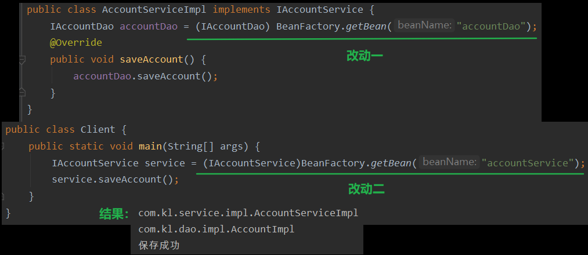

## 2.5改进工厂模式设计

- 从输出结果可以看到当前的工厂是多例的，这降低代码的效率

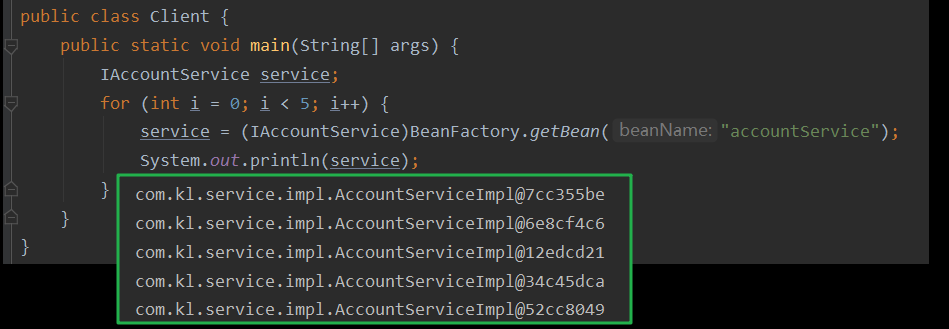

---

- 改进为单例

```java
public class BeanFactory {
    //存放我们要存放的对象,称之为容器
    private static Map<String,Object> map;

    //2.使用静态代码块为Properties对象赋值
    static {
        //1.定义一个properties对象
        Properties properties = new Properties(); //实例化对象
        map = new HashMap<>();
        InputStream in = BeanFactory.class.getClassLoader().getResourceAsStream("bean.properties"); //获取配置文件的流对象
        try {
            if (in == null) throw new NullPointerException();
            properties.load(in);
            //将配置文件中的key全部取出
            Enumeration<Object> keys = properties.keys();
            //遍历枚举类型的key
            while (keys.hasMoreElements()){
                //取出key并获取对应的全限定类名
                String key = (String) keys.nextElement();
                String beanPath = properties.getProperty(key);
                //加载类并创建实例对象
                Object obj = Class.forName(beanPath).getConstructor().newInstance();
                map.put(key,obj);
            }
        } catch (Exception e) {
            e.printStackTrace();
        }
    }

    //根据bean的名称获取bean对象
    public static Object getBean(String beanName){
        //直接从容器中取出对象
        return map.get(beanName);
    }
}
```

- 单例的工厂模式下的测试结果

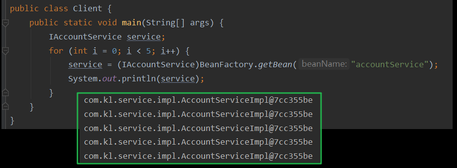

## Ioc控制反转

- 控制反转（Inversion of Control，英文缩写为loc）把创建对象的权利交给框架，是框架的重要特征，并非面向对象编程的用术语。它包括依赖注入（Dependency Injection，简称DI）和依赖查找（Dependency Lookup）
- 明确Ioc的作用：削减计算机程序的耦合（解除我们代码中的依赖关系）

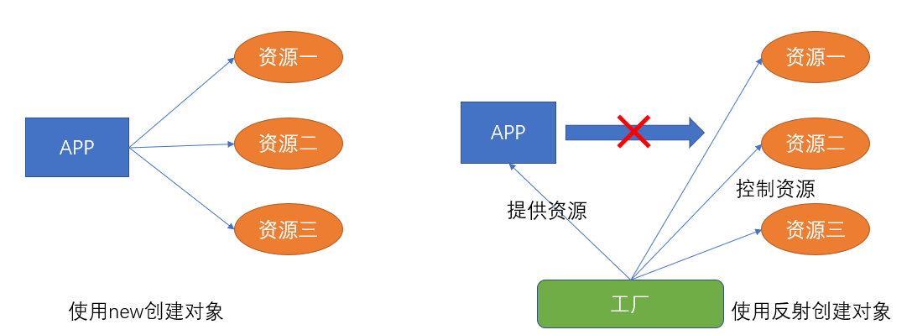

# 三、SpringIoC

## 3.1环境搭建和入门

1. 在pom.xml文件中导入spring坐标

```xml
<packaging>jar</packaging>
<dependencies>
    <dependency>
        <groupId>org.springframework</groupId>
        <artifactId>spring-context</artifactId>
        <version>5.0.2.RELEASE</version>
    </dependency>
</dependencies>
```

2. 创建bean.xml文件

```xml
<?xml version="1.0" encoding="UTF-8"?>
<!--导入约束-->
<beans xmlns="http://www.springframework.org/schema/beans"
       xmlns:xsi="http://www.w3.org/2001/XMLSchema-instance"
       xsi:schemaLocation="http://www.springframework.org/schema/beans
        http://www.springframework.org/schema/beans/spring-beans.xsd">

    <!--把对象的创建交给spring来管理-->
    <bean id="accountService" class="com.kl.service.impl.AccountServiceImpl"/>
    <bean id="accountDao" class="com.kl.dao.impl.AccountImpl"/>
</beans>
```

3. 使用测试

```java
public class Client {
    public static void main(String[] args) {
        //1.获取核心容器对象
        ApplicationContext ac = new ClassPathXmlApplicationContext("bean.xml");
        //2.根据id获取bean对象
        //方式一：需要强转
        IAccountService service = (IAccountService) ac.getBean("accountService");
        //方式二：不需要强转
        IAccountDao accountDao = ac.getBean("accountDao",IAccountDao.class);
        System.out.println(service); //com.kl.service.impl.AccountServiceImpl@5ea434c8
        System.out.println(accountDao); //com.kl.dao.impl.AccountImpl@3bbc39f8
    }
}
```

## 3.2BeanFactory和ApplicationContext的区别

```java
/**
 * ApplicationContext的三个常用类:
 *   ClassPathXmlApplicationContext:可以加载类路径下的配置文件,要求配置文件必须在类路径下,否则加载不了
 *   FileSystemXmlApplicationContext:可以加载磁盘任意路径下的配置文件(前提是有访问权限)
 *   AnnotationConfigApplicationContext:用于读取注解创建容器
 *
 * 核心容器的两个接口引发的问题:
 *   ApplicationContext:单例对象适用
 *   在构建核心容器时采用的是立即加载的方式
 *   只要一读取完配置文件就马上创建配置文件中配置的对象
 *
 *   beanFactory:多例对象适用
 *   在构建核心容器时，创建对象采取的策略是采用延迟加载的方式
 *   也就是说，什么时候根据id获取对象了，什么时候才真正的创建对象
 */
```

## 3.3spring对bean的管理细节

### 3.3.1bean创建的三种方式

1. **第一种方式：使用默认构造函数创建**

- bean.xml文件

```xml
<!-- 第一种方式：使用默认构造函数创建
     在spring的配置文件中使用bean标签，配以id和class属性之后，且没有其他属性和标签时
     采用的就是默认构造函数创建bean对象，此时如果类中没有默认构造函数，则对象无法创建
-->
<bean id="accountService" class="com.kl.service.impl.AccountServiceImpl"></bean>
```

2. **第二种方式： 使用普通工厂中的方法创建对象（使用某个类中的方法创建对象，并存入spring容器）**

- 工厂类

```java
package com.kl.factory;

import com.kl.service.IAccountService;
import com.kl.service.impl.AccountServiceImpl;

public class InstanceFactory {
    public IAccountService getAccountService(){
        return new AccountServiceImpl();
    }
}
```

- bean.xml

```xml
<!-- 第二种方式： 使用普通工厂中的方法创建对象（使用某个类中的方法创建对象，并存入spring容器）-->
<bean id="instanceFactory" class="com.kl.factory.InstanceFactory"></bean>
<bean id="accountService" factory-bean="instanceFactory" factory-method="getAccountService"></bean>
```

3. **第三种方式：使用工厂中的静态方法创建对象（使用某个类中的静态方法创建对象，并存入spring容器)**

- 工厂类

```java
package com.kl.factory;

import com.kl.service.IAccountService;
import com.kl.service.impl.AccountServiceImpl;

public class StaticFactory {
    public static IAccountService getAccountService(){
        return new AccountServiceImpl();
    }
}
```

- bean.xml

```xml
<!-- 第三种方式：使用工厂中的静态方法创建对象(使用某个类中的静态方法创建对象，并存入spring容器)-->
<bean id="accountService" class="com.kl.factory.StaticFactory" factory-method="getAccountService"></bean>
```

### 3.3.2bean对象的作用范围

```xml
<!-- bean的作用范围调整
    bean标签的scope属性：
        作用:用于指定bean的作用范围
        取值:常用的就是单例的和多例的
            1.singleton：单例的（默认值）
            2.prototype：多例的
            3.request：作用于web应用的请求范围
            4.session：作用于web应用的会话范围
            5.global-session：作用于集群环境的会话范围（全局会话范围），当不是集群环境时，它就是session  -->
<bean id="accountService" class="com.kl.service.impl.AccountServiceImpl" scope="prototype"/>
```

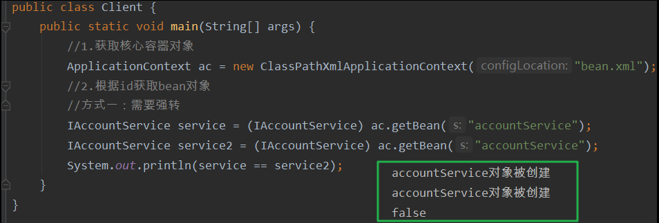

### 3.3.3bean对象的生命周期

- 在接口实现类中增加初始化模拟和销毁模拟的方法

```java
public class AccountServiceImpl implements IAccountService {
    public AccountServiceImpl(){
        System.out.println("accountService对象被创建");
    }

    public void saveAccount() {
        System.out.println("service的save方法");
    }
    public void init() {
        System.out.println("对象初始化");
    }
    public void destroy() {
        System.out.println("对象被销毁");
    }
}
```

---

- 在单例模式的配置下

```xml
<!-- bean对象的生命周期
        单例对象
            出生：当容器创建时对象出生
            活着：只要容器还在，对象一直活着
            死亡：容器销毁，对象消亡
            总结：单例对象的生命周期和容器相同
-->
 <bean id="accountService" class="com.kl.service.impl.AccountServiceImpl"
          scope="singleton" init-method="init" destroy-method="destroy"/>
```

- 测试中虽然调用了两次获取对象的方法，但对象只被创建了一次，并且执行了初始化方法和销毁方法

```java
public class Client {
    public static void main(String[] args) {
        //1.获取核心容器对象
        ClassPathXmlApplicationContext ac = new ClassPathXmlApplicationContext("bean.xml");
        //2.根据id获取bean对象
        //方式一：需要强转
        IAccountService service = (IAccountService) ac.getBean("accountService");
        IAccountService service2 = (IAccountService) ac.getBean("accountService");
        System.out.println(service == service2);
        ac.close();
    }
}
```

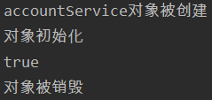

---

- 在多例模式的配置下

```xml
<!-- bean对象的生命周期
        单例对象
            出生：当容器创建时对象出生
            活着：只要容器还在，对象一直活着
            死亡：容器销毁，对象消亡
            总结：单例对象的生命周期和容器相同
        多例对象
            出生：当我们使用对象时spring框架为我们创建
            活着：对象只要是在使用过程中就一直活着。
            死亡：当对象长时间不用，且没有别的对象引用时，由Java的垃圾回收器回收
 -->
  <bean id="accountService" class="com.kl.service.impl.AccountServiceImpl"
          scope="prototype" init-method="init" destroy-method="destroy"/>
```

- 同样执行上面的测试方法，两次调用获取对象就创建了两次对象，并且销毁方法没有得到执行

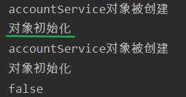

# 四、依赖注入

- 依赖注入：Dependency Injection
-  IOC的作用：降低程序间的耦合（依赖关系）
- 依赖关系的管理：以后都交给spring来维护，在当前类需要用到其他类的对象，由spring为我们提供，我们只需要在配置文件中说明
- 依赖关系的维护：就称之为依赖注入
- 依赖注入：能注入的数据有三类

>- 基本类型和String
>- 其他bean类型（在配置文件中或者注解配置过的bean）
>
>- 复杂类型/集合类型

-  注入的方式：有三种

>- 第一种：使用构造函数提供
>
>-  第二种：使用set方法提供
>
>- 第三种：使用注解提供

## 4.1构造函数注入

- 使用的标签：constructor-arg
- 标签出现的位置：bean标签的内部
- 标签中的属性

>- type：用于指定要注入的数据的数据类型，该数据类型也是构造函数中某个或某些参数的类型
>- index：用于指定要注入的数据给构造函数中指定索引位置的参数赋值。索引的位置是从0开始
>- name：(常用的)用于指定给构造函数中指定名称的参数赋值                                        
>-  ----------------------------(以上三个用于指定给构造函数中哪个参数赋值)-------------------------------
>- value：用于提供基本类型和String类型的数据
>- ref：用于指定其他的bean类型数据。它指的就是在spring的Ioc核心容器中出现过的bean对象           

- 优势：在获取bean对象时，注入数据是必须的操作，否则对象无法创建成功
- 弊端：改变了bean对象的实例化方式，使我们在创建对象时，如果用不到这些数据，也必须提供

---

- AccountServiceImpl类
- 注意：并没有getter和setter方法

```java
public class AccountServiceImpl implements IAccountService {
    //一下属性都是用来测试的,无特殊含义
    private String name;
    private Integer age;
    private Date birthday;

    public AccountServiceImpl(String name, Integer age, Date birthday) {
        this.name = name;
        this.age = age;
        this.birthday = birthday;
    }

    public void saveAccount() {
        System.out.println("service的save方法");
        System.out.println(this);
    }

    @Override
    public String toString() {
        return "AccountServiceImpl{" +
                "name='" + name + '\'' +
                ", age=" + age +
                ", birthday=" + birthday +
                '}';
    }
}
```

- bean.xml

```xml
<?xml version="1.0" encoding="UTF-8"?>
<beans xmlns="http://www.springframework.org/schema/beans"
       xmlns:xsi="http://www.w3.org/2001/XMLSchema-instance"
       xsi:schemaLocation="http://www.springframework.org/schema/beans
        http://www.springframework.org/schema/beans/spring-beans.xsd">

    <bean id="accountService" class="com.kl.service.impl.AccountServiceImpl">
        <constructor-arg name="name" value="张三"/>
        <constructor-arg name="age" value="18"/>
        <constructor-arg name="birthday" ref="birth"/>
    </bean>
    <bean id="birth" class="java.util.Date"/>
</beans>
```

- 测试方法：构造函数被调用了，方法也被执行了，说明注入成功

```java
public class Client {
    public static void main(String[] args) {
        //1.获取核心容器对象
        ApplicationContext ac = new ClassPathXmlApplicationContext("bean.xml");
        //2.根据id获取bean对象，getBean相当于就是new一个UserDao对象，区别在于用getBean的方式是容器启动时该对象已经存在于容器里
        IAccountService service = (IAccountService) ac.getBean("accountService");
        service.saveAccount(); //方法被调用,说明IAccountService类创建成功
    }
}
```

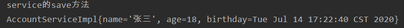

## 4.2set方法注入

- 使用的标签：property
- 标签出现的位置：bean标签的内部
- 标签中的属性

>- name：用于指定注入时所调用的set方法名称                               
>- value：用于提供基本类型和String类型的数据
>- ref：用于指定其他的bean类型数据。它指的就是在spring的Ioc核心容器中出现过的bean对象           

- 优势：创建对象时没有明确的限制，可以直接使用默认构造函数
- 弊端：如果有某个成员必须有值，则获取对象是有可能set方法没有执行

---

- 修改AccountServiceImpl类
- 添加setter方法即可

```java
public class AccountServiceImpl implements IAccountService {
    //以下属性都是用来测试的,无特殊含义
    private String name;
    private Integer age;
    private Date birthday;

    public void setName(String name) {
        this.name = name;
    }

    public void setAge(Integer age) {
        this.age = age;
    }

    public void setBirthday(Date birthday) {
        this.birthday = birthday;
    }

    public void saveAccount() {
        System.out.println("service的save方法");
        System.out.println(this);
    }

    @Override
    public String toString() {
        return "AccountServiceImpl{" +
                "name='" + name + '\'' +
                ", age=" + age +
                ", birthday=" + birthday +
                '}';
    }
}
```

- bean.xml

```xml
<?xml version="1.0" encoding="UTF-8"?>
<beans xmlns="http://www.springframework.org/schema/beans"
       xmlns:xsi="http://www.w3.org/2001/XMLSchema-instance"
       xsi:schemaLocation="http://www.springframework.org/schema/beans
        http://www.springframework.org/schema/beans/spring-beans.xsd">

    <bean id="accountService" class="com.kl.service.impl.AccountServiceImpl">
        <property name="name" value="张三"/>
        <property name="age" value="20"/>
        <property name="birthday" ref="birth"/>
    </bean>
    <bean id="birth" class="java.util.Date"/>
</beans>
```

- 测试方法不变，测试结果也没变

## 4.3注入集合数据

- 复杂类型的注入/集合类型的注入
- 用于给List结构集合注入的标签：list array set
- 用于个Map结构集合注入的标签:：map  props
- 结构相同，标签可以互换

---

- AccountServiceImpl类

```java
public class AccountServiceImpl implements IAccountService {

    private String[] strings;
    private List<String> list;
    private Set<String> set;
    private Map<String,String> map;
    private Properties properties;

    public void setStrings(String[] strings) {
        this.strings = strings;
    }

    public void setList(List<String> list) {
        this.list = list;
    }

    public void setSet(Set<String> set) {
        this.set = set;
    }

    public void setMap(Map<String, String> map) {
        this.map = map;
    }

    public void setProperties(Properties properties) {
        this.properties = properties;
    }

    public void saveAccount() {
        System.out.println(this);
    }

    @Override
    public String toString() {
        return "AccountServiceImpl{" +
                "strings=" + Arrays.toString(strings) +
                ", list=" + list +
                ", set=" + set +
                ", map=" + map +
                ", properties=" + properties +
                '}';
    }
}
```

- bean.xml

```xml
<?xml version="1.0" encoding="UTF-8"?>
<beans xmlns="http://www.springframework.org/schema/beans"
       xmlns:xsi="http://www.w3.org/2001/XMLSchema-instance"
       xsi:schemaLocation="http://www.springframework.org/schema/beans
        http://www.springframework.org/schema/beans/spring-beans.xsd">

    <bean id="accountService" class="com.kl.service.impl.AccountServiceImpl">
        <property name="strings">
           <list>
               <value>apple</value>
               <value>banana</value>
               <value>pear</value>
           </list>
        </property>
        <property name="list">
            <list>
                <value>哈哈</value>
                <value>嘻嘻</value>
                <value>呵呵</value>
            </list>
        </property>
        <property name="set">
            <set>
                <value>集合1</value>
                <value>集合2</value>
                <value>集合3</value>
            </set>
        </property>
        <property name="map">
            <map>
                <entry key="钥匙1" value="值1"/>
                <entry key="钥匙2" value="值2"/>
            </map>
        </property>
        <property name="properties">
            <props>
                <prop key="配置1">
                    对应1
                </prop>
                <prop key="配置2">
                    对应2
                </prop>
            </props>
        </property>
    </bean>
</beans>
```

- 测试方法不变：从输出结果看出复杂属性被注入成功

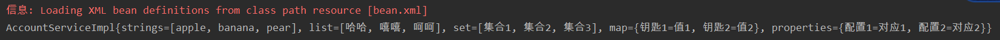