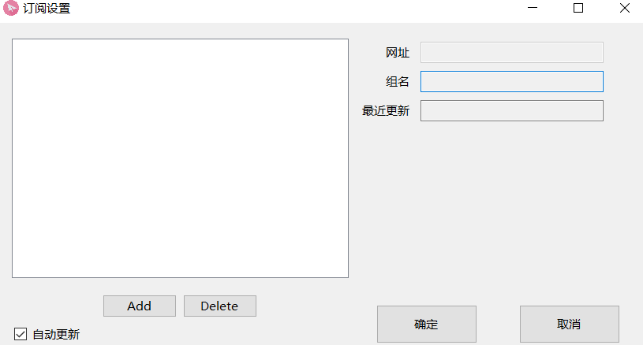

# 科学上网的原理

从国内直接访问外国服务器是不可以的，因为会被GFW（长城防火墙阻断），但有些国外服务器是没有被GFW阻断的，那么我们可以先与这台服务器通信，再通过这台服务器访问被阻断的服务器，这台服务器就是代理服务器，通过代理服务器我们就可以间断的访问被阻断的服务器，比如谷歌,Youtube

# VPN的历史

使用代理服务器的方式有很多种，比如VPN，VPN的中文意思是虚拟专用网，最开始是应用于企业中，在外地出差想访问企业内部的OA或者ERP，但企业内部的服务器又不能连接互联网，那么企业就可以设置一台VPN服务器，配置两块网卡，一块连接企业内部网络，一块连接互联网，这样在外出差就可以通过VPN访问企业内部网络了

后来VPN就主要用来科学上网，VPN主要有三种协议

- PPTP
- L2TP
- IPSec

这三种协议已经在GFW的黑名单了，所以即使使用VPN科学上网也会存在很大问题

1. 不安全，容易被检测出来
2. 速度慢，不稳定，即使是付费用户也可能用几天就不能用了，例如:即使使用手机破解版的蓝灯和纳豆，也可能用几天就用不了了

# 新的科学上网的软件

破娃酱：它是在SS基础上改进的一款科学上网的软件

无论SS还是SSR都是使用的SOCKSS协议，目前SSR是一款比较稳定易用的科学上网工具，可以在Github上下载

```http
https://github.com/shadowsocksrr/shadowsocksr-csharp/releases
```


下载解压，呜呜呜，呜呜呜，下载了一下午，麻蛋，还开了个VPN，找了好几个节点，一下午都没下好，也是奇怪了，换了一个新节点马上下好了，今天真的是日了狗了


4.0主要用在window7,window10系统，且电脑已经安装了.net framework 4.0以上的插件，如果你的电脑不能运行SSR，有可能你的电脑没有安装.net framework ，因为SSR是用C++C#语言开发的

- 打开4.0.exe


初次打开SSR，图标显示白色


去掉服务器负载均衡


# 每一项逐一讲解

## 1.系统代理模式主要分为三种：

- 直连模式
  - 电脑不使用SSR代理，相当于你的电脑没有打开SSR软件
- PAC模式
  - 利用PAC文件控制你的电脑流量
- 全局模式
  - 跟直连模式相反，全局模式就是你的电脑访问谷歌访问YouTube访问百度访问网易，也就是说无论是访问国内的网站还是国外的网站他全部都走这个SSR的代理
- 还有一个是保持当前状况不修改
  - 你选择了以上三种的任何一种模式，它就不会再做任何修改


---

第二项这里有很多PAC文件的配置方式


你直接更新PAC是无法更新成功的，它也不会弹出来错误提示刚才我们下载的SSR软件目录里是没有PAC文件的，必须连接一个SSR节点才可能可以更新成功

- 更新PAC为绕过局域网IP
  - 比如公司或者是学校流量就不会经过SSR代理了
- 更新PAC为绕过大陆常见域名列表
  - 得到一个pac文件，里面会有很多域名，包括百度的域名，那么就表示访问百度不会经过SSR节点
- 更新PAC为绕过大陆IP
  - 和更新PAC为绕过大陆常见域名列表是差不多的
- 更新PAC为GFWList
  - 的到pac文件，里面所列举出来的域名都全部是国外的已经被长城防火墙阻塞的，不翻墙这些地址都不能直接访问，谷歌和YouTube里面都有
- 更新PAC为仅通过大陆常见域名
  - 假设你身在美国，如果想访问国内的网站，比如百度，网易等，则可以选择这一项 
- 复制PAC URL
  - 实际上这一项就是指PAC文件的路径地址，粘贴到浏览器上就可以下载，下载的就是生成的pac文件
- 编辑本地PAC 文件
  - 会打开装有SSR的文件目录，然后就可以打开pac文件根据自己的需要进行编辑，增添一些域名地址
- 编辑GFWList用户规则
  - 然后就会生成一个user-rule文件，我们也可以编辑这个文件，一般用户用不到


## 2.讲解代理规则


- 绕过局域网：
  - 假设你的上网环境是公司或者是学校，你的公司或者学校有Web服务器，如果你访问Web服务器就不会走SSR节点
- 绕过局域网和大陆
  - 比如百度，打开百度这个流量是不会走SSR软件的
- 绕过局域网和非大陆
  - 和绕过局域网和大陆是差不多的
- 用户自定义
  - 用户编辑user-rule文件，从国外访问国内的网站就可以自定义
- 全局
  - 跟系统代理模式里面的全局模式是一样的


注：使用SSR这个软件主要就是通过上面三项来对流量进行控制

## 3.服务器解释


- SSR软件自带一个FreeSSR-public节点，这个节点是不可以用的，要上上网还得需要一个机场服务器才行
- 编辑服务器


打钩可以看到免费节点的IP地址


ping一下，没有ping通，说明不可用


ping了一下百度作对比


时间代表延迟，时间越小说明网络越好，TTL说明对方用的是什么系统

- 服务器端口
  - 连接的SSR节点的服务器开启的端口


- 从文件导入服务器

  主要是导入一个后缀为JSON的文件，这个文件主要是由机场主提供的机场服务的服务商提供的，导入的方式不常用

- 优先相同节点连接同一地址

  - 比如打开一个网站，打开一个域名，打开一个网页，如果这个网页里面只有一个域名，只有一个IP地址，那么就只用同一个节点去连接，如果有不同的IP地址，有不同的域名，那么就不会遵守这条规定，一般不用

- 服务器连接统计


点击群组名就可以进行开关，关闭所有群组名相同的节点，单点击开关可以控制单个节点的开关

---

选项里面可以设置


这样当你切换服务器的时候它就会自动把之前的服务器连接断开，如果不勾选的话切换服务器后之前的也不会断开


连接数越高说明这个结点越好，延迟数越小网络越好

## 4.服务器订阅


- 订阅设置



一开始并没有内容，如果要更换需要先delete之前的订阅内容

- 更新服务器订阅
  - 得先有一个可以用的节点

## 5.负载服务器均衡


简单的说就是用一下这个节点，再用一下另外一个节点，这个功能会不会提高访问速度呢？其实是不会的，一般情况下不要选择，使用这个功能谷歌账号容易被封

- 好处：刷新网页的时候可以看哪一个节点的延迟比较低，可以进行SSR节点的筛选

## 6.本地代理


这个本地代理是很牛逼的，我们可以把我们自己的主机变成一台代理服务器使用，需要把本地端口改一下，因为1080已经在本机使用了，可以改成1079等其他的，这样之后我们打开一台没有任何翻墙软件的手机，通过连接wifi的入口进去手动添加代理，输入我们的本机地址和端口号就可以让手机科学上网了

## 7.退出


直接点击退出就是正常退出，这时1080端口也会关闭

但是如果是从任务管理器里结束任务


那么这种情况1080端口不会关闭，你再重新点击小飞机打开的时候就会有错误

# 机场

什么是机场？

现实生活中的机场就有很多飞机，可以飞往各个地方。而科学上网中的机场集合了很多节点，我们可以通过这些节点访问国外的网站，这些节点其实就是国外的一些VPS服务器，或者是香港的一些VPS服务器。

- 香港的节点离大陆近，一般速度也会更快一点