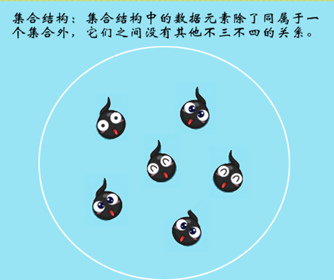
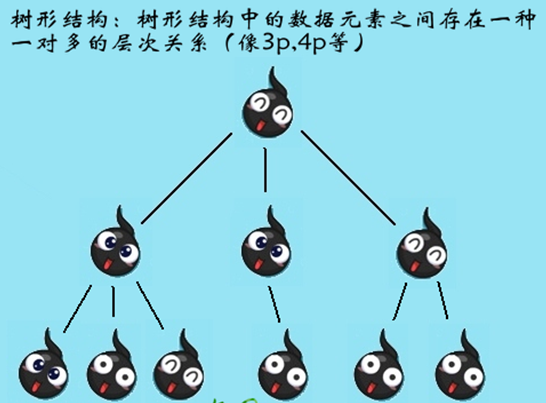
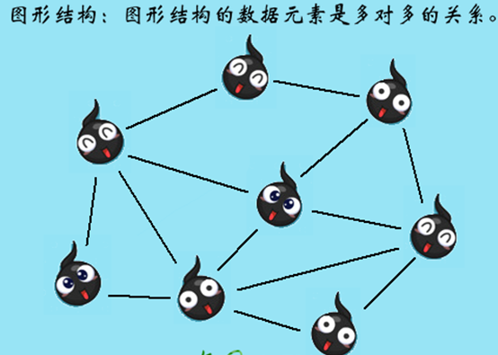
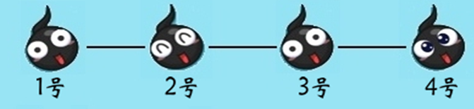
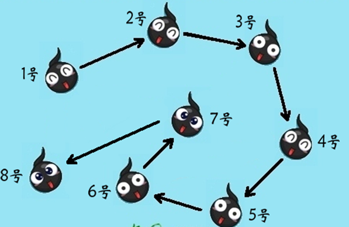
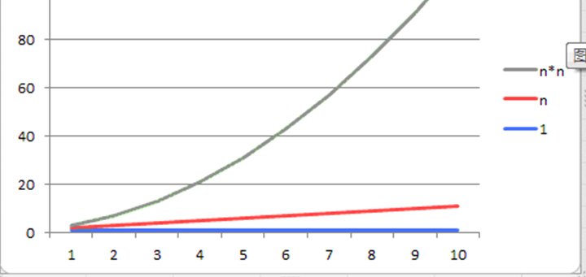
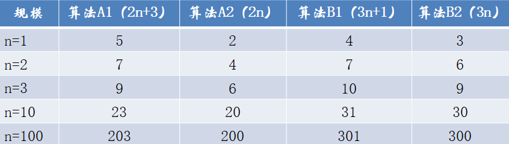
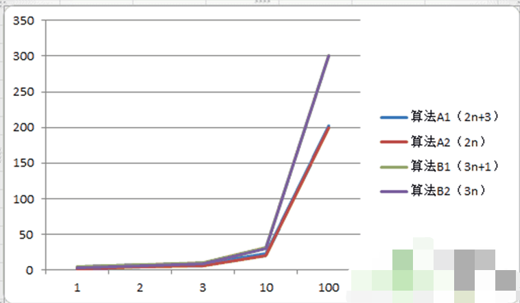
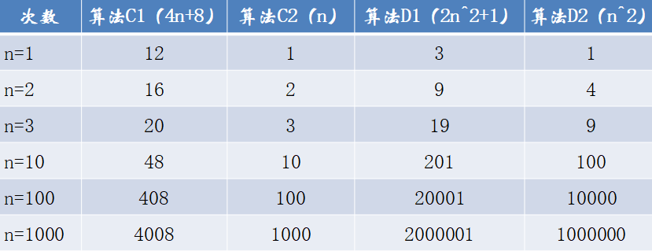
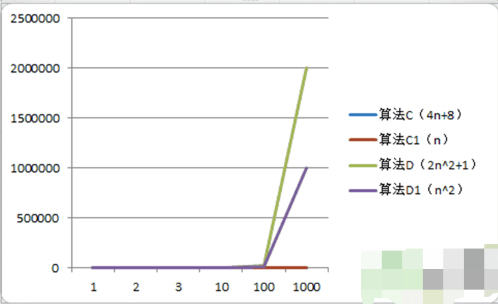

# 什么是数据结构？

## 数据结构和算法绪论

- 数据结构是一门研究非数值计算的程序设计问题中的操作对象，以及它们之间的关系和操作等相关问题的学科。

- 程序设计 = 数据结构 + 算法。
- 再简单的来说数据结构就是关系，没错，就是数据元素相互之间存在的一种或多种特定关系的集合。

- 传统上，我们把数据结构分为逻辑结构和物理结构。
- 逻辑结构：是指数据对象中数据元素之间的相互关系，也是我们今后最需要关注和讨论的问题。
- 物理结构：是指数据的逻辑结构在计算机中的存储形式。








## 物理结构

- 顺序存储结构：是把数据元素存放在地址连续的存储单元里，其数据间的逻辑关系和物理关系是一致的。
- 例如我们编程语言的数组结构就是这样滴。



## 链式存储结构

- 从顺序存储结构我们想到了日常生活中我们的排队，有木有？但现实生活中，我们发觉也并不完全如此。
- 例如有人排着排着她内急，她要被迫离开队伍去上洗手间，还有人不遵守基本基本道德规范他插队，这些情况会破坏存储存储结构的基本原则。
- 面对这样时常要变化的结构，顺序存储是不科学的，那么就该让链式存储结构露面了。



# 什么是算法呢？

- 算法是解决特定问题求解步骤的描述，在计算机中表现为指令的有限序列，并且每条指令表示一个或多个操作。
- 懵了吧？用通俗的话来讲，算法就是你泡妞儿的技巧和方式。这就像追女孩子，总不可能每个人追女孩子的方式都一样吧？
- 就像没有药可以包治百病一样，一个问题可以由多个算法解决，一个算法也不可能具有通解所有问题的能力。
- 算法具有五个基本特征：输入、输出、有穷性、确定性和可行性。

## 算法的特性

### 输入

- 算法具有零个或多个输入

### 输出

- 算法至少有一个或多个输出。
- 算法是一定要输出的，不需要它输出，那你要这个算法来干啥？输出的形式可以是打印形式输出，也可以是返回一个值或多个值等。

### 有穷性

- 指算法在执行有限的步骤之后，自动结束而不会出现无限循环，并且每一个步骤在可接受的时间内完成。一个永远都不会结束的算法，我们还要他来干啥？

### 确定性

- 算法的每一个步骤都具有确定的含义，不会出现二义性。
- 算法在一定条件下，只有一条执行路径，相同的输入只能有唯一的输出结果。
- 算法的每个步骤都应该被精确定义而无歧义。

### 可行性

- 算法的每一步都必须是可行的，也就是说，每一步都能够通过执行有限次数完成。

## 算法设计的要求

- 算法并不是唯一的。也就是说同一个问题，可以有多种解决问题的算法。

### 正确性

- 算法的正确性是指算法至少应该具有输入、输出和加工处理无歧义性、能正确反映问题的需求、能够得到问题的正确答案。

### 大体分为以下四个层次

- 算法程序没有语法错误。
- 算法程序对于合法输入能够产生满足要求的输出。
- 算法程序对于非法输入能够产生满足规格的说明。
- 算法程序对于故意刁难的测试输入都有满足要求的输出结果。

### 可读性

- 算法设计另一目的是为了便于阅读、理解和交流。
- 我们写代码的目的，一方面是为了让计算机执行，但还有一个重要的目的是为了便于他人阅读和自己日后阅读修改。

### 健壮性

- 当输入数据不合法时，算法也能做出相关处理，而不是产生异常、崩溃或莫名其妙的结果。

# 算法效率的度量方法

- 设计算法要尽量的提高效率，这里效率高一般指的是算法的执行时间。那么我们如何来度量一个算法的执行时间呢？所谓“是骡子是马拉出来遛遛”，比较容易想到的方法就是我们把算法跑若干次，然后拿个“计时器”在旁边计时。这种事后统计方法看上去的确不错，并且也并非真的要你拿个计算器在那里计算，因为计算机都有计时功能。

## 事后统计方法

- 这种方法主要是通过设计好的测试程序和数据，利用计算机计时器对不同算法编制的程序的运行时间进行比较，从而确定算法效率的高低。
- 但这种方法显然是有很大缺陷的：
  - 必须依据算法事先编制好测试程序，通常需要花费大量时间和精力，完了发觉测试的是糟糕的算法，那不是功亏一篑？赔了娘子又折兵？
  - 不同测试环境差别不是一般的大！
- 我们把刚刚的估算方法称为事后诸葛亮。我们的计算机前辈们也不一定知道诸葛亮是谁，为了对算法的评判更为科学和便捷，他们研究出事前分析估算的方法。

## 事前分析估算方法

- 在计算机程序编写前，依据统计方法对算法进行估算。

## 总结

- 我们发现一个高级语言编写的程序在计算机上运行时所消耗的时间取决于下列因素：
  1. 算法采用的策略，方案
  2. 编译产生的代码质量
  3. 问题的输入规模
  4. 机器执行指令的速度
- 由此可见，抛开这些与计算机硬件、软件有关的因素，一个程序的运行时间依赖于算法的好坏和问题的输入规模。（所谓的问题输入规模是指输入量的多少）

- 第一种算法：

```java
int i, sum = 0, n = 100;   // 执行1次
for( i=1; i <= n; i++ )    // 执行了n+1次
{
sum = sum + i;          // 执行n次
}
```

- 第二种算法：

```java
int sum = 0, n = 100;     // 执行1次
sum = (1+n)*n/2;          // 执行1次
```

```
第一种算法执行了1+(n+1)+n=2n+2次。
第二种算法，是1+1=2次
如果我们把循环看做一个整体，忽略头尾判断的开销，那么这两个算法其实就是n和1的差距。
```

循环判断在算法1里边执行了n+1次，看起来是个不小的数量，凭什么说忽略就能忽略？请接着继续看延伸的例子：

```
int i, j, x=0, sum=0, n=100;
for( i=1; i <= n; i++ )
{
for( j=1; j <= n; j++ )
{
x++;
sum = sum + x;
}
}

```

```
这个例子中，循环条件i从1到100，每次都要让j循环100次，如果非常较真的研究总共精确执行次数，那是非常累的。
另一方面，我们研究算法的复杂度，侧重的是研究算法随着输入规模扩大增长量的一个抽象，而不是精确地定位需要执行多少次，因为如果这样的话，我们就又得考虑回编译器优化等问题，然后，然后就永远也没有然后了！
所以，对于刚才例子的算法，我们可以果断判定需要执行100^2次。
```

- 我们不关心编写程序所用的语言是什么，也不关心这些程序将跑在什么样的计算机上，我们只关心它所实现的算法
- 这样，不计那些循环索引的递增和循环终止条件、变量声明、打印结果等操作。最终，在分析程序的运行时间时，最重要的是把程序看成是独立于程序设计语言的算法或一系列步骤。
- 我们在分析一个算法的运行时间时，重要的是把基本操作的数量和输入模式关联起来。



# 函数的渐近增长

- 判断以下两个算法A和B哪个更好？
  - 假设两个算法的输入规模都是n，算法A要做2n+3次操作，你可以这么理解：先执行n次的循环，执行完成后再有一个n次的循环，最后有3次运算。
  - 算法B要做3n+1次操作，理解同上，你觉得它们哪一个更快些呢？



```
当n=1时，算法A1效率不如算法B1，当n=2时，两者效率相同；当n>2时，算法A1就开始优于算法B1了，随着n的继续增加，算法A1比算法B1逐步拉大差距。所以总体上算法A1比算法B1优秀。
```



- 函数的渐近增长：给定两个函数f(n)和g(n)，如果存在一个整数N，使得对于所有的n>N，f(n)总是比g(n)大，那么，我们说f(n)的增长渐近快于g(n)。
- 从刚才的对比中我们还发现，随着n的增大，后面的+3和+1其实是不影响最终的算法变化曲线的。
- 例如算法A2，B2，在图中他们压根儿被覆盖了。所以，我们可以忽略这些加法常数。

第二个测试，算法C是4n+8，算法D是2n^2+1。





- 我们观察发现，哪怕去掉与n相乘的常数，两者的结果还是没有改变，算法C2的次数随着n的增长，还是远小于算法D2。
- 也就是说，与最高次项相乘的常数并不重要，也可以忽略。

## 总结

- 判断一个算法的效率时，函数中的常数和其他次要项常常可以忽略，而更应该关注主项（最高项）的阶数。

- 注意，判断一个算法好不好，我们只通过少量的数据是不能做出准确判断的，很容易以偏概全。