# 单链表`java`实现

## 概要

链表是一种数据结构，和数组同级。比如，Java中我们使用的`ArrayList`，其实现原理是数组。而`LinkedList`的实现原理就是链表了。链表在进行循环遍历时效率不高，但是插入和删除时优势明显。下面对单向链表做一个介绍。

<u>单向链表是一种线性表，实际上是由结点（Node）组成的</u>，一个链表拥有不定数量的节点。

其数据在内存中存储是不连续的，它存储的数据分散在内存中，<u>每个结点只能也只有它能知道下一个结点的存储位置</u>。由N各节点（Node）组成单向链表，每一个Node记录本Node的数据及下一个Node。

向外暴露的只有一个头节点（Head），<u>我们对链表的所有操作，都是直接或者间接地通过其头节点来进行的</u>。
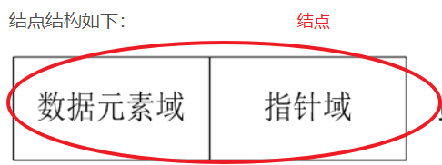


  

上图中最左边的节点即为头结点（Head），但是添加节点的顺序是从右向左的，添加的新节点会被作为新节点。<u>最先添加的节点对下一节点的引用可以为空。引用是引用下一个节点而非下一个节点的对象。</u>因为有着不断的引用，所以头节点就可以操作所有节点了。
下图描述了单向链表存储情况。存储是分散的，每一个节点只要记录下一节点，就把所有数据串了起来，形成了一个单向链表。
  

节点（Node）是由一个需要储存的对象及对下一个节点的引用组成的。也就是说，<u>节点拥有两个成员：储存的对象、对下一个节点的引用。下面图是具体的说明：</u> 

  

## 实现

### 构造结点对象

```java
public class MyLink {
    public Node head = null; // 头节点

    /**
     * 链表中的节点，data代表节点的值，next是指向下一个节点的引用
     */
    class Node {
        Node next = null;// 节点的引用，指向下一个节点
        int data;// 节点的对象，即内容

        private Node(int data) {
            this.data = data;
        }
    }
    ....
} 
```

### 向结点插入数据

```java
/**
     * 向链表中插入数据
     */
    public void addNode(int value) {
        Node newNode = new Node(value);// 实例化一个节点
        if (head == null) {
            head = newNode;
            return;
        }
        Node temp = head;
        while (temp.next != null) {
            temp = temp.next;
        }
        temp.next = newNode;
    }
```

------

测试1：

```java
System.out.println("linkLength:" + list.length());
System.out.println("head.data:" + list.head.data);
System.out.println(list.head.next);
```

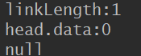

代码逻辑：手动debug

先初始化头结点：在方法里创建一个结点对象，判断头结点为空之后就把这个对象的引用给头结点，头结点就算初始化了，有了一个data=0，指向向一个结点引用的next为null；

创建第一个结点：也是在方法里创建一个新的结点对象，判断头结点不为空，继续向下执行，把头结点的引用给一个临时结点，这个临时结点判断下一个结点的引用为空，直接就将第一个结点的引用给头结点里的next对象，这一步运行完头结点就丰满了，有了一个数值0，还有第一个结点的引用；但第一个结点只有数值1，引用为null

创建第二个结点：先创建一个新的对象，头结点不为空，把头结点引用给一个临时结点，这个的结点的引用不为空，也就是存在第一个结点的地址，那就把第一个结点的地址又给这个临时结点，由这个临时结点判断第一个结点里的引用是null，那就把第二个结点的引用给第一个结点的next对象；

。。。。。。

依次类推直到最后一个结点

小测试2

```java
 MyLink list = new MyLink();
        list.addNode(0);
        list.addNode(1);
        list.addNode(2);
        System.out.println("linkLength:" + list.length());
        System.out.println("head.data:" + list.head.data);
        System.out.println(list.head);
        System.out.println(list.head.next.next);
        System.out.println(list.head.next.next.next);
```

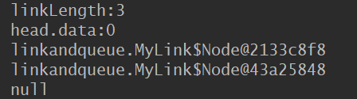

头结点有地址，有引用；但是尾结点只有地址没有引用。


**第一次addNode方法调试：**

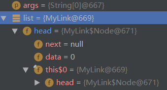

**第二次addNode方法调试：**

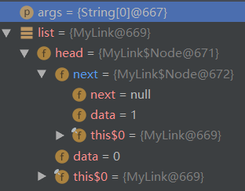

**第三次addNode方法调试：**

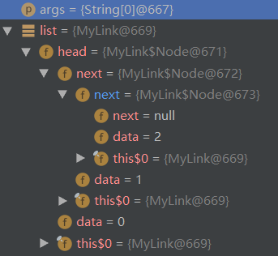

​                                                   。。。。。。。。。。。。。。。。。。。。。。

**最后一次：第五次addNode方法调试：**

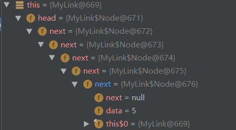

从输出和调试结果可以看出头结点的data是0，自己的地址是671，存在下一个结点的引用672，结点互相串联在一起，最后一个结点的自己的引用地址为676，没有下一个结点的引用地址了null

### 删除指定位置节点

这个程序有问题

```java
/**
     *
     * @param index:删除第index个节点
     */
    public boolean deleteNode(int index) {
        if (index < 1 || index > length()) {
            return false;
        }
        if (index == 1) {
            head = head.next;
            return true;
        }
        int i = 2;
        //头结点的引用
        Node preNode = head;
        //第一个结点的引用
        Node curNode = preNode.next;
        while (curNode != null) {
            if (i == index) {
                preNode.next = curNode.next;
                return true;
            }
            preNode = curNode;
            curNode = curNode.next;
            i++;
        }
        return false;
}
```

思路：

链表和数组不一样，链表应该是从1开始的，那么在删除结点的时候我们就要先排除非法输入，如果输入比1还小的数或比链表长度还大的数就返回false；

删除头结点：如果是等于1的话，就是删除头结点，那么就直接把头结点的引用，也就是第一结点的地址给头结点就好了，头结点的原本地址被第一个结点的地址覆盖，就删除了。

如果是删除其他结点

删除第二个为例：

进入循环，先判断第一结点地址为null吗，有第一结点才向下执行，如果index=2，i=2，此时判断条件成立，那么就把第一个结点的引用给头结点，也就是用第二个结点的地址覆盖掉第一个结点的地址，那么第一个结点就被删除了，这样头结点的引用也变成了原来第二个结点的引用

删除第二个结点，但是没有第三个结点的情况：

也是进入if判断，为true，然后把第二行结点的引用给第一个结点，那第一个结点就变为null，但null也是值，只是在打印的时候判断不打印为null的值出来

### 返回结点长度

```java
/**
     * @return 返回节点长度
     */
    public int length() {
        int length = 0;
        Node temp = head;
        while (temp != null) {
            length++;
            temp = temp.next;
        }
        return length;
    }
```

思路：

从头结点地址开始访问，如果存在就继续访问下一个，让长度加1，知道下一个结点的地址为空，那么链表的长度也出来了

### 未知头指针删除结点

```java
    /**
     * 在不知道头指针的情况下删除指定节点
     */
    public boolean deleteNode11(Node n) {
        if (n == null || n.next == null)
            return false;
        int tmp = n.data;
        n.data = n.next.data;
        n.next.data = tmp;
        n.next = n.next.next;
        System.out.println("删除成功！");
        return true;
    }
```

### 打印结点数据

```java
 public void printList() {
        Node temp = head;
        while (temp != null) {
            System.out.print(temp.data+" ");
            temp = temp.next;
        }
    }
```

思路：和返回结点长度的思路一样，挨个结点判断地址是否存在，存在就输出该结点携带的值，不存在了就

结束打印的循环

### 测试

```java
 public static void main(String[] args) {
        MyLink list = new MyLink();
        list.addNode(0);
        list.addNode(1);
        list.addNode(2);
        list.addNode(3);
        list.addNode(4);
        System.out.println("linkLength:" + list.length());
        System.out.println("head.data:" + list.head.data);


        list.printList();
        System.out.println();
        System.out.println("After deleteNode(4):");
        list.deleteNode(4);
        list.printList();
        System.out.println();
        System.out.println("After deleteNode(1):头结点");
        list.deleteNode(1);
        list.printList();
    }
```

**输出：**

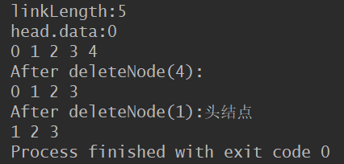

> **结点计数是从1开始的**

## 单链表的反转

### 迭代法

<u>所谓的单链表反转，就是把每个节点的指针域由原来的指向下一个节点变为指向其前</u>

<u>一个节点。</u>但由于单链表没有指向前一个节点的指针域，因此我们需要增加一个指向

前一个节点的指针`pre`，用于存储每一个节点的前一个节点。此外，还需要定义一

个保存当前节点的指针cur，以及下一个节点的next。定义好这三个指针后，遍历单

链表，将当前节点的指针域指向前一个节点，之后将定义的三个指针往后移动，直至

遍历到最后一个节点停止。


```java
public  Node ReverseIteratively(){
        Node pre = null;
        Node next = null;
        while (head != null) {
            next = head.next;
            head.next = pre;
            pre = head;
            head = next;
        }
        //新的头结点
        head=pre;
        return head;
    }
```

### 递归法


>**递归实质上就是系统帮你压栈的过程，系统在压栈的时候会保留现场。**

我们来看是怎样的一个递归过程：1->2->3->4

- 程序到达Node newHead = reverse(head.next);时进入递归
- 我们假设此时递归到了3结点，此时head=3结点，temp=3结点.next(实际上是4结点)
- 执行Node newHead = reverse(head.next);传入的head.next是4结点，返回的newHead是4结点。
- 接下来就是弹栈过程了
  - 程序继续执行 temp.next = head就相当于4->3
  - head.next = null 即把3结点指向4结点的指针断掉。
  - 返回新链表的头结点newHead

>**注意：当retuen后，系统会恢复2结点压栈时的现场，此时的head=2结点；temp=2结点.next(3结点)，再进行上述的操作。最后完成整个链表的翻转。**


**首先定义Node：**

```java
public static class Node {
    public int value;
    public Node next;

    public Node(int data) {
        this.value = data;
    }
}
```

**反转方法如下：**

```java
public Node reverse(Node head) {
    if (head == null || head.next == null)
        return head;
    Node temp = head.next;
    Node newHead = reverse(head.next);
    temp.next = head;
    head.next = null;
    return newHead;
}
```


# 单链表的整表创建

## 头插法

先创建第一个结点，让它为头结点；接着又创建第二个结点，把第一个结点的引用给

第二个结点，并把第二个结点又设置为头结点；接着又创建第三个结点，把第二个结

点的引用给第三个结点，再把第三个结点设置为头结点，以此类推。。。。。。

```java
public class Link {
    //创建一个存储数据的属性
    private int data;
    //创建存储下一个节点地址的属性
    private Link next;
    static int length=0;
    /**
     * 创建一个链表
     * @param len  产生数据的长度
     * @return  链表第一个节点地址
     */
    public static Link create(int len){
        //定义随机对象
        Random r=new Random();
        //定义链表的节点
        Link newnode,header;
        //header永远存储第一个节点的地址，tailer永远存储最后一个节点的地址
        header=null;
        for (int i = 0; i < len; i++) {
            //生成一个[0-100)的随机数字
            int temp=r.nextInt(100);
            //创建一个临时节点
            newnode=new Link();
            //长度
            length++;
            //为属性赋值
            newnode.data=temp;
            //判断当前链表是否第一次赋值
            if(header==null){
                header=newnode;
            }else{
                //将新节点连接到链表的头部
                newnode.next=header;
                //header永远存储第一个节点的地址
                header=newnode;
            }
        }
        return header;
    }
```

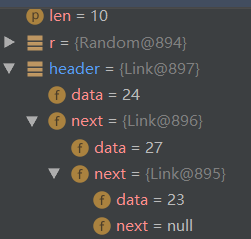

思路：先输入一个数字确定链表的长度，然后开始循环创建结点，第一次创建第一个临时结点，给这个结点初始化一个随机值23，如果头结点为空就把这个结点的引用给头结点，这样头结点就有了一个数据23，但引用next为null；第二次循环又创建第二个临时结点(`newNode`与第一个结点对象的引用断开，第一个结点对象被释放)，给这个结点初始化数据为27，这时头结点不为空，就把头结点的引用给临时结点的引用，这时这个临时结点就有了数据27和头结点的地址引用，再把这个临时结点的引用给头结点，头结点的地址就被这个临时结点的地址覆盖(头结点对第一个结点的引用断开，指向第二个结点)，有了第二个临时结点携带的内容(第二个结点的数据和第一个结点的引用地址)；然后创建第三个结点，以此类推，header永远存储第一个节点的地址，最后一个结点的引用next为null，这就是头插法

```java
 public static void main(String[] args) {
        Scanner sc=new Scanner(System.in);
        System.out.println("输入长度：");
        int len=sc.nextInt();
        System.out.println("打印数组：");
        //调用数组生成方法 传入键盘值l
        Link head=Link.create(len);
        for (int i = 0; i < Link.length; i++) {
            System.out.print(head.data+" ");
            //把当前对象的下一个对象地址传给当前对象
            head=head.next;
        }
    }

```

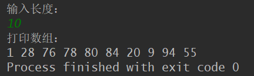

## 尾插法

```java
public class Link {
    //创建一个存储数据的属性
    private int data;
    //创建存储下一个节点地址的属性
    private Link next;
    private static int length=0;
    /**
     * 创建一个链表
     * @param len  产生数据的长度
     * @return  链表第一个节点地址
     */
    public static Link create(int len){
        //定义随机对象
        Random r=new Random();
        //定义链表的节点
        Link newnode,header,tailer;
        //header永远存储第一个节点的地址，tailer永远存储最后一个节点的地址
        header=tailer=null;
        for (int i = 0; i < len; i++) {
            //生成一个随机数字
            int temp=r.nextInt(100);
            //创建一个临时节点
            newnode=new Link();
            //长度
            length++;
            //为属性赋值
            newnode.data=temp;
            //判断当前链表是否第一次赋值
            if(header==null){
                header=tailer=newnode;
            }else{
                //将新节点连接到链表的尾部
                tailer.next=newnode;
                //tailer永远存储最后一个节点的地址
                tailer=newnode;
            }
        }
        return header;
    }
```

**尾插法： 尾插法相对于头插法有些许不同 因为要返回头 头不能动 所以需要一个tailer来记录最后一个值 tailer右移**

```java
 public static void main(String[] args) {
        Scanner sc=new Scanner(System.in);
        System.out.println("输入长度：");
        int len=sc.nextInt();
        System.out.println("打印数组：");
        //调用数组生成方法 传入键盘值l
        Link head=Link.create(len);
        for (int i = 0; i < Link.length; i++) {
            System.out.print(head.data+" ");
            //把当前对象的下一个对象地址传给当前对象
            head=head.next;
        }
    }
```

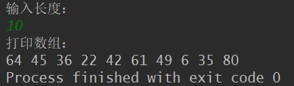

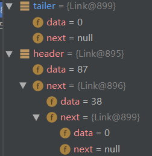


这里可以比较一下两种方法的不同：

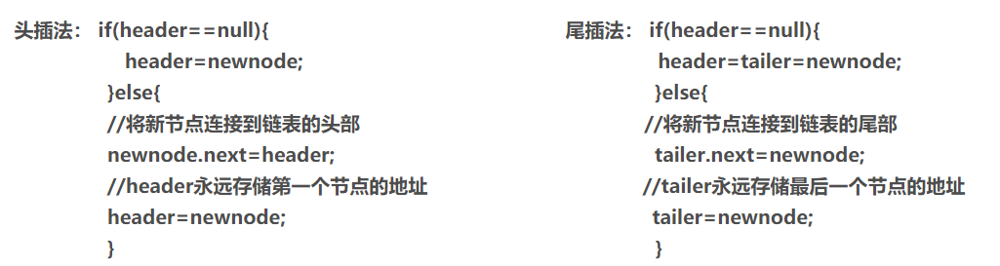


## 疑问

在每次`newnode=new Link()`一个对象后，`newnode`引用的对象就会发生改变，那么之前那个节点就失去了引用，这个结点会被垃圾回收机制回收吗？

不会，因为失去名字的结点虽然没有名字了，但是他的地址还存在上一个结点的next对象里，相当于它的名字最终就是next


