# 单表操作

1. 查询全体学生的学号和姓名

```sql
select Sno,Sname from Student
```

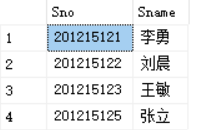

2. 查询全体学生的姓名、学号和系

```
select Sname,Sno,Sdept from Student
```


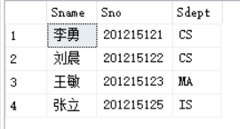

各个列的先后顺序可以与表中的不一致

3. 查询全体学生的详细记录

```sql
select * from Student
```

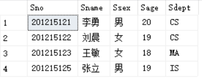

4. 查询全体学生的姓名及其出身年份

```sql
select Sname,2014-Sage from Student
```

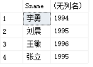

查询的第二列不是一个列名而是一个计算式，用当时的年份减去学生的年龄及等于学生的出身年份

5. 查询全体学生的姓名，出生年月和所在院系

```sql
select Sname,'Year of Birth',2014-Sage,LOWER(Sdept) from Student
```


可以指定别名来改变查询结果的列标题

```mssql
select Sname,'Year of Birth' Birth,2014-Sage Birthday,LOWER(Sdept) Department from Student
```

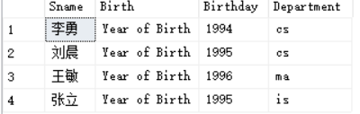

6. 查询选修了课程的学生学号

```sal
select Sno from SC 
```

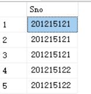

包含了很多重复的行

```sql
select distinct Sno from SC 
```

- **加上一个单词：distinct(截然不同)就可以去掉重复的行**

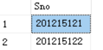

7. 查询计算机科学系全体学生的名单

```sql
select Sname from Student where Sdept='CS';
```

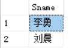

目的：得到一个名单，那就是学生的名字，学生的名字从学生表里查

约束条件：计算机科学系

8. 查询所以年龄在20岁以下的学生姓名及其年龄

```sql
select Sname,Sage from Student where Sage<20;
```

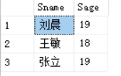

目的：得到学生姓名和年龄

约束条件：年龄在20岁以下

9. 查询考试成绩在90分以下的学生学号

```sql
select Sno from SC where Grade<90;
```

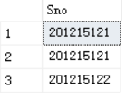

这里出现了学号重复，说明这个学生有多门课程在90分以下

10. 查询年龄在20-23岁之间的学生的姓名，系别和学号

```sql
select Sname,Sdept,Sage from Student where Sage between 20 and 23;
```

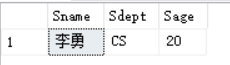

- **between前是范围的下限，and后是范围的上限** 

11. 查询年龄不在20-23岁之间的学生的姓名，系别和学号

```sql
select Sname,Sdept,Sage from Student where Sage not between 20 and 23;
```

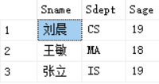

在between前加一个not就行了

12. 查询在计算机系、数学系、信息系的学生的名字、性别和系名

```sql
select Sname,Ssex,Sdept from Student 
where Sdept in('CS','MA','IS');
```

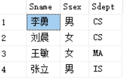

13. 查询既不是计算机系、数学系、也不是信息系的学生的名字、性别和系名

```sql
select Sname,Ssex,Sdept from Student 
where Sdept not in('CS','MA','IS');
```


查询结果为空，没有这样的同学

- **in可以用来查找属性值属于指定集合的元组**

14. 查询学号为20125121的学生的详细情况

```sql
select * from Student 
where Sno like '201215121';
```

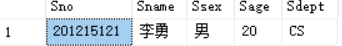

等价于

```sql
select * from Student 
where Sno = '201215121';
```

注：如果like后面不含通配符，则可以用=运算符取代like谓词，可以用!=或者<>运算符来取代not like谓词

15. 查询所有姓刘的学生的姓名，学号和性别

```sql
select Sname,Sno,Ssex from Student 
where Sname like '刘%';
```

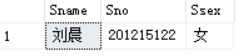

16. 查询姓欧阳且全名为四个汉字的学生的信息

```sql
select * from Student 
where Sname like '欧阳__';
```

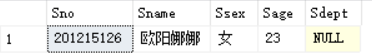

**注：上面是两条横的线'_'，一条横线代表一个汉字，中间不能有空格**

数据库字符集为ASCLL时一个汉字需要两个_；当字符集为GBK时只需要一个

17. 查询名字中第二个字为阳的学生信息

```sql
select * from Student 
where Sname like '_阳%';
```

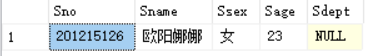

18. 查询所以不姓刘的学生的信息

```sql
select * from Student 
where Sname not like '刘%';
```

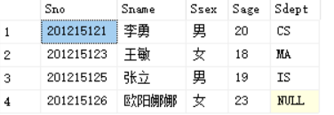

19. 查询DB_design课程的课程号和学分

```sql
select Cno,Ccredit from Course 
where Cname like 'DB\_design' escape '\'
```

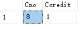

书上说的是`escape '\'`表示\为换码字符，这样紧跟在\后面的字符`'_'`不再具有通配符的含义，转义为普通的`'_'`字符

但是就这么直接查也是一样的结果！

```sql
select * from Course 
where Cname like 'DB_%i__'
```

20. 查询以DB开头，倒数第三个字符为i的课程的详细信息

```sql
select Cno,Ccredit from Course 
where Cname like 'DB_%i__'
```

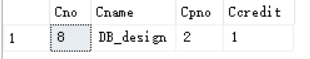

聚合函数

21. 查询学生的总人数

```sql
select count(*)'总人数' from Student
```

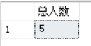

22. 查询选修了课程的学生人数

```sql
select count(distinct Sno)'总人数' from SC
```

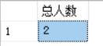

有同学选了多门选修，distinct除去了重复计数的情况

23. 查询选修了1号课程的学生最高分

```sql
select max(Grade)'最高分' from SC where Cno=1
```

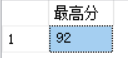

24. 查询学号为201215121的同学选修课的总学分

```sql
select sum(Ccredit)'总修学分' from SC,Course 
where Sno='201215121' and SC.Cno=Course.Cno;
```


学分是在Course表里，学号在Student表和SC表里都有，但是要从学号找到学生，再找到学生选修课程的学分就只有通过SC表与Course表连接

25. 查询各个课程号和选课的人数

```sql
select Cno,count(Sno) from SC;
```

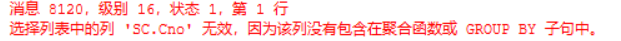

修改

```sql
select Cno,count(Sno)'人数' from SC group by Cno;
```

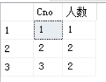

- **group by子句将查询的结果按某一列或多列的值分组，值相等的为一组**

26. 查询选修了两门或两门以上课程的学生学号

错解：

```java
select * from SC 
group by Sno having count(*)>2
```

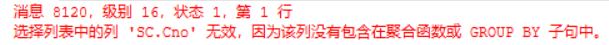

修改：

```sql
select Sno from SC 
group by Sno having count(*)>2
```

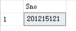

- **分组后还有再进行筛选，用having短语指定筛选条件**

思路：这里先用group by子句按照学号Sno进行分组，相同学号的为一组，然后再用聚合函数count对每一组计数；having短语给出了选择组的条件，只有满足条件的组才会被输出，即在同一组里统计的学号Sno数大于2的才会被输出

27. 查询选修了两门或两门以上课程的学生信息

```sql
select * from Student 
where Student.Sno in(select Sno from SC 
group by Sno having count(*)>2)
```

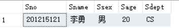

要查询学生的信息肯定要到Student表中读取，但是要先根据选修的课程数进行筛选，而选课情况又在SC表中，得先从SC表里面把符合条件的同学进行分组筛选一遍输出来，这时得到一个符合条件的学号集合，再通过in谓词看是否有学生表里的学生，有就输出结果

目的：得到学生信息

筛选条件：选修了两门以上的课程

28. 查询平均成绩大于等于90分的学生学号和平均成绩

错解

```SQL
select Sno,avg(Grade) from SC 
where avg(Grade)>85 group by Sno
```

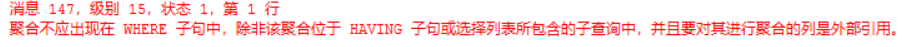

正解

```sql
select Sno,avg(Grade)'平均成绩' from SC  
group by Sno having avg(Grade)>=85
```

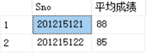

因为where子句不能用聚合函数作为表达式

- 一般有聚合函数加列名的后面都要用group by语句来分组，可以用having语句进行再筛选