# 建表语句

Student

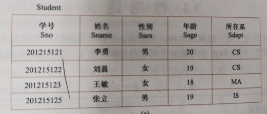

Course

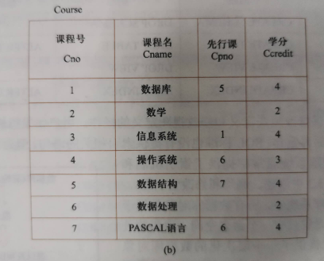

SC

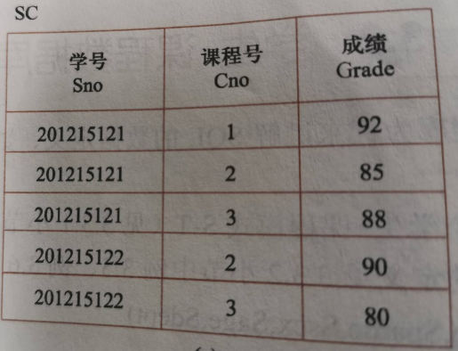

## 建立学生表

```sql
create table Student
(Sno char(9) PRIMARY KEY,
Sname char(20) UNIQUE,
Ssex char(2),
Sage SMALLINT,
Sdept char(20)
);
```

### 情况一：

数据库表建立后左边的资源管理器却没有，解决

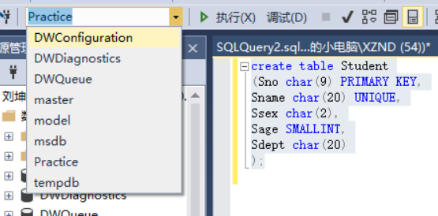

1.先改成自己的数据库名下，再右键表刷新，如果不行自己右键自己的数据库刷新一次就可以了

### 情况二：

表名，列名下出现红波浪线，显示“表名无效”，但仍然可以查询得到结果

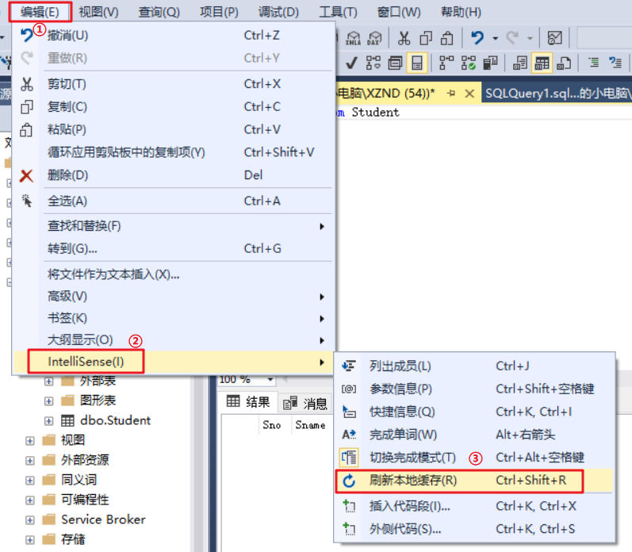

刷新本地缓存红色波浪线就消失了

## 建立课程表 

```sql
create table Course
(Cno char(4) PRIMARY KEY,
Cname char(40) not null,
Cpno char(4),
Ccredit SMALLINT,
foreign key(Cpno) references Course(Cno)
);
```

## 建立学生选课表

### 情况一：

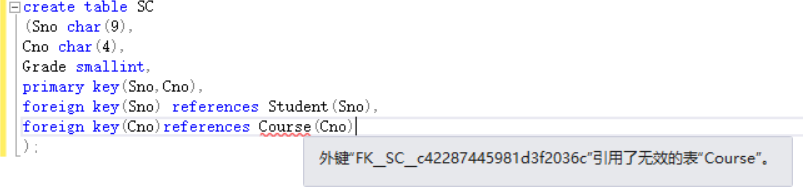

我之前的课程表明明已经创建好了，突然发现我在查询的时候又是显示的是Course表名无效，所以原因在于没有刷新本地缓存，刷新后就解决了

```sql
create table SC
(Sno char(9),
Cno char(4),
Grade smallint,
primary key(Sno,Cno),
foreign key(Sno) references Student(Sno),
foreign key(Cno)references Course(Cno)
);
```

## 设计表

在创建表之后就需要向表中填充数据

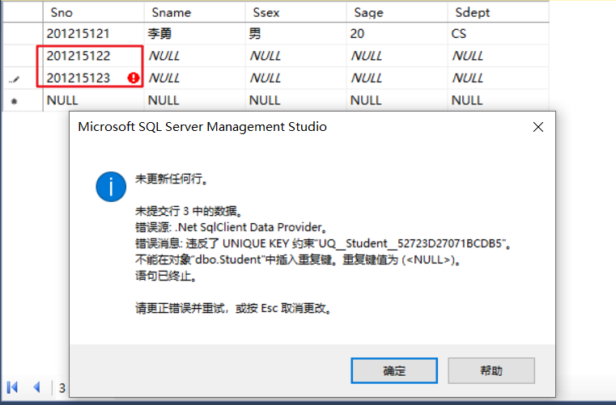

数据要一行一行的录入完之后再录另一行的数据，如果跳着录入就会出现错误

### 情况一：

提示索引超出范围？

之前创建表时一个字母没有大写，然后我设计表把字母改成大写了，出现了这个错误，得到的答案是因为我增加了属性，但数据库还是老的。

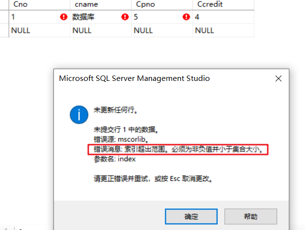

于是我重新建表，取提示表名对象已经存在了

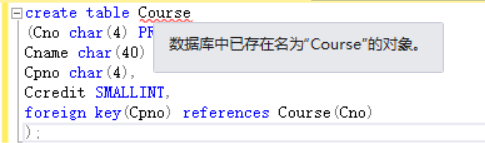

我刷新了本地缓存波浪线也没有去除，但并没有影响到查询结果，重新建立的表并没有改变原来表的结构

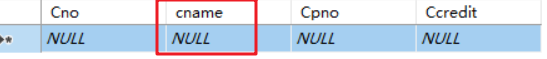

cname还是小写，原因是可能被锁表了，解决：

一种方法是找到锁表进程，杀之，然后drop表。或者重启数据库，重启后锁表进程已被清除，可以删除了。

我重启了数据库，其实还是不行，想着就直接删除数据库，重新建表吧！结果还删不了数据库！

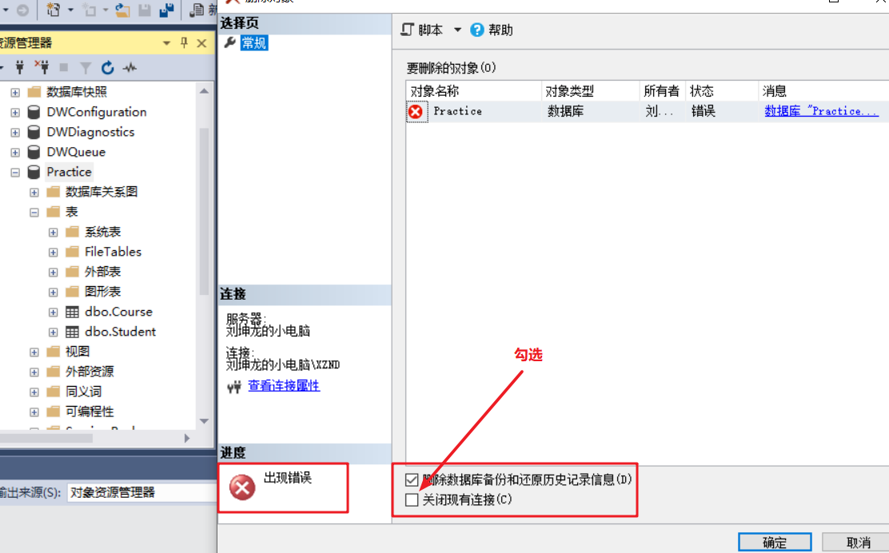

原来方框区域内，都要勾上，否则当前数据库被占用，不能关闭。

## 情况二

**之前表不能插入数据的问题报告**

> **ALTER TABLE 语句与 FOREIGN KEY SAME TABLE 约束"FKCourseCpno__412EB0B6"冲突。该冲突发生于数据库"TestDataBase"，表"dbo.Course", column 'Cno'。**

提示的是先修课Cpno作为外键引用错误，

**不能插入数据的根本问题：**

Course表存在一个字段Cpno，有外键约束，引用于Course表的主键Cno，那么在向Course表插入数据时，字段Cpno必须为Course表中Id已经存在的值，如果向中存放一个Course中没有的值，则会报违反外键约束。但这里的Course表里并没有已经存在的Cpno，所以违法了外键约束，导致不能插入数据，和之前列名的大小写并无实质性的关系

删除Cpno外键约束之后：

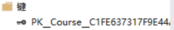

插入就变得顺利了

