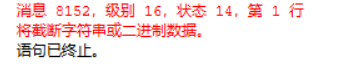
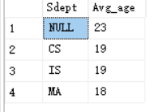
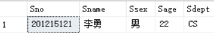
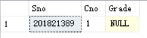
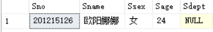

# 插入数据

插入语句insert通常有两种形式，一种是插入一个元组，另一种是插入子查询结果。后者可以一次插入多个元组

## 一、插入元组

1. 将一个新学生元组

（学号：2018213889，姓名：刘坤龙，性别：男，所在系：CS，年龄：20岁）

插入到Student表中

```sql
insert into Student (Sno,Sname,Ssex,Sdept,Sage)
values ('2018213889','刘坤龙','男','CS',20);
```



原因：是插入的数据超过了数据库中字段的长度，这个问题尤其是在插入中文时特别容易出现。

这里是学号的长度超过了，减少一位数字即可

```sql
insert into Student (Sno,Sname,Ssex,Sdept,Sage)
values ('201821388','刘坤龙','男','CS',20);
(1 行受影响)
```

2. 将学生张成名的信息插入到Student表中

```sql
insert into Student 
values ('201821389','张成民','男','IS',19);
```


这里只指定了表名，没有指定属性名。这表示新元组要在表的所有属性列上都指定值，属性列的次序与create table中的次序要相同，values字句对新元组的各属性赋值，一定要注意与属性列要一一对应。否则就出现了上面数据类型不匹配的错误

```sql
insert into Student 
values ('201821389','张成民','男',19,'IS');
(1 行受影响)
```

3. 插入一条选课记录（‘201821387‘，’1‘）

```sql
insert into SC(Sno,Cno)
values ('201821387',1)
```

报错

```sql
消息 547，级别 16，状态 0，第 1 行
INSERT 语句与 FOREIGN KEY 约束"FK__SC__Sno__3D5E1FD2"冲突。该冲突发生于数据库"TestDataBase"，表"dbo.Student", column 'Sno'。
语句已终止。
```

有外键约束，你必须插入在Student学生表中已经有了的学生学号和课程，'201821387'这个学号在Student表中没有，所以报错

```sql
insert into SC(Sno,Cno)
values ('201821388',1)
(1 行受影响)
```

关系数据库将在Grade列上自动地赋空值

```sql
insert into SC
values ('201821389',1,null)
```

因为没有指出SC属性名，所以在Grade列上要明确的给出空值

## 二、插入子查询结果

字查询不仅可以嵌套在select语句中用以构造父查询的条件，也可以嵌套在insert语句中用以生成要插入的批量数据

1. 对每一个系，求学生的平均年龄，并把结果存入数据库

①新建一个表，其中一列存放系名，另一列存放相应的学生年龄

```sql
create table Dept_age(Sdept char(15) ,Avg_age smallint)
```

②然后对Student表中按系分组求平均年龄，再把系名和平均年龄存入新表中

```sql
insert into Dept_age (Sdept ,Avg_age) 
select Sdept,AVG(Sage) from Student
group by Sdept
```



确实数据被插入


# 修改数据

修改操作又称为更新操作

## 一、修改某一个元组的值

1. 将学生201215121的年龄改为22岁

```sql
update Student 
set Sage=22
where Sno='201215121'
```



## 二、修改多个元组的值

1. 将所有学生年龄增加1岁

```
update Student 
set Sage=Sage+1
(7 行受影响)
```

## 三、带子查询的修改语句

1. 将计算机科学系全体学生的成绩置零

```sql
update SC set Grade=0 where Sno in
(select Sno from Student where Sdept='CS')
```


# 删除数据

## 删除某一个元组的数据

1. 删除学号为201215128的学生记录

```sql
delete from Student where Sno='201821389'
```

提示错误

```sql
消息 547，级别 16，状态 0，第 1 行
DELETE 语句与 REFERENCE 约束"FK__SC__Sno__3D5E1FD2"冲突。该冲突发生于数据库"TestDataBase"，表"dbo.SC", column 'Sno'。
语句已终止。
```

## 二、删除多个元组的值

2. 删除所以学生的平均成绩记录

```sql
delete from Dept_age
```

## 三、带子查询的删除语句

子查询同样可以嵌套在delete语句中，用以构造执行删除操作的条件

1. 删除计算机科学系所以学生的选课记录

```sql
delete from SC 
where Sno in(select Sno from Student where Sdept='CS')
(6 行受影响)
```

SC表只剩下一条记录



# 空值的处理

1. 应该有值，目前不知道
2. 不应该有值
3. 不便于填写

空值和0不同，具有不缺定性


1. 查找年龄或者系别遗漏的信息的记录

```sql
select *
from Student
where Sage is  null or Sdept is  null
```



有NOT NULL约束条件的不能取空值

加了UNIQUE限制的属性不能取空值

码属性不能取空值

