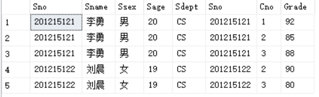

>**若一个查询同时涉及两个表及以上的表，则称之为连接查询。**
>
>**连接查询是关系数据库中最主要的查询，包括等值连接查询、自然连接查询、非等值连接查询、自身连接查询、外连接查询和复合条件查询等**

# 等值于非等值连接查询

连接查询的where子句中用来连接两个表的条件成为连接条件或连接谓词，一般格式为

**表名1.列名1 {比较运算符} 表名2.列名2**

当连接运算符为“=”时，称之为等值连接。使用其他运算符称之为非等值连接。

连接谓词中的列名称为连接字段。连接条件中的各连接字段类型必须是可比的，但是名字不必相同

1. 查询每个学生及其选修课情况

```sql
select Student.*,SC.* from Student,SC 
where Student.Sno=SC.Sno;
```



学生情况放在Student表中，学生选课情况放在SC表中，所以本查询涉及两个表，这两个表之间的联系通过公共属性Sno实现

2. 对例1用自然连接完成


