>**若一个查询同时涉及两个表及以上的表，则称之为连接查询。**
>
>**连接查询是关系数据库中最主要的查询，包括等值连接查询、自然连接查询、非等值连接查询、自身连接查询、外连接查询和复合条件查询等**

# 等值于非等值连接查询

连接查询的where子句中用来连接两个表的条件成为连接条件或连接谓词，一般格式为

**表名1.列名1 {比较运算符} 表名2.列名2**

当连接运算符为“=”时，称之为等值连接。使用其他运算符称之为非等值连接。

连接谓词中的列名称为连接字段。连接条件中的各连接字段类型必须是可比的，但是名字不必相同

1. 查询每个学生及其选修课情况

```sql
select Student.*,SC.* from Student,SC 
where Student.Sno=SC.Sno;
```


学生情况放在Student表中，学生选课情况放在SC表中，所以本查询涉及两个表，这两个表之间的联系通过公共属性Sno实现

2. 对例1用自然连接完成

```sql
select student.Sno, Sname,Ssex, Sage,Sdept,Cno,Grade
from student,sc
where student.sno = sc.sno;
```


去掉Student表和SC表共同的属性列Sno，其中一个，等值连接就变成了自然连接，上述SQL保留了student的Sno

# 自身连接

连接操作不仅可以在两个表之间进行，也可以是一个表与自己进行连接，称为表的自身连接。

```sql
select c.Cno 课程号,c.Cname 课程名, c.Cpno 先行课程号 , s.Cname 先行课程名, s.Cpno 间接先行课程号
from Course c,course s 
where c.Cpno = s.Cno;
```


原来给列名起别名的时候对于字符串不用加引号都可以通过编译！

# 多表连接

```sql
select Student.Sno,Sname,Cname,Grade 
from Student,SC,Course
where Student.Sno=SC.Sno and SC.Cno=Course.Cno;
```


通常是先进行两个表的连接，再将其连接结果与第三个表进行连接

# 嵌套查询

1. 查找课程号为2的学生姓名

```sql
select Sname  /*外层查询或父查询*/
from Student
where Sno in
    (select Sno  /*内层查询或子查询*/
     from SC
     where Cno='2');  
```


首先在SC表里找到了课程号为2的学生学号，这些学号形成了一个集合

再用Student表里的学生学号判断是否和集合里的学号有相同的，如果有，则输出学生姓名

- 带有in谓词的子查询

在嵌套查询中，子查询的结果往往是一个集合，所以谓词in是嵌套查询中最经常使用的谓词

- 子查询中的select语句不能用order by子句，order by子句只能对最终查询结果排序


2. 查询与刘晨在同一个系学习的学生

思路：最终目的：找到这个学生，也就是说得到这个学生的姓名，知道他是谁

约束条件：要在同一个系

那么就先查出刘晨所在的系，再根据这个系查找其他学生的信息

```sql
select * from Student 
where Sdept in(select Sdept from Student where Sname='刘晨')
```


本例中，子查询的查询条件不依赖父查询，称为不相关子查询


3. 查询选修课程名为“信息系统”的学生学号和姓名

思路：最终目的：得到学生学号和姓名

约束条件：得是信息系统的学生

选修课程名在Course表，学生信息在Student表，两个表完全没关系，所以得依靠SC表建立关系，把SC表和Course表先连接找到信息系统的课程号，在SC表里找到课程号对应的学号，再把学号和Student表连接，输出学生信息

```sql
select  * from Student 
where Sno in(select Sno from SC 
where Cno in(select Cno from Course where Cname='信息系统')
)
```


①首先在Course关系中找出“信息系统”的课程号，结果为3号

②然后在SC关系中找出选修了3号课程的学生学号

③最后在Student关系中取出学生信息


4. 例3也可以用连接查询实现

```sql
select Student.Sno,Sname 
from Student,SC,Course
where Student.Sno=SC.Sno and
Course.Cname='信息系统'
```


**会有重复值出现，用distinct除去**

```sql
select distinct Student.Sno,Sname 
from Student,SC,Course
where Student.Sno=SC.Sno and
Course.Cname='信息系统'
```


有些嵌套查询可以用连接运算代替，有些是不能代替的

# 带有比较运算符的子查询

1. 查找与刘晨在同一个系的学生信息

```sql
select * from Student 
where Sdept in (select Sdept from Student where Sname='刘晨' )
```

由于一个学生只有可能在一个系学习，也就是说内查询的结果是一个值，因此可以用=代替in

```sql
select * from Student
where Sdept = (select Sdept from Student where Sname='刘晨' )
```


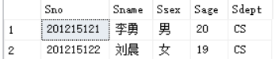

2. 找出每个学生超过他自己选修课程平均成绩的课程号

```sql
select * from SC x 
where Grade>=(select avg(Grade) from SC y where y.Sno=x.Sno )
```

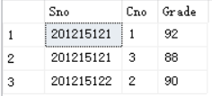

x是SC表的别名，又称为元组变量，可以用来表示SC的一个元组。内层查询是求一个学生所有选修课的平均成绩至于是哪一个学生的平均成绩要看参数x.Sno的值，值是与父查询相关的，因此这类查询称为相关子查询


**整个SC表**

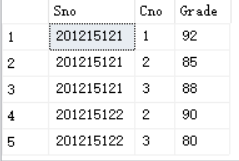

①先从外层查询取出SC的一个元组x，将元组x的Sno值（2012215121)传递给内层查询 

```sql
select avg(Grade) from SC y
where y.Sno="2012215121"
```

②执行内层查询，(92+88+85)/3得到88的近似值，用该值代替内层查询，得到外层查询

```sql
select Sno,Cno from SC x
where Grade >=88
```

③执行这个查询，得到

```sql
(201215121,1)
(201215121,3)
```

然后外层查询取下一个元素重复②③步骤

# 带有any(some)或者all谓词的子查询

1. 查询非计算机科学系中比计算机科学系任意一个学生年龄小的学生姓名和年龄和系名

```sql
select Sname,Sage,Sdept from Student 
where Sage < any(select Sage from Student where Sdept ='CS')
and Sdept!='CS'
```

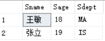

2. 例1的意思就是查找非计算机科学系中比计算机科学系年龄最大的同学的年龄下的学生

```sql
select * from Student 
where Sage<(select max(Sage) from Student where Sdept='CS') 
and Sdept!='CS'
```

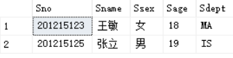

还是一样的结果

3. 查询非计算机科学系中比计算机科学系所有学生年龄都小的学生姓名和年龄

```sql
select Sname,Sage from Student 
where Sage <all(select Sage from Student where Sdept='CS')
and Sdept != 'CS'
```

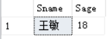

4. 例3的另一种说法就是查找计算机科学系年龄最小的学生都要比非计算机科学系的学生年龄大

```sql
select Sname,Sage from Student 
where Sage <(select min(Sage) from Student where Sdept='CS')
and Sdept != 'CS'
```


一样的结果

# 带有exists谓词的子查询

- exists代表存在量词，带有exists谓词的子查询不返回任何数据，只产生逻辑真值true或逻辑假词false

1. 查询所以选修了1号课程的学生姓名

课程号在SC表查，名字在Student表查

①用连接查询

```sql
select Sname from Student
where Sname in (select Sname from SC,Student where SC.Sno=Student.Sno and Cno=1)
```

②带exists的谓词查询

```sql
select Sname from Student where exists 
(select * from SC where Sno=Student.Sno and Cno=1)
```

先是把SC表和Student表连接起来，再查找Cno=1的那列元组，结果不为空，返回true，再取出这个元组里的名字

2. 查询没有选修1号课程的学生姓名

```sql
select Sname from Student where not exists 
(select * from SC where Sno=Student.Sno and Cno=1)
```

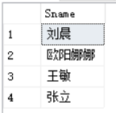

先是把SC表和Student表连接起来，再查找Cno=1的那列元组，结果为空，返回false，再取出这个元组里的名字

3. 查询与刘晨在同一个系学习的学生

```sql
select * from Student s1
where exists (select * from Student s2  
where s2.Sdept=s1.Sdept and s2.Sname='刘晨' )
```

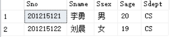

4. 查询选修了全部课程的学生姓名

含义：没有一门课是他没有选的

```sql
select Sname
from Student
where not exists
(select  * from Course where not exists 
(select * from SC where Sno=Student.Sno and Cno=Course.Cno))
```

查询结果为空

# 集合查询

1. 查询计算机科学系的学生及年龄不大于19岁的学生

```sql
select * from Student 
where Sdept='CS'
union select * from Student where Sage<=19
```

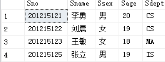

本查询实际上是求计算机科学系的学生与年龄不大于19岁的学生的并集，union将多个查询结果合并起来时会将重复的元组去掉

2. 查询选修了课程1或者选修了课程2的学生

```sql
select Sno from SC 
where Cno=1
union select Sno from SC where Cno=2
```

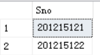

若想查出姓名

```sql
select * from Student where Sno in 
(select Sno from SC 
where Cno=1
union select Sno from SC where Cno=2)
```

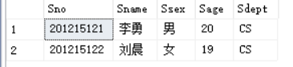

3. 查询计算机科学系的学生与年龄不大于19岁的学生的交集

```sql
select * from Student
where Sdept='CS'
intersect select * from Student 
where Sage<=19
```

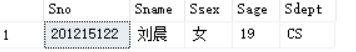

这实际上就是查询计算机科学系年龄不大于19岁的学生

4. 查询既选修了课程1又选修了课程2的学生，就是查询选修课程1的学生集合与选修课程2的学生集合的交集

```sql
select Sno from SC where Cno=1
intersect 
select Sno from SC where Cno=2
```

不能用select * ，因为是求交集嘛，一定是具体属性的交集

5. 查询计算机科学系的学生与年龄不大于19岁的学生的差集

```
select * from Student where Sdept='CS'
except
select * from Student
where Sage<=19
```

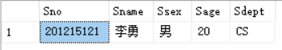

也就是查询计算机科学系中年龄大于19岁的学生

```sql
select * from Student where Sdept='CS' and Sage>19
```

