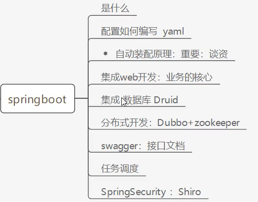

# SpringBoot

- 基础是为了以后看源码更方便
- 框架是为了项目整合更简单

## 学习模块预览



## SpringBoot是什么

- Spring是如何简化Java开发的？

>1. 基于POJO的轻量级和最小侵入性编程，所有东西都是bean；
>2. 通过IOC，依赖注入（DI）和面向接口实现松耦合；
>3. 基于切面（AOP）和惯例进行声明式编程；
>4. 通过切面和模版减少样式代码，RedisTemplate，xxxTemplate；

- 什么是SpringBoot？

>- 就是一个javaweb的开发框架，和SpringMVC类似，对比其他javaweb框架的好处，官方说是简化开发，**约定大于配置**，  you can "just run"，能迅速的开发web应用，几行代码开发一个http接口
>- Spring Boot 基于 Spring 开发，Spirng Boot 本身并不提供 Spring 框架的核心特性以及扩展功能，只是用于快速、敏捷地开发新一代基于 Spring 框架的应用程序。也就是说，它并不是用来替代 Spring 的解决方案，而是和 Spring 框架紧密结合用于提升 Spring 开发者体验的工具。Spring Boot 以**约定大于配置的核心思想**，默认帮我们进行了很多设置，多数 Spring Boot 应用只需要很少的 Spring 配置。同时它集成了大量常用的第三方库配置（例如 Redis、MongoDB、Jpa、RabbitMQ、Quartz 等等），Spring Boot 应用中这些第三方库几乎可以零配置的开箱即用
>- 简单来说就是SpringBoot其实不是什么新的框架，它默认配置了很多框架的使用方式，就像maven整合了所有的jar包，spring boot整合了所有的框架 。Spring Boot 出生名门，从一开始就站在一个比较高的起点，又经过这几年的发展，生态足够完善，Spring Boot 已经当之无愧成为 Java 领域最热门的技术

- 优点

>- 为所有Spring开发者更快的入门
>- **开箱即用**，提供各种默认配置来简化项目配置
>- 内嵌式容器简化Web项目
>- 没有冗余代码生成和XML配置的要求

- 小插曲
  - 程序 = 数据结构 + 算法 ------ 程序员 ---》创造性的生物
  - 程序 = 面向对象 + 框架 ------ 码农     ---》 搬砖

## 微服务是什么

- 微服务是一种架构风格，它要求我们在开发一个应用的时候，这个应用必须构建成一系列小服务的组合；可以通过http的方式进行互通。要说微服务架构，先得说说过去我们的单体应用架构


### 单体应用架构

- 所谓单体应用架构（all in one）是指，我们将一个应用的中的所有应用服务都封装在一个应用中，无论是ERP，CRM或是其他什么系统，你都把数据库访问，web访问，等等各个功能放到一个war包内
- 这样做的好处是，易于开发和测试；也十分方便部署；当需要扩展时，只需要将war复制多份，然后放到多个服务器上，再做个负载均衡就可以
- 单体应用架构的缺点是，哪怕我要修改一个非常小的地方，我都需要停掉整个服务，重新打包、部署这个应用war包。特别是对于一个大型应用，我们不可能吧所有内容都放在一个应用里面，我们如何维护、如何分工合作都是问题

### 微服务架构

- all in one的架构方式，我们把所有的功能单元放在一个应用里面。然后我们把整个应用部署到服务器上。如果负载能力不行，我们将整个应用进行水平复制，进行扩展，然后在负载均衡
- 所谓微服务架构，就是打破之前all in one的架构方式，把每个功能元素独立出来。把独立出来的功能元素的动态组合，需要的功能元素才去拿来组合，需要多一些时可以整合多个功能元素。所以微服务架构是对功能元素进行复制，而没有对整个应用进行复制
- 这样做的好处是：
  1. 节省了调用资源
  2. 每个功能元素的服务都是一个可替换的、可独立升级的软件代码

---

- 构建一个个功能独立的微服务应用单元，可以使用springboot，可以帮我们快速构建一个应用
- 大型分布式网络服务的调用，这部分由spring cloud来完成，实现分布式
- 在分布式中间，进行流式数据计算、批处理，我们有spring cloud data flow
- spring为我们想清楚了整个从开始构建应用到大型分布式应用全流程方案

## 第一个SpringBoot程序

```java
package com.kl;

import org.springframework.boot.SpringApplication;
import org.springframework.boot.autoconfigure.SpringBootApplication;

//springboot的程序入口
//本身就是一个spring的组件
@SpringBootApplication
public class SpringbootStartApplication {

    public static void main(String[] args) {
        SpringApplication.run(SpringbootStartApplication.class, args);
    }

}
```

- 约定大于配置，我们只有在SpringbootStartApplication同级目录下创建包和类才会被springboot扫描到


- 控制器接口

```java
package com.kl.controller;

import org.springframework.web.bind.annotation.RequestMapping;
import org.springframework.web.bind.annotation.RestController;

@RestController //向浏览器返回字符串
public class HelloController {

    //接口：http://localhost:8080/hello
    @RequestMapping(value = "/hello")
    public String sayHello(){
        return "Hello World";
    }
}
```


## pom.xml文件

```xml
<?xml version="1.0" encoding="UTF-8"?>
<project xmlns="http://maven.apache.org/POM/4.0.0" xmlns:xsi="http://www.w3.org/2001/XMLSchema-instance"
         xsi:schemaLocation="http://maven.apache.org/POM/4.0.0 https://maven.apache.org/xsd/maven-4.0.0.xsd">
    <modelVersion>4.0.0</modelVersion>
    <!--父项目-->
    <parent>
        <groupId>org.springframework.boot</groupId>
        <artifactId>spring-boot-starter-parent</artifactId>
        <version>2.3.3.RELEASE</version>
        <relativePath/> <!-- lookup parent from repository -->
    </parent>
    <groupId>com.kl</groupId>
    <artifactId>springboot-start</artifactId>
    <version>0.0.1-SNAPSHOT</version>
    <name>springboot-start</name>
    <description>Demo project for Spring Boot</description>

    <properties>
        <java.version>11</java.version>
    </properties>

    <dependencies>
        <!--web依赖：集成了tomcat,dispatchers,xml-->
        <dependency>
            <groupId>org.springframework.boot</groupId>
            <artifactId>spring-boot-starter-web</artifactId>
        </dependency>

        <!--springboot的单元测试-->
        <dependency>
            <groupId>org.springframework.boot</groupId>
            <artifactId>spring-boot-starter-test</artifactId>
            <scope>test</scope>
            <exclusions>
                <exclusion>
                    <groupId>org.junit.vintage</groupId>
                    <artifactId>junit-vintage-engine</artifactId>
                </exclusion>
            </exclusions>
        </dependency>
    </dependencies>

    <build>
        <!--打jar包的插件-->
        <plugins>
            <plugin>
                <groupId>org.springframework.boot</groupId>
                <artifactId>spring-boot-maven-plugin</artifactId>
            </plugin>
        </plugins>
    </build>

</project>
```

- 点击package后就会在target目录下生产一个可执行的jar包


- 打开该jar包所在的位置，使用java -jar .\jar包名 可执行编译


## application.properties

- application.properties是springboot的配置文件

```properties
# 修改tomcat启动的端口号
server.port=8081
```

- 可以在resource创建一个banner.txt来自定义banner
- 注意看bannrer.txt左下角有一个图标，这是被springboot识别成功的标志

```txt
`--------------------------`()'--------------------------'
                            ||
                         __ ||                                        __
                         ] """"---...._                             .' /
                   _,-"""==============`--.                       .'/)/
                 ,' ) ,--. .-----.         `.___________________.' ///_
               .'  / /___| |_____|  e c      G-DMG       _______  ()  _>
              /   / /____| |__|__|             ,----"""""       `//  \
            .<`=='===========================.'                 (/`.  \
           (  `.----------------------------/                       `._\
            `-._\_                ____...--'
                  """--ii--'"""77"
        lkl      .____//______//___,
                 `-----------------'
```

- 当我们再次启动服务器就会将原本的spring改变成为我们自己设置的banner


## SpringBoot自动装配原理

### 原理初探

- 我们使用springboot时不需要导入我们需要的版本，因为在父依赖中都为我们做了统一的依赖管理

```xml
<name>spring-boot-dependencies</name>
```

- 启动器：就是springboot的启动场景

```xml
<name>springboot-start</name>
```

- 如`<artifactId>spring-boot-starter-web</artifactId>`，启动器会为我们导入web项目所需要的全部依赖
- springboot将所有的功能场景都变成了一个个的启动器，我们要使用什么功能就找到对应的启动器即可

### 主程序

```java
//标注这是一个springboot的应用
@SpringBootApplication
public class SpringbootStartApplication {

    //将springboot应用启动
    public static void main(String[] args) {
        SpringApplication.run(SpringbootStartApplication.class, args);
    }

}
```


- AutoConfigurationImportSelector ：自动配置导入选择器，那么它会导入哪些组件的选择器呢？我们点击去这个类看源码

```java
protected AutoConfigurationEntry getAutoConfigurationEntry(AnnotationMetadata annotationMetadata) {
    if (!isEnabled(annotationMetadata)) {
        return EMPTY_ENTRY;
    }
    AnnotationAttributes attributes = getAttributes(annotationMetadata);
    //获得候选的配置
    List<String> configurations = getCandidateConfigurations(annotationMetadata, attributes);
    configurations = removeDuplicates(configurations);
    Set<String> exclusions = getExclusions(annotationMetadata, attributes);
    checkExcludedClasses(configurations, exclusions);
    configurations.removeAll(exclusions);
    configurations = getConfigurationClassFilter().filter(configurations);
    fireAutoConfigurationImportEvents(configurations, exclusions);
    return new AutoConfigurationEntry(configurations, exclusions);
}
```

- 点击getCandidateConfigurations()这个方法

```java
protected List<String> getCandidateConfigurations(AnnotationMetadata metadata, AnnotationAttributes attributes) {
   List<String> configurations = SpringFactoriesLoader.loadFactoryNames(getSpringFactoriesLoaderFactoryClass(),
         getBeanClassLoader());
   Assert.notEmpty(configurations, "No auto configuration classes found in META-INF/spring.factories. If you "
         + "are using a custom packaging, make sure that file is correct.");
   return configurations;
}
```

- 点进loadFactoryNames()方法

```java
public static List<String> loadFactoryNames(Class<?> factoryType, @Nullable ClassLoader classLoader) {
    String factoryTypeName = factoryType.getName();
    return loadSpringFactories(classLoader).getOrDefault(factoryTypeName, Collections.emptyList());
}

private static Map<String, List<String>> loadSpringFactories(@Nullable ClassLoader classLoader) {
    //获得classLoader,我们返回可以看到这里得到的就是EnableAutoConfiguration标注的类本身
    MultiValueMap<String, String> result = cache.get(classLoader);
    if (result != null) {
        return result;
    }

    try {
        //getResources:获取项目资源 "META-INF/spring.factories"
        Enumeration<URL> urls = (classLoader != null ?
                                 classLoader.getResources(FACTORIES_RESOURCE_LOCATION) :
                                 ClassLoader.getSystemResources(FACTORIES_RESOURCE_LOCATION));
        result = new LinkedMultiValueMap<>();
        //将读取到的资源遍历，封装成为一个Properties
        while (urls.hasMoreElements()) {
            URL url = urls.nextElement();
            UrlResource resource = new UrlResource(url);
            Properties properties = PropertiesLoaderUtils.loadProperties(resource);
            for (Map.Entry<?, ?> entry : properties.entrySet()) {
                String factoryTypeName = ((String) entry.getKey()).trim();
                for (String factoryImplementationName : StringUtils.commaDelimitedListToStringArray((String) entry.getValue())) {
                    result.add(factoryTypeName, factoryImplementationName.trim());
                }
            }
        }
        cache.put(classLoader, result);
        return result;
    }
    catch (IOException ex) {
        throw new IllegalArgumentException("Unable to load factories from location [" +
                                           FACTORIES_RESOURCE_LOCATION + "]", ex);
    }
}
```

```java
public final class SpringFactoriesLoader {

	/**
	 * The location to look for factories.
	 * <p>Can be present in multiple JAR files.
	 */
	public static final String FACTORIES_RESOURCE_LOCATION = "META-INF/spring.factories";
}
```

- 发现一个多次出现的文件：spring.factories，全局搜索它
- 我们根据源头打开spring.factories ， 看到了很多自动配置的文件；这就是自动配置根源所在！


- 我们在上面的自动配置类随便找一个打开看看，比如 ：WebMvcAutoConfiguration


- 可以看到这些一个个的都是JavaConfig配置类，而且都注入了一些Bean

### 自动装配原理总结

- 所以，自动配置真正实现是从classpath中搜寻所有的META-INF/spring.factories配置文件 ，并将其中对应的 org.springframework.boot.autoconfigure. 包下的配置项，通过反射实例化为对应标注了 @Configuration的JavaConfig形式的IOC容器配置类 ， 然后将这些都汇总成为一个实例并加载到IOC容器中

- **结论：**

1. SpringBoot在启动的时候从类路径下的META-INF/spring.factories中获取EnableAutoConfiguration指定的值
2. 将这些值作为自动配置类导入容器 ， 自动配置类就生效 ， 帮我们进行自动配置工作
3. 整个J2EE的整体解决方案和自动配置都在springboot-autoconfigure的jar包中
4. 它会给容器中导入非常多的自动配置类 （xxxAutoConfiguration）, 就是给容器中导入这个场景需要的所有组件 ， 并配置好这些组件 
5. 有了自动配置类 ， 免去了我们手动编写配置注入功能组件等的工作

### 主启动类

```java
@SpringBootApplication
public class SpringbootStartApplication {

    //将springboot应用启动
    public static void main(String[] args) {
        SpringApplication.run(SpringbootStartApplication.class, args);
    }

}
```

- SpringApplication这个类主要做了以下四个事情
  1. 推断应用的类型是普通的项目还是Web项目
  2. 查找并加载所有可用初始化器 ， 设置到initializers属性中
  3. 找出所有的应用程序监听器，设置到listeners属性中
  4. 推断并设置main方法的定义类，找到运行的主类

## ymal语法

### 配置文件

- SpringBoot使用一个全局的配置文件 ， 配置文件名称是固定的

>- application.properties
>  - 语法结构 ：key=value
>- application.yml
>  - 语法结构 ：key：空格 value

- **配置文件的作用 ：**修改SpringBoot自动配置的默认值，因为SpringBoot在底层都给我们自动配置好了
- 比如我们可以在配置文件中修改Tomcat 默认启动的端口号

```properties
server.port=8081
```

### yaml概述

- YAML是 "YAML Ain't a Markup Language" （YAML不是一种标记语言）的递归缩写。在开发的这种语言时，YAML 的意思其实是："Yet Another Markup Language"（仍是一种标记语言）
- **这种语言以数据****作为中心，而不是以标记语言为重点！
- 以前的配置文件，大多数都是使用xml来配置；比如一个简单的端口配置，我们来对比下yaml和xml
- 传统xml配置：

```xml
<server>
    <port>8081<port>
</server>
```

- yaml配置：

```yaml
server：
  prot: 8080
```

### yaml语法

- 说明：语法要求严格！
  1. 空格不能省略
  2. 以缩进来控制层级关系，只要是左边对齐的一列数据都是同一个层级的
  3. 属性和值的大小写都是十分敏感的

- **字面量：普通的值  [ 数字，布尔值，字符串  ]**

```yaml
# 字面量直接写在后面就可以,字符串默认不用加上双引号或者单引号
k: v
```

- 注意：
  - “ ” 双引号，不会转义字符串里面的特殊字符 ， 特殊字符会作为本身想表示的意思；
    - 比如 ：name: "super \n man"  输出 ：super 换行  man
  - '' 单引号，会转义特殊字符 ， 特殊字符最终会变成和普通字符一样输出
    - 比如 ：name: "super \n man"  输出 ：super /n man
- **对象、Map（键值对）**

```yaml
#对象、Map格式
k: 
    v1:
    v2:
```

- 在下一行来写对象的属性和值得关系，注意缩进；比如：

```yaml
student:
    name: batman
    age: 3
```

- 行内写法

```yaml
student: {name: batman,age: 3}
```

- **数组（ List、set ）**

```yaml
# 用 - 值表示数组中的一个元素
pets:
 - cat
 - dog
 - pig
```

- 行内写法

```yaml
pets: [cat,dog,pig]
```

- **修改SpringBoot的默认端口号**

```yaml
# 配置文件中添加，端口号的参数，就可以切换端口
server:
  port: 8082
```

### 注入配置文件

- 有一个Dog实体

```java
@Component //注册bean到容器中
public class Dog {
    private String dogName;
    private Integer  age;
    
    //有参无参构造、get、set方法、toString()方法  
}
```

- 还有一个Master实体

```java
@Component
/**
 * @ConfigurationProperties作用：
 * 将配置文件中配置的每一个属性的值，映射到这个组件中；
 * 告诉SpringBoot将本类中的所有属性和配置文件中相关的配置进行绑定
 * 参数 prefix = “master” : 将配置文件中的master下面的所有属性一一对应
 * 注意：prefix命名问题，全部需要小写
 */
@ConfigurationProperties(prefix = "master")
public class Master {
    private String name;
    private Integer age;
    private Date birth;
    private Dog dog;
    private Map<String,Object> map;
    private List<String> list;

    //有参无参构造、get、set方法、toString()方法  
}
```

- application.yaml

```yaml
master:
  name: 二郎神
  age: 100
  birth: 2000/1/1
  dog:
    dogName: 哮天犬
    age: 99
  map: {kl: 主人,k2: 宠物}
  list:
    - 巡逻
    - 睡觉
    - 打游戏
```

- 使用@ConfigurationProperties注解上类上方会报异常，但是不会影响程序运行，加上这段坐标可消除异常警告

```xml
<!-- 导入配置文件处理器，配置文件进行绑定就会有提示，需要重启 -->
<dependency>
    <groupId>org.springframework.boot</groupId>
    <artifactId>spring-boot-configuration-processor</artifactId>
    <optional>true</optional>
</dependency>
```

- 使用springboot的测试类进行测试

```java
@SpringBootTest
class SpringbootStartApplicationTests {

    @Autowired //会自动注入
    private Master master;

    @Test
    void contextLoads() {
        System.out.println(master);
    }

}
```

- pojo包创建在和SpringbootStartApplication的同级目录下，springboot在启动时会自动将该同级包下的所有组件扫描到容器中，我们在使用时只需要自动注入即可

## JSR303校验

- 需要导入validation启动器

```xml
<!-- https://mvnrepository.com/artifact/org.springframework.boot/spring-boot-starter-validation -->
<dependency>
    <groupId>org.springframework.boot</groupId>
    <artifactId>spring-boot-starter-validation</artifactId>
</dependency>
```

- 使用数据校验，可以保证数据的准确性
- 常见参数

```java
@NotNull(message="名字不能为空")
private String userName;
@Max(value=120,message="年龄最大不能查过120")
private int age;
@Email(message="邮箱格式错误")
private String email;

空检查
@Null       验证对象是否为null
@NotNull    验证对象是否不为null, 无法查检长度为0的字符串
@NotBlank   检查约束字符串是不是Null还有被Trim的长度是否大于0,只对字符串,且会去掉前后空格.
@NotEmpty   检查约束元素是否为NULL或者是EMPTY.
    
Booelan检查
@AssertTrue     验证 Boolean 对象是否为 true  
@AssertFalse    验证 Boolean 对象是否为 false  
    
长度检查
@Size(min=, max=) 验证对象（Array,Collection,Map,String）长度是否在给定的范围之内  
@Length(min=, max=) string is between min and max included.

日期检查
@Past       验证 Date 和 Calendar 对象是否在当前时间之前  
@Future     验证 Date 和 Calendar 对象是否在当前时间之后  
@Pattern    验证 String 对象是否符合正则表达式的规则

.......等等
除此以外，我们还可以自定义一些数据校验规则
```

## 多环境切换

### 配置文件

- profile是Spring对不同环境提供不同配置功能的支持，可以通过激活不同的环境版本，实现快速切换环境
- 我们在主配置文件编写的时候，文件名可以是 application-{profile}.properties/yml , 用来指定多个环境版本
- **例如：**

>- application-test.properties 代表测试环境配置
>- application-dev.properties 代表开发环境配置
>- 但是Springboot并不会直接启动这些配置文件，它**默认使用application.properties主配置文件**；
>- 我们需要通过一个配置来选择需要激活的环境：

```properties
#比如在配置文件中指定使用dev环境，我们可以通过设置不同的端口号进行测试；
#我们启动SpringBoot，就可以看到已经切换到dev下的配置了；
spring.profiles.active=dev
```

---

### yaml的多文档块

```yaml
# 和properties配置文件中一样，但是使用yml去实现不需要创建多个配置文件，更加方便了!
server:
  port: 8081
#选择要激活那个环境块
spring:
  profiles:
    active: prod

---
server:
  port: 8083
spring:
  profiles: dev #配置环境的名称


---

server:
  port: 8084
spring:
  profiles: prod  #配置环境的名称
```

- **注意：如果yml和properties同时都配置了端口，并且没有激活其他环境 ， 默认会使用properties配置文件的！**

### 配置文件的加载位置

- springboot 启动会扫描以下位置的application.properties或者application.yml文件作为Spring boot的默认配置文件

```tex
优先级1：项目路径下的config文件夹配置文件
优先级2：项目路径下配置文件
优先级3：资源路径下的config文件夹配置文件
优先级4：资源路径下配置文件
```

- 优先级由高到底，高优先级的配置会覆盖低优先级的配置
- **SpringBoot会从这四个位置全部加载主配置文件；互补配置**


## 配置文件的自动配置原理

### 分析

- 配置文件到底能写什么？怎么写？SpringBoot官方文档中有大量的配置，我们无法全部记住
- 我们以**HttpEncodingAutoConfiguration（Http编码自动配置）**为例解释自动配置原理

```java
//表示这是一个配置类，和以前编写的配置文件一样，也可以给容器中添加组件；
@Configuration 

//启动指定类的ConfigurationProperties功能；
//进入这个HttpProperties查看，将配置文件中对应的值和HttpProperties绑定起来；
//并把HttpProperties加入到ioc容器中
@EnableConfigurationProperties({HttpProperties.class}) 

//Spring底层@Conditional注解
//根据不同的条件判断，如果满足指定的条件，整个配置类里面的配置就会生效；
//这里的意思就是判断当前应用是否是web应用，如果是，当前配置类生效
@ConditionalOnWebApplication(
    type = Type.SERVLET
)

//判断当前项目有没有这个类CharacterEncodingFilter；SpringMVC中进行乱码解决的过滤器；
@ConditionalOnClass({CharacterEncodingFilter.class})

//判断配置文件中是否存在某个配置：spring.http.encoding.enabled；
//如果不存在，判断也是成立的
//即使我们配置文件中不配置pring.http.encoding.enabled=true，也是默认生效的；
@ConditionalOnProperty(
    prefix = "spring.http.encoding",
    value = {"enabled"},
    matchIfMissing = true
)

public class HttpEncodingAutoConfiguration {
    //他已经和SpringBoot的配置文件映射了
    private final Encoding properties;
    //只有一个有参构造器的情况下，参数的值就会从容器中拿
    public HttpEncodingAutoConfiguration(HttpProperties properties) {
        this.properties = properties.getEncoding();
    }

    //给容器中添加一个组件，这个组件的某些值需要从properties中获取
    @Bean
    @ConditionalOnMissingBean //判断容器没有这个组件？
    public CharacterEncodingFilter characterEncodingFilter() {
        CharacterEncodingFilter filter = new OrderedCharacterEncodingFilter();
        filter.setEncoding(this.properties.getCharset().name());
        filter.setForceRequestEncoding(this.properties.shouldForce(org.springframework.boot.autoconfigure.http.HttpProperties.Encoding.Type.REQUEST));
        filter.setForceResponseEncoding(this.properties.shouldForce(org.springframework.boot.autoconfigure.http.HttpProperties.Encoding.Type.RESPONSE));
        return filter;
    }
    //。。。。。。。
}
```

**一句话总结 ：根据当前不同的条件判断，决定这个配置类是否生效！**

- 一但这个配置类生效；这个配置类就会给容器中添加各种组件；
- 这些组件的属性是从对应的properties类中获取的，这些类里面的每一个属性又是和配置文件绑定的；
- 所有在配置文件中能配置的属性都是在xxxxProperties类中封装着；
- 配置文件能配置什么就可以参照某个功能对应的这个属性类

---

```java
//从配置文件中获取指定的值和bean的属性进行绑定
@ConfigurationProperties(prefix = "server", ignoreUnknownFields = true)
public class ServerProperties {
    //....
}
```

- 我们去配置文件里面试试前缀，看提示！


- 提示出现的在配置类中都能找到对应的属性，**这就是自动装配的原理！**


### 总结

1. SpringBoot启动会加载大量的自动配置类
2. 我们看我们需要的功能有没有在SpringBoot默认写好的自动配置类当中；
3. 我们再来看这个自动配置类中到底配置了哪些组件；（只要我们要用的组件存在在其中，我们就不需要再手动配置了）
4. 给容器中自动配置类添加组件的时候，会从properties类中获取某些属性。我们只需要在配置文件中指定这些属性的值即可；
5. **xxxxAutoConfigurartion：自动配置类；**给容器中添加组件
6. **xxxxProperties:封装配置文件中相关属性；**


