# 一、创建springboot项目

```java
package com.kl.springbootquicktest.controller;

import org.springframework.web.bind.annotation.RequestMapping;
import org.springframework.web.bind.annotation.RestController;

@RestController
public class HelloController {

    @RequestMapping("/hello")
    public String hello(){
        return "Hello,World";
    }
}
```

# 二、springboot配置

## 2.1配置文件

- SpringBoot使用一个全局的配置文件，配置文件名是固定的；
  - application.properties
  - application.yml

- 配置文件的作用：
  - 修改SpringBoot自动配置的默认值
  - SpringBoot在底层都给我们自动配置好

- YAML（YAML Ain't Markup Language）
  - YAML  A Markup Language：是一个标记语言
  - YAML   isn't Markup Language：不是一个标记语言；

- 标记语言：
  - 以前的配置文件；大多都使用的是  **xxxx.xml**文件；
   - YAML：**以数据为中心**，比json、xml等更适合做配置文件；

- YAML：配置例子

```yaml
server:
  port: 8081
```

- XML：

```xml
<server>
	<port>8081</port>
</server>
```

## 2.2YAML语法

### 2.2.1基本语法

- k:(空格)v：表示一对键值对（空格必须有）

- 以**空格**的缩进来控制层级关系；只要是左对齐的一列数据，都是同一个层级的

```yaml
server:
    port: 8081
    path: /hello
```

- **属性和值也是大小写敏感**


### 2.2.2值的写法

#### (1)字面量：普通的值（数字，字符串，布尔）

- k: v：字面直接来写；
- 字符串默认不用加上单引号或者双引号；
  - ""：双引号；不会转义字符串里面的特殊字符；特殊字符会作为本身想表示的意思
    - name:   "zhangsan \n lisi"：输出；zhangsan 换行  lisi
  - ''：单引号；会转义特殊字符，特殊字符最终只是一个普通的字符串数据
    - name:   ‘zhangsan \n lisi’：输出；zhangsan \n  lisi

---


#### (2)对象、Map(属性和值)(键值对)

- k: v：在下一行来写对象的属性和值的关系；注意缩进
- 对象还是k: v的方式

```yaml
friends:
		lastName: zhangsan
		age: 20
```

- 行内写法：

```yaml
friends: {lastName: zhangsan,age: 18}
```

---


#### (3)数组(List、Set)

- 用- 值表示数组中的一个元素

```yaml
pets:
 - cat
 - dog
 - pig
```

- 行内写法

```yaml
pets: [cat,dog,pig]
```


## 2.3配置文件值注入到bean对象

```java
package com.kl.springbootquicktest.bean;
import java.util.Date;
import java.util.List;
import java.util.Map;

public class Person {
    private String name;
    private Integer age;
    private boolean sex;
    private Date birth;
    private Map<String,Object> maps;
    private List<Object> lists;
    private Dog dog;

    public String getName() {
        return name;
    }

    public void setName(String name) {
        this.name = name;
    }

    public Integer getAge() {
        return age;
    }

    public void setAge(Integer age) {
        this.age = age;
    }

    public boolean isSex() {
        return sex;
    }

    public void setSex(boolean sex) {
        this.sex = sex;
    }

    public Date getBirth() {
        return birth;
    }

    public void setBirth(Date birth) {
        this.birth = birth;
    }

    public Map<String, Object> getMaps() {
        return maps;
    }

    public void setMaps(Map<String, Object> maps) {
        this.maps = maps;
    }

    public List<Object> getLists() {
        return lists;
    }

    public void setLists(List<Object> lists) {
        this.lists = lists;
    }

    public Dog getDog() {
        return dog;
    }

    public void setDog(Dog dog) {
        this.dog = dog;
    }

    @Override
    public String toString() {
        return "Person{" +
                "name='" + name + '\'' +
                ", age=" + age +
                ", sex=" + sex +
                ", birth=" + birth +
                ", maps=" + maps +
                ", lists=" + lists +
                ", dog=" + dog +
                '}';
    }
}
```

### 2.3.1使用yaml文件配置

- 配置application.yml文件

```yaml
person:
  name: 猪猪侠
  age: 20
  sex: true
  birth: 1999/09/29
  maps: {k1: v1,k2: v2}
  lists:
    - cat
    - dog
    - pig
  dog:
     name: 小黑
     age: 3
```

- 为了让application.yml生效需要在Person类上加上注解ConfigurationProperties
- ConfigurationProperties出现报错的情况

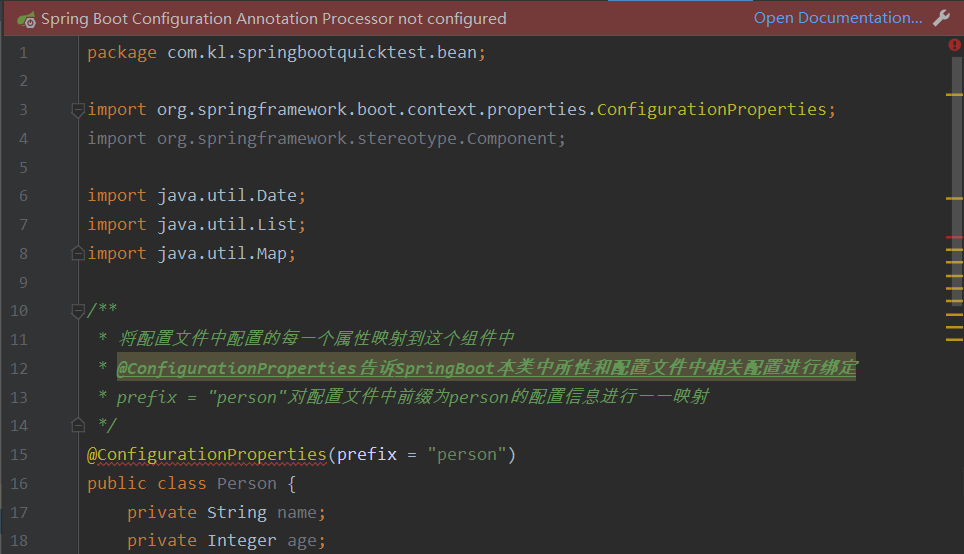

- 在pom.xml中配置文档说明坐标

```xml
<!--导入配置文件处理器,配置文件导入就会有提示-->
<dependency>
    <groupId>org.springframework.boot</groupId>
    <artifactId>spring-boot-configuration-processor</artifactId>
    <optional>true</optional>
</dependency>
```

- 输入一个关键字n就会有提示

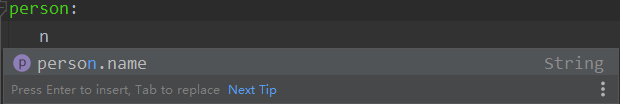

- 还是会报错

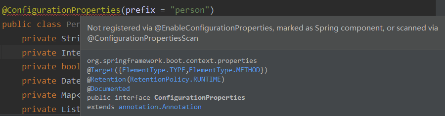

- 回到自定义的bean Person中，添加注解@Component，声明将这个组件添加至容器中，这样才可以被使用？
  - “只有这个组件是容器中的组件，才能使用容器提供的@ConfigurationProperties功能”
  - 配置后确实不再报错了

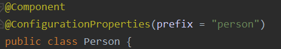

---

- 在springboot测试文件下进行测试

```java
package com.kl.springbootquicktest;

import com.kl.springbootquicktest.bean.Person;
import org.junit.jupiter.api.Test;
import org.springframework.beans.factory.annotation.Autowired;
import org.springframework.boot.test.context.SpringBootTest;

@SpringBootTest
class SpringbootQuickTestApplicationTests {

    @Autowired //自动注入
    Person person;

    @Test
    void contextLoads() {
        System.out.println(person);
    }

}
```

- 注入成功

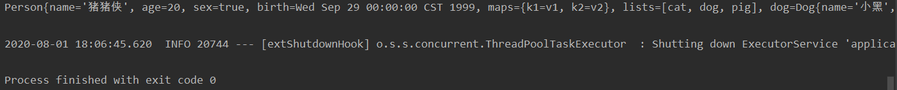

- bean文件总体预览

```java
@Component
@ConfigurationProperties(prefix = "person") //默认从全局配置文件中获取值
public class Person {
    //......
}
```


### 2.3.2使用properties文件配置

```properties
person.name=蝙蝠侠
person.age=100
person.sex=true
person.birth=1000/10/10
person.maps.k1=v1
person.maps.k2=v2
person.lists=cat,dog,pig
person.dog.name=小黑
person.dog.age=3
```

- 将yaml配置的注释掉，其他的文件都不用变
- 再次测试出现中文乱码，这是因为IDEA默认是使用UTF-8进行编码，但是properties默认是GBK编码

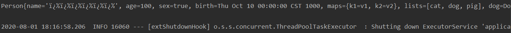

- 在setting搜索file encoding

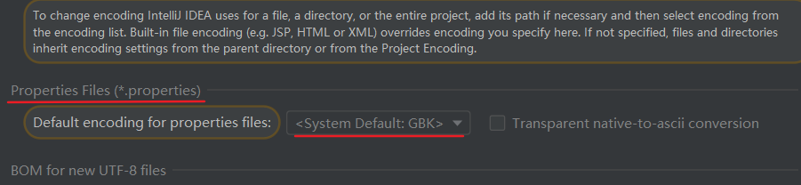

- 修改为UTF-8编码，再次运行可以看到乱码消失

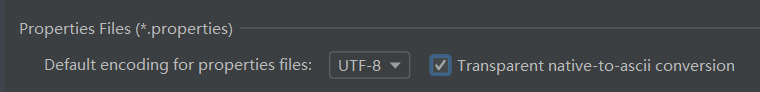


### 2.3.3使用@value注解

```java
@Component //将该bean对象放入spring容器
public class Person {

    @Value("${person.name}")
    private String name;
    @Value("#{11*2}")
    private Integer age;
    @Value("true")
    private boolean sex;
    private Date birth;
    private Map<String,Object> maps;
    private List<Object> lists;
    private Dog dog;
}
```

- 运行测试代码

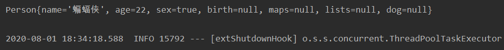


### 2.3.4@Value获取值和@ConfigurationProperties获取值比较

|                      | @ConfigurationProperties | @Value     |
| -------------------- | ------------------------ | ---------- |
| 功能                 | 批量注入配置文件中的属性 | 一个个指定 |
| 松散绑定（松散语法） | 支持                     | 不支持     |
| SpEL                 | 不支持                   | 支持       |
| JSR303数据校验       | 支持                     | 不支持     |
| 复杂类型封装         | 支持                     | 不支持     |

- 配置文件yml还是properties他们都能获取到值；


- 如果说，我们只是在某个业务逻辑中需要获取一下配置文件中的某项值，使用@Value；

```java
@RestController
public class HelloController {

    @Value("${person.name}")
    private String name;

    @RequestMapping("/hello")
    public String hello(){
        return "Hello,"+name;
    }
}
```


- 如果说，我们专门编写了一个javaBean来和配置文件进行映射，我们就直接使用@ConfigurationProperties；


### 2.3.5配置文件注入值数据校验数

- 新版本需要validation启动器在pom.xml 中加入下面的依赖

```xml
<dependency>
    <groupId>org.springframework.boot</groupId>
    <artifactId>spring-boot-starter-validation</artifactId>
</dependency>
```

- 使用

```java
@Component
@ConfigurationProperties(prefix = "person")
@Validated //校验注解
public class Person {
    
    @Email //要求必须是邮件格式
    private String name;
    private Integer age;
    private boolean sex;
    private Date birth;
    private Map<String,Object> maps;
    private List<Object> lists;
    private Dog dog;
    
    //......
}
```

- 配置文件中的name不是邮箱格式，直接运行就报错

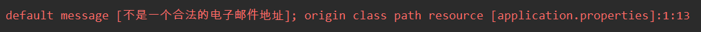

## 2.4@PropertySource&@ImportResource&@Bean

- 问题引入：@ConfigurationProperties(prefix = "person")，默认从全局配置文件中获取值，如果所有的配置文件都放在全局配置中，配置文件就会显得很庞大，这时我们可以将一些跟springboot无关的配置文件抽取出来放到其他配置文件中

```java
@Component
@ConfigurationProperties(prefix = "person") //默认从全局配置文件中获取值
public class Person {
    //......
}
```

- 将application.properties中的配置信息删除，创建person.properties

```properties
person.name=钢铁侠
person.age=100
person.sex=true
person.birth=1000/10/10
person.maps.k1=v1
person.maps.k2=v2
person.lists=cat,dog,pig
person.dog.name=小黑
person.dog.age=3
```

### 2.4.1@PropertySource:加载指定的配置文件

```java
@Component
@PropertySource(value = "classpath:person.properties") //指定类路径下person.properties配置文件的内容
@ConfigurationProperties(prefix = "person")

public class Person {
    
    private String name;
    private Integer age;
    private boolean sex;
    private Date birth;
    private Map<String,Object> maps;
    private List<Object> lists;
    private Dog dog;
    
    //..............
}
```

- 测试运行结果成功

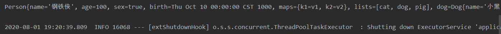


### 2.4.2@ImportResource:导入Spring的配置文件，让配置文件里面的内容生效

- 创建一个HelloService类

```java
package com.kl.springbootquicktest.service;

public class HelloService {
}
```

- 创建spring配置文件bean.xml

```xml
<?xml version="1.0" encoding="UTF-8"?>
<beans xmlns="http://www.springframework.org/schema/beans"
       xmlns:xsi="http://www.w3.org/2001/XMLSchema-instance"
       xsi:schemaLocation="http://www.springframework.org/schema/beans http://www.springframework.org/schema/beans/spring-beans.xsd">

    <bean class="com.kl.springbootquicktest.service.HelloService" id="helloService"/>
</beans>
```

- 测试一

```java
@SpringBootTest
class SpringbootQuickTestApplicationTests {

    @Autowired
    ApplicationContext ioc;

    @Test
    public void testIOC(){
        System.out.println(ioc.containsBean("helloService"));
    }
}
```

- 输出false，说明bean.xml文件没有被加载

---

- 原因

>- Spring Boot里面没有Spring的配置文件，我们自己编写的配置文件，也不能自动识别
>- 想让Spring的配置文件生效，加载进来；@**ImportResource**标注在一个配置类上

- 在启动类上加上注解@ImportResource

```java
@ImportResource(locations = "classpath:bean.xml") //导入Spring的配置文件让其生效
@SpringBootApplication
public class SpringbootQuickTestApplication {

    public static void main(String[] args) {
        SpringApplication.run(SpringbootQuickTestApplication.class, args);
    }
}
```

- 再次测试输出true


### 2.4.3@Bean:eight_pointed_black_star:

- 不建议通过编写Spring的配置文件来给spring容器中添加组件，建议使用全注解的方法
- 删除之前的@ImportResource(locations = "classpath:bean.xml")注解和bean.xml配置文件
- 单独编写一个配置类

```java
package com.kl.springbootquicktest.config;

import com.kl.springbootquicktest.service.HelloService;
import org.springframework.context.annotation.Bean;
import org.springframework.context.annotation.Configuration;

@Configuration //指明当前类是一个配置类,就是来替代之前的Spring配置文件
public class MyAppConfig {

    @Bean //将方法的返回值添加到容器中,容器中这个组件默认的id就是方法名
    public HelloService helloService(){
        return new HelloService();
    }
}
```

- 再次测试

```java
@SpringBootTest
class SpringbootQuickTestApplicationTests {

    @Autowired
    ApplicationContext ioc;

    @Test
    public void testIOC(){
        System.out.println(ioc.containsBean("helloService")); //输出为true
    }
}
```

- 小结

>1. 配置类**@Configuration**------>Spring配置文件
>2. 使用**@Bean**给容器中添加组件

## 2.5配置文件占位符

### 2.5.1随机数

```properties
${random.value}
${random.int}
${random.long}
${random.int(10)}
${random.int[1024,65536]}
```

### 2.5.2占位符获取之前配置的值，如果没有可以是用:指定默认值

```properties
person.name=蝙蝠侠${random.uuid}
person.age=${random.int(10)}
person.sex=true
person.birth=1000/10/10
person.maps.k1=v1
person.maps.k2=v2
person.lists=cat,dog,pig
person.dog.name=${person.hello:dog}_小黑
person.dog.age=3
```

- 如果person.hello的值获取不到就取默认值dog
- 如果不加默认值person.hello的值也获取不到就输出${person.hello}_小黑

## 2.6Profile

- Profile是Spring对不同环境提供不同配置功能的支持，可以通过激活、指定参数等方式快速切换环境

### 2.6.1多profile文件形式：

- 我们在主配置文件编写的时候，文件名可以是**application-{profile}.properties/yml**
- 默认使用application.properties的配置，若不设置则默认端口为8080
- 如果我们要使用其中一个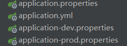
- 如果要使用application-dev.properties配置文件，就需要在approcation.properties配置文件中添加
  - `spring.profiles.active=dev`


### 2.7yml支持多文档块方式

```yaml
server:
  port: 8081
spring:
  profiles:
    active: prod #使用并激活未发布下的端口号
--- # 三根横线可以划分文档块

server:
  port: 8082
spring:
  profiles: prod
---

server:
  port: 8083
spring:
  profiles: dev
```


### 2.8命令行

1. **在IDE中设置**

- `--spring.profiles.active=dev`

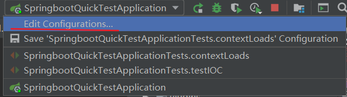

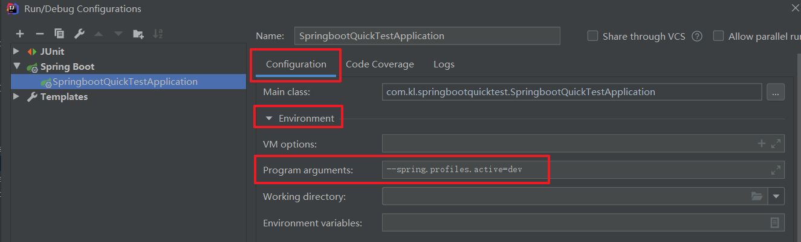

---

2. **通过cmd命令窗口设置**

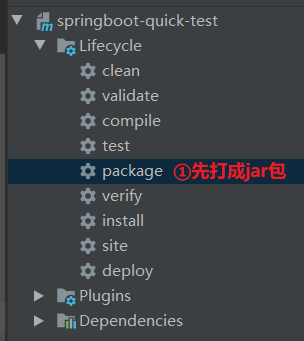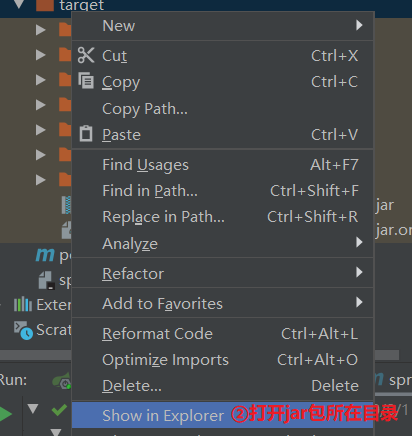

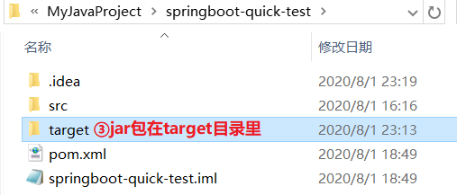

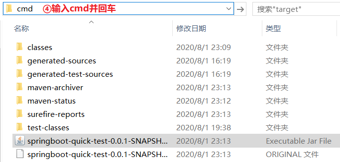

- 输入`java -jar springboot-quick-test-0.0.1-SNAPSHOT.jar --spring.profiles.active=dev`
- dev配置文件中的端口就为8083，设置成功

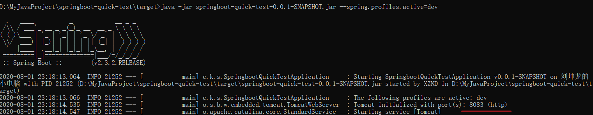

---

3. **虚拟机参数`-Dspring.profiles.active=dev`**

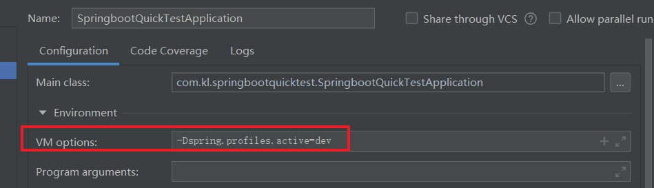

## 2.7配置文件的加载位置

- springboot 启动会扫描以下位置的application.properties或者application.yml文件作为Spring boot的默认配置文件
  - file:./config/
  - file:./
  - classpath:/config/
  - classpath:/
- 优先级由高到底，高优先级的配置会覆盖低优先级的配置
  - 根目录下的config > 根目录 > 类路径下的config > 类路径
- SpringBoot会从这四个位置全部加载主配置文件；**互补配置**

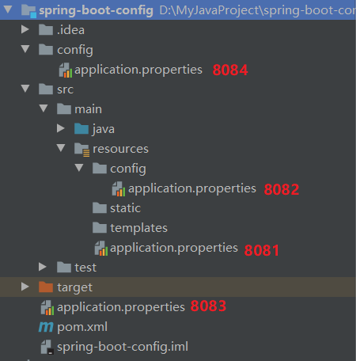

---

- 什么叫互补配置？springboot扫描器会从优先级高的往优先级低的进行扫描，若优先级高的配置文件中没有相应的配置就加载优先级低的文件中的那个配置信息
- 在最低优先级的配置文件中添加

```properties
server.port=8081

# 配置项目的访问路径
server.servlet.context-path=/boot
```

- 创建一个控制器用于测试

```java
package com.kl.demo.controller;

import org.springframework.web.bind.annotation.RequestMapping;
import org.springframework.web.bind.annotation.RestController;

@RestController
public class HelloController {

    @RequestMapping("/hello")
    public String hello(){
        return "hello,world";
    }
}
```

- 这种访问路径变为http://localhost:8084/boot/hello

## 2.8外部配置加载顺序

- SpringBoot也可以从以下位置加载配置； 优先级从高到低；高优先级的配置覆盖低优先级的配置，所有的配置会形成**互补配置**

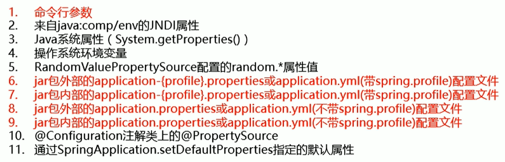

### 2.8.1命令参数

- 先打包项目，打包成功后可以在target目录下看到jar包

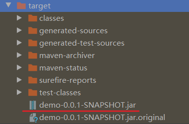

- 注意：打包后的文件只包含src的文化，即只有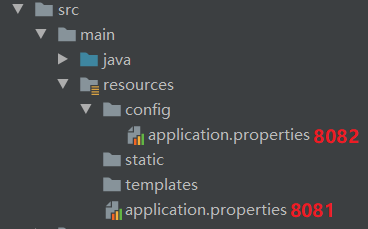两个配置文件有效
- 切换到target目录下`cd target`，命令行启动`java -jar demo-0.0.1-SNAPSHOT.jar`启动，默认访问路径变为http://localhost:8082/boot/hello
- 可以手动修改项目端口号`java -jar demo-0.0.1-SNAPSHOT.jar --server.port=8086`


