# Web开发

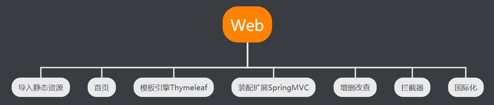

## 静态资源导入

- SpringBoot中，SpringMVC的web配置都在 WebMvcAutoConfiguration 这个配置类里面
- 该类中有一个addResourceHandlers方法用于添加资源处理器

```java
@Configuration(proxyBeanMethods = false)
@ConditionalOnWebApplication(type = Type.SERVLET)
@ConditionalOnClass({ Servlet.class, DispatcherServlet.class, WebMvcConfigurer.class })
@ConditionalOnMissingBean(WebMvcConfigurationSupport.class)
@AutoConfigureOrder(Ordered.HIGHEST_PRECEDENCE + 10)
@AutoConfigureAfter({ DispatcherServletAutoConfiguration.class, TaskExecutionAutoConfiguration.class,
                     ValidationAutoConfiguration.class })
public class WebMvcAutoConfiguration {

    public static final String DEFAULT_PREFIX = "";

    public static final String DEFAULT_SUFFIX = "";

    private static final String[] SERVLET_LOCATIONS = { "/" };

    //......

    //添加资源处理器
    @Override
    public void addResourceHandlers(ResourceHandlerRegistry registry) {
        //如果有用户自定义的映射路径,直接返回方法
        if (!this.resourceProperties.isAddMappings()) {
            logger.debug("Default resource handling disabled");
            return;
        }
        //缓存控制
        Duration cachePeriod = this.resourceProperties.getCache().getPeriod();
        CacheControl cacheControl = this.resourceProperties.getCache().getCachecontrol().toHttpCacheControl();
        //webjars配置:Webjars本质就是以jar包的方式引入我们的静态资源
        //如果用户访问请求是localhost:8080/webjars/**,都会到类路径下的/META-INF/resources/webjars/文件中去找
        if (!registry.hasMappingForPattern("/webjars/**")) {
            customizeResourceHandlerRegistration(registry.addResourceHandler("/webjars/**")
                                                 .addResourceLocations("classpath:/META-INF/resources/webjars/")
                                                 .setCachePeriod(getSeconds(cachePeriod)).setCacheControl(cacheControl));
        }
        //静态资源配置
        //获取所有的静态路径映射
        String staticPathPattern = this.mvcProperties.getStaticPathPattern();
        if (!registry.hasMappingForPattern(staticPathPattern)) {
            //如果用户访问请求是localhost:8080/**,就会到类路径下是 { "META-INF/resources/","resources/", "static/", "public/" } 的文件中去寻找
            customizeResourceHandlerRegistration(registry.addResourceHandler(staticPathPattern)
                                                 .addResourceLocations(getResourceLocations(this.resourceProperties.getStaticLocations()))
                                                 .setCachePeriod(getSeconds(cachePeriod)).setCacheControl(cacheControl));
        }
    }
}
```

- 系统默认的静态资源路径

```java
private static final String[] CLASSPATH_RESOURCE_LOCATIONS = { "classpath:/META-INF/resources/",
      "classpath:/resources/", "classpath:/static/", "classpath:/public/" };
```

- 系统默认的静态映射路径

```java
private String staticPathPattern = "/**";
```

- 优先级resources > static > public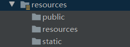


## 首页定制

- 在WebMvcAutoConfiguration类中有一个配置欢迎页的方法

```java
@Bean
public WelcomePageHandlerMapping welcomePageHandlerMapping(ApplicationContext applicationContext,
                                                           FormattingConversionService mvcConversionService, ResourceUrlProvider mvcResourceUrlProvider) {
    WelcomePageHandlerMapping welcomePageHandlerMapping = new WelcomePageHandlerMapping(
        new TemplateAvailabilityProviders(applicationContext), applicationContext, getWelcomePage(),
        this.mvcProperties.getStaticPathPattern());
    welcomePageHandlerMapping.setInterceptors(getInterceptors(mvcConversionService, mvcResourceUrlProvider));
    welcomePageHandlerMapping.setCorsConfigurations(getCorsConfigurations());
    return welcomePageHandlerMapping;
}

//获取欢迎页
private Optional<Resource> getWelcomePage() {
    String[] locations = getResourceLocations(this.resourceProperties.getStaticLocations());
    //拿到系统定义的静态类路径 locations:{/resoureces/,/static/,/public/}
    String[] locations = getResourceLocations(this.resourceProperties.getStaticLocations());
    //遍历locations 找到对应静态文件下名为index.html的页面就是欢迎页
    return Arrays.stream(locations).map(this::getIndexHtml).filter(this::isReadable).findFirst();
}

//获取静态文件夹下的index.html页面
private Resource getIndexHtml(String location) {
    return this.resourceLoader.getResource(location + "index.html");
}

//判断静态文件是否存在且文件夹里是否有index.html
private boolean isReadable(Resource resource) {
    try {
        return resource.exists() && (resource.getURL() != null);
    }
    catch (Exception ex) {
        return false;
    }
}
```

- 总结：简而言之，只要将index.html页面放在类路径下的resources或static或public文件夹下就能自动读取


## 模板引擎

### 介绍

模板引擎，我们其实大家听到很多，其实jsp就是一个模板引擎，还有用的比较多的freemarker，包括SpringBoot给我们推荐的Thymeleaf，模板引擎有非常多，但再多的模板引擎，他们的思想都是一样的，什么样一个思想呢我们来看一下这张图：

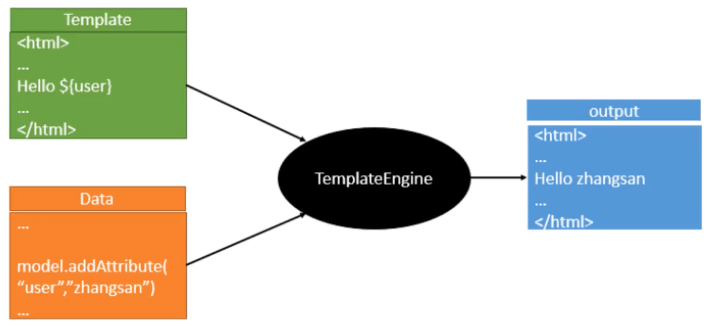

模板引擎的作用就是我们来写一个页面模板，比如有些值呢，是动态的，我们写一些表达式。而这些值，从哪来呢，就是我们在后台封装一些数据。然后把这个模板和这个数据交给我们模板引擎，模板引擎按照我们这个数据帮你把这表达式解析、填充到我们指定的位置，然后把这个数据最终生成一个我们想要的内容给我们写出去，这就是我们这个模板引擎，不管是jsp还是其他模板引擎，都是这个思想。只不过呢，就是说不同模板引擎之间，他们可能这个语法有点不一样

### 引入thymeleaf

```xml
<!--thymeleaf-->
<dependency>
    <groupId>org.springframework.boot</groupId>
    <artifactId>spring-boot-starter-thymeleaf</artifactId>
</dependency>
```

- 引入后会导入这三个jar包

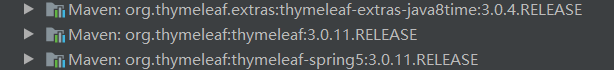

- 简单使用

```html
<!DOCTYPE html>
<html lang="en" xmlns:th="http://www.thymeleaf.org">
    <head>
        <meta charset="UTF-8">
        <title>thymeleaf</title>
    </head>
    <body>
        <h1>测试页面</h1>

        <!--th:text就是将div中的内容设置为它指定的值，和之前学习的Vue一样-->
        <div th:text="${msg}"></div>
    </body>
</html>
```

## Lombok

### 介绍

>Lombok 是一种 Java 实用工具，可用来帮助开发人员消除 Java 的冗长，尤其是对于简单的 Java 对象（POJO）。它通过注解实现这一目的

- 拿下面例子来说:

```java
public class Person {
    private String name;
    private Integer age;
}
```

- 要使用这个对象,必须还要写一些getter和setter方法,可能还要写一个构造器、equals方法、或者hash方法.这些方法很冗长而且没有技术含量,我们叫它**样板式代码**
- lombok的主要作用是通过一些注解，消除样板式代码，像这样：

```java
import lombok.Data;

@Data
public class Person {
    private String name;
    private Integer age;
}
```

- 然后可以看到这个类自动生成了这些方法

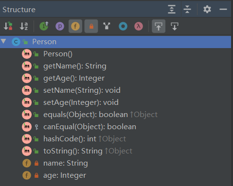

### 使用

1. 需要在IDEA中安装Lombok插件
   - 这里有可能会搜索不到，不用慌张，如果连接的是wifi就换手机热度！这的确是个无聊但有用的解决方法
2. 导入Lombok坐标

```xml
<dependency>
    <groupId>org.projectlombok</groupId>
    <artifactId>lombok</artifactId>
</dependency>
```

### 常用注解


- @Getter/@Setter：自动产生 getter/setter
- @ToString：自动重写 `toString()` 方法，会印出所有变量
- @EqualsAndHashCode：自动生成 `equals(Object other)` 和 `hashcode()` 方法，包括所有非静态变量和非 transient 的变量
- @NoArgsConstructor：生成一个没有参数的构造器
- @AllArgsConstructor : 生成一个包含所有参数的构造器
- @RequiredArgsConstructor : 生成一个包含 "特定参数" 的构造器，特定参数指的是那些有加上 final 修饰词的变量们
- @Data：整合包，只要加了 @Data 这个注解，等于同时加了以下注解
  - @Getter/@Setter
  - @ToString
  - @EqualsAndHashCode
  - @RequiredArgsConstructor
- @Value：也是整合包，但是他会把所有的变量都设成 final 的，其他的就跟 @Data 一样，等于同时加了以下注解
  - @Getter (注意没有setter)
  - @ToString
  - @EqualsAndHashCode
  - @RequiredArgsConstructor
- @Builder：自动生成流式 set 值写法，从此之后再也不用写一堆 setter 了
- @Slf4j：自动生成该类的 log 静态常量，要打日志就可以直接打，不用再手动 new log 静态常量了


## 整合JDBC

- 导入JDBC和mysql驱动

```xml
<!--JDBC-->
<dependency>
    <groupId>org.springframework.boot</groupId>
    <artifactId>spring-boot-starter-jdbc</artifactId>
</dependency>

<!--MYSQL-->
<dependency>
    <groupId>mysql</groupId>
    <artifactId>mysql-connector-java</artifactId>
    <scope>runtime</scope>
</dependency>
```

- 编写连接数据库所需要的信息

```yaml
spring:
  datasource:
    username: root
    password: root
    url: jdbc:mysql://localhost:3306/ssm?useUnicode=true&characterEncoding=utf-8&serverTimezone=UTC
    driver-class-name: com.mysql.cj.jdbc.Driver
```

- 就可以直接使用了

```java
@SpringBootTest
class SpringbootJdbcApplicationTests {

    @Autowired
    DataSource dataSource;

    @Test
    void contextLoads() {
        //springboot默认数据源:com.zaxxer.hikari.HikariDataSource
        System.out.println(dataSource.getClass());
    }

}
```


## 整合Druid数据源

- 导入druid启动器

```xml
<dependency>
    <groupId>com.alibaba</groupId>
    <artifactId>druid-spring-boot-starter</artifactId>
    <version>1.1.23</version>
</dependency>
```

- 在yaml配置中将默认的数据源修改为druid数据源

```yaml
spring:
  datasource:
    username: root
    password: root
    url: jdbc:mysql://localhost:3306/ssm?useUnicode=true&characterEncoding=utf-8&serverTimezone=UTC
    driver-class-name: com.mysql.cj.jdbc.Driver
    type: com.alibaba.druid.pool.DruidDataSource #数据源的类型
    filters: stat #让druid后台能够监控sql
```

- 配置DruidDatasource并加入sping容器

```java
@Configuration
public class DruidConfig {

    @ConfigurationProperties(prefix = "spring.datasource")
    @Bean
    public DataSource DruidDatasource(){
        return new DruidDataSource();
    }

    //后台监控:相当于web.xml配置
    @Bean
    public ServletRegistrationBean<StatViewServlet> statViewServlet(){
        //固定写法
        ServletRegistrationBean<StatViewServlet> bean = new ServletRegistrationBean<>(new StatViewServlet(),"/druid/*");
        HashMap<String, String> initParameters = new HashMap<>();

        //后台登陆，账户和密码配置
        initParameters.put("loginUsername","admin"); //登陆的key是固定写法 loginUsername、loginPassword
        initParameters.put("loginPassword","123456");

        //允许谁可以访问,默认允许所有人都可以访问
        initParameters.put("allow","");


        //设置初始化参数
        bean.setInitParameters(initParameters);
        return bean;
    }

    //配置过滤器
    @Bean
    public FilterRegistrationBean<WebStatFilter> WebStatFilter(){
        FilterRegistrationBean<WebStatFilter> filter = new FilterRegistrationBean<>(new WebStatFilter());
        final HashMap<String, String> filterMap = new HashMap<>();
        //这些东西不进行统计
        filterMap.put("exclusions","*.js,*.css,/druid/*");
        filter.setInitParameters(filterMap);
        return filter;
    }

}
```

- 当我们访问http://localhost:8080/druid时就会跳转到login.html页面

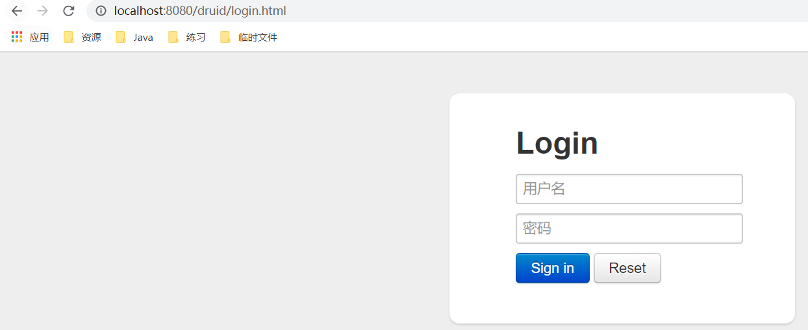

- 输入我们设定的账户和密码就可以进入
- 当我们向服务器发送一条请求后就后台就会有SQL监控数据产生

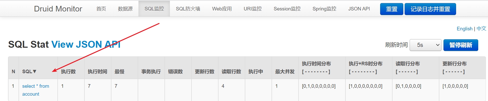


## 整合Mybatis框架

### 导入坐标

- 导入sping-mybatis整合启动器

```xml
<!-- https://mvnrepository.com/artifact/org.mybatis.spring.boot/mybatis-spring-boot-starter -->
<dependency>
    <groupId>org.mybatis.spring.boot</groupId>
    <artifactId>mybatis-spring-boot-starter</artifactId>
    <version>2.1.3</version>
</dependency>
```

- 还是需要数据库连接池和JDBC的坐标

```xml
<!--JDBC-->
<dependency>
    <groupId>org.springframework.boot</groupId>
    <artifactId>spring-boot-starter-jdbc</artifactId>
</dependency>

<!--MYSQL-->
<dependency>
    <groupId>mysql</groupId>
    <artifactId>mysql-connector-java</artifactId>
    <scope>runtime</scope>
</dependency>
```

- 为了使用一些注解，web依赖包也是比不可少的

```xml
<dependency>
    <groupId>org.springframework.boot</groupId>
    <artifactId>spring-boot-starter-web</artifactId>
</dependency>
```

- 为了方便实体的实现对应模板方法，再导入lombok坐标

```xml
<dependency>
    <groupId>org.projectlombok</groupId>
    <artifactId>lombok</artifactId>
</dependency>
```

### 编写实体类

- 数据库表

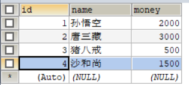

```java
package com.kl.pojo;

import lombok.AllArgsConstructor;
import lombok.Data;
import lombok.NoArgsConstructor;

//getter setter 有参 无参 toString
@Data
@AllArgsConstructor
@NoArgsConstructor
public class User {
    private Integer id;
    private String name;
    private float money;
}
```

### Mapper类

```java
@Mapper     //与mapper文件映射
@Repository //注入容器
public interface UserMapper {

    List<User> findAll();

    User findById(Integer id);

    void addUser(User user);

    int deleteUser(Integer id);

    int updateUser(User user);

}
```

### SQL映射文件

```xml
<!DOCTYPE mapper
        PUBLIC "-//mybatis.org//DTD Mapper 3.0//EN"
        "http://mybatis.org/dtd/mybatis-3-mapper.dtd">
<mapper namespace="com.kl.mapper.UserMapper">

    <select id="findAll" resultType="user">
        select * from user
    </select>

    <select id="findById" resultType="user">
        select * from user where id = #{id}
    </select>

    <insert id="addUser" parameterType="user">
        insert into user(name,money) values(#{name},#{money})
    </insert>

    <delete id="deleteUser" parameterType="java.lang.Integer">
        delete from user where id = #{id}
    </delete>

    <update id="updateUser" parameterType="user">
        update user set `name` = #{name},`money` = #{money} where id = #{id}
    </update>

</mapper>
```

### 业务层

```java
@Service
public class UserService {

    @Autowired
    UserMapper userMapper;

    public List<User> findAll() {
        return userMapper.findAll();
    }

    public User findById(Integer id) {
        return userMapper.findById(id);
    }

    public void addUser(User user) {
        userMapper.addUser(user);
    }

    public int deleteUser(Integer id) {
        return userMapper.deleteUser(id);
    }

    public int updateUser(User user) {
        return userMapper.updateUser(user);
    }

}
```

### yaml文件配置

```yaml
#配置数据库连接的数据源
spring: 
  datasource:
    username: root
    password: root
    url: jdbc:mysql://localhost:3306/ssm?useUnicode=true&characterEncoding=utf-8&serverTimezone=UTC
    driver-class-name: com.mysql.cj.jdbc.Driver

# 整合mybatis

mybatis:
  type-aliases-package: com.kl.pojo #为指定包下的类起别名
  mapper-locations: classpath:mybatis/mapper/*.xml #指定sql映射文件的路径
```

- 最后基本配置就结束了，可在控制层中自动注入业务层的类，直接调用对应方法进行使用即可


## SpringSecurity

- 在web开发中，安全第一，拦截器，过滤器......

### 概念(自带登录和注销)

- Spring Security是针对Spring项目的安全框架，也是Spring Boot底层安全模块默认的技术选型，他可以实现强大的Web安全控制，对于安全控制，我们仅需要引入spring-boot-starter-security模块，进行少量的配置，即可实现强大的安全管理！
- 记住几个类：
  - WebSecurityConfigurerAdapter：自定义Security策略
  - AuthenticationManagerBuilder：自定义认证策略
  - @EnableWebSecurity：开启WebSecurity模式
- Spring Security的两个主要目标是"认证"和“授权"（访问控制），这个概念是通用的，而不是只在Spring Security中存在
  - “认证"（Authentication"
  - 授权"（Authorization）

### 用户认证和授权

- 在web模块的基础上引入这个坐标

```xml
<!--security-->
<dependency>
    <groupId>org.springframework.boot</groupId>
    <artifactId>spring-boot-starter-security</artifactId>
</dependency>
```

- 控制器

```java
@Controller(value = "/user")
public class SecurityController {
    //跳转到首页
    @RequestMapping(value = {"/","/index.html"})
    public String index(){
        return "index";
    }

    //跳转到普通用户页面
    @RequestMapping(value = "/level1/vip1")
    public String vip1(){
        return "/level1/vip1";
    }

    //跳转到vip用户页面
    @RequestMapping(value = "/level2/vip2")
    public String vip2(){
        return "/level2/vip2";
    }

    //跳转到超级vip用户页面
    @RequestMapping(value = "/level3/vip3")
    public String vip3(){
        return "/level3/vip3";
    }

}
```

- 页面布局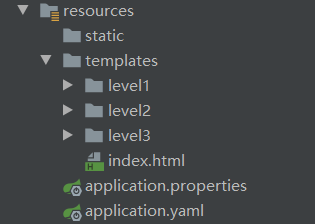
- 如果不进行安全处理，那么用户点击以下三个超链接中的任意一个都会进行跳转

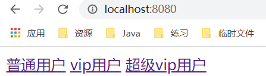

```html
<!DOCTYPE html>
<html lang="en" xmlns:th="http://www.thymeleaf.org">
    <head>
        <meta charset="UTF-8">
        <title>Title</title>
    </head>
    <body>
        <a th:href="@{/level1/vip1}">普通用户</a>
        <a th:href="@{/level2/vip2}">vip用户</a>
        <a th:href="@{/level3/vip3}">超级vip用户</a>

    </body>
</html>
```

- 如果添加了授权处理，对于没有权限的用户就会被拒绝访问，接着会自动跳转到一个登录页面，在该页面输入正确的账户和密码后可获取特点的角色，接着就可以获取改角色的权限
- 添加权限处理

```java
@EnableWebSecurity
public class SecurityConfig extends WebSecurityConfigurerAdapter {
    /**
     * 授权的实质是将特定的权限赋予某个角色,而非指定的用户
     * 认证的实质是某个用户获得了特定的角色,由此获得了特定的功能权限
     */
    
    
    //授权
    @Override
    protected void configure(HttpSecurity http) throws Exception {
        //设置首页所有人都可以访问,功能页只有对应权限的人才可以访问
        http.authorizeRequests()
                .antMatchers("/").permitAll()
                .antMatchers("/level1/**").hasRole("vip1")
                .antMatchers("/level2/**").hasRole("vip2")
                .antMatchers("/level3/**").hasRole("vip3");
        //没有权限就自动跳转到登录页面
        http.formLogin();
    }

    //认证
    @Override
    protected void configure(AuthenticationManagerBuilder auth) throws Exception {
        //这些数据正常的情况下应该从数据库中查询
        //BCryptPasswordEncoder是对密码进行加密处理的类
        //roles()方法是给用户指定的角色
        auth.inMemoryAuthentication().passwordEncoder(new BCryptPasswordEncoder())
                .withUser("tom").password(new BCryptPasswordEncoder().encode("123"))
                .roles("vip1")
                .and()
                .withUser("mike").password(new BCryptPasswordEncoder().encode("123"))
                .roles("vip1","vip2")
                .and()
                .withUser("jerry").password(new BCryptPasswordEncoder().encode("123"))
                .roles("vip1","vip2","vip3");
    }
}
```

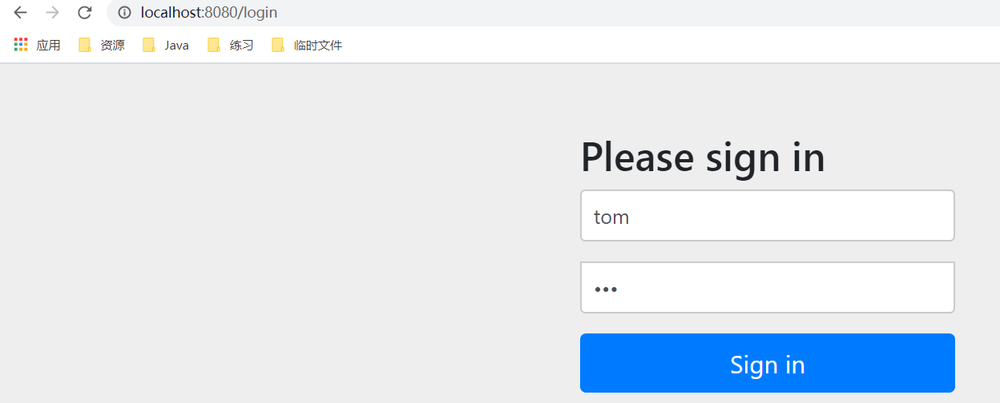

- 账户密码输入正确后才可正确访问对应权限的页面

### 注销和权限控制

- 只用添加一个logout方法就可以实现注销功能

```java
//授权
@Override
protected void configure(HttpSecurity http) throws Exception {
    //设置首页所有人都可以访问,功能页只有对应权限的人才可以访问
    http.authorizeRequests()
        .antMatchers("/").permitAll()
        .antMatchers("/level1/*").hasRole("vip1")
        .antMatchers("/level2/*").hasRole("vip2")
        .antMatchers("/level3/*").hasRole("vip3");
    //没有权限就自动跳转到登录页面
    http.formLogin();

    //注销功能,注销成功后指定跳转页面
    http.logout().logoutSuccessUrl("/");
}
```

- 需要访问/logout

```html
<a th:href="@{/login}">登录</a>
<a th:href="@{/logout}">注销</a><br/>
```

- 点击页面的注销请求，点击Log Out按钮即可实现注销功能


### 首页定制

```java
@Override
protected void configure(HttpSecurity http) throws Exception {
    //设置首页所有人都可以访问,功能页只有对应权限的人才可以访问
    http.authorizeRequests()
            .antMatchers("/").permitAll()
            .antMatchers("/level1/*").hasRole("vip1")
            .antMatchers("/level2/*").hasRole("vip2")
            .antMatchers("/level3/*").hasRole("vip3");
    //没有权限就自动跳转到指定登录页面,如果不设定,就跳转到系统指定的登录页面
    http.formLogin().loginPage("/login.html");

    //注销功能,注销成功后指定跳转页面
    http.logout().logoutSuccessUrl("/");

    //记住我功能开启
    http.rememberMe();
}
```

- 调用rememberMe()方法就会有勾选功能

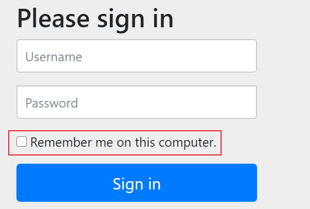

## Swagger2

>swagger,中文“拽”的意思。它是一个功能强大的api框架，它的集成非常简单，不仅提供了在线文档的查阅，而且还提供了在线文档的测试。另外swagger很容易构建restful风格的api，简单优雅帅气，正如它的名字

### 引入依赖

```xml
<!--注意:这里如果使用过高的版本如3.0.0就访问不到
            http://localhost:8080/swagger-ui.html-->
<dependency>
    <groupId>io.springfox</groupId>
    <artifactId>springfox-swagger2</artifactId>
    <version>2.9.2</version>
</dependency>

<dependency>
    <groupId>io.springfox</groupId>
    <artifactId>springfox-swagger-ui</artifactId>
    <version>2.9.2</version>
</dependency>
```

### 写配置类将swagger注入容器

- 从依赖的名字就可以看出来，swagger2并不是springboot官方的包，要将它注册进spring容器，需要编写一个配置类

```java
package com.kl.config;

import org.springframework.context.annotation.Configuration;
import springfox.documentation.swagger2.annotations.EnableSwagger2;

@Configuration
@EnableSwagger2
public class Swagger2Config {

}
```

- 访问http://localhost:8080/swagger-ui.html

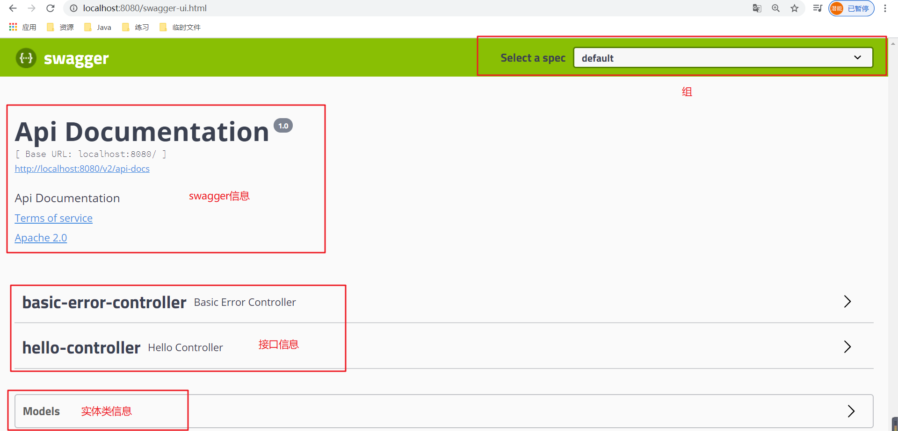

- 配置一个hello请求

```java
@RestController
public class HelloController {

    @GetMapping(value = "/hello")
    public String hello(){
        return "hello";
    }
}
```

- 访问这个请求就会被扫描进文档

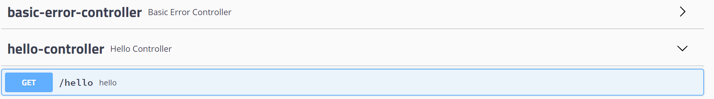

### 配置swagger

```java
@Configuration
@EnableSwagger2
public class Swagger2Config {
    @Bean
    public Docket docket() {
        return new Docket(DocumentationType.SWAGGER_2)
                .apiInfo(apiInfo());
    }

    //contact就是作者信息
    private ApiInfo apiInfo() {
        return new ApiInfoBuilder()
                .title("lkl的swagger-api文档") 
                .description("lkl第一次练习使用")
                .termsOfServiceUrl("http://www.baidu.com")
                .version("2.0")
                .contact(new Contact("batman","http://www.4399.com","2633649336@qq.com"))
                .build();
    }
}
```

- 再次访问页面

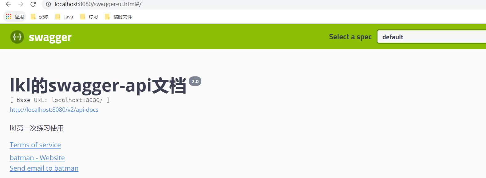

### 配置扫描接口及开关

- 默认是所有的都扫描，有basic-error-controller和hello-cntroller两个


- 现在我们配置只扫描hello-controller这个控制器
- 配置文件中有

```properties
spring.profiles.active=prod
```

- swagger2配置类

```java
@Configuration
@EnableSwagger2
public class Swagger2Config {

    //获取到当前的生产环境
    @Value("${spring.profiles.active}") //取不到值就会报错
    private String env;

    @Bean
    public Docket docket() {
        //如果是生产环境或就显示swagger页面
        boolean flag = env.equals("prod");
        System.out.println(flag);

        return new Docket(DocumentationType.SWAGGER_2)
                .enable(flag) //默认为true,设置为false就不会显示swagger页面
                .select() //使用选择器
                .apis(RequestHandlerSelectors.basePackage("com.kl.controller")) //指定要扫描的包
                .paths(PathSelectors.any()) //映射什么路径,any:扫描全部 none:不扫描
                .build()
                .apiInfo(apiInfo());
    }

    //contact就是作者信息
    private ApiInfo apiInfo() {
        return new ApiInfoBuilder()
                .title("lkl的swagger-api文档")
                .description("lkl第一次练习使用")
                .termsOfServiceUrl("http://www.baidu.com")
                .version("2.0")
                .contact(new Contact("batman","http://www.4399.com","2633649336@qq.com"))
                .build();
    }
}
```

- 再次刷新页面，配置扫描成功

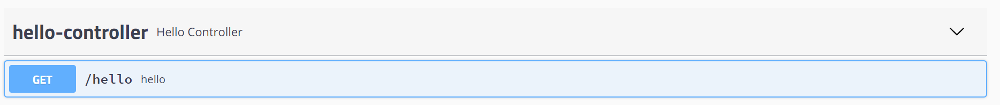

### 分组和接口控制

- 如果是多个人协同开发，那么bean可能会来自多组，每个bean互不影响，都被扫描进spring容器中，每个组的组名就确定哪个api文档是谁开发的

```java
@Configuration
@EnableSwagger2
public class Swagger2Config {

    @Bean
    public Docket docket1() {
        return new Docket(DocumentationType.SWAGGER_2).groupName("张三");
    }

    @Bean
    public Docket docket2() {
        return new Docket(DocumentationType.SWAGGER_2).groupName("李四");
    }
}
```

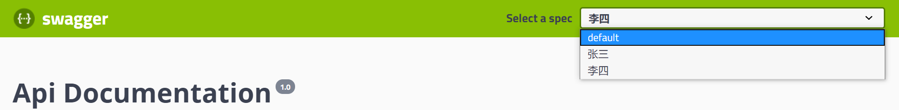

- 总结
  1. 我们可以通过swagger给一些比较难理解的属性或者接口增加注释信息
  2. 接口文档可以实时更新
  3. 可以在线测试 
- swagger是一个优秀的工具，几乎所有的大公司都用它
- 注意：在正式发布项目的时候，出于安全考虑最好关闭swagger


## 异步任务

1. 开启异步任务的开关

```java
@SpringBootApplication
@EnableAsync //打开异步任务注解开关
public class SpringbootTaskApplication {

    public static void main(String[] args) {
        SpringApplication.run(SpringbootTaskApplication.class, args);
    }

}
```

2. 新建一个AsyncService业务类，模拟异步任务

```java
@Service
public class AsyncService {

    @Async //标志这是一个异步方法
    public void aMethod(){
        try {
            Thread.sleep(3000);
        } catch (InterruptedException e) {
            e.printStackTrace();
        }
        System.out.println("aMethod方法执行结束");
    }
}
```

3. 新建AsyncController控制类去调用线程卡顿方法

```java
@RestController
public class AsyncController {
    @Autowired
    AsyncService asyncService;

    @GetMapping(value = "/task")
    public String task(){
        asyncService.aMethod();
        return "success";
    }
}
```

- 开启了异步任务，会立即返回success字符串到页面上，之后3秒结束后将异步任务执行结束
- 如果没有开启异步任务，就会等3秒，要等线程卡顿结束后才会向页面返回success字符串，这是非常不好的体验


## 邮件任务

1. 导入依赖

```xml
<!--邮件-->
<dependency>
    <groupId>org.springframework.boot</groupId>
    <artifactId>spring-boot-starter-mail</artifactId>
</dependency>
```

2. 打开QQ邮箱

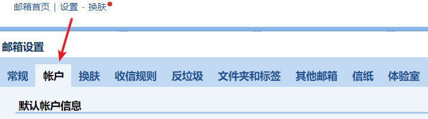

往下继续拉，全部开启，点击获取授权码

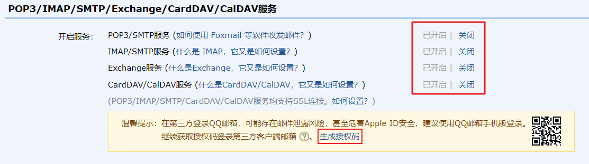

3. 配置application.properties

```properties
#发件人邮箱
spring.mail.username=2733749339@qq.com
#生成的授权码
spring.mail.password=xfmwthtvvkstdgbh
#QQ的SMIP地址
spring.mail.host=smtp.qq.com
#配置安全连接
spring.mail.properties.mail.smtp.ssl.enable=true
```

4. 在测试类中测试

```java
@SpringBootTest
class SpringbootTaskApplicationTests {

    //注入邮件发送器
    @Autowired
    JavaMailSenderImpl javaMailSender;

    /**
     * 简单邮件测试
     */
    @Test
    public void contextLoads1() {
        SimpleMailMessage message = new SimpleMailMessage();
        message.setText("卡普中校,路飞已经到达香波地群岛...是否实施抓捕任务"); //邮件内容
        message.setSubject("秘密逮捕计划"); //邮件主题
        //发送者邮箱
        message.setFrom("2733749339@qq.com");
        //发送到哪个邮箱
        message.setTo("2733749339@qq.com");
        javaMailSender.send(message);
    }
}
```

5. 还可以发送复制邮箱，有图片和文字样式的内容

```java
@SpringBootTest
class SpringbootTaskApplicationTests {

    //注入邮件发送器
    @Autowired
    JavaMailSenderImpl javaMailSender;

    /**
     * 复杂邮件测试
     */
    @Test
    public void contextLoads2() throws Exception{
        //1.创建一个复杂的消息邮件
        MimeMessage mimeMessage = javaMailSender.createMimeMessage();
        //第二个参数  是否需要上传附件
        MimeMessageHelper helper = new MimeMessageHelper(mimeMessage,true);
        //邮件设置
        //这里可以使用html标签样式
        helper.setText("<b style='color:red'>罗罗亚索隆是三刀流</b>",true);
        helper.setSubject("介绍");
        //发送者邮箱
        helper.setFrom("2733749339@qq.com");
        //发送到哪个邮箱
        helper.setTo("2733749339@qq.com");
        //上传附件 附件名，路径
        helper.addAttachment("1.jpg",new File("D:\\用户\\桌面\\1.jpg"));
        javaMailSender.send(mimeMessage);
    }

}
```


## 定时执行任务

- 只适合处理简单的计划任务，不能处理分布式计划任务。优势：是spring框架提供的计划任务，开发简单，执行效率比较高。且在计划任务数量太多的时候，可能出现阻塞，崩溃，延迟启动等问题

---

1. 启用Scheduled定时任务机制

```java
@SpringBootApplication
@EnableScheduling //启用Scheduled定时任务机制
public class SpringbootTaskApplication {

    public static void main(String[] args) {
        SpringApplication.run(SpringbootTaskApplication.class, args);
    }

}
```

2. 标注定时任务执行时间

```java
@Service
public class ScheduledService {

    @Scheduled(cron = "0 56 14 23 8 *") //任意星期的8月23号的14点56分0秒执行该方法
    public void ScheduledTask(){
        System.out.println("Hello! ScheduledTask");
    }
}
```

Scheduled定时任务的核心在于注解@Scheduled，这个注解的核心属性是cron，代表定时任务的触发计划表达式。这个表达式的格式为

```java
@Scheduled(cron="seconds minutes hours day month week")
```

或

```java
@Scheduled(cron="seconds minutes hours day month week year")
```

推荐使用第一种表达式形式，因为在很多其他技术中都有不同的定时任务机制，其中用于设置触发计划的表达式都是第一种cron表达式。第二种表达式不能说是Spring Scheduled特有的，也是只有少数技术支持的

- cron表达式中，每个位置的约束如下：

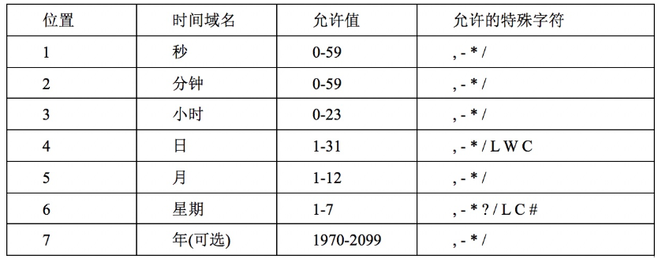

